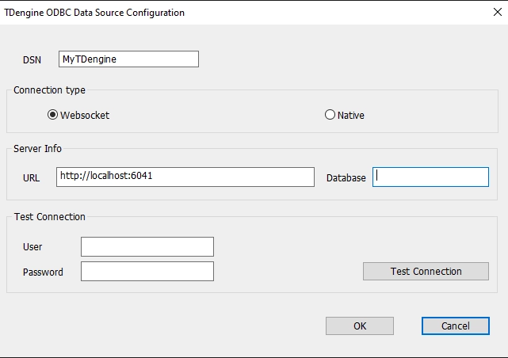

## Introduction

The TDengine ODBC driver is a driver specifically designed for TDengine based on the ODBC standard. It can be used by ODBC based applications,like [PowerBI](https://powerbi.microsoft.com), on Windows, to access a local or remote TDengine cluster or an instance in the TDengine Cloud service.

TDengine ODBC provides two kinds of connections, native connection and WebSocket connection. You can choose to use either one for your convenience. WebSocket is the recommended choice and you must use WebSocket if you are trying to access an instance in the TDengine Cloud service. 

Note: TDengine ODBC driver can only be run on 64-bit systems, and can only be invoked by 64-bit applications.

## Install

1.  The TDengine ODBC driver only supports the Windows platform. To run on Windows, the Microsoft Visual C++ Runtime library is required. If the Microsoft Visual C++ Runtime Library is missing on your platform, you can download and install it from [VC Runtime Library](https://learn.microsoft.com/en-us/cpp/windows/latest-supported-vc-redist?view=msvc-170). 

2. Install TDengine Client package for Windows. The TDengine Client version should be above 3.2.1.0. The client package includes both the TDengine ODBC driver and some other necessary libraries that will be used in either native connection or WebSocket connection.

## Configure Data Source

### Connection Types

TDengine ODBC driver supports two kinds of connections to TDengine cluster: native connection and WebSocket connection. The major differences between them are listed below.

1. Only a WebSocket connection can be used to connect to TDengine Cloud service. 

2. A Websocket connection is more compatible with different TDengine server versions. Usually, you don't need to upgrade the TDengine Client package along with the server side.

3. Native connections usually have better performance, but the TDengine Client version must be compatible with the TDengine server version.

4. For most users, it's recommended to use **WebSocket** connection, which has much better compatibility and almost the same performance as native connection. 

### WebSocket Connection

1. Click the "Start" Menu, and Search for "ODBC", and choose "ODBC Data Source (64-bit)" (Note: Don't choose 32-bit)

2. Select "User DSN" tab, and click "Add" to enter the page for "Create Data Source"

3. Choose the data source to be added, here we choose "TDengine"

4. Click "Finish", and enter the configuration page for "TDengine ODBC Data Source", fill in required fields

    

    4.1 [DSN]: Data Source Name, required field, to name the new ODBC data source

    4.2 [Connection Type]: required field, we choose "WebSocket"

    4.3 [URL]: required field, the URL for the ODBC data source, for example, `http://localhost:6041` is the URL for a local TDengine cluster, `https://gw.cloud.taosdata.com?token=your_token` is the URL for a TDengine cloud service.

    4.4 [Database]: optional field, the default database to access

    4.5 [User]: optional field, only used for connection testing in step 5; If it's left as blank, "root" user will be used by default.

    4.6 [Password]: optional field, only used for connection testing in step 5; 

5. Click "Test Connection" to test whether the connection to the data source is successful; if successful, it will prompt "Successfully connected to URL"

6. Click "OK" to set the configuration and exit.

7. You can also select an already configured data source name in step 2 to change existing configuration.

### Native Connection

Please be noted that native connection can't be used to access a TDengine client service. 

The steps are exactly same as "WebSocket" connection, except for you choose "Native" in step 4.2.

## PowerBI

As an example, you can use PowerBI, which invokes TDengine ODBC driver, to access TDengine, please refer to [Power BI](../../third-party/powerbi) for more details.
