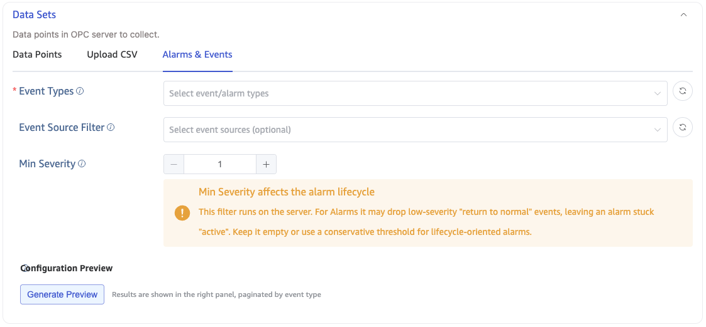
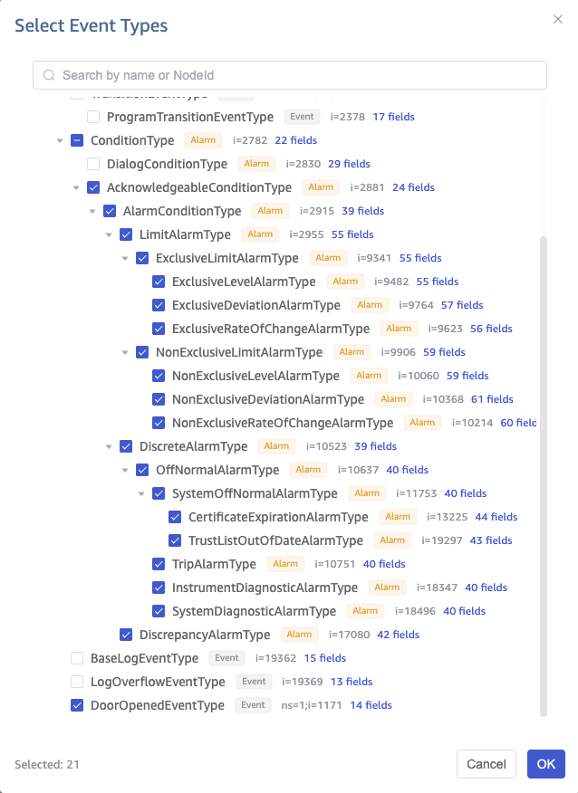
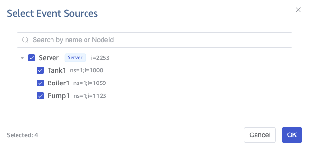
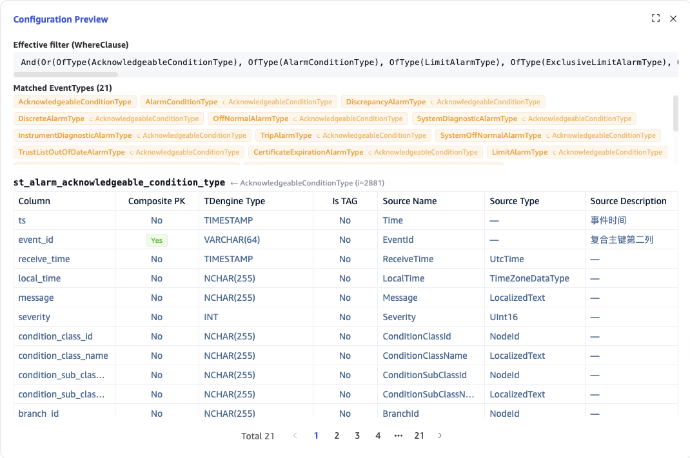

This page describes how to create an OPC UA data ingestion task in Explorer to collect **alarms and events (Alarm & Event, A&E)** from an OPC UA Server into TDengine.

:::note
The basic task creation flow (data source, connection, authentication) is the same as for point collection. Read [OPC UA](./index.md) first. This page covers only what is specific to A&E collection.
:::

## Overview

Besides regular data points (Value), an industrial OPC UA Server also pushes alarms and notifications as **events**. TDengine's OPC UA ingestion supports two collection modes:

| Collection mode                      | Monitored target                         | Suited for                                             |
| ------------------------------------ | ---------------------------------------- | ------------------------------------------------------ |
| **Point collection (Value)**         | A node's attribute value                 | Process variables such as temperature, pressure, level |
| **Alarm and Event collection (A&E)** | Event notifications pushed by the Server | Alarms, state transitions, operator action logs        |

A&E collection uses the standard OPC UA `Subscription + MonitoredItem + EventFilter` mechanism to subscribe to events pushed by the Server, and writes **every state change as a new row** to TDengine, fully reconstructing the alarm lifecycle.

Compared with simulating alarms through point subscriptions, native A&E collection has two major advantages:

1. **Efficiency**: A single subscription can receive all alarms of a given type from the Server; simulating with points requires one subscription row per alarm field (typically hundreds of alarms × dozens of fields = tens of thousands of subscription rows).
2. **Complete semantics**: Native collection obtains key semantics such as `EventId`, state-transition timestamps, severity changes, and the operator (`ClientUserId`), allowing you to reconstruct the full Active → Ack → Inactive → Confirm cycle.

### Two data forms

OPC UA events fall into two categories, with different collection and table-creation rules:

- **Alarm**: A stateful object with a lifecycle, such as a level limit violation or equipment trip. The same alarm instance fires repeatedly; each state transition pushes one event.
- **Event (ordinary)**: A one-shot, stateless transient notification, such as a door opening, a system start/stop, or an audit event. Each event is independent.

## Use Cases

- **Pure alarm collection**: Ingest plant alarms (level / pressure / trip, etc.) natively and reconstruct the lifecycle row by row.
- **Value + A&E mixed collection**: On the same Server, a point task collects process variables while an A&E task collects alarms; the two are correlated by `device_id` for unified analytics.
- **Multi-Server aggregation**: Alarms of the same type from multiple Servers land in the same supertable, distinguished by `server_endpoint`.
- **On-demand filtering**: Subscribe only to the alarm subtypes + the event sources of specific lines + a minimum severity; filtering happens on the Server side.

## Prerequisites

Before using A&E collection, the target OPC UA Server must satisfy:

1. **OPC UA only**: OPC Classic AE (DCOM-based) is not supported. If the field exposes only Classic AE, deploy a UA Wrapper first (such as GE / KEPServerEX) to expose it as OPC UA, then collect with taosX.
2. **The Server must implement the "A & C - Standard" Profile**, and the `EventNotifier` attribute of the Server node (`i=2253`) must be non-zero; otherwise events cannot be subscribed.
3. **Network reachability**: The taosX host must be able to reach the Server's OPC UA endpoint directly (default port 4840).
4. **Least privilege**: The collection account only needs Subscribe (or read-only) permission; no Method-call permission is required.

If the Server does not meet these conditions, Explorer shows an "unsupported" message when you enter the **Alarms & Events** configuration. In that case, fall back to point collection or deploy a Wrapper first.

## Configuration

After completing the first four steps of [OPC UA](./index.md) (data source, connection, authentication), proceed to **Points Set**.

The **Points Set** of an OPC UA task offers three mutually exclusive modes, switched via tabs:

1. **Select Data Points** (default; point collection)
2. **Upload CSV Configuration File** (point collection)
3. **Alarms & Events** (A&E collection; this page)

Select the **Alarms & Events** tab to enter A&E collection. In this mode you can configure three filters — Event Types, Event Source Filter, and Min Severity — and generate a configuration preview.



### 1. Select Event Types (required)

Click **Event Types** and Explorer browses the Server, building the **event type inheritance tree** recursively from `BaseEventType` (`i=2041`) along `HasSubtype`, shown as a tree for multi-selection.

- Each type node shows its NodeId, BrowseName, and the list of fields it owns and inherits.
- **Selecting a type automatically includes all its subtypes** (corresponding to `OfType` in the EventFilter).
- The type tree is cached by default (instant UI); to force a fresh browse, click **Refresh (no cache)** in the top right.
- **Fallback**: If the Server does not expose a complete type tree, Explorer falls back to a built-in catalog of standard OPC UA event types (fixed NodeIds in namespace 0 + standard field sets). Only vendor-specific custom types cannot be discovered.



:::tip
The event type tree rarely changes, so the default cache is fine. The cache is invalidated automatically only when the Endpoint, security policy, or account changes, or when the last browse failed.
:::

### 2. Event Source Filter (optional)

**Event Source Filter** is **independent** of the event types and is taken from the instance space: it expands the notifier / event-source hierarchy from the Server node (`i=2253`) along `HasNotifier` / `HasEventSource`, also shown as a tree with multi-selection and keyword search.

- **Leaf nodes = real event sources**: selecting them collects only events emitted by those sources (`SourceNode`).
- **Branch nodes = Areas**: used only for grouping; selecting a branch is equivalent to selecting all leaves beneath it.
- A plant may have hundreds or thousands of sources; use the search box to filter by name or NodeId.
- **Empty = no filter, collect from all sources** (default).



:::note
If the Server has no notifier / event-source hierarchy, the source tree is empty. You can then enter a `SourceNode` NodeId manually and press Enter, or leave it empty to collect from all sources.
:::

### 3. Min Severity (optional)

**Min Severity** is a numeric input with range **1–1000**, mapped to `Severity >= value` in the EventFilter. **Empty = no filter (collect all severities).**

:::warning
The Min Severity filter takes effect on the **Server side**. Applying it to **alarms** can have side effects: when a "return to normal" event for an alarm drops below the threshold, the Server filters it out too, leaving the alarm "stuck active" in the database.

- For subscriptions whose goal is to **reconstruct the alarm lifecycle**: leave it **empty** or set a very conservative threshold.
- For collecting **events**: safe to use — ordinary events have no lifecycle, so filtering low severity has no side effect.

:::

### 4. Configuration Preview (recommended)

Before submitting, click **Generate Preview** in the **Preview** area. Explorer calls a backend API to statically derive the result of the current configuration and shows it in the right panel:

1. **All matched event types**, including those implicitly included via subtypes.
2. **The supertable name + full column structure** to be created for each matched type, including column name, whether it is part of the composite primary key, TDengine type, whether it is a TAG, source attribute, etc.
3. **The effective filter**, echoing the EventFilter `WhereClause` in readable form.

The preview is **static**: it only reads the type fields and derives the schema — it **does not create a subscription and does not write to TDengine**. It reuses the exact same rules as the runtime table creation, so **what you see in the preview is what actually gets created**.

<!--  -->

:::tip
As long as at least one event type is selected, the preview is always non-empty and deterministic, regardless of "whether an alarm happens to occur within the window." Always preview before submitting to confirm the table structure and filters.
:::

The preview **cannot** verify: whether a source actually emits events, real field values, or whether the Server accepts the EventFilter — these can only be observed after the task runs.

### 5. Collection Mode

When the **Alarms & Events** tab is selected, the **Collection Mode** in the collection configuration is **automatically locked to `event`** and cannot be changed. The `observe` / `subscribe` modes for point collection are only available under the **Select Data Points** or **Upload CSV Configuration File** tabs. You therefore do not need to choose the collection mode manually — switching the tab does it.

Click **Submit** to create the A&E collection task.

## Data Ingestion Rules

taosX **automatically creates tables and writes data** based on the subscribed events, following the rules below. Understanding them helps with querying.

### Supertables and Subtables

- **One event type maps to one supertable**, avoiding many NULL columns that would result from field differences across subtypes.
  - An alarm-type supertable is named `st_alarm_<type>`; an ordinary-event type is named `st_evt_<type>`.
  - The type name is derived from the BrowseName converted to lower snake_case, with the `_alarm_type` / `_event_type` suffix removed. For example, `ExclusiveLimitAlarmType` → `st_alarm_exclusive_limit`; `DoorOpenedEventType` → `st_evt_door_opened`.
- **Subtable granularity differs by data form**:

  | Data form            | Subtable dimension                           | One row =             | Notes                                                                                      |
  | -------------------- | -------------------------------------------- | --------------------- | ------------------------------------------------------------------------------------------ |
  | **Alarm**            | `ConditionId` (one subtable per alarm point) | One state transition  | Accumulates every occurrence of that alarm point over time, isomorphic to a point subtable |
  | **Event (ordinary)** | `SourceNode` (one subtable per event source) | One independent event | Each event is an independent row                                                           |

- **Subtable naming** concatenates semantically stable fields so the same alarm point / event source always lands in the same subtable: `{supertable}_{SourceNode}[_{ConditionName}]` (alarms include ConditionName, ordinary events do not). Non-alphanumeric characters in a NodeId (such as `=`, `;`, `/`) are replaced with `_`, e.g. `ns=2;s=Tank1` → `ns_2_s_Tank1`. Overly long names are automatically truncated with a hash suffix to guarantee uniqueness.

:::note
An alarm subtable is a "long time series" rather than "a few rows." `ConditionId` is fixed for the Server's runtime — one alarm lifecycle (a few rows) is just a segment of the subtable, which accumulates **every occurrence** of that alarm point in history. This is exactly isomorphic to a point subtable: a point subtable = the value series of one measurement; an alarm subtable = the state-transition series of one alarm point.
:::

### Field Type Mapping

Columns are determined by the `SelectClauses` of the EventFilter (by default, all inherited fields of the selected types are collected). The OPC UA → TDengine type mapping is:

| OPC UA type                                                      | TDengine type  |
| ---------------------------------------------------------------- | -------------- |
| Boolean                                                          | BOOL           |
| SByte / Byte / Int16 / UInt16 / Int32                            | INT            |
| UInt32 / Int64 / UInt64                                          | BIGINT         |
| Float                                                            | FLOAT          |
| Double / Duration                                                | DOUBLE         |
| DateTime / UtcTime                                               | TIMESTAMP      |
| ByteString                                                       | VARBINARY(255) |
| StatusCode                                                       | INT            |
| String / LocalizedText / NodeId / ExpandedNodeId / QualifiedName | NCHAR(255)     |
| Structure / other unknown types                                  | NCHAR(255)     |

:::note
Although `EventId` is a ByteString, because it is used as the second column of the composite primary key (TDengine composite primary keys only support integer / VARCHAR types), it is **stored exceptionally as a `VARCHAR(64)` hexadecimal string** — the only exception to the table above.
:::

### State-Machine Field Splitting (Alarms only)

State-machine fields of an alarm such as `ActiveState` / `AckedState` / `ConfirmedState` / `EnabledState` are split into two columns:

- `xxx_id` (BOOL): the state boolean
- `xxx_text` (NCHAR): the readable text

For example, `ActiveState` → `active_state_id` + `active_state_text`. This allows efficient boolean filtering while preserving readable state text.

### Composite Primary Key and Deduplication

Each subtable uses a **composite primary key `(ts, event_id)`**:

- `ts`: the event time (first primary key).
- `event_id`: the unique identifier of a single event notification (second primary key, VARCHAR(64)).

After a cold start or reconnect, taosX calls the standard OPC UA method `ConditionRefresh` (`i=3875`) to have the Server resend the snapshot of currently active alarms. Resent events carry the same `EventId` and `Time` as the originals; duplicate writes are deduplicated by overwriting via the composite primary key. Different events remain separate rows even when their `Time` is identical, so state transitions are never lost to overwriting.

### TAG Columns

Each supertable carries the following TAGs (all NCHAR) for querying and correlating by device / source / type:

| TAG               | Description                                | Alarm / Event |
| ----------------- | ------------------------------------------ | ------------- |
| `device_id`       | Device identifier (derived from the event) | Both          |
| `source_node`     | Event source NodeId                        | Both          |
| `source_name`     | Readable name of the event source          | Both          |
| `event_type`      | Event type BrowseName                      | Both          |
| `server_endpoint` | OPC UA Server endpoint                     | Both          |
| `condition_id`    | Alarm instance NodeId (fixed at runtime)   | Alarm only    |
| `condition_name`  | Readable name of the alarm instance        | Alarm only    |

### Alarm Lifecycle Row Example

Taking an exclusive-limit level alarm (`ExclusiveLimitAlarmType`) as an example, a full lifecycle — level rises above the limit → operator acknowledges → level returns to normal → operator confirms — is written as **multiple rows** in the subtable:

| ts           | event_id | severity | active_state_id | acked_state_id | confirmed_state_id | message                    |
| ------------ | -------- | -------- | --------------- | -------------- | ------------------ | -------------------------- |
| 12:00:00.100 | 0xA1…    | 900      | true            | false          | false              | Level exceeds HighHigh     |
| 12:00:04.100 | 0xA2…    | 900      | true            | true           | false              | Acknowledged by operator01 |
| 12:00:09.500 | 0xA3…    | 0        | false           | true           | false              | Alarm returned to normal   |
| 12:00:13.500 | 0xA4…    | 0        | false           | true           | true               | Confirmed by operator01    |

:::note
A&E collection writes each state transition as a new row (**append**), rather than updating the same row. Each Ack / Confirm performed by an operator via the HMI is pushed back to taosX as a new event and written row by row, so the collected alarm data is more complete than the Server's single state.
:::

## SQL Examples

The supertables / subtables below are all **created automatically** by taosX; you do not need to write them by hand. They are shown to help you understand the schema and write queries.

Taking the exclusive-limit level alarm as an example (a representative subset of columns; the actual column set is the full set of fields of the selected type):

```sql
-- Supertable = event type
CREATE STABLE st_alarm_exclusive_limit (
  ts               TIMESTAMP,               -- event time
  event_id         VARCHAR(64) PRIMARY KEY, -- second column of the composite primary key
  receive_time     TIMESTAMP,
  message          NCHAR(255),
  severity         INT,
  last_severity    INT,
  quality          INT,
  client_user_id   NCHAR(255),              -- operator identity (audit chain)
  branch_id        NCHAR(255),
  -- state-machine fields: split into _id (BOOL) + _text (NCHAR)
  enabled_state_id   BOOL, enabled_state_text   NCHAR(32),
  active_state_id    BOOL, active_state_text    NCHAR(32),
  acked_state_id     BOOL, acked_state_text     NCHAR(32),
  confirmed_state_id BOOL, confirmed_state_text NCHAR(32),
  high_limit DOUBLE, highhigh_limit DOUBLE, low_limit DOUBLE, lowlow_limit DOUBLE
  -- …other inherited fields expanded in full
) TAGS (
  device_id NCHAR(255), source_node NCHAR(255), source_name NCHAR(255),
  event_type NCHAR(255), condition_id NCHAR(255), condition_name NCHAR(255),
  server_endpoint NCHAR(255)
);
```

Typical queries:

```sql
-- Full history of an alarm point
SELECT * FROM st_alarm_exclusive_limit
WHERE condition_name = 'Tank1_Level' ORDER BY ts;

-- All A&E of a device (correlated via TAG, independent of subtable name)
SELECT * FROM st_alarm_exclusive_limit WHERE device_id = 'tank1';

-- Count alarms by severity for a device today
SELECT severity, COUNT(*) FROM st_alarm_exclusive_limit
WHERE device_id = 'tank1' AND ts >= TODAY
GROUP BY severity;

-- Correlate A&E with point data of the same device:
-- filter both supertables by the same device_id, then JOIN
```

## Runtime Behavior

### Read-Only Bypass (no reverse control)

taosX is a **passive subscriber** during the alarm lifecycle and performs no writes or reverse control on the production Server:

- It **does not call** any alarm method such as `Acknowledge`, `Confirm`, or `AddComment`;
- It **does not write back** to any OPC UA point.

Ack / Confirm of alarms is done by operators through the HMI / SCADA. This ensures "production cannot be affected" and avoids breaking the named audit chain (`ClientUserId`) required by ISA-18.2 / IEC 62682 by performing actions on behalf of operators. `ConditionRefresh` is a read-only call required by the protocol and is not reverse control.

### Cold Start / Reconnect Snapshot

After a taosX restart or a reconnect to the Server, `ConditionRefresh` is automatically called to backfill the snapshot of currently active alarms (only Condition / Alarm are resent; one-shot ordinary events are unaffected), and duplicates are removed by the composite primary key — no duplicate rows are produced. This is enabled by default and is not configurable.

### Schema Evolution

When you adjust the event filter and fields are added or removed: extra fields are automatically extended with `ALTER STABLE ... ADD COLUMN`; removed fields are **not dropped** and are written as NULL when absent.

## Constraints and Limitations

- Only OPC UA is supported; OPC Classic AE (DCOM) is not. Deploy a UA Wrapper for the latter first.
- Depends on the Server's "A & C - Standard" Profile and a non-zero `EventNotifier` on the Server node.
- Custom advanced filter expressions (hand-written `ContentFilter`) and dynamic sample preview are future work and not currently available. The current filters are: event type, event source, and min severity.
- Field selection (SelectClauses) currently defaults to all fields of the selected types; per-field selection is not supported.
- Alarms ingested through a Wrapper may lose some fields (such as `Message`, event-type granularity, `ConditionClass`, `Confirm`, Suppression/Shelving); NULLs in the database are expected, not a defect.
- The schema is append-only (columns are never dropped).

## Troubleshooting

| Symptom                                                                            | Possible cause                                                                         | Resolution                                                                                                                           |
| ---------------------------------------------------------------------------------- | -------------------------------------------------------------------------------------- | ------------------------------------------------------------------------------------------------------------------------------------ |
| Cannot enter or save the **Alarms & Events** configuration; "events not supported" | The Server does not implement the A&C Profile, or `EventNotifier=0`                    | Verify the Server Profile and the `EventNotifier` attribute of `i=2253`; otherwise fall back to point collection or deploy a Wrapper |
| The event type tree is empty / only standard types appear                          | The Server does not support browsing the type tree along `HasSubtype`                  | Use the built-in standard type catalog; for vendor custom types, enter the NodeId manually                                           |
| The event source tree is empty                                                     | The Server has no `HasNotifier` / `HasEventSource` hierarchy                           | Enter the SourceNode NodeId manually, or leave it empty to collect from all sources                                                  |
| The preview shows types, but no data arrives after the task runs                   | The selected sources never emit events / filters too strict / no active alarms on site | Relax the source and severity filters; confirm whether alarms actually occur on site                                                 |
| An alarm is "stuck active" with no "return to normal" row                          | The Min Severity filter dropped the "return to normal" event                           | Lower or remove Min Severity (especially for alarms)                                                                                 |
| Monitored-item creation fails / filter rejected                                    | The Server does not accept some filter operator                                        | Simplify the filter (fewer operators / sources); check the Server status code in the task log                                        |
