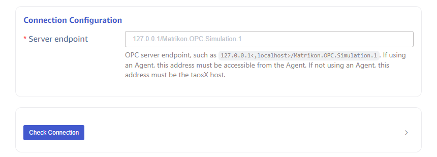
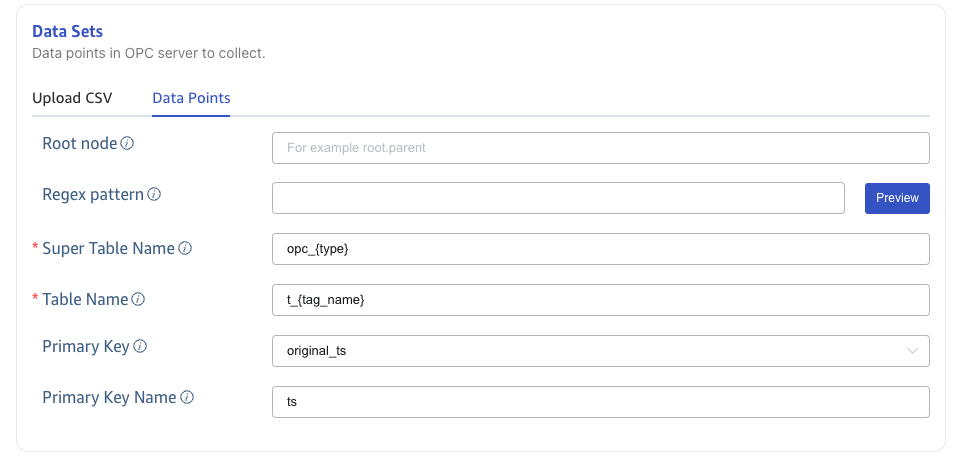
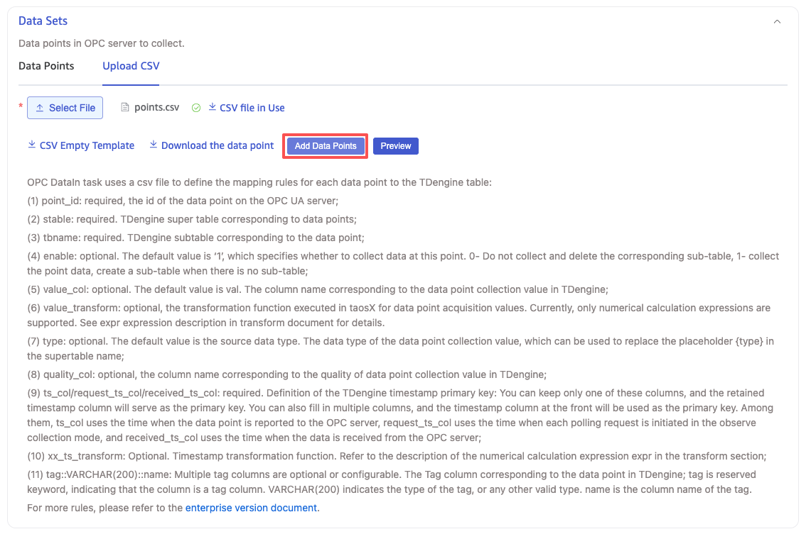
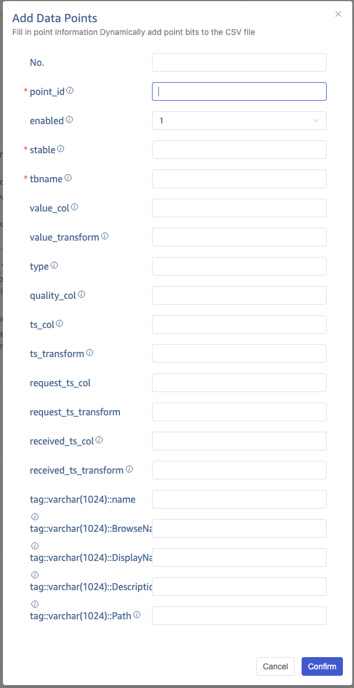

import { AddDataSource, Enterprise } from '../resources/_resources.mdx';

<Enterprise/>

This section describes how to create data migration tasks through the taosExplorer interface, synchronizing data from an OPC-DA server to the current TDengine cluster.

## Overview

OPC is one of the interoperability standards for secure and reliable data exchange in the field of industrial automation and other industries.

OPC DA (Data Access) is a classic COM-based specification, only applicable to Windows. Although OPC DA is not the latest and most efficient data communication specification, it is widely used. This is mainly because some old equipment only supports OPC DA.

TDengine can efficiently read data from OPC-DA servers and write it to TDengine, achieving real-time data storage.

## Procedure

### Add a Data Source

<AddDataSource connectorName="OPC DA"/>

### Configure Connection Information

Fill in the **OPC-DA Service Address** in the **Connection Configuration** area, for example: `127.0.0.1/Matrikon.OPC.Simulation.1`, and configure the authentication method.

Click the **Connectivity Check** button to check if the data source is available.

### Configure Points Set

**Points Set** can choose to use a CSV file template or **Select All Points**.

#### Upload CSV Configuration File

You can download the CSV blank template and configure the point information according to the template, then upload the CSV configuration file to configure the points; or download the data points according to the configured filter conditions, and download them in the format specified by the CSV template.

CSV files have the following rules:

1. File Encoding

The encoding format of the CSV file uploaded by the user must be one of the following:

(1) UTF-8 with BOM

(2) UTF-8 (i.e., UTF-8 without BOM)

1. Header Configuration Rules

The header is the first line of the CSV file, with the following rules:

(1) The header of the CSV can configure the following columns:

| No. | Column Name             | Description                                                                                                                                                                                                                                                            | Required | Default Behavior                                                                                                                                                                                                                                                               |
|-----|-------------------------|------------------------------------------------------------------------------------------------------------------------------------------------------------------------------------------------------------------------------------------------------------------------| -------- | ------------------------------------------------------------------------------------------------------------------------------------------------------------------------------------------------------------------------------------------------------------------------------ |
| 1   | tag_name                | The id of the data point on the OPC DA server                                                                                                                                                                                                                          | Yes      | None                                                                                                                                                                                                                                                                           |
| 2   | stable                  | The supertable in TDengine corresponding to the data point                                                                                                                                                                                                             | Yes      | None                                                                                                                                                                                                                                                                           |
| 3   | tbname                  | The subtable in TDengine corresponding to the data point                                                                                                                                                                                                               | Yes      | None                                                                                                                                                                                                                                                                           |
| 4   | enable                  | Whether to collect data from this point                                                                                                                                                                                                                                | No       | Use a unified default value `1` for enable                                                                                                                                                                                                                                     |
| 5   | value_col               | The column name in TDengine corresponding to the collected value of the data point                                                                                                                                                                                     | No       | Use a unified default value `val` as the value_col                                                                                                                                                                                                                             |
| 6   | value_transform         | The transform function executed in taosX for the collected value of the data point                                                                                                                                                                                     | No       | Do not perform a transform on the collected value                                                                                                                                                                                                                              |
| 7   | type                    | The data type of the collected value of the data point                                                                                                                                                                                                                 | No       | Use the original type of the collected value as the data type in TDengine                                                                                                                                                                                                      |
| 8   | quality_col             | The column name in TDengine corresponding to the quality of the collected value                                                                                                                                                                                        | No       | Do not add a quality column in TDengine                                                                                                                                                                                                                                        |
| 9   | ts_col                  | The timestamp column in TDengine corresponding to the original timestamp of the data point                                                                                                                                                                             | No       | ts_col, request_ts, received_ts these 3 columns, when there are more than 2 columns, the leftmost column is used as the primary key in TDengine.                                                                                                                               |
| 10  | request_ts_col          | The timestamp column in TDengine corresponding to the timestamp when the data point value was request                                                                                                                                                                  | No       | Same as above                                                                                                                                                                                                                                                                  |
| 11  | received_ts_col         | The timestamp column in TDengine corresponding to the timestamp when the data point value was received                                                                                                                                                                 | No       | Same as above                                                                                                                                                                                                                                                                  |
| 12  | ts_transform            | The transform function executed in taosX for the original timestamp of the data point                                                                                                                                                                                  | No       | Do not perform a transform on the original timestamp of the data point                                                                                                                                                                                                         |
| 13  | request_ts_transform    | The transform function executed in taosX for the request timestamp of the data point                                                                                                                                                                                   | No       | Do not perform a transform on the received timestamp of the data point                                                                                                                                                                                                         |
| 14  | received_ts_transform   | The transform function executed in taosX for the received timestamp of the data point                                                                                                                                                                                  | No       | Do not perform a transform on the received timestamp of the data point                                                                                                                                                                                                         |
| 15  | tag::VARCHAR(200)::name | The Tag column in TDengine corresponding to the data point. Where `tag` is a reserved keyword, indicating that this column is a tag column; `VARCHAR(200)` indicates the type of this tag, which can also be other legal types; `name` is the actual name of this tag. | No       | If configuring more than one tag column, use the configured tag columns; if no tag columns are configured, and stable exists in TDengine, use the tags of the stable in TDengine; if no tag columns are configured, and stable does not exist in TDengine, automatically add the following two tag columns by default: tag::VARCHAR(256)::point_idtag::VARCHAR(256)::point_name |

(2) In the CSV Header, there cannot be duplicate columns;

(3) In the CSV Header, columns like `tag::VARCHAR(200)::name` can be configured multiple times, corresponding to multiple Tags in TDengine, but the names of the Tags cannot be duplicated.

(4) In the CSV Header, the order of columns does not affect the CSV file validation rules;

(5) In the CSV Header, columns that are not listed in the table above, such as: serial number, will be automatically ignored.

1. Row Configuration Rules

Each Row in the CSV file configures an OPC data point. The rules for Rows are as follows:

(1) Correspondence with columns in the Header

| Number | Column in Header        | Type of Value | Range of Values                                                                                                                                                                                                                   | Mandatory | Default Value            |
|--------|-------------------------| ------------- | --------------------------------------------------------------------------------------------------------------------------------------------------------------------------------------------------------------------------------- | --------- | ------------------------ |
| 1      | tag_name                | String        | Strings like `root.parent.temperature`, must meet the OPC DA ID specification                                                                                                                                                     | Yes       |                          |
| 2      | enable                  | int           | 0: Do not collect this point, and delete the corresponding subtable in TDengine before the OPC DataIn task starts; 1: Collect this point, do not delete the subtable before the OPC DataIn task starts.                         | No        | 1                        |
| 3      | stable                  | String        | Any string that meets the TDengine supertable naming convention; if there are special characters `.`, replace with underscore. If `{type}` exists: if type in CSV file is not empty, replace with the value of type; if empty, replace with the original type of the collected value | Yes       |                          |
| 4      | tbname                  | String        | Any string that meets the TDengine subtable naming convention; for OPC UA: if `{ns}` exists, replace with ns from point_id; if `{id}` exists, replace with id from point_id; for OPC DA: if `{tag_name}` exists, replace with tag_name | Yes       |                          |
| 5      | value_col               | String        | Column name that meets TDengine naming convention                                                                                                                                                                                | No        | val                      |
| 6      | value_transform         | String        | Computation expressions supported by Rhai engine, such as: `(val + 10) / 1000 * 2.0`, `log(val) + 10`, etc.;                                                                                                                      | No        | None                     |
| 7      | type                    | String        | Supported types include: b/bool/i8/tinyint/i16/smallint/i32/int/i64/bigint/u8/tinyint unsigned/u16/smallint unsigned/u32/int unsigned/u64/bigint unsigned/f32/floatf64/double/timestamp/timestamp(ms)/timestamp(us)/timestamp(ns)/json | No        | Original type of data point value |
| 8      | quality_col             | String        | Column name that meets TDengine naming convention                                                                                                                                                                                | No        | None                     |
| 9      | ts_col                  | String        | Column name that meets TDengine naming convention                                                                                                                                                                                | No        | ts                       |
| 10     | request_ts_col          | String        | Column name that meets TDengine naming convention                                                                                                                                                                                | No        | rts                      |
| 11     | received_ts_col         | String        | Column name that meets TDengine naming convention                                                                                                                                                                                | No        | rts                      |
| 12     | ts_transform            | String        | Supports +, -, *, /, % operators, for example: ts / 1000* 1000, sets the last 3 digits of a ms unit timestamp to 0; ts + 8 *3600* 1000, adds 8 hours to a ms precision timestamp; ts - 8 *3600* 1000, subtracts 8 hours from a ms precision timestamp; | No        | None                     |
| 13     | request_ts_transform    | String        | No                                                                                                                                                                                                                                | None      |                          |
| 14     | received_ts_transform   | String        | No                                                                                                                                                                                                                                | None      |                          |
| 15     | tag::VARCHAR(200)::name | String        | The value in tag, when the tag type is VARCHAR, it can be in Chinese                                                                                                                                                              | No        | NULL                     |

(2) `tag_name` is unique throughout the DataIn task, that is: in an OPC DataIn task, a data point can only be written to one subtable in TDengine. If you need to write a data point to multiple subtables, you need to create multiple OPC DataIn tasks;

(3) When `tag_name` is different but `tbname` is the same, `value_col` must be different. This configuration allows data from multiple data points of different types to be written to different columns in the same subtable. This corresponds to the "OPC data into TDengine wide table" scenario.

1. Other Rules

(1) If the number of columns in Header and Row are not consistent, validation fails, and the user is prompted with the line number that does not meet the requirements;

(2) Header is on the first line and cannot be empty;

(3) Row must have more than 1 line;

#### Selecting Data Points

Data points can be filtered by configuring the **Root Node ID** and **Regular Expression**.

Configure **Supertable Name** and **Table Name** to specify the supertable and subtable where the data will be written.

Configure **Primary Key Column**, choosing `origin_ts` to use the original timestamp of the OPC data point as the primary key in TDengine; choosing `request_ts` to use the timestamp when the data is request as the primary key; choosing `received_ts` to use the timestamp when the data is received as the primary key. Configure **Primary Key Alias** to specify the name of the TDengine timestamp column.

### Collection Configuration

In the collection configuration, set the current task's collection interval, connection timeout, and collection timeout.

As shown in the image:

- **Connection Timeout**: Configures the timeout for connecting to the OPC server, default is 10 seconds.
- **Collection Timeout**: If data is not returned from the OPC server within the set time during data point reading, the read fails, default is 10 seconds.
- **Collection Interval**: Default is 10 seconds, the interval for data point collection, starting from the end of the last data collection, polling to read the latest value of the data point and write it into TDengine.

:::note

- The collection interval is a task-level parameter: all points in the same OPC DA Data In task share one interval. Per-tag or per-group scan rates within a single task are not supported.
- If a small set of points needs a higher or lower rate, put them in another OPC DA task (it can target the same OPC server and database) and set that task’s collection interval separately.
- To change the collection interval, timeouts, and similar settings, Edit and submit the task in taosExplorer. You do not need to reinstall or redeploy taosX-Agent on the OPC server host.

:::

When using **Select Data Points** in the **Data Point Set**, the collection configuration can configure **Data Point Update Mode** and **Data Point Update Interval** to enable dynamic data point updates. **Dynamic Data Point Update** means that during the task operation, if OPC Server adds or deletes data points, the matching data points will automatically be added to the current task without needing to restart the OPC task.

- Data Point Update Mode: Can choose `None`, `Append`, `Update`.
  - None: Do not enable dynamic data point updates;
  - Append: Enable dynamic data point updates, but only append;
  - Update: Enable dynamic data point updates, append or delete;
- Data Point Update Interval: Effective when "Data Point Update Mode" is `Append` and `Update`. Unit: seconds, default value is 600, minimum value: 60, maximum value: 2147483647.

### Advanced Options

As shown above, configure advanced options for more detailed optimization of performance, logs, etc.

**Log Level** defaults to `info`, with options `error`, `warn`, `info`, `debug`, `trace`.

In **Maximum Write Concurrency**, set the limit for the maximum number of concurrent writes to taosX. Default value: 0, meaning auto, automatically configures concurrency.

In **Batch Size**, set the batch size for each write, that is, the maximum number of messages sent at once.

In **Batch Delay**, set the maximum delay for a single send (in seconds). When the timeout ends, as long as there is data, it is sent immediately even if it does not meet the **Batch Size**.

When **Cache Realtime Data** is enabled, data consumed from OPC DA is first written to a local file; a background task continuously reads from the file and sends data to the downstream consumer. This is intended for traffic shaping when the data rate is high enough that downstream cannot keep up and would otherwise drop messages. Once the backlog is consumed, the file is cleaned up automatically. Disabled by default. For detailed information about this feature, see [Store and Forward](../../12-operations-and-tooling/03-components/07-taosx-agent/store-and-forward.md).

In **Cache Storage Directory**, you can enter the directory where the cache files are stored. It defaults to the data directory configured at taosX startup, but can be overridden. This option only takes effect when **Cache Realtime Data** is enabled.

In **Save Raw Data**, choose whether to save raw data. Default value: no.

When saving raw data, the following 2 parameters are effective.

In **Maximum Retention Days**, set the maximum retention days for raw data.

In **Raw Data Storage Directory**, set the path for saving raw data. If using Agent, the storage path refers to the path on the server where Agent is located, otherwise it is on the taosX server. The path can include placeholders `$DATA_DIR` and `:id` as part of the path.

- On Linux platform, `$DATA_DIR` is `/var/lib/taos/taosx`, by default the storage path is `/var/lib/taos/taosx/tasks/<task_id>/rawdata`.
- On Windows platform, `$DATA_DIR` is `C:\TDengine\data\taosx`, by default the storage path is `C:\TDengine\data\taosx\tasks\<task_id>\rawdata`.

### Completion

Click the **Submit** button to complete the creation of the OPC DA to TDengine data synchronization task, return to the **Data Source List** page to view the task execution status.

## Point and Metadata Maintenance

### Add Data Points

While the task is running, click **Edit**, then **Add Data Points**, to append points to the CSV. Use this when you only need to add a few points and do not want to re-import the full point list.

In the pop-up form, fill in the data point information.

Click **Confirm** to finish appending the points.

### Modify Existing Point Mapping or Enable State

- **Point tags / industrial metadata**: For operations- and asset-oriented attributes such as description, engineering unit, range, and source path, maintain them in TDengine IDMP. IDMP provides asset trees and attribute management, which suits selective bulk edits and per-device metadata without repeatedly exporting or re-importing the full OPC point list. See the [TDengine IDMP documentation](https://idmpdocs.taosdata.com/en/). If you are not using IDMP and the metadata is already stored as TAGs in the database, you can use SQL [`ALTER TABLE … SET TAG`](../../05-tdengine-sql/02-ddl/02-table.md#modify-subtable-tag-value), including [batch modify subtable tag values](../../05-tdengine-sql/02-ddl/02-table.md#batch-modify-subtable-tag-value).
- **Enable / disable collection**: Change `enable` on the corresponding CSV rows (`1` = collect, `0` = do not collect) and re-upload the task CSV. When `enable=0`, the corresponding subtable in TDengine is deleted before the task starts (see the Row rules above).
- **Change ingest mapping columns** (such as `stable`, `tbname`, `value_col`, `value_transform`): Download the current point CSV, edit the needed rows, and re-upload. You do not need to rebuild the Agent for a few mapping changes; the task stays bound to the same agent.

### CSV Metadata and Fields Stored in TDengine

What you configure in the CSV / point form determines the TDengine table structure and tags. Unlike OPC UA, OPC DA does not automatically import server Item properties such as Description, Engineering Unit, or Hi/Lo range as TAGs.

| Source | What is written to / affects TDengine |
| --- | --- |
| Required / common CSV columns | `tag_name` (OPC point id), `stable`, `tbname`, value and timestamp columns, and so on |
| CSV `enable` | Whether to collect the point; disabling can delete the corresponding subtable |
| CSV `value_transform` | Rhai expression transform on the numeric value before write (for example unit conversion); result remains a numeric column |
| CSV `tag::TYPE::name` | Custom TAGs; you can manually fill description, engineering unit, range, source path, and other fields from a vendor dump |
| Default TAGs | If no tag columns are configured and the supertable does not exist, `point_id` and `point_name` are added automatically |

If a vendor dump includes description, unit, range, and similar fields, the recommended flow is: arrange points per the CSV template → put description/unit/range into custom `tag::…` columns → upload and create the task. After points are ingested, maintain tags and industrial metadata day to day in IDMP; if IDMP is not used, adjust stored TAGs with SQL `SET TAG`.

For OPC UA auto-mapping of BrowseName / Description / Path and Property→TAG, see [OPC UA](./05-opcua/index.md) and [OPC UA CSV Mapping Reference](./05-opcua/02-csv-reference.md).

## Task Changes and the Agent

Install the Agent once near the OPC server and keep it running. After that, create, edit, start/stop Data In tasks, adjust collection settings, and append or update the point CSV in taosExplorer (or via [Data Ingestion (Xnode)](../../05-tdengine-sql/08-cluster-management/02-xnode.md) SQL). In general you do not need to repackage or reinstall the Agent when points change.

You only need to change the Agent host configuration or reinstall when replacing `endpoint` / `token`, upgrading the Agent, or changing host-local options such as store-and-forward directories. Installation steps: [Install taosX-Agent](./01-install-agent.md).

## Related Documents

- [Install taosX-Agent](./01-install-agent.md): remote agent install and connectivity
- [OPC UA](./05-opcua/index.md): UA point metadata auto-mapping and collection modes
- [TDengine IDMP](../../19-tdengine-idmp/index.md): point tags and industrial metadata management (recommended)
- [Data Ingestion (Xnode)](../../05-tdengine-sql/08-cluster-management/02-xnode.md): manage ingest nodes, tasks, and agents with SQL
- [Modify Subtable Tag Value](../../05-tdengine-sql/02-ddl/02-table.md#modify-subtable-tag-value): batch-update stored TAGs when IDMP is not used
