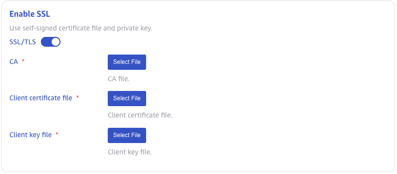
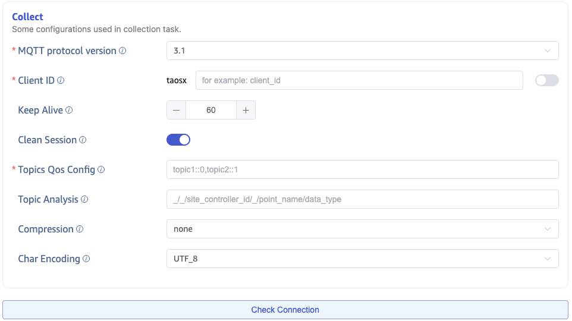
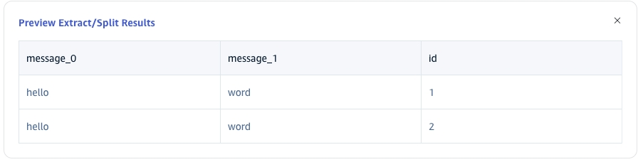
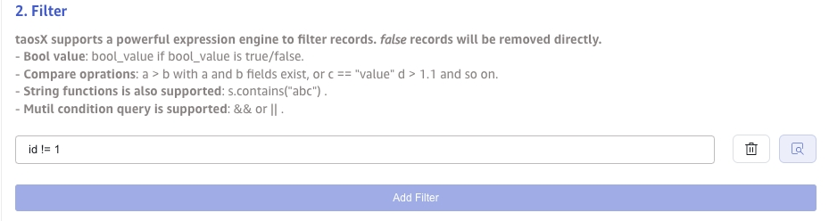
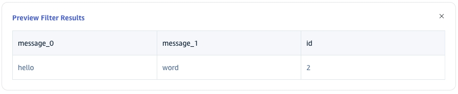
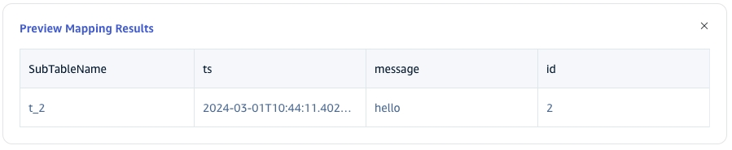
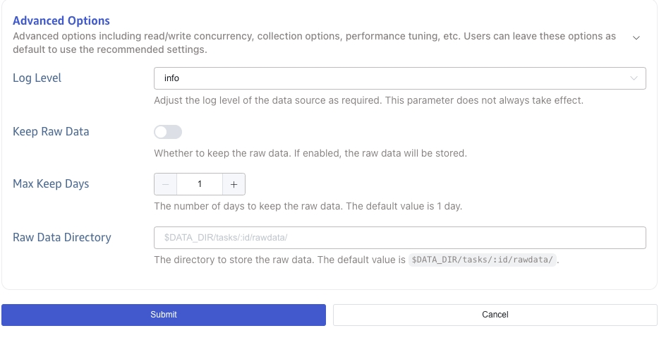

import { AddDataSource, Enterprise } from '../resources/_resources.mdx';

<Enterprise/>

This section describes how to create data migration tasks through the taosExplorer interface, migrating data from MQTT to the current TDengine cluster.

## Overview

MQTT stands for Message Queuing Telemetry Transport. It is a lightweight messaging protocol that is easy to implement and use.

TDengine can subscribe to data from an MQTT broker via an MQTT connector and write it into TDengine, enabling real-time data streaming.

## Procedure

### Add a Data Source

<AddDataSource connectorName="MQTT"/>

### Configure Connection and Authentication Information

Enter the MQTT broker's address in **MQTT Address**, for example: `192.168.1.42`

Enter the MQTT broker's port in **MQTT Port**, for example: `1883`

Enter the MQTT broker's username in **User**.

Enter the MQTT broker's password in **Password**.


### Configure TLS

In **TLS Verification**, select one of the following modes:

1. **Disabled**: Do not verify TLS certificates. The connector first attempts TCP and, if that fails, attempts TLS without certificate verification.
2. **One-way authentication**: Use TLS and verify the server certificate. Upload the CA certificate.
3. **Mutual authentication**: Use mutual TLS. Upload the CA certificate, client certificate, and client private key.



### Configure Collection Information

Fill in the collection task related configuration parameters in the **Collection Configuration** area.

Select the MQTT protocol version from the **MQTT Protocol** dropdown list. There are three options: `3.1`, `3.1.1`, `5.0`. The default value is 3.1.

Enter the client identifier in **Client ID**, after which a client id with the prefix `taosx` will be generated (for example, if the identifier entered is `foo`, the generated client id will be `taosxfoo`). If the switch at the end is turned on, the current task's task id will be concatenated after `taosx` and before the entered identifier (the generated client id will look like `taosx100foo`). All client ids connecting to the same MQTT address must be unique.

Enter the keep alive interval in **Keep Alive**. If the broker does not receive any message from the client within the keep alive interval, it will assume the client has disconnected and will close the connection.
The keep alive interval is the time interval negotiated between the client and the broker to check if the client is active. If the client does not send a message to the broker within the keep alive interval, the broker will disconnect.

In **Clean Session**, choose whether to clear the session. The default value is true.

When MQTT `5.0` is selected, you can configure custom **Connection User Properties** and **Subscription User Properties**. When using a TDengine Bnode as the MQTT broker, you can also specify the initial subscription position.

In the **Topics Qos Config**, fill in the topic name and QoS to subscribe. Use the following format: `{topic_name}::{qos}` (e.g., `my_topic::0`). MQTT protocol 5.0 supports shared subscriptions, allowing multiple clients to subscribe to the same topic for load balancing. Use the following format: `$share/{group_name}/{topic_name}::{qos}`, where `$share` is a fixed prefix indicating the enablement of shared subscription, and `group_name` is the client group name, similar to Kafka's consumer group.

In the **Topic Analysis**, fill in the MQTT topic parsing rules. The format is the same as the MQTT Topic, parsing each level of the MQTT Topic into corresponding variable names, with `_` indicating that the current level is ignored during parsing. For example: if the MQTT Topic `a/+/c` corresponds to the parsing rule `v1/v2/_`, it means assigning the first level `a` to variable `v1`, the value of the second level (where the wildcard `+` represents any value) to variable `v2`, and ignoring the value of the third level `c`, which will not be assigned to any variable. In the `payload parsing` below, the variables obtained from Topic parsing can also participate in various transformations and calculations.

In the **Compression**, configure the message body compression algorithm. After receiving the message, taosX uses the corresponding compression algorithm to decompress the message body and obtain the original data. Options include none (no compression), gzip, snappy, lz4, and zstd, with the default being none.

In the **Char Encoding**, configure the message body encoding format. After receiving the message, taosX uses the corresponding encoding format to decode the message body and obtain the original data. Options include UTF_8, GBK, GB18030, and BIG5, with the default being UTF_8.

Click the **Check Connection** button to check if the data source is available.



### Configure MQTT Payload Parsing

Fill in the Payload parsing related configuration parameters in the **MQTT Payload Parsing** area.

taosX can use a JSON extractor to parse data and allows users to specify the data model in the database, including specifying table names and supertable names, setting ordinary columns and tag columns, etc.

#### Parsing

There are three methods to obtain sample data:

Click the **Retrieve from Server** button to get sample data from MQTT.

Click the **File Upload** button to upload a CSV file and obtain sample data.

Fill in the example data from the MQTT message body in **Message Body**.

JSON data supports JSONObject or JSONArray, and the json parser can parse the following data:

```json
{"id": 1, "message": "hello-word"}
{"id": 2, "message": "hello-word"}
```

or

```json
[{"id": 1, "message": "hello-word"},{"id": 2, "message": "hello-word"}]
```

The analysis results are as follows:


Click the **magnifying glass icon** to view the preview of the analysis results.


#### Field Splitting

In **Extract or Split from Column**, fill in the fields to extract or split from the message body, for example: split the `message` field into `message_0` and `message_1`, select the split extractor, fill in the separator as -, and number as 2.


Click **Delete** to remove the current extraction rule.

Click **Add** to add more extraction rules.

Click the **magnifying glass icon** to view the preview of the extraction/split results.



#### Data Filtering

In **Filter**, fill in the filtering conditions, for example: write `id != 1`, then only data with id not equal to 1 will be written to TDengine.



Click **Delete** to remove the current filtering rule.

Click the **magnifying glass icon** to view the preview of the filtering results.



#### Table Mapping

In the **Target Supertable** dropdown, select a target supertable, or click the **Create Supertable** button on the right.

If the supertable must be generated dynamically from each message, select **Create Template**. The supertable name, column names, and column types can contain template variables. When data arrives, taosX evaluates the variables, creates a missing supertable, and adds missing columns to an existing supertable.

In **Mapping**, fill in the subtable name in the target supertable, for example: `t_{id}`. Fill in the mapping rules according to the requirements, where mapping supports setting default values.


Click **Preview** to view the mapping results.



If a supertable column name is a template variable, mapping performs a pivot: the template-variable values become column names and the mapped field supplies their values.

### Advanced Options

import AdvancedOptionsMqtt from './resources/_02-advanced-options-mqtt.mdx'

<AdvancedOptionsMqtt />



### Exception Handling

import ExceptionHandling from './resources/_03-exception-handling-strategy.mdx'

<ExceptionHandling />

### Completion

Click the **Submit** button to complete the creation of the MQTT to TDengine data synchronization task, return to the **Data Source List** page to view the status of the task execution.
