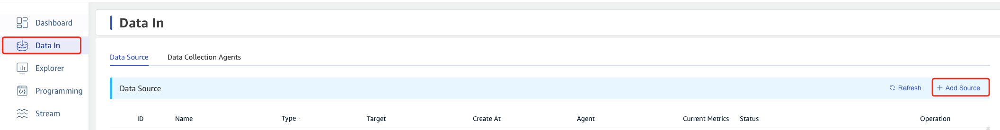
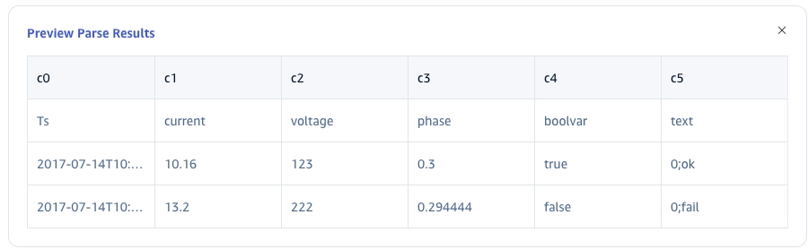
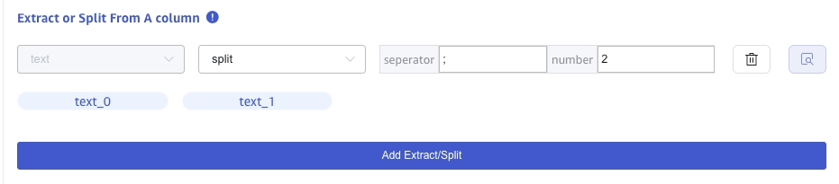
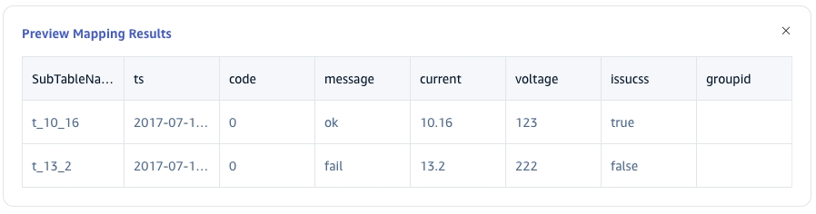
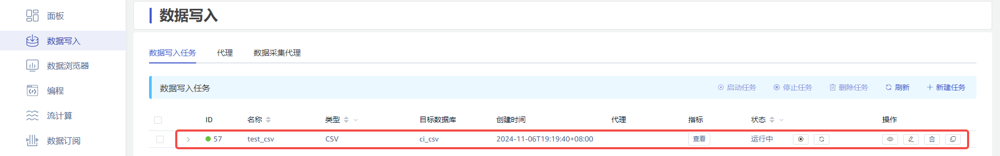
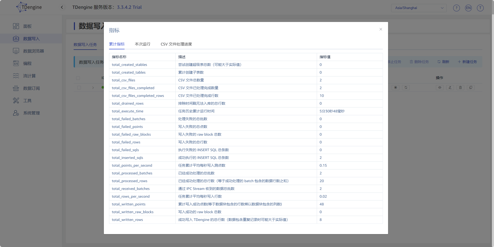
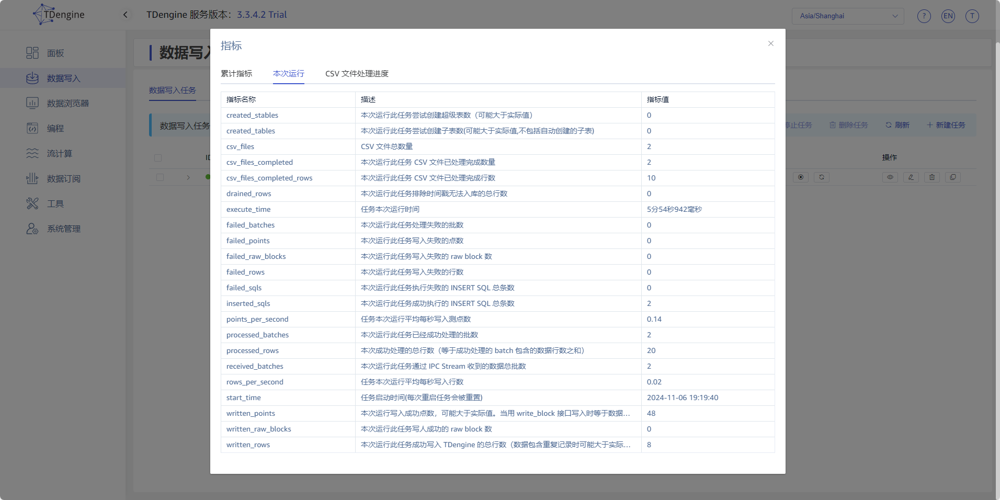
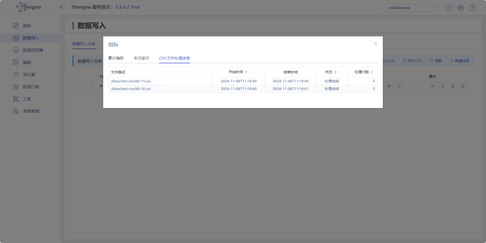

import { Enterprise } from '../resources/_resources.mdx';

<Enterprise/>

This section describes how to create data migration tasks through the Explorer interface, migrating data from CSV to the current TDengine cluster.

## Feature Overview

Import data from one or more CSV files into TDengine.

## Create Task

### 1. Add Data Source

On the data writing page, click the **+Add Data Source** button to enter the add data source page.

### 2. Configure Basic Information

Enter the task name in **Name**, such as: "test_csv";

Select **CSV** from the **Type** dropdown list.

Select a target database from the **Target Database** dropdown list, or click the **+Create Database** button on the right.

### 3. Configure CSV Options

Click to enable or disable in the **Include Header** area, if enabled, the first line will be treated as column information.

In the **Ignore First N Rows** area, fill in N, indicating to ignore the first N rows of the CSV file.

Select in the **Field Separator** area, the separator between CSV fields, default is ",".

Select in the **Field Enclosure** area, used to surround field content when CSV fields contain separators or newline characters, ensuring the entire field is correctly recognized, default is "\"".

Select in the **Comment Prefix** area, if a line in the CSV file starts with the character specified here, that line will be ignored, default is "#".

### 4. Configure Parsing CSV File

Upload a CSV file locally, for example: test-json.csv, this example csv file will be used later to configure extraction and filtering conditions.

#### 4.1 Parsing

Click **Select File**, choose test-json.csv, then click **Parse** to preview the recognized columns.

#### 4.2 Field Splitting

In **Extract or Split from Column**, fill in the fields to extract or split from the message body, for example: split the message field into `text_0` and `text_1`, select the split extractor, fill in the separator as -, and number as 2.
Click **Delete** to remove the current extraction rule.
Click **Add** to add more extraction rules.

Click the **Magnifying Glass Icon** to preview the extraction or splitting results.

<!-- In **Filter**, fill in the filtering conditions, for example: fill in `id != 1`, then only data with id not equal to 1 will be written into TDengine.
Click **Delete** to remove the current filtering rule.

Click the **Magnifying Glass Icon** to view the preview filtering results.
-->

#### 4.3 Table Mapping

Select a target supertable from the **Target Supertable** dropdown list, or click the **Create Supertable** button on the right.

In **Mapping**, fill in the subtable name of the target supertable, for example: `t_${groupid}`.

Click **Preview** to preview the mapping results.

### 5. Configure Advanced Options

import AdvancedOptions from "./resources/_02-advanced_options.mdx";

<AdvancedOptions />

### 6. Configure Exception Handling

import ExceptionHandling from "./resources/_03-exception-handling-strategy.mdx";

<ExceptionHandling />

### 7. Completion

Click **Submit** to create the CSV ingestion task. On the task list, you can start, stop, view, edit, delete, or copy the task.

<!--  -->

### 8. View Runtime Metrics

Click **View** to inspect task metrics and the processing status of every file.

<!--  -->

<!--  -->

<!--  -->
