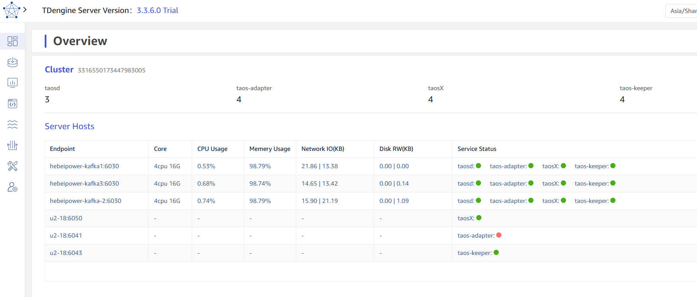

import Image from '@theme/IdealImage';
import imgMonitor1 from '../assets/monitor-your-cluster-01.png';
import imgMonitor2 from '../assets/monitor-your-cluster-02.png';
import imgMonitor3 from '../assets/monitor-your-cluster-03.png';
import imgMonitor4 from '../assets/monitor-your-cluster-04.png';
import imgMonitor5 from '../assets/monitor-your-cluster-05.png';
import imgMonitor6 from '../assets/monitor-your-cluster-06.png';
import imgMonitor7 from '../assets/monitor-your-cluster-07.png';
import imgMonitor8 from '../assets/monitor-your-cluster-08.png';

To ensure stable operation of the cluster, TDengine integrates various monitoring metrics collection mechanisms and summarizes them through taosKeeper. taosKeeper is responsible for receiving these data and writing them into a separate TDengine instance, which can remain independent of the monitored TDengine cluster. The two core components of TDengine, taosd (database engine) and taosX (data access platform), both implement runtime monitoring through the same monitoring architecture, but their monitoring metrics are designed differently.

As for how to obtain and use these monitoring data, users can use third-party monitoring tools such as Zabbix to retrieve the saved system monitoring data, thereby seamlessly integrating the operation status of TDengine into the existing IT monitoring system. Alternatively, users can use the TDinsight plugin provided by TDengine, which allows users to visually display and manage these monitoring information through the Grafana platform, as shown in the figure below. This provides users with flexible monitoring options to meet operational needs in different scenarios.

<figure>
<Image img={imgMonitor1} alt="Managing monitoring information"/>
<figcaption>Figure 1. Managing monitoring information</figcaption>
</figure>

## Configuring taosKeeper

Since the monitoring data of TDengine are all reported and stored through taosKeeper, this section will first introduce the configuration of taosKeeper.

The configuration file of taosKeeper is located by default at `/etc/taos/taoskeeper.toml`. For detailed configuration, see [Reference Manual](../../tdengine-reference/components/taoskeeper/#configuration-file). Among them, the most critical configuration item is `database`, which determines which database in the target system the collected monitoring data is stored in.

## Monitoring taosd

### Monitoring taosd with TDinsight

To simplify the configuration work of users in TDengine monitoring, TDengine provides a Grafana plugin named TDinsight. This plugin works in conjunction with taosKeeper and can monitor various performance metrics of TDengine in real-time.

By integrating Grafana and TDengine data source plugin, TDinsight can read the monitoring data collected by taosKeeper. This allows users to intuitively view the status of the TDengine cluster, node information, read/write requests, and resource usage on the Grafana platform, achieving data visualization.

Below are the detailed instructions for using TDinsight to help you fully utilize this powerful tool.

#### Prerequisites

To use TDinsight smoothly, the following conditions should be met.

- TDengine is installed and running normally.
- taosAdapter is installed and running normally.
- taosKeeper is installed and running normally.
- Grafana is installed and running normally, with the following introduction based on Grafna 11.0.0.

Also, record the following information.

- RESTful interface address of taosAdapter, such as `http://www.example.com:6041`.
- Authentication information of the TDengine cluster, including username and password.

#### Importing the Dashboard

The TDengine data source plugin has been submitted to the Grafana official website. For how to install the TDengine data source plugin and configure the data source, please refer to: [Install Grafana Plugin and Configure Data Source](../../third-party-tools/visualization/grafana/#install-grafana-plugin-and-configure-data-source). After completing the installation of the plugin and the creation of the data source, you can proceed with the import of the TDinsight dashboard.

On the "Home" -> "Dashboards" page of Grafana, click the "New" -> "import" button in the upper right corner to enter the Dashboard import page, which supports the following two import methods.

- Dashboard ID: 18180.
- Dashboard URL: [https://grafana.com/grafana/dashboards/18180-tdinsight-for-3-x/](https://grafana.com/grafana/dashboards/18180-tdinsight-for-3-x/)

After filling in the above Dashboard ID or Dashboard URL, click the "Load" button and follow the guide to complete the import. After the import is successful, the "TDinsight for 3.x" dashboard will appear on the Dashboards list page. Click to enter, and you will see the panels of various metrics created in TDinsight, as shown in the figure below:

<figure>
<Image img={imgMonitor2} alt="TDinsight interface"/>
<figcaption>Figure 2. TDinsight interface</figcaption>
</figure>

**Note** In the "Log from" dropdown list in the upper left corner of the TDinsight interface, you can select the `log` database.

### TDengine V3 Monitoring Data

TDinsight dashboard data comes from the `log` database (the default database for storing monitoring data, which can be modified in the taoskeeper configuration file). The "TDinsight for 3.x" dashboard queries monitoring metrics for taosd and TaosAdapter.

- For taosd monitoring metrics, refer to [taosd monitoring metrics](../../tdengine-reference/components/taosd/)
- For taosAdapter monitoring metrics, refer to [taosAdapter monitoring metrics](../../tdengine-reference/components/taosadapter/)

## Monitoring taosX

taosX is a core component in TDengine that provides zero-code data access capabilities, and monitoring it is also very important. Monitoring of taosX is similar to TDengine monitoring; it involves using taosKeeper to write collected metrics into a specified database, then leveraging Grafana panels for visualization and alerts. The monitorable objects include:

1. taosX process
2. All running taosx-agent processes
3. Various connector subprocesses running on the taosX or taosx-agent side
4. Various data writing tasks in progress

### Prerequisites

1. taosd, taosAdapter, and taosKeeper have all been deployed and started successfully.
2. taosX service monitoring is configured correctly, see below "Configuring taosX Monitoring" for configuration details, and the service has started successfully.  
   **Note**: TDengine Enterprise version 3.2.3.0 or above includes this functionality in taosX. If taosX is installed separately, it requires version 1.5.0 or above.
3. Deploy Grafana, install the TDengine Datasource plugin, and configure the data source. Refer to: [Install Grafana Plugin and configure data source](../../third-party-tools/visualization/grafana/).  
   **Note**: You need to install the Grafana plugin [TDengine Datasource v3.5.0](https://grafana.com/grafana/plugins/tdengine-datasource/) or above.

### Configuring taosX Monitoring

The configuration related to monitoring in the taosX configuration file (default /etc/taos/taosx.toml) is as follows:

```toml
[monitor]
# FQDN of taosKeeper service, no default value
# fqdn = "localhost"
# port of taosKeeper service, default 6043
# port = 6043
# how often to send metrics to taosKeeper, default every 10 seconds. Only value from 1 to 10 is valid.
# interval = 10
```

Each configuration also has corresponding command line options and environment variables. Explained in the following table:

| Configuration File Option | Command Line Option | Environment Variable | Meaning                                              | Value Range | Default Value                             |
| ------------------------- | ------------------- | -------------------- | ---------------------------------------------------- | ----------- | ----------------------------------------- |
| fqdn                      | --monitor-fqdn      | MONITOR_FQDN         | FQDN of taosKeeper service                           |             | No default value, configuring fqdn enables monitoring |
| port                      | --monitor-port      | MONITOR_PORT         | Port of taosKeeper service                           |             | 6043                                      |
| interval                  | --monitor-interval  | MONITOR_INTERVAL     | Interval in seconds for taosX to send metrics to taosKeeper | 1-10      | 10                                        |

### Monitoring tasoX Based on TDinsight

"TDinsight for taosX" is a Grafana dashboard specifically created for monitoring taosX. You need to import this dashboard before using it.

#### Entering the Dashboard

1. In the Grafana interface menu, click "Data sources", then select the TDengine data source that has been configured.
2. In the data source configuration interface, select the "Dashboard" tab, and then import the "TDinsight for taosX" dashboard (you need to import it the first time you use it). Below is an example image:

   <figure>
   <Image img={imgMonitor3} alt=""/>
   </figure>

   Each row on the dashboard represents one or a category of monitoring objects. The top row is for monitoring taosX, followed by the Agent monitoring row, and finally the monitoring of various data writing tasks.
   :::note
   - If you open this dashboard and see no data, you likely need to click on the database list in the upper left corner (the "Log from" dropdown menu) and switch to the database where the monitoring data is stored.
   - The database will automatically create as many Agent rows as there are Agents' data. (As shown in the picture above)
   :::

#### Monitoring Examples

1. taosX monitoring example image

   <figure>
   <Image img={imgMonitor4} alt=""/>
   </figure>

2. Agent monitoring example image

   <figure>
   <Image img={imgMonitor5} alt=""/>
   </figure>

3. TDengine2 data source monitoring example image

   <figure>
   <Image img={imgMonitor6} alt=""/>
   </figure>

   :::info
   The monitoring panel only displays some monitoring indicators for data writing tasks. There are more comprehensive monitoring indicators on the Explorer page, with detailed explanations for each indicator.

   :::

4. TDengine3 data source monitoring example image

   <figure>
   <Image img={imgMonitor7} alt=""/>
   </figure>

5. Other data source monitoring example image

   <figure>
   <Image img={imgMonitor8} alt=""/>
   </figure>

#### Limitations

Monitoring-related configurations only take effect when taosX is running in server mode.

## Cluster Dashboard

After logging into the explorer, switch to the "Dashboard" page, and you can view the cluster status. As shown in the following figure, it includes the number of taosd/taos-adapter/taosX/taos-keeper in the cluster, as well as the information of dnode hosts and the status of various service components.


