To facilitate users in more efficiently utilizing and managing TDengine, version 3.0 introduced a new visual component—taosExplorer. This component aims to help users manage TDengine clusters easily, even without SQL familiarity. Through taosExplorer, users can effortlessly monitor the operational status of TDengine, browse data, configure data sources, perform stream computations, and set up data subscriptions. Additionally, users can use taosExplorer for data backup, replication, synchronization operations, and to configure various access permissions for users. These features significantly simplify the database usage process and enhance the user experience.

This section introduces the basic functions of visual management.

## Login

After completing the installation and startup process of TDengine, users can immediately start using taosExplorer. This component listens on TCP port 6060 by default. Users only need to enter `http://<IP>:6060/login` (where IP is the user's address) in their browser to log in successfully. Upon successful login to the cluster, users will find that various functions are clearly divided into different modules in the left navigation bar. The main modules will be briefly introduced next.

## Runtime Monitoring Panel

After installing the TDengine data source plugin on Grafana, you can add the TDengine data source and import the TDengine Grafana Dashboard: TDengine for 3.x. By doing this, users will be able to monitor the operational status of TDengine in real-time and set up alerts without writing any code. For details, please refer to [Monitor Your Cluster](../monitor-your-cluster/).

## Programming

On the "Programming" page, users can see how different programming languages interact with TDengine to perform basic operations such as writing and querying data. Users can create an example project simply by copying and pasting code. Currently supported programming languages include Java, Go, Python, Node.js (JavaScript), C#, Rust, and R.

## Data Ingestion

By creating different tasks, users can import data from various external data sources into TDengine with zero code. Currently, TDengine supports data sources including AVEVA PI System, OPC-UA/DA, MQTT, Kafka, InfluxDB, OpenTSDB, TDengine 2, TDengine 3, CSV, AVEVA Historian, etc. In the task configuration, users can also add ETL-related configurations.

On the task list page, users can start, stop, edit, delete tasks, and view the activity logs of the tasks.

For detailed information on data ingestion, please refer to [Data Ingestion].

## Data Browser

By clicking on the "Data Browser" entry in the feature list, users can create and delete databases, create and delete supertables and subtables, execute SQL statements, and view the execution results of SQL statements. In addition, super administrators have management permissions for databases, while other users do not have this feature. The following image shows:

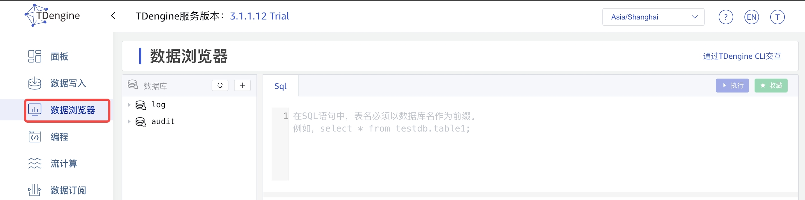

### Creating a Database

The following illustrates the functionality and operations of the data browser page through the creation of a database, showcasing two methods for creating a database:

1. By clicking the + sign in the image, users will be redirected to the create database page. Click the Create button as shown in the following image:

**Step 1:** Click the + sign;
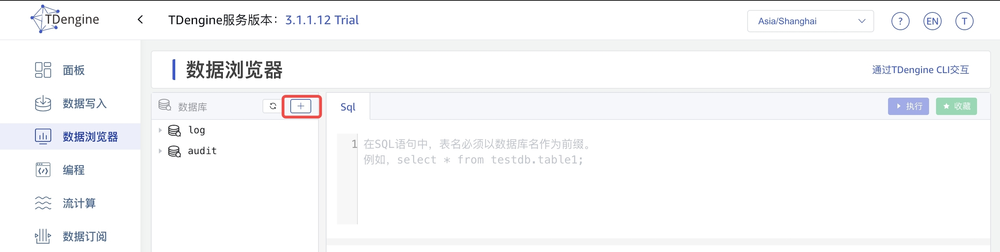

**Step 2:** Fill in the database name and necessary database configuration parameters, which are categorized and collapsible; click to expand.
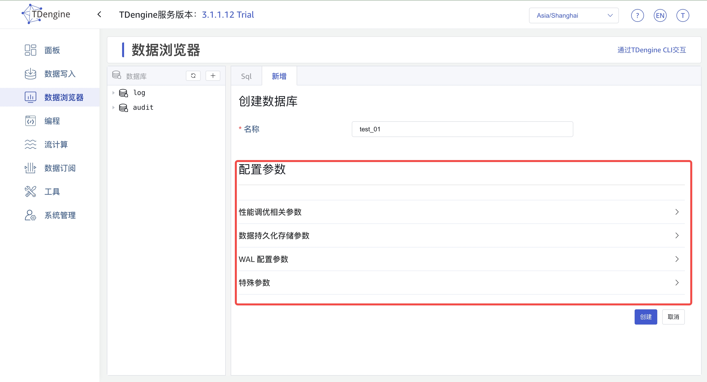
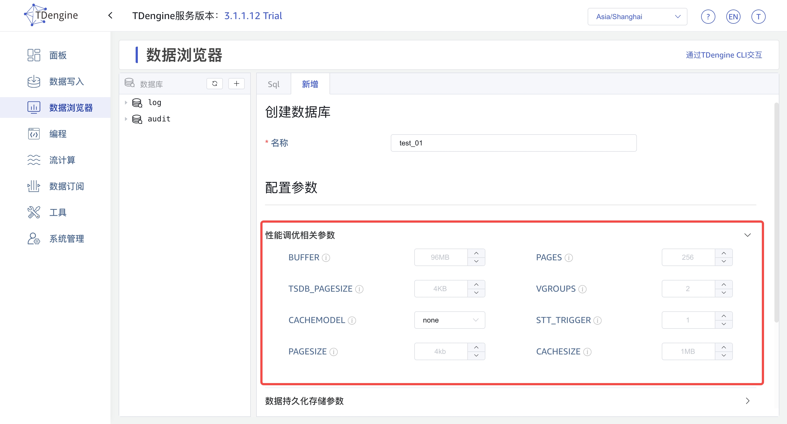

**Step 3:** After clicking the "Create" button, the database name will appear on the left, indicating that the database has been successfully created.
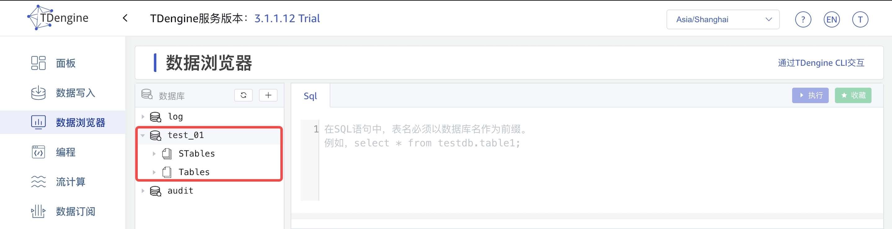

2. By entering SQL statements in the SQL editor, click the Execute button, as shown in the following image:

**Step 1:** Input the SQL statement;
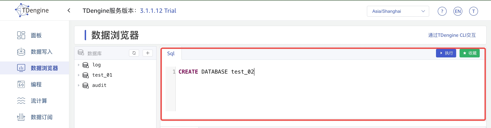

**Step 2:** After clicking the "Execute" button, the database name test02 will appear on the left, indicating successful creation.
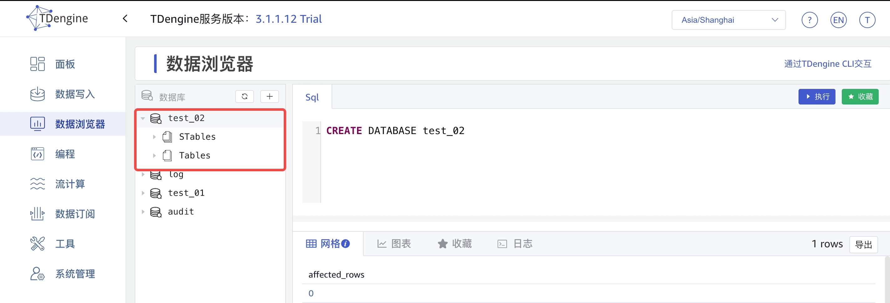

Since creating, modifying, and deleting supertables, as well as creating tables and subtables, are behaviorally consistent, creating a supertable will be demonstrated as an example:

### Creating a Supertable

**Step 1:** Hover over STables, click the + sign to open the create supertable tab;
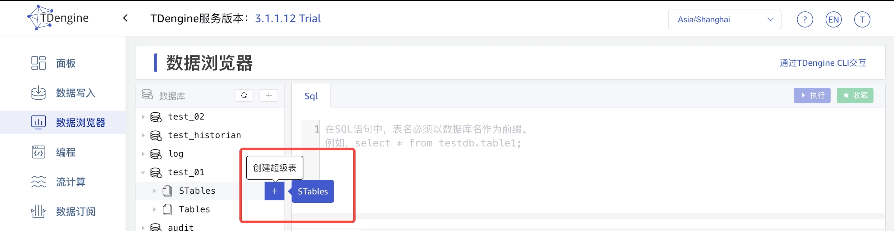

**Step 2:** Fill in the supertable information and click the "Create" button;
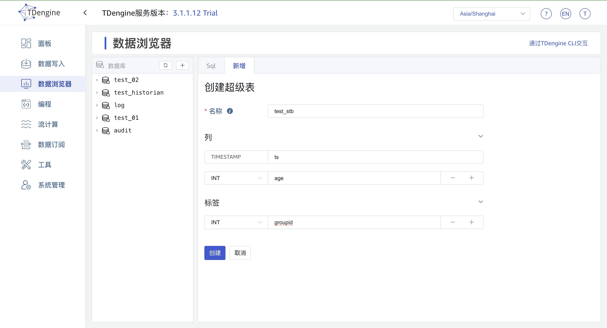

**Step 3:** Clicking on Stables will show the name of the supertable just created, indicating success.
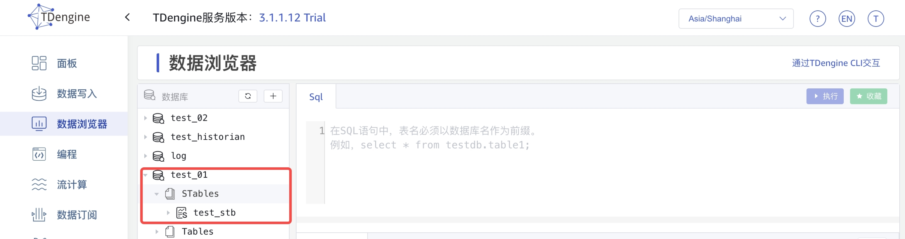

### Viewing a Supertable

Hover over the supertable you wish to view; the icon will appear as shown in the following image. Click the "eye icon" to view the supertable information.

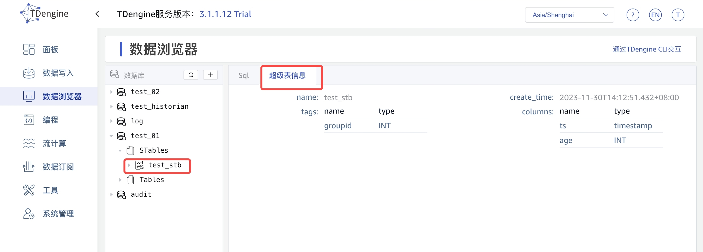

### Modifying a Supertable

Hover over the supertable you wish to edit; the icon will appear as shown in the following image. Click the "edit icon" to modify the supertable information.
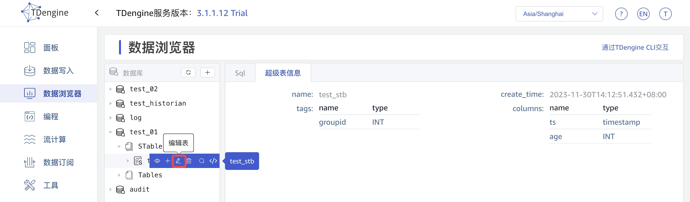

### Deleting a Supertable

Hover over the supertable you wish to delete; the icon will appear as shown in the following image. Click the "delete icon" to remove the supertable.
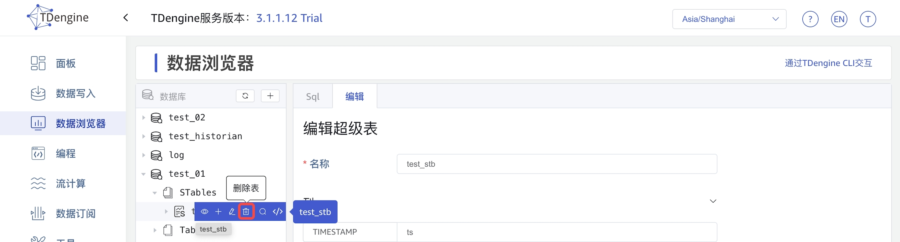

### Using the SQL Editor

When entering multiple statements, you can select the statements to execute with your mouse. You can also comment on statements (shortcut keys Control-/ Command-/), then click execute.
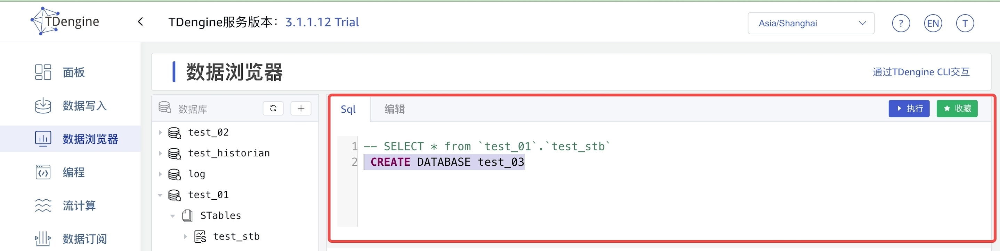

### Using the SQL Favorites Feature

Select the SQL in the window and click the favorite button to save the SQL, along with a description of the SQL statement.
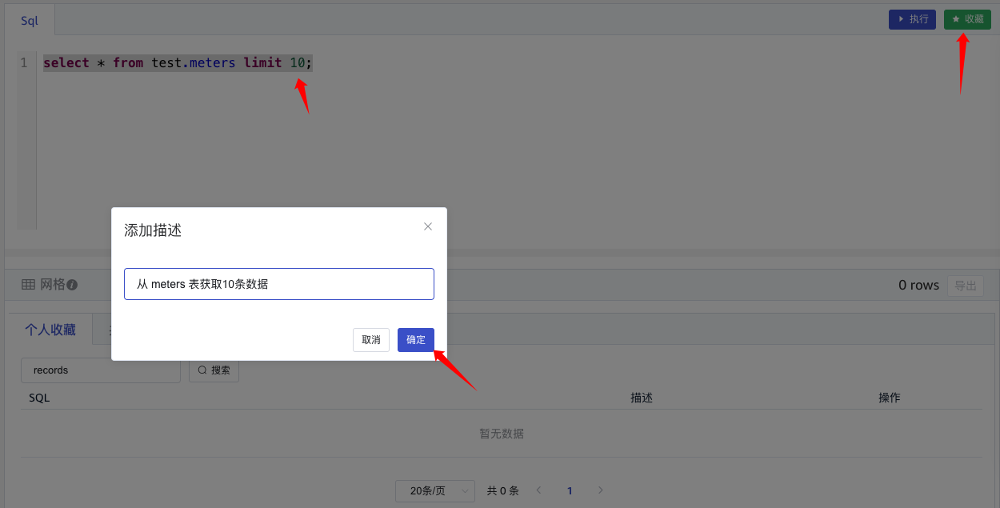

In your favorites, click the share button on the SQL to add the current SQL to shared favorites.
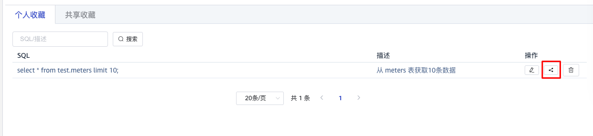

SQL in the shared favorites will be visible to all users.

Click the cancel share button to withdraw the sharing of this SQL.

In the search bar, you can perform a fuzzy search for SQL or descriptions.
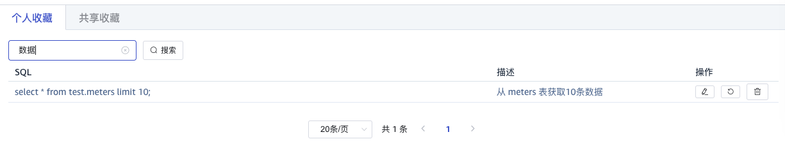

Click the delete button to remove the SQL from your favorites. If the SQL has already been shared in shared favorites, the corresponding SQL in the shared favorites will be deleted simultaneously.

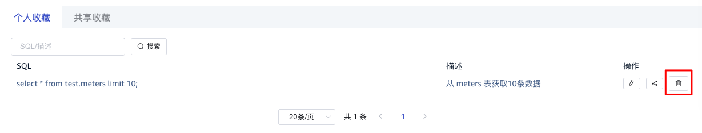

:::note

1. If the SQL you want to favorite is already in your favorites, it cannot be favored again. This operation will report an error but will not have any consequences.
2. If the SQL you wish to share has already been shared by you or others, it cannot be shared again. This operation will report an error but will not have any consequences.

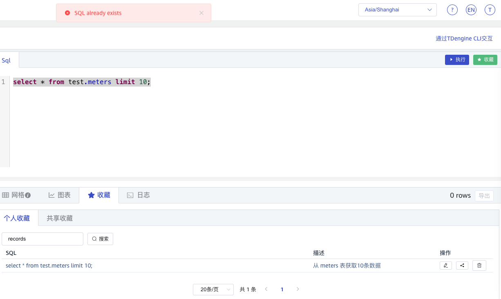

:::

## Stream Computing

Through Explorer, you can easily manage streams to better utilize the stream computing capabilities provided by TDengine. Click on the "Stream Computing" option in the left navigation bar to access the stream computing configuration management page. You can create streams in two ways: using the stream computing wizard and custom SQL statements. Currently, the stream computing wizard does not support grouping functions. When creating streams using custom SQL, you need to understand the syntax of TDengine's stream computing SQL statements and ensure their correctness.

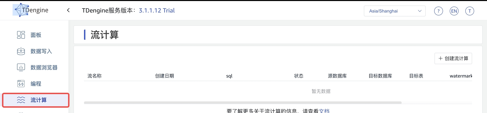

### Creating Stream Computation Wizard

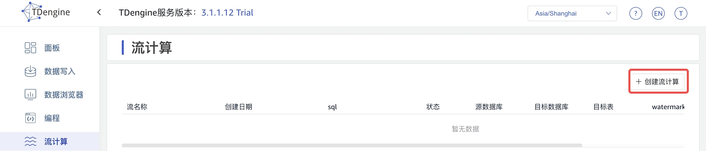

**Step 1:** Fill in the required information to create stream computation and click the Create button;

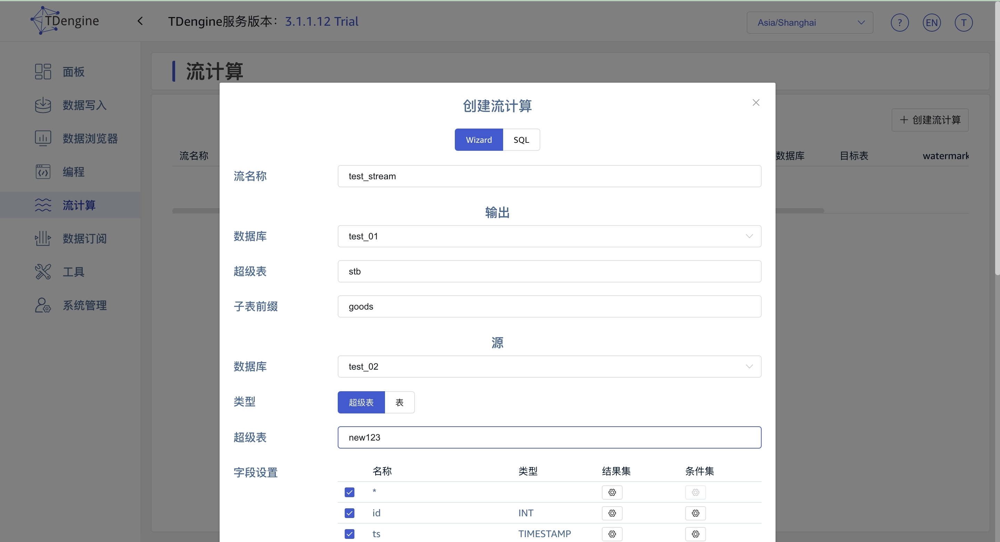
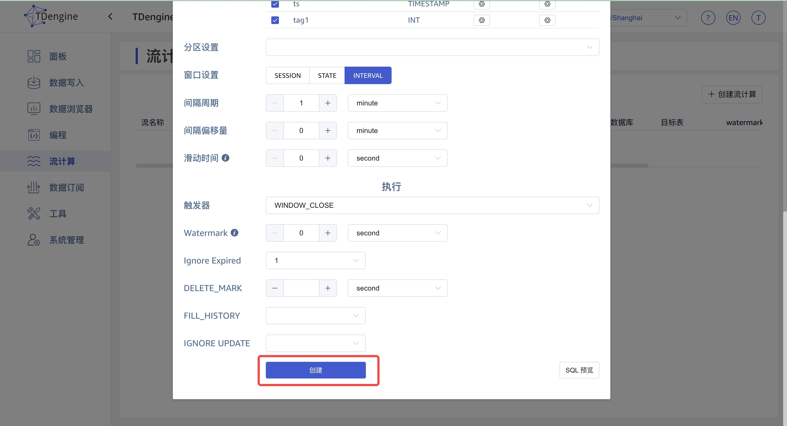

**Step 2:** If the following record appears on the page, it indicates successful creation.
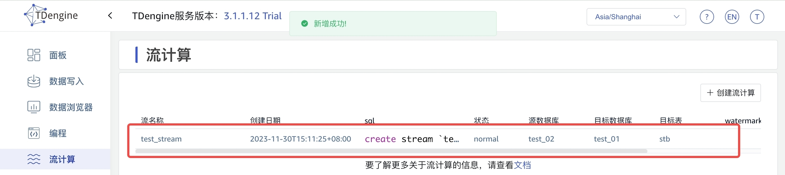

### Using SQL

**Step 1:** Switch to the SQL tab, directly input the SQL statement to create stream computation, and click the Create button;
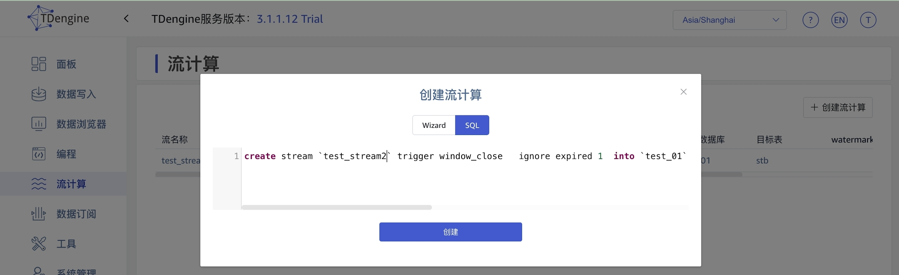

**Step 2:** If the following record appears on the page, it indicates successful creation.

## Data Subscription

Through Explorer, you can easily manage data subscriptions to better utilize the data subscription capabilities provided by TDengine. Click on the "Data Subscription" option in the left navigation bar to access the data subscription configuration management page. You can create topics using two methods: using the wizard and custom SQL statements. When creating topics using custom SQL, you need to understand the syntax of TDengine's data subscription SQL statements and ensure their correctness.

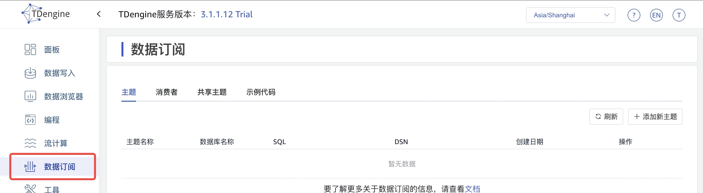

### Adding Data Subscription

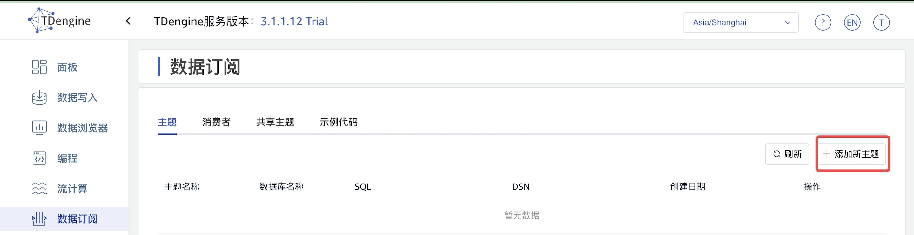

1. Wizard Method

**Step 1:** Fill in the required information to add a new topic and click the "Create" button;
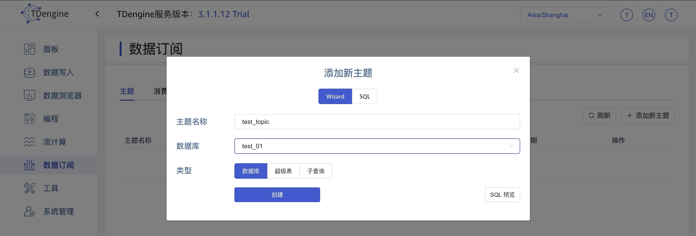

**Step 2:** If the following record appears on the page, it indicates successful creation.
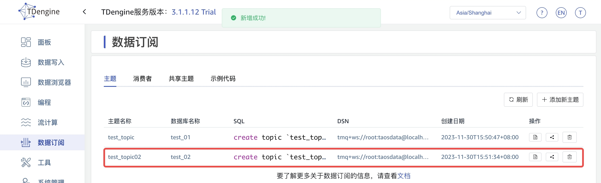

2. SQL Method

**Step 1:** Switch to the SQL tab, directly input the SQL statement to add a new topic, and click the "Create" button;

**Step 2:** If the following record appears on the page, it indicates successful creation.
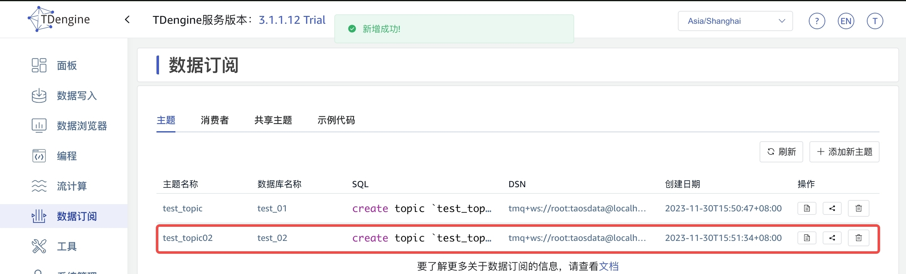

### Sharing Topics

In the "Shared Topics" tab, select the topic you want to share from the "Topics" drop-down list; click the "Add Consumers for this Topic" button, then select the corresponding user from the "Username" drop-down list, and click "Add" to share this topic with the user.

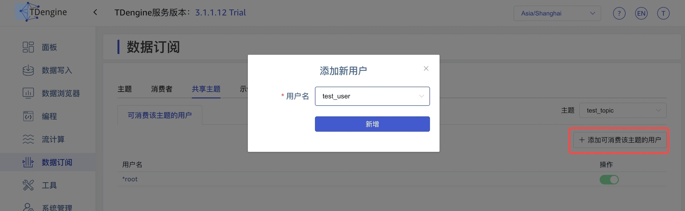

### Viewing Consumer Information

You can consume the shared topic by executing the "Full Instance" program described in the next section "Sample Code". In the "Consumers" tab, you can view information related to consumers.
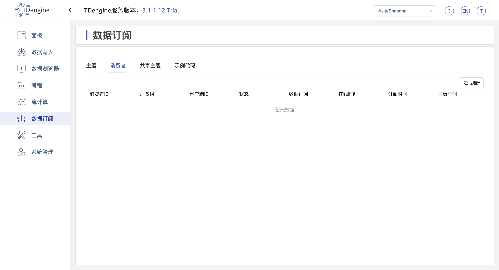

### Sample Code

In the "Sample Code" tab, select the corresponding topic from the "Topics" drop-down list; choose your preferred language to read and use this section of sample code to "create consumption" and "subscribe to topics". By executing the program in the "Full Instance", you can consume the shared topic.
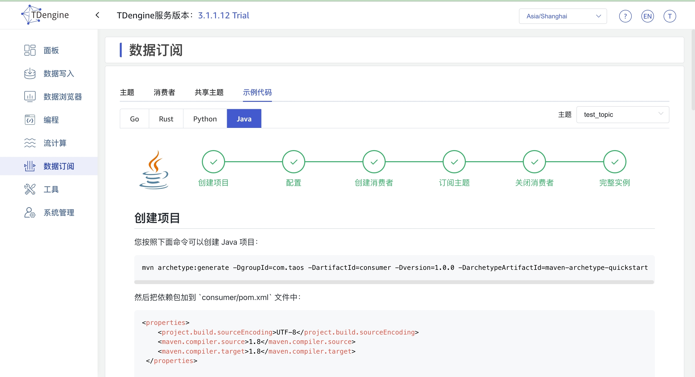

## Tools

Through the "Tools" page, users can learn about the usage methods of the following TDengine peripheral tools:

- TDengine CLI.
- taosBenchmark.
- taosDump.
- Integration of TDengine with BI tools such as Google Data Studio, Power BI, and Yonghong BI.
- Integration of TDengine with Grafana and Seeq.

## System Management

By clicking the "System Management" entry in the feature list, you can create users, grant access permissions to users, and delete users. You can also back up and restore data for the current managed cluster and configure a remote TDengine address for data synchronization. Additionally, it provides information about the cluster, licenses, and proxy information for viewing. The system management menu is only accessible to the root user.

### User Management

Upon clicking "System Management," you will default to the "Users" tab.
In the user list, you can view existing users in the system and their creation times, and you can enable, disable, edit (including changing passwords, database read/write permissions, etc.), and delete users.

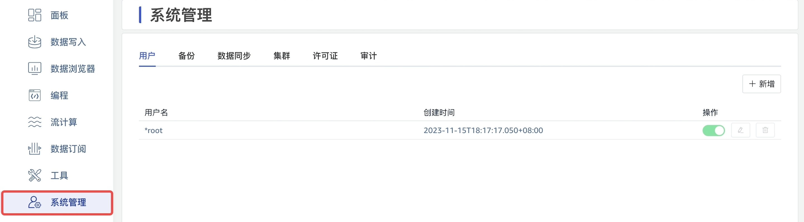

**Step 1:** Click the "+ Add" button in the upper right corner of the user list to open the "Add User" dialog, fill in the new user's information, and click the "Confirm" button:
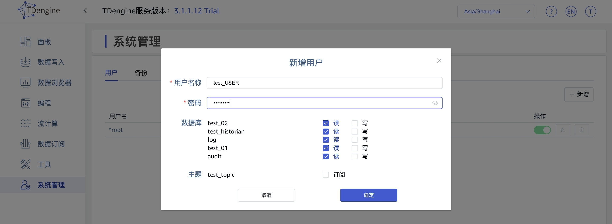

**Step 2:** View the newly added user.

### Importing Users/Permissions

Click the Import button, which will pop up the Import Users/Permissions form. Fill in the information and click "Confirm" to submit the form.

- **Service Address:** Import from the specified cluster (taosAdapter access address, e.g., `http://127.0.0.1:6041`)
- **Password:** Root password of the source cluster
- **Import Content:**
  - Username and password (actual basic user information, including sysinfo/super, etc.)
  - Permissions
  - Whitelist

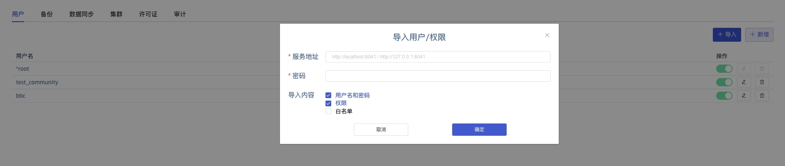

### Slow SQL

After clicking "System Management," click the "Slow SQL" tab to view the slow SQL execution statement log statistics and details.

- **Slow SQL Details:** By default, it shows the data that started executing within a day and had an execution time of 10 seconds or more.
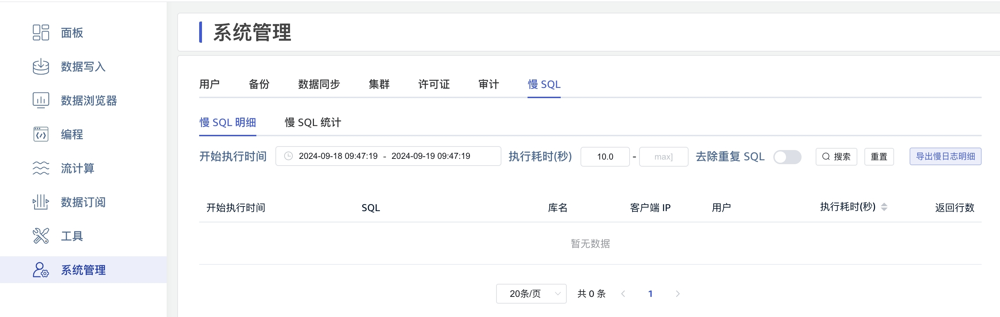
- **Slow SQL Statistics:** By default, it displays all data, and you can filter it by the start execution time.
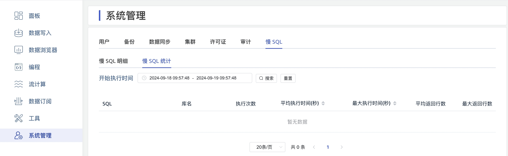
