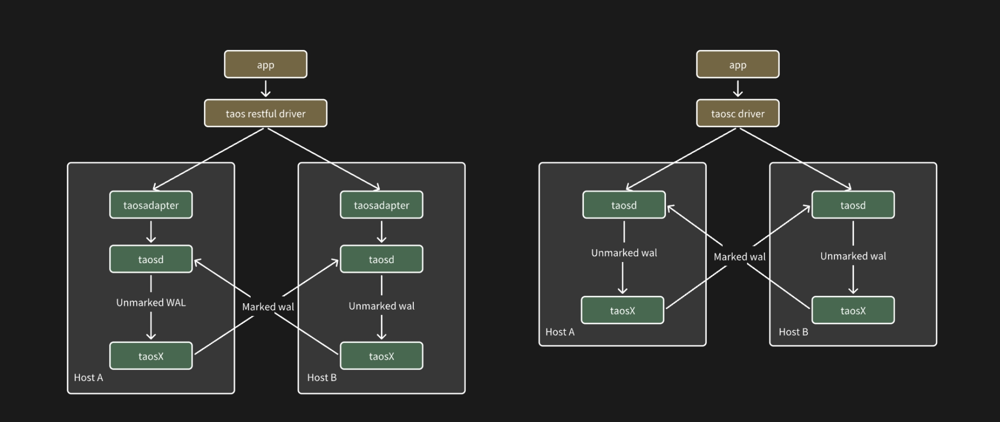

This section introduces the configuration and usage of the TDengine Active-Active System.

1. Some users can only deploy two servers due to the uniqueness of their deployment environment, while also hoping to achieve a certain level of service high availability and data high reliability. This article primarily describes the product behavior of the TDengine Active-Active System based on two key technologies: data replication and client failover. This includes the architecture, configuration, and operation and maintenance of the Active-Active System. The TDengine Active-Active feature can be used in resource-constrained environments, as previously mentioned, as well as in disaster recovery scenarios between two TDengine clusters (regardless of resources). The Active-Active feature is unique to TDengine Enterprise and was first released in version 3.3.0.0. It is recommended to use the latest version.

2. The definition of an Active-Active system is: there are only two servers in the business system, each deploying a set of services. From the business layer's perspective, these two machines and two sets of services constitute a complete system, with the details of the underlying system not needing to be perceived by the business layer. The two nodes in the Active-Active system are usually referred to as Master-Slave, meaning "primary-secondary" or "primary-backup," and this document may mix these terms.

3. The deployment architecture diagram of the TDengine Active-Active System is as follows, involving three key points:
   1. Failover of the dual system is implemented by the Client Driver, meaning the switch between primary and secondary nodes when the primary node goes down.
   2. Data replication is achieved from the (current) primary node to the secondary node via taosX.
   3. The write interface of data subscriptions adds a special mark in the WAL when writing replicated data, while the read interface of data subscriptions automatically filters out the data with that special mark during reads to avoid infinite loops caused by repeated replication.

Note: The diagram below uses a single TDengine instance as an example, but in actual deployment, one host in the diagram can be replaced by any number of TDengine clusters.



## Configuration

### Cluster Configuration

The Active-Active feature imposes no specific requirements on the configuration of the TDengine cluster itself, but there is a certain requirement regarding the WAL retention period for databases to be synchronized between the Active-Active systems. A longer WAL retention period increases the fault tolerance of the Active-Active system; if the backup node is down for a period exceeding the WAL retention period on the primary node, data loss on the backup node is inevitable. Even if the downtime of the backup node does not exceed the WAL retention period on the primary node, there is still a certain probability of data loss, depending on the proximity and speed of data synchronization.

### Client Configuration

Currently, only the Java connector supports Active-Active in WebSocket connection mode. The configuration example is as follows:

```java
url = "jdbc:TAOS-RS://" + host + ":6041/?user=root&password=taosdata";
Properties properties = new Properties();
properties.setProperty(TSDBDriver.PROPERTY_KEY_BATCH_LOAD, "true");
properties.setProperty(TSDBDriver.PROPERTY_KEY_SLAVE_CLUSTER_HOST, "192.168.1.11");
properties.setProperty(TSDBDriver.PROPERTY_KEY_SLAVE_CLUSTER_PORT, "6041");
properties.setProperty(TSDBDriver.PROPERTY_KEY_ENABLE_AUTO_RECONNECT, "true");
properties.setProperty(TSDBDriver.PROPERTY_KEY_RECONNECT_INTERVAL_MS, "2000");
properties.setProperty(TSDBDriver.PROPERTY_KEY_RECONNECT_RETRY_COUNT, "3");
connection = DriverManager.getConnection(url, properties);
```

The configuration properties and their meanings are as follows:

| Property Name                      | Meaning                                                      |
| ---------------------------------- | ------------------------------------------------------------ |
| PROPERTY_KEY_SLAVE_CLUSTER_HOST    | Hostname or IP of the second node; defaults to empty         |
| PROPERTY_KEY_SLAVE_CLUSTER_PORT    | Port number of the second node; defaults to empty            |
| PROPERTY_KEY_ENABLE_AUTO_RECONNECT | Whether to enable automatic reconnection; effective only in WebSocket mode. true: enable, false: disable; default is false. In Active-Active scenarios, please set to true. |
| PROPERTY_KEY_RECONNECT_INTERVAL_MS | Interval for reconnection in milliseconds; default is 2000 milliseconds (2 seconds); minimum is 0 (immediate retry); no maximum limit. |
| PROPERTY_KEY_RECONNECT_RETRY_COUNT | Maximum number of retries per node; default is 3; minimum is 0 (no retries); no maximum limit. |

### Constraints

1. Applications cannot use the subscription interface; if Active-Active parameters are configured, it will cause the creation of consumers to fail.
2. It is not recommended for applications to use parameter binding for writes and queries; if used, the application must address the issue of invalidated related objects after a connection switch.
3. In Active-Active scenarios, it is not recommended for user applications to explicitly call `use database`; the database should be specified in the connection parameters.
4. The clusters at both ends of the Active-Active configuration must be homogeneous (i.e., the naming of databases, all configuration parameters, usernames, passwords, and permission settings must be exactly the same).
5. Only WebSocket connection mode is supported.

## Operation and Maintenance Commands

The TDengine Active-Active System provides several operation and maintenance tools that can automate the configuration of taosX, and allow one-click starting, restarting, and stopping (on single-node environments) of all Active-Active components.

### Starting the Active-Active Task

```shell
taosx replica start
```

This command is used to start the data replication task in the Active-Active system, where both the taosd and taosX on the specified two hosts are in an online state.

1. Method One

```shell
    - taosx replica start -f source_endpoint -t sink_endpoint [database...] 
```

Establish a synchronization task from `source_endpoint` to `sink_endpoint` in the taosx service on the current machine. After successfully running this command, the replica ID will be printed to the console (referred to as `id` later).
The input parameters `source_endpoint` and `sink_endpoint` are mandatory, formatted as `td2:6030`. For example:

```shell
taosx replica start -f td1:6030 -t td2:6030 
```

This example command will automatically create a synchronization task for all databases except `information_schema`, `performance_schema`, `log`, and `audit`. You can specify the endpoint using `http://td2:6041` to use the WebSocket interface (default is the native interface). You can also specify database synchronization: `taosx replica start -f td1:6030 -t td2:6030 db1` will create synchronization tasks only for the specified database.

2. Method Two

```shell
taosx replica start -i id [database...]
```

Use the already created Replica ID (`id`) to add other databases to that synchronization task.

:::note

- Repeated use of this command will not create duplicate tasks; it will only add the specified databases to the corresponding task.
- The replica ID is globally unique within a taosX instance and is independent of the `source/sink` combination.
- For ease of memory, the replica ID is a randomly chosen common word, and the system automatically maps the `source/sink` combination to a word list to obtain a unique available word.

:::

### Checking Task Status

```shell
taosx replica status [id...]
```

This returns the list and status of Active-Active synchronization tasks created on the current machine. You can specify one or more replica IDs to obtain their task lists and status. An example output is as follows:

```shell
+---------+----------+----------+----------+------+-------------+----------------+
| replica | task     | source   | sink     | database | status      | note           |
+---------+----------+----------+----------+------+-------------+----------------+
| a       | 2        | td1:6030 | td2:6030 | opc      | running     |                |
| a       | 3        | td2:6030 | td2:6030 | test     | interrupted | Error reason   |
```

### Stopping Active-Active Tasks

```shell
taosx replica stop id [db...]
```

This command has the following effects:

- Stops all or specified database synchronization tasks under the specified Replica ID.
- Using `taosx replica stop id1 db1` indicates stopping the synchronization task for `db1` under the `id1` replica.

### Restarting Active-Active Tasks

```shell
taosx replica restart id [db...]
```

This command has the following effects:

- Restarts all or specified database synchronization tasks under the specified Replica ID.
- Using `taosx replica start id1 db1` only restarts the synchronization task for the specified database `db1`.

### Checking Synchronization Progress

```shell
taosx replica diff id [db....]
```

This command outputs the difference between the subscribed offset in the current dual-replica synchronization task and the latest WAL (not representing row counts), for example:

```shell
+---------+----------+----------+----------+-----------+---------+---------+------+
| replica | database | source   | sink     | vgroup_id | current | latest  | diff |
+---------+----------+----------+----------+-----------+---------+---------+------+
| a       | opc      | td1:6030 | td2:6030 | 2         | 17600   | 17600   | 0    |
| ad      | opc      | td2:6030 | td2:6030 | 3         | 17600   | 17600   | 0    |
```

### Deleting Active-Active Tasks

```shell
taosx replica remove id [--force]
```

This deletes all current Active-Active synchronization tasks. Under normal circumstances, to delete a synchronization task, you need to first stop that task; however, when `--force` is enabled, it will forcibly stop and clear the task.

### Recommended Usage Steps

1. Assuming running on machine A, you need to first use `taosx replica start` to configure taosX, with input parameters being the addresses of the source and target servers to synchronize. After configuration, the synchronization service and tasks will automatically start. It is assumed that the taosx service uses the standard port and the synchronization task uses the native connection.
2. The steps on machine B are the same.
3. After starting services on both machines, the Active-Active system can provide services.
4. After the configuration is completed, if you want to restart the Active-Active system, please use the restart subcommand.

## Exception Cases

If the downtime recovery time exceeds the WAL retention duration, data loss may occur. In this case, the automatic data synchronization of the taosX service in the Active-Active system cannot handle the situation. Manual judgment is required to identify which data is lost, followed by starting additional taosX tasks to replicate the missing data.
