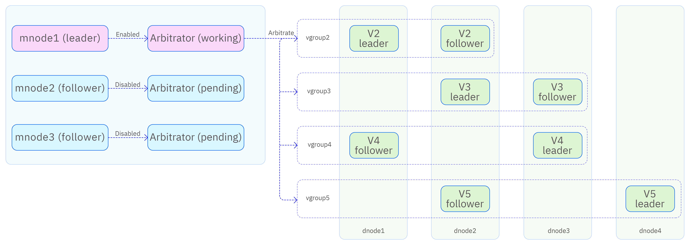

import Enterprise from '../../assets/resources/_enterprise.mdx';

<Enterprise/>

TDengine offers an arbitrator-based dual-replica solution that enables fault tolerance, provided that only one node fails at a time and failures are not continuous. Compared with three-replica deployments, dual-replica mode reduces hardware costs while ensuring a certain level of high availability.

In this architecture, leader election is handled by the high-availability mnode through arbitration, rather than being decided within the Raft group.

1. Arbitrator: Provides arbitration services but does not store data. If a vgroup becomes unavailable due to a vnode failure, the arbitrator designates another vnode in the vgroup as the assigned leader, based on data synchronization status.
1. Assigned Leader: A vnode that has been explicitly designated as the leader. It can continue serving client requests regardless of whether the other replica vnode is alive.



## Cluster Configuration

The dual-replica architecture requires at least three server nodes. The basic deployment and configuration steps are as follows:

1. Determine the number of server nodes and their hostnames or domain names, then configure DNS or /etc/hosts for proper name resolution.
1. Install the TDengine TSDB-Enterprise server package on each node and edit the taos.cfg file on each node as needed.
1. You can designate one node to provide only arbitration services (by deploying an mnode) and set the SupportVnodes parameter to 0, which means it does not store time-series data. This requires minimal resources (only 1–2 CPU cores) and can run alongside other applications.
1. Start the taosd service on each node. Other services (such as taosadapter, taosx, taoskeeper, or taos-explorer) can be started as required.

## Limitations

1. The minimum server configuration is two data nodes and one arbitrator node.
1. The replica count is a per-database parameter; different databases can choose the number of replicas as needed.
1. The full feature set of TDengine TSDB is supported.
1. All TDengine TSDB language connectors and connection methods are supported.
1. You can switch between single-replica and dual-replica configurations (provided that the number of nodes, available vnodes, memory, and storage space meet the requirements).
1. You cannot switch between dual-replicas and three-replica mode.
1. You cannot switch from dual-replica mode to active-active mode, unless an additional independent instance is deployed to form an active-active setup.

## Maintenance Commands

### Create a Cluster

Create two additional dnodes in your cluster for a total of three dnodes:

```sql
CREATE dnode <dnode_ep> port <dnode_port>;
CREATE dnode <dnode_ep> port <dnode_port>;
```

Create mnodes on the two dnodes for a total of three mnodes:

```sql
CREATE mnode on dnode <dnode_id>;
CREATE mnode on dnode <dnode_id>;
```

### Create a Dual-Replica Database

Create a dual-replica database:

```sql
create database <dbname> replica 2 vgroups xx buffer xx ...
```

### Modify an Existing Database

If you have already created a single-replica database, you can change it into a dual-replica database:

```sql
alter database <dbname> replica 2;
```

## Failure Scenarios

| Scenario | Result |
| ------- | ------ |
| Arbitrator failure (two or more mnodes down) | Service available |
| Single vnode failure after vgroup has finished synchronization |  Service available |
| Double vnode failure after vgroup has finished synchronization, but one vnode recovers  |  You can run the ASSIGN LEADER FORCE; statement to make service available |
| Single vnode failure before vgroup has finished synchronization  |  Service unavailable |
| Double vnode failure |  Service unavailable |

```sql
ASSIGN LEADER FORCE;
```

## Frequently Asked Questions

### 1. Creating or modifying a database to use two replicas causes `DB error: Out of dnodes`

- Cause: There are fewer than two data nodes in the cluster.
- Solution: Ensure that there are at least two dnodes before creating a dual-replica database.

### 2. Creating a dual-replica database or running SPLIT VGROUP causes `DB error: Vnodes exhausted`

- Cause: Some dnodes have fewer available vnodes than required for database creation or vgroup splitting.
- Solution: Increase the number of CPU cores on the dnodes or modify the SupportVnodes parameter.
