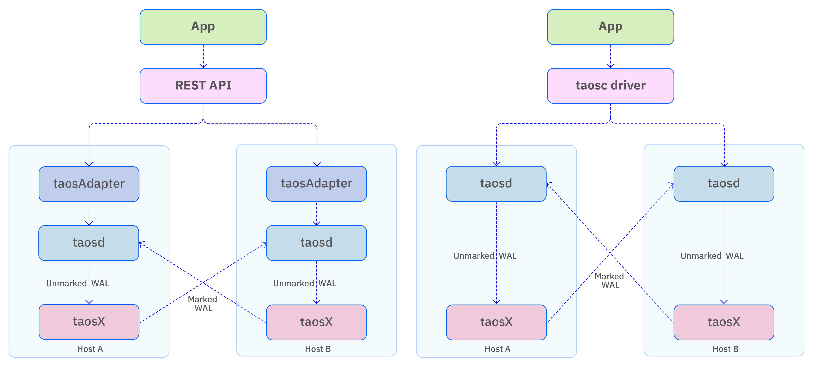

import Enterprise from '../../assets/resources/_enterprise.mdx';

<Enterprise/>

You can deploy TDengine in active-active mode to achieve high availability and reliability with limited resources. Active-active mode is also used in disaster recovery strategies to maintain offsite replicas of the database.

In active-active mode, you create two separate TDengine deployments, one acting as the primary node and the other as the secondary node. Data is replicated in real time between the primary and secondary nodes via taosX. Note that each node in an active-active deployment can be a single TDengine instance or a cluster.

In the event that the primary node cannot provide service, the client driver fails over to the secondary node. This failover is automatic and transparent to the business layer.

The deployment architecture of the TDengine TSDB active-active system is shown below. It is built around three key mechanisms:

In the event that the primary node cannot provide service, the client driver fails over to the secondary node. This failover is automatic and transparent to the business layer.

Replicated data is specially marked to avoid infinite loops. The architecture of an active-active deployment is described in the following figure.



Note that this diagram uses a single-node TDengine TSDB cluster as an example. In practice, each host in the diagram can represent a TDengine TSDB cluster of any size.

## Cluster Configuration

It is not necessary to configure your cluster specifically for active-active mode. However, note that the WAL retention period affects the fault tolerance of an active-active deployment. This is because data loss will occur if the secondary node is unreachable for a period of time exceeding the configured WAL retention period. Data lost in this manner can only be recovered manually.

If the secondary node is unreachable for a period of time not exceeding configured WAL retention period, there is still a possibility of data loss depending on how close the downtime duration is to the retention period and on the data synchronization speed.

## Client Configuration

Active-active mode is supported only by the Java client library in WebSocket connection mode. The following is an example configuration:

```java
url = "jdbc:TAOS-WS://" + host + ":6041/?user=root&password=taosdata";
Properties properties = new Properties();
properties.setProperty(TSDBDriver.PROPERTY_KEY_SLAVE_CLUSTER_HOST, "192.168.1.11");
properties.setProperty(TSDBDriver.PROPERTY_KEY_SLAVE_CLUSTER_PORT, "6041");
properties.setProperty(TSDBDriver.PROPERTY_KEY_ENABLE_AUTO_RECONNECT, "true");
properties.setProperty(TSDBDriver.PROPERTY_KEY_RECONNECT_INTERVAL_MS, "2000");
properties.setProperty(TSDBDriver.PROPERTY_KEY_RECONNECT_RETRY_COUNT, "3");
connection = DriverManager.getConnection(url, properties);
```

These parameters are described as follows:

| Property                              | Description |
| ---------------------------------- | --- |
| PROPERTY_KEY_SLAVE_CLUSTER_HOST    | Enter the hostname or IP address of the secondary node. |
| PROPERTY_KEY_SLAVE_CLUSTER_PORT    | Enter the port number of the secondary node.  |
| PROPERTY_KEY_ENABLE_AUTO_RECONNECT | Specify whether to enable automatic reconnection. For active-active mode, set the value of this parameter to true. |
| PROPERTY_KEY_RECONNECT_INTERVAL_MS | Enter the interval in milliseconds at which reconnection is attempted. The default value is 2000. You can enter 0 to attempt to reconnect immediately. There is no maximum limit. |
| PROPERTY_KEY_RECONNECT_RETRY_COUNT | Enter the maximum number of retries per node. The default value is 3. There is no maximum limit. |

## Limitations

1. You cannot use the data subscription APIs when active-active mode is enabled.
1. You cannot use the parameter binding interface while active-active mode is enabled.
1. You cannot use the `USE <database>` statement to set a context. Instead, specify the database in the connection parameters.
1. The primary and secondary nodes must be identical. Database names, all configuration parameters, usernames, passwords, and permission settings must be exactly the same.
1. Only WebSocket connection mode is supported.

## Maintenance Commands

You can manage your active-active deployment with the following commands.

### Start Active-Active Mode

```shell
taosx replica start
```

This command is used to start the data replication task in an active-active setup. Both taosd and taosX must be running on the two hosts.

1. Method 1:

```shell
taosx replica start -f source_endpoint -t sink_endpoint [database...] 
```

In the local taosx service, this command creates a synchronization task from `source_endpoint` to `sink_endpoint`. If the command runs successfully, it prints the replica ID to the console (referred to as id below).

The input parameters `source_endpoint` and `sink_endpoint` are required, and must be in the format `td2:6030`. For example:

```shell
taosx replica start -f td1:6030 -t td2:6030 
```

This example command automatically creates synchronization tasks for all databases except `information_schema`, `performance_schema`, `log`, and `audit`. It also continuously monitors for new databases. When the same database name is created on both td1 and td2, a new replication task for that database will be started automatically. Notes:

- You can specify that an endpoint use the WebSocket interface (default is the native interface) with `http://td2:6041`.
- You can configure the interval for checking new databases with:
`--new-database-checking-interval <SECONDS>` (default: 30 minutes).
- You can disable monitoring for new databases with `--no-new-databases`.
- You can also specify replication for particular databases. For example, `taosx replica start -f td1:6030 -t td2:6030 db1` creates a replication task only for the specified database. In this case, it is equivalent to using `--no-new-databases`, and automatic replication of newly created databases will not be enabled.

2. Method 2:

```shell
taosx replica start -i id [database...]
```

Use an existing replica ID to add databases to a replication task:

Notes:

1. Running this command multiple times will not create duplicate tasks; it only adds the specified databases to the existing task.
1. The replica ID is globally unique within a single taosX instance and is independent of the source/sink combination.
1. For easier recall, the replica ID is generated as a common random word. The system automatically maps each source/sink combination to a word list to assign a unique, available word.

### View Task Status

```shell
taosx replica status [id...]
```

Returns the list and status of active-active replication tasks created on the current machine. You can specify one or more replica IDs to retrieve their corresponding task details and status. Example output:

```shell
+---------+----------+----------+----------+------+-------------+----------------+
| replica | task | source   | sink     | database | status      | note           |
+---------+----------+----------+----------+------+-------------+----------------+
| a       | 2    | td1:6030 | td2:6030 | opc      | running     |                |
| a       | 3    | td2:6030 | td2:6030 | test     | interrupted | Error reason |
```

### Stop Active-Active Mode

```shell
taosx replica stop id [db...]
```

This command stops all active-active replication tasks, or only the specified databases, under the given replica ID. For example, `taosx replica stop id1 db1` stops the replication task for `db1` under replica `id1`.

If the `--no-new-databases` option is enabled, the monitoring task for new databases is not stopped. Only the currently running database replications are stopped.

### Restart Active-Active Mode

```shell
taosx replica restart id [db...]
```

This command restarts all active-active replication tasks, or only the specified databases, under the given replica ID. For example, `taosx replica restart id1 db1` restarts the replication task for `db1` under replica `id1`.

### View Synchronization Progress

```shell
taosx replica diff id [db....]
```

This command outputs the difference between the subscribed offset and the latest WAL in the current synchronization task. Note that this does not represent the number of rows. For example:

```shell
+---------+----------+----------+----------+-----------+---------+---------+------+
| replica | database | source   | sink     | vgroup_id | current | latest  | diff |
+---------+----------+----------+----------+-----------+---------+---------+------+
| a       | opc      | td1:6030 | td2:6030 | 2         | 17600   | 17600   | 0    |
| a       | opc      | td2:6030 | td2:6030 | 3         | 17600   | 17600   | 0    |
```

### Delete a Synchronization Task

```shell
taosx replica remove id [--force]
```

This command deletes all current active-active replication tasks. Normally, you must stop a task before deleting it. However, when the `--force` option is used, the tasks are forcibly stopped and cleared.

If the `--no-new-databases` option is enabled, newly created database replication tasks are not deleted. Only the currently running database replications are removed. After taosX restarts, if the deleted databases still exist, the corresponding replication tasks will be recreated. If taosX is not restarted or the active-active monitoring task is not updated, these replication tasks will not be created again.

### Update New Databases Checking Interval

```shell
taosx replica update id --new-database-checking-interval <SECONDS>
```

This command updates the interval (in seconds) for checking newly created databases in an active-active setup.

### Recommended Usage

1. On Machine A, run `taosx replica start` to configure taosX. The input parameters are the source and target server addresses for synchronization. Once configured, the synchronization service and tasks are started automatically. In this example, the taosX service uses the standard port and the replication task uses the native connection.
1. Repeat the same steps on Machine B.
1. After starting the services on both machines, the active-active system is ready to provide service.
1. If the system has already been configured and you want to start it again, use the restart subcommand.

## Troubleshooting

If the downtime recovery period exceeds the WAL retention period, data loss may occur. In this case, the automatic data synchronization provided by the built-in taosX service in the active-active system cannot resolve the issue. Manual intervention is required to identify which data has been lost, and then an additional taosX task must be started to replicate the missing data.
