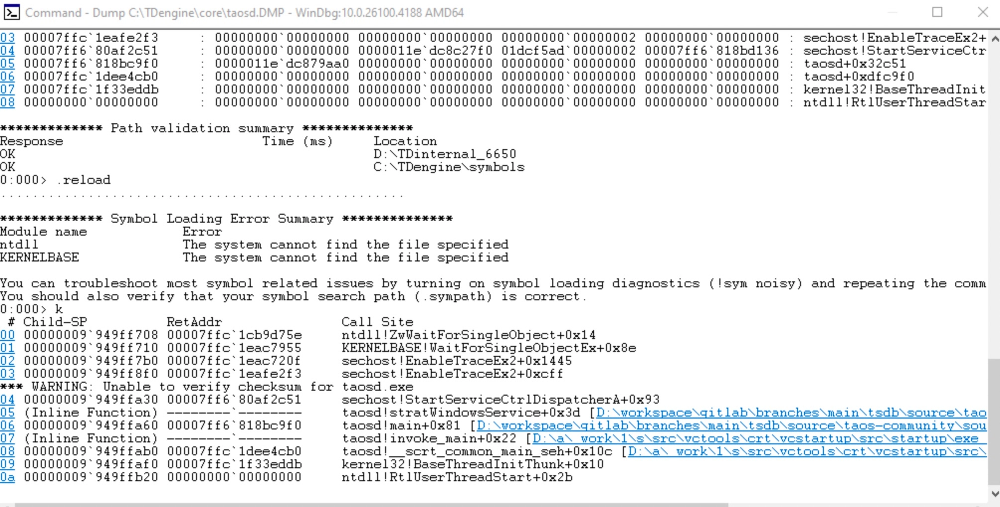

## Purpose

This guide provides instructions for diagnosing and locating TDengine TSDB crash issues on Windows. The following content presents two analysis and resolution methods.

## .dmp File

### Locating the .dmp File

When `taosd.exe` crashes, it captures the crash and generates a `.dmp` file in its own directory. The file name starts with `taosd`, followed by the crash timestamp — for example, `taosd_20260509_124419.dmp`. The file size is typically between `10M~200M`.

> **Note:** If a `.dmp` file has a size of 0K, severe stack or heap corruption may have occurred.

### No .dmp File Generated

If no `.dmp` file was produced in the previous step, the crash may not be capturable from inside the process. In that case, you need to enable out-of-process dump capture.

Save the following content as a `.reg` file and double-click it to import into the registry, enabling out-of-process dump capture:

```ini
Windows Registry Editor Version 5.00

; Enable WER out-of-process dump for taosd.exe
; Dumps are written by WerFault.exe (a separate process) and are therefore
; immune to stack/heap corruption in taosd.
;
; Usage:
;   1. Double-click this file, or run:
;        reg import wer_localdumps.reg
;   2. Make sure C:\TDengine\core\ exists and is writable by NETWORK SERVICE.

[HKEY_LOCAL_MACHINE\SOFTWARE\Microsoft\Windows\Windows Error Reporting\LocalDumps\taosd.exe]
; Directory where WerFault.exe writes the .dmp files (must exist before crash)
"DumpFolder"="C:\\TDengine\\core\\"
; DumpType 2 = MiniDumpWithFullMemory (full user-mode dump, best for debugging)
"DumpType"=dword:00000002
; Keep at most 10 dumps (oldest is deleted when limit is exceeded)
"DumpCount"=dword:0000000a

; Suppress the "taosd.exe has stopped working" dialog on server environments.
[HKEY_LOCAL_MACHINE\SOFTWARE\Microsoft\Windows\Windows Error Reporting]
"DontShowUI"=dword:00000001
```

Configuration options:

- **DumpCount**: Maximum number of `.dmp` files to keep. The oldest file is deleted when the limit is exceeded.
- **DumpFolder**: Directory where `.dmp` files are stored.

### Manually Generating .dmp Files

If the `taosd` process becomes unresponsive, you can manually generate a `.dmp` file for analysis. To do this, open `Windows Task Manager`, find the `taosd.exe` process in the `Processes` tab, right-click and select the `Create dump file` menu option, then choose a location to save the file in the popup window.

### Obtaining PDB Files

A crash stack trace can only be resolved to function names and line numbers when combined with PDB files. PDB files can be obtained as follows:

- **Community Edition users**: Download from the official symbol server at [TDengine Symbol Server](https://www.taosdata.com/symbols/) — select the matching version.
- **Enterprise Edition users**: PDB files are not currently available for download. Contact TDengine technical support to obtain them.
- **Locally compiled builds**: PDB files are in the same directory as the compiled executables.

### Analyzing .dmp + PDB Files

To analyze a `.dmp` file, you need to load the matching PDB file to view the complete crash stack information. The following steps describe how to analyze a `.dmp` file:

1. **Obtain WinDbg**

   WinDbg is Microsoft's official tool for analyzing `.dmp` files. You can [download it](https://apps.microsoft.com/detail/9pgjgd53tn86) from the Microsoft website or install it by selecting the `Windows Debugging Tools` option when installing Visual Studio.

2. **Load PDB**

   Launch WinDbg, open the menu File -> Symbol File Path, click the `browse...` button in the popup window to select the folder containing the PDB files, then click `OK` to save and close.

   

3. **Analyze .dmp**

   Select the menu File -> Open Crash Dump, choose the `.dmp` file in the popup window, and open it for analysis.

   After opening the `.dmp` file, enter the `k` command in the command line at the bottom to display the crash stack. When the PDB is successfully loaded, you can see function names along with source file names and line numbers, as shown below:

   

   At this point, use the command line provided by WinDbg to analyze the crash cause in detail.

## Using an ASan Build

If you still cannot locate the issue through the `.dmp` file, you can further escalate the analysis method by using an ASan build with memory out-of-bounds access monitoring to continue troubleshooting.

The TDengine repository supports compiling ASan builds for both Debug and Release configurations. The build option is the same as on Linux.

> **Note:** ASAN on Windows does not support memory leak detection, but it does detect out-of-bounds accesses and use-after-free errors.

### Compiling an ASan Build

- Build option: `-DBUILD_SANITIZER=true`.
- **Debug** build: Any version of VS 2022 is supported.
- **Release** build: Requires VS 2022 version >= 17.14.32.

### Prerequisites

To run an ASan build of TDengine on a target machine, copy the ASan runtime DLL from the build machine to the target machine.

Location of the ASan runtime DLL on the build machine (VS 2022):

```bash
C:\\Program Files\\Microsoft Visual Studio\\2022\\Community\\VC\\Tools\\MSVC\\14.44.35207\\bin\\Hostx64\\x64\\
```

| Build type     | DLL required                             | Destination             |
| ---------------- | ------------------------------------------ | --------------------- |
| Release + ASan | `clang_rt.asan_dynamic-x86_64.dll`       | Same directory as taosd |
| Debug + ASan   | `clang_rt.asan_dbg_dynamic-x86_64.dll`  | Same directory as taosd |

### MSVC ASan Report Output Location

Default output: stderr

The ASan report is written to stderr by default. Where it ends up depends on how taosd is launched:

| Launch method              | Default output destination                          |
| -------------------------- | --------------------------------- |
| Run taosd.exe from command line | Printed directly to the current terminal window |
| Double-click (no console)  | Lost — no console window, stderr has nowhere to go  |
| Run as a Windows service   | Lost — services have no stderr console              |

### Redirecting ASan Output to a File (to Avoid Loss)

Set the `ASAN_OPTIONS` environment variable before starting taosd:

```Bash
# Include the process name to distinguish output in multi-process scenarios
set ASAN_OPTIONS=log_path=C:\TDengine\log\asan_report:log_exe_name=1
taosd.exe
```

Generated file name format: `asan_report.12345` (PID suffix) or `asan_report.taosd.exe.12345`.

### Performance Comparison

Benchmark: taosBenchmark creating 10,000 child tables, each with 10,000 rows of smart meter data.

> **Note:** The Debug build crashes on large data writes (known compiler issue) and cannot be tested.

|                       | Write performance | Comparison |
| --------------------- | ---------- | ---------- |
| Release               | 204 s      | Baseline   |
| Release + ASan        | 324 s      | +50%       |

### ASan Detection Example

Test code snippet:

```C
void test() {
    char buf[4];
    // overflow
    memcpy(buf, "abcdefg01234", 8);
}
```

Detection result:

ASan successfully detects the out-of-bounds access and reports:

```text
=================================================================
==12345==ERROR: AddressSanitizer: stack-buffer-overflow on address 0x7ffde5c1f8f0 at pc 0x0000000000000 bp 0x7ffde5c1f8a0 sp 0x7ffde5c1f890
READ of size 8 at 0x7ffde5c1f8f0 thread T0
    #0 0x000000000000 in test() (taosd.exe+0x000000000000)
    #1 0x000000000000 in main (taosd.exe+0x000000000000)
Address 0x7ffde5c1f8f0 is located in stack of thread T0 at offset 48 in frame
    #0 0x000000000000 in test() (taosd.exe+0x000000000000)
  This frame has 1 object(s):
    [32, 36) 'buf' <== Memory access at offset 48 overflows this variable
HINT: this may be a false positive if your program uses some custom stack unwind mechanism or swapcontext
      (longjmp and C++ exceptions *are* supported)
SUMMARY: AddressSanitizer: stack-buffer-overflow in test() (taosd.exe+0x000000000000)
```

## Service Crash Tracking

When the TDengine TSDB service process `taosd.exe` encounters a crash, it exits. Windows detects the service exit and attempts to restart the service. To prevent repeated crash-restart cycles, the service will only be restarted three times. Startup logs can be found in `Control Panel` -> `Windows Event Viewer`, where service stop logs are also recorded.

## Summary

If a `.dmp` file is available, analyze it first to locate the root cause. If the dump does not provide enough information, run an ASan build to find the issue.
