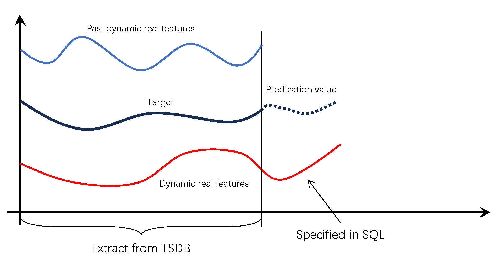

Time-series forecasting takes a continuous period of time-series data as its input and forecasts how the data will trend in the next continuous period. The number of data points in the forecast results is not fixed, but can be specified by the user. TDgpt uses the `FORECAST` function to provide forecasting. The input for this function is the historical time-series data used as a basis for forecasting, and the output is forecast data. You can use the `FORECAST` function to invoke a forecasting algorithm on an anode to provide service. Forecasting is typically performed on a subtable or on the same time series across tables.

In this section, the table `foo` is used as an example to describe how to perform forecasting and anomaly detection in TDgpt. This table is described as follows:

| Column | Type | Description |
| --- | --- | --- |
| `ts` | `TIMESTAMP` | Primary timestamp |
| `val` | Integer | Measured value |
| `past_co_val` | Integer | Historical covariate |
| `future_co_val` | Integer | Future covariate |

```sql
taos> SELECT * FROM foo LIMIT 2;
           ts            |   val | past_co_val | future_co_val |
================================================================
 2020-01-01 00:00:12.681 |    13 |           1 |             1 |
 2020-01-01 00:00:13.727 |    14 |           2 |             1 |
```

### Syntax

```sql
FORECAST(column_expr, option_expr)

option_expr: {"
algo=expr1
[,wncheck=1|0]
[,conf=conf_val]
[,every=every_val]
[,rows=rows_val]
[,start=start_ts_val]
[,timeout=timeout_val]
[,expr2]
"}
```

1. `column_expr`: The time-series data column to forecast. Enter a column whose data type is numerical.
1. `options`: The parameters for forecasting. Enter parameters in key=value format, separating multiple parameters with a comma (,). It is not necessary to use quotation marks or escape characters. Only ASCII characters are supported. The supported parameters are described as follows:

### Parameter Description

|Parameter|Definition|Default|
| ------- | ------------------------------------------ | ---------------------------------------------- |
|algo|Forecasting algorithm.|holtwinters|
|wncheck|White noise data check. Enter 1 to enable or 0 to disable.|1|
|conf|Forecast confidence level used for `_FLOW` and `_FHIGH`. End-to-end requests must use a value in `(0, 1)`, such as `0.95`.|0.95|
|every|Sampling period.|The sampling period of the input data|
|start|Starting timestamp for forecast data.|One sampling period after the final timestamp in the input data|
|rows|Number of forecast rows to return.|10|
|timeout|Maximum time to wait for the forecast request, supported since `v3.3.6.5`. The range is 1 to 1200 seconds.|60 seconds|

- Three pseudocolumns are used in forecasting:
  - `_FROWTS`: the timestamp of the forecast data
  - `_FLOW`: the lower threshold of the confidence interval
  - `_FHIGH`: the upper threshold of the confidence interval. For algorithms that do not include a confidence interval, the `_FLOW` and `_FHIGH` pseudocolumns contain the forecast results.
- You can specify the `START` parameter to modify the starting time of forecast results. This does not affect the forecast values, only the time range.
- The `EVERY` parameter can be lesser than or equal to the sampling period of the input data. However, it cannot be greater than the sampling period of the input data.
- If you specify a confidence interval for an algorithm that does not use it, the upper and lower thresholds of the confidence interval regress to a single point.
- The maximum value of `rows` is 1024. Values above this limit return an error.
- Forecasting requires at least 10 input rows and supports at most 40,000. Some models have stricter limits.

### Selecting CES, Theta, or ETS

|Data characteristics|Recommended algorithm|Reason|
|---|---|---|
|The seasonal pattern is complex or does not fit a conventional additive or multiplicative pattern.|CES|CES can represent seasonal behavior with complex-valued states and can automatically select its model form.|
|The series has a clear long-term trend and relatively regular seasonality.|Theta|Theta is a compact trend-focused method; choose additive decomposition for stable seasonal amplitude and multiplicative decomposition for proportional seasonal amplitude.|
|You want an interpretable combination of error, trend, and seasonal components.|ETS|ETS can automatically select or explicitly configure additive and multiplicative components, with optional damped trend behavior.|

Start with automatic selection (`model=Z` for CES or `model=ZZZ` for ETS) when the component structure is unknown. Theta multiplicative decomposition and any explicitly multiplicative ETS component require strictly positive input. For seasonal forecasts, set `period` and provide at least two complete periods of historical data.

### Example

```sql
--- ARIMA forecast, return 10 rows of results (default), perform white noise data check, with 95% confidence interval 
SELECT _flow, _fhigh, _frowts, FORECAST(val, "algo=arima")
FROM foo;

--- ARIMA forecast, periodic input data, 10 samples per period, disable white noise data check, with 95% confidence interval
SELECT _flow, _fhigh, _frowts, FORECAST(val, "algo=arima,conf=0.95,period=10,wncheck=0")
FROM foo;
```

```sql
taos> select _flow, _fhigh, _frowts, forecast(i32) from foo;
        _flow         |        _fhigh        |       _frowts           | forecast(i32) |
========================================================================================
           10.5286684 |           41.8038254 | 2020-01-01 00:01:35.000 |            26 |
          -21.9861946 |           83.3938904 | 2020-01-01 00:01:36.000 |            30 |
          -78.5686035 |          144.6729126 | 2020-01-01 00:01:37.000 |            33 |
         -154.9797363 |          230.3057709 | 2020-01-01 00:01:38.000 |            37 |
         -253.9852905 |          337.6083984 | 2020-01-01 00:01:39.000 |            41 |
         -375.7857971 |          466.4594727 | 2020-01-01 00:01:40.000 |            45 |
         -514.8043823 |          622.4426270 | 2020-01-01 00:01:41.000 |            53 |
         -680.6343994 |          796.2861328 | 2020-01-01 00:01:42.000 |            57 |
         -868.4956665 |          992.8603516 | 2020-01-01 00:01:43.000 |            62 |
        -1076.1566162 |         1214.4498291 | 2020-01-01 00:01:44.000 |            69 |
```

## Covariate Forecasting

TDgpt supports univariate forecasting and, since `v3.3.6.6`, historical covariate forecasting. Static covariates are not supported.

Only the moirai time-series foundation model is supported for covariate forecasting. If you want to perform covariate forecasting, you must set the `algo` parameter to `moirai`.



In the diagram above, there are two covariates and one target variable (also called the primary variable). `Target` is the forecasting objective, and `Prediction value` is the forecast result. `Past dynamic real features` represent historical covariates, while `Dynamic real features` represents future covariates.  

Historical and future covariate data aligned with the same time window as the target variable are retrieved from the time-series database. Future covariate values corresponding to the prediction horizon must be provided directly in the SQL statement. Detailed usage is described below.

### Historical Covariate Forecasting

Historical covariate forecasting is available in `v3.3.6.6` and later.

When the `forecast` function takes a single column as input, it operates in default univariate forecasting mode. When multiple columns are provided, the first column is treated as the **primary variable**, and subsequent columns are treated as covariates.

All input columns must be numeric. Each forecasting query supports up to 10 historical covariate columns. The following SQL example demonstrates covariate forecasting:

```sql
SELECT _frowts, forecast(val, past_co_val, 'algo=moirai') FROM foo;
```

In this example, the first column (`val`) is the primary variable; subsequent columns (`past_co_val`) are historical covariates.

### Future Covariate Forecasting

For future covariate forecasting, you must specify the future input values and their associated covariate columns.

Future covariate values must be provided directly in the SQL statement using array syntax within square brackets, with values separated by spaces.  
The number of values must match the forecasting horizon; otherwise, an error will occur.

Future covariates use the prefix `dynamic_real_`. If multiple future covariates are used, they can be named sequentially as `dynamic_real_1`, `dynamic_real_2`, `dynamic_real_3`, and so on.

For each future covariate, the corresponding column must be specified:

- The column for `dynamic_real_1` is defined via the parameter `dynamic_real_1_col`
- The column for `dynamic_real_2` is defined via `dynamic_real_2_col`, and so on

In the example below, forecasting is performed on the `val` column. One historical covariate column `past_co_val` is provided, along with one future covariate column `future_co_val`. Future covariate values are supplied via `dynamic_real_1`, which contains 4 future values in the array. The parameter `dynamic_real_1_col=future_co_val` maps the future covariate to the `future_co_val` column.

```sql
select _frowts, forecast(val, past_co_val, future_co_val, "algo=moirai,rows=4, dynamic_real_1=[1 1 1 1], dynamic_real_1_col=future_co_val") from foo;
```

## Built-In Forecasting Algorithms

- [ARIMA](01-arima.md)
- [HoltWinters](02-holtwinters.md)
- [Prophet](03-prophet.md)
- [Time-Series Foundation Model](04-tsfm.md)
- [Complex exponential smoothing (CES)](05-ces.md)
- [Theta](06-theta.md)
- [ETS (Error, Trend, Seasonal)](07-ets.md)
- XGBoost
- LightGBM
- Multiple Seasonal-Trend decomposition using LOESS (MSTL)
- Long Short-Term Memory (LSTM)
- Multilayer Perceptron (MLP)
- DeepAR
- N-BEATS
- N-HiTS
- Patch Time Series Transformer (PatchTST)
- Temporal Fusion Transformer
- TimesNet
