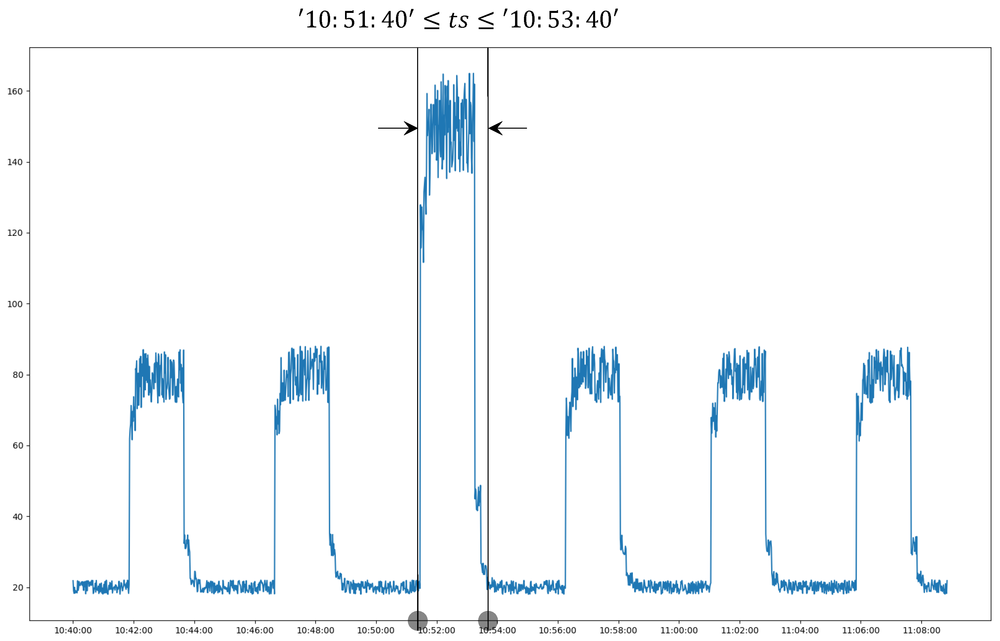

This service is provided via an anomaly window that has been introduced into TDengine. An anomaly window is a special type of event window, defined by the anomaly detection algorithm as a time window during which an anomaly is occurring. This window differs from an event window in that the algorithm determines when it opens and closes instead of expressions input by the user. You can use the `ANOMALY_WINDOW` keyword in a `WHERE` clause to invoke the anomaly detection service. The window pseudocolumns `_WSTART`, `_WEND`, and `_WDURATION` record the start, end, and duration of the window. For example:

```sql
--- Use the IQR algorithm to detect anomalies in the `col_val` column. Also return the start and end time of the anomaly window as well as the sum of the `col` column within the window.
SELECT _wstart, _wend, SUM(col) 
FROM foo
ANOMALY_WINDOW(col_val, "algo=iqr");
```

As shown in the following figure, the anode returns the anomaly window `[10:51:30, 10:53:40]`.



You can then query, aggregate, or perform other operations on the data in the window.

### Syntax

```sql
ANOMALY_WINDOW(column_expr [, column_expr ...] [, option_expr])

option_expr: {"
algo=expr1
[,wncheck=1|0]
[,expr2]
"}
```

1. `column_expr`: A numeric input column or expression. Character types such as `NCHAR`, `VARCHAR`, and `VARBINARY`, tags, and nonnumeric results are not supported. Multiple columns are supported in `v3.4.1.0` and later. Models that accept only one column use the first column and ignore the rest.
2. `option_expr`: The anomaly-detection algorithm and parameters as comma-separated `key=value` pairs. Only ASCII characters are supported. For example, `algo=ksigma,k=2` selects k-sigma with `k=2`.
3. You can use the results of anomaly detection as the inner part of a nested query. The same functions are supported as in other windowed queries.
4. White noise checking is performed on the input data by default. If the input data is white noise, no results are returned.

### Parameter Description

|Parameter|Definition|Default|
| ------- | ------------------------------------------ | ------ |
|algo|Specify the anomaly detection algorithm.|iqr|
|wncheck|Enter 1 to perform the white noise data check or 0 to disable the white noise data check.|1|

### Anomaly Detection Pseudo-columns

Anomaly detection introduces a pseudo-column for marking anomaly types:

- `_ANOMALYMARK`: Used to identify and output different anomaly types. By default, all built-in anomaly detection algorithms output `-1` for anomalous points.

Window pseudo-columns (`_WSTART`, `_WEND`, `_WDURATION`) are also available to describe the start time, end time, and duration of anomaly windows, just like other time window queries.

### Example

```sql
--- Use the IQR algorithm to detect anomalies in the `i32` column. Also return the start and end time of the anomaly window, the sum of the `i32` column within the window, and the anomaly mark.
SELECT _wstart, _wend, SUM(i32), _anomalymark
FROM foo
ANOMALY_WINDOW(i32, "algo=iqr");

--- Use the k-sigma algorithm with k value of 2 to detect anomalies in the `i32` column.
SELECT _wstart, _wend, SUM(i32) 
FROM foo
ANOMALY_WINDOW(i32, "algo=ksigma,k=2");

taos> SELECT _wstart, _wend, count(*) FROM foo ANOMALY_WINDOW(i32);
         _wstart         |          _wend          |   count(*)    |
====================================================================
 2020-01-01 00:00:16.000 | 2020-01-01 00:00:17.000 |             2 |
Query OK, 1 row(s) in set (0.028946s)

--- Multiple columns are accepted in `v3.4.1.0` and later. A single-column
--- algorithm such as k-sigma ignores the i8 column.
SELECT _wstart, _wend, SUM(i32)
FROM foo
ANOMALY_WINDOW(i32, i8, "algo=ksigma,k=2");
```

### Built-In Anomaly Detection Algorithms

Built-in anomaly-detection models are grouped into [Statistical Algorithms](01-statistics-approach.md), [Data Density Algorithms](02-data-density.md), and [Machine Learning Algorithms](03-machine-learning.md). If you do not specify an algorithm, IQR is used by default. The actual algorithms available on an Anode are returned by `SHOW ANODES FULL`; see [SHOW ANODES](../../../05-tdengine-sql/09-system-info/03-show.md#show-anodes).

### Evaluating Algorithm Effectiveness

TDgpt Enterprise provides a tool that evaluates anomaly-detection models with precision and recall. See [Model Evaluation Tools](../../01-tdgpt/05-tools.md).
