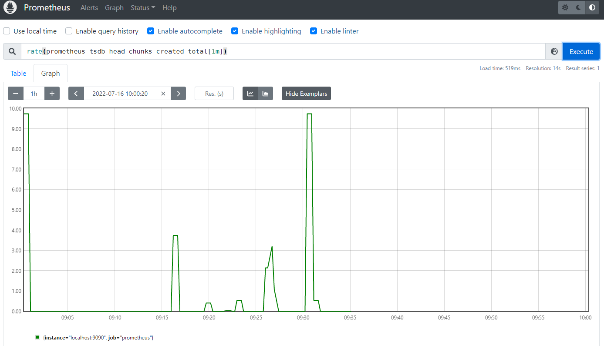

Prometheus is a widespread open-source monitoring and alerting system. Prometheus joined the Cloud Native Computing Foundation (CNCF) in 2016 as the second incubated project after Kubernetes, which has a very active developer and user community.

Prometheus provides `remote_read` interface to leverage other database products as its storage engine. To enable users of the Prometheus ecosystem to take advantage of TDengine's efficient querying, TDengine also provides support for this interface so that data stored in TDengine can be queried via the `remote_read` interface, taking full advantage of TDengine's efficient query performance and clustering capabilities for time-series data.

## Install Prometheus

Please refer to [Install Prometheus](https://docs.tdengine.com/cloud/data-in/prometheus#install-prometheus).

## Configure Prometheus

Please refer to [Configure Prometheus](https://docs.tdengine.com/cloud/prometheus/#configure-prometheus).

## Start Prometheus

Please refer to [Start Prometheus](https://docs.tdengine.com/cloud/data-in/prometheus/#start-prometheus).

## Verify Remote Read

Lets retrieve some metrics from TDengine Cloud via prometheus web server. Browse to <http://localhost:9090/graph> and use the "Graph" tab.

Enter the following expression to graph the per-second rate of chunks being created in the self-scraped Prometheus:

```
rate(prometheus_tsdb_head_chunks_created_total[1m])
```



