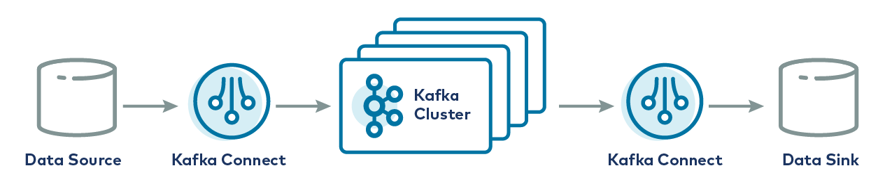

The TDengine Kafka Connector includes two plugins: the TDengine Source Connector and the TDengine Sink Connector. Users can simply provide a configuration file to synchronize data from a specified topic in Kafka (either in batches or in real-time) to TDengine, or to synchronize data from a specified database in TDengine (either in batches or in real-time) to Kafka.

## What is Kafka Connect?

Kafka Connect is a component of [Apache Kafka](https://kafka.apache.org/) that makes it easy to connect other systems, such as databases, cloud services, and file systems, to Kafka. Data can flow into Kafka from other systems via Kafka Connect, and vice versa. The plugins that read data from other systems are called Source Connectors, while those that write data to other systems are called Sink Connectors. Source and Sink Connectors do not connect directly to Kafka Brokers; instead, the Source Connector hands off the data to Kafka Connect, while the Sink Connector receives data from Kafka Connect.



The TDengine Source Connector is used to read data in real-time from TDengine and send it to Kafka Connect. The TDengine Sink Connector is used to receive data from Kafka Connect and write it to TDengine.


## Prerequisites

Here are the prerequisites to run the examples in this tutorial:

1. Linux operating system
2. Java 8 and Maven installed
3. Git, curl, and vi installed
4. TDengine installed and running. For installation details, refer to [Installation and Uninstallation](../../../get-started/)

## Install Kafka

- Execute the following commands in any directory:

    ```shell
    curl -O https://downloads.apache.org/kafka/3.4.0/kafka_2.13-3.4.0.tgz
    tar xzf kafka_2.13-3.4.0.tgz -C /opt/
    ln -s /opt/kafka_2.13-3.4.0 /opt/kafka
    ```

- Then, add the `$KAFKA_HOME/bin` directory to your PATH.

    ```title=".profile"
    export KAFKA_HOME=/opt/kafka
    export PATH=$PATH:$KAFKA_HOME/bin
    ```

    You can append the above script to the profile file of the current user (either `~/.profile` or `~/.bash_profile`).

## Install TDengine Connector Plugin

### Compile the Plugin

```shell
git clone --branch 3.0 https://github.com/taosdata/kafka-connect-tdengine.git
cd kafka-connect-tdengine
mvn clean package -Dmaven.test.skip=true
unzip -d $KAFKA_HOME/components/ target/components/packages/taosdata-kafka-connect-tdengine-*.zip
```

The above script first clones the project source code and then compiles and packages it using Maven. After the packaging is complete, a zip file of the plugin is generated in the `target/components/packages/` directory. Unzip this zip file to the installation path for the plugin. The example above uses the built-in plugin installation path: `$KAFKA_HOME/components/`.

### Configure the Plugin

Add the kafka-connect-tdengine plugin to the `plugin.path` in the `$KAFKA_HOME/config/connect-distributed.properties` configuration file.

```properties
plugin.path=/usr/share/java,/opt/kafka/components
```

## Start Kafka

```shell
zookeeper-server-start.sh -daemon $KAFKA_HOME/config/zookeeper.properties
kafka-server-start.sh -daemon $KAFKA_HOME/config/server.properties
connect-distributed.sh -daemon $KAFKA_HOME/config/connect-distributed.properties
```

### Verify Kafka Connect is Successfully Started

Enter the command:

```shell
curl http://localhost:8083/connectors
```

If all components have started successfully, you will see the following output:

```txt
[]
```

## Using TDengine Sink Connector

The TDengine Sink Connector is used to synchronize data from a specified topic to TDengine. Users do not need to create databases and supertables in advance. You can manually specify the name of the target database (see the configuration parameter `connection.database`), or it can be generated according to certain rules (see the configuration parameter `connection.database.prefix`).

The TDengine Sink Connector internally uses the TDengine [schemaless write interface](../../../developer-guide/schemaless-ingestion/) to write data to TDengine and currently supports three data formats: InfluxDB line protocol format, OpenTSDB Telnet protocol format, and OpenTSDB JSON protocol format.

The following example synchronizes data from the `meters` topic to the target database `power`. The data format is InfluxDB Line protocol format.

### Add Sink Connector Configuration File

```shell
mkdir ~/test
cd ~/test
vi sink-demo.json
```

The contents of `sink-demo.json` are as follows:

```json title="sink-demo.json"
{
  "name": "TDengineSinkConnector",
  "config": {
    "connector.class":"com.taosdata.kafka.connect.sink.TDengineSinkConnector",
    "tasks.max": "1",
    "topics": "meters",
    "connection.url": "jdbc:TAOS://127.0.0.1:6030",
    "connection.user": "root",
    "connection.password": "taosdata",
    "connection.database": "power",
    "db.schemaless": "line",
    "data.precision": "ns",
    "key.converter": "org.apache.kafka.connect.storage.StringConverter",
    "value.converter": "org.apache.kafka.connect.storage.StringConverter",
    "errors.tolerance": "all",
    "errors.deadletterqueue.topic.name": "dead_letter_topic",
    "errors.deadletterqueue.topic.replication.factor": 1
  }
}
```

Key configuration explanations:

1. `"topics": "meters"` and `"connection.database": "power"` indicate that data from the `meters` topic will be subscribed and written into the `power` database.
2. `"db.schemaless": "line"` indicates that InfluxDB line protocol format will be used for the data.

### Create Sink Connector Instance

```shell
curl -X POST -d @sink-demo.json http://localhost:8083/connectors -H "Content-Type: application/json"
```

If the above command executes successfully, you will see the following output:

```json
{
  "name": "TDengineSinkConnector",
  "config": {
    "connection.database": "power",
    "connection.password": "taosdata",
    "connection.url": "jdbc:TAOS://127.0.0.1:6030",
    "connection.user": "root",
    "connector.class": "com.taosdata.kafka.connect.sink.TDengineSinkConnector",
    "data.precision": "ns",
    "db.schemaless": "line",
    "key.converter": "org.apache.kafka.connect.storage.StringConverter",
    "tasks.max": "1",
    "topics": "meters",
    "value.converter": "org.apache.kafka.connect.storage.StringConverter",
    "name": "TDengineSinkConnector",
    "errors.tolerance": "all",
    "errors.deadletterqueue.topic.name": "dead_letter_topic",
    "errors.deadletterqueue.topic.replication.factor": "1"
  },
  "tasks": [],
  "type": "sink"
}
```

### Write Test Data

Prepare a text file with test data as follows:

```txt title="test-data.txt"
meters,location=California.LosAngeles,groupid=2 current=11.8,voltage=221,phase=0.28 1648432611249000000
meters,location=California.LosAngeles,groupid=2 current=13.4,voltage=223,phase=0.29 1648432611250000000
meters,location=California.LosAngeles,groupid=3 current=10.8,voltage=223,phase=0.29 1648432611249000000
meters,location=California.LosAngeles,groupid=3 current=11.3,voltage=221,phase=0.35 1648432611250000000
```

Use `kafka-console-producer` to add test data to the `meters` topic.

```shell
cat test-data.txt | kafka-console-producer.sh --broker-list localhost:9092 --topic meters
```

:::note

If the target database `power` does not exist, the TDengine Sink Connector will automatically create the database. The automatic database creation uses a time precision of nanoseconds, which requires that the timestamp of the written data is also in nanoseconds. If the timestamp precision of the written data is not in nanoseconds, an exception will be thrown.

:::

### Verify Synchronization Success

Use the TDengine CLI to verify whether the synchronization was successful.

```sql
taos> use power;
Database changed.

taos> select * from meters;
              _ts               |          current          |          voltage          |           phase           | groupid |            location            |
=============================================================================================================================================================== 
 2022-03-28 09:56:51.249000000 |              11.800000000 |             221.000000000 |               0.280000000 | 2       | California.LosAngeles          |
 2022-03-28 09:56:51.250000000 |              13.400000000 |             223.000000000 |               0.290000000 | 2       | California.LosAngeles          |
 2022-03-28 09:56:51.249000000 |              10.800000000 |             223.000000000 |               0.290000000 | 3       | California.LosAngeles          |
 2022-03-28 09:56:51.250000000 |              11.300000000 |             221.000000000 |               0.350000000 | 3       | California.LosAngeles          |
Query OK, 4 row(s) in set (0.004208s)
```

If you see the above data, it indicates that the synchronization was successful. If not, please check the Kafka Connect logs. For detailed parameter descriptions, refer to [Configuration Reference](#configuration-reference).

## Using TDengine Source Connector

The TDengine Source Connector is used to push data from a specific TDengine database to Kafka for any time after a certain point. The implementation principle of the TDengine Source Connector is to first pull historical data in batches and then synchronize incremental data using a timed query strategy. It also monitors changes to tables and can automatically synchronize newly added tables. If Kafka Connect is restarted, it will continue synchronizing from the last interrupted position.

The TDengine Source Connector converts data from TDengine tables into InfluxDB line protocol format or OpenTSDB JSON format and then writes it to Kafka.

The following example program synchronizes data from the `test` database to the `tdengine-test-meters` topic.

### Add Source Connector Configuration File

```shell
vi source-demo.json
```

Input the following content:

```json title="source-demo.json"
{
  "name":"TDengineSourceConnector",
    "config":{
    "connector.class": "com.taosdata.kafka.connect.source.TDengineSourceConnector",
    "tasks.max": 1,
    "subscription.group.id": "source-demo",
    "connection.url": "jdbc:TAOS://127.0.0.1:6030",
    "connection.user": "root",
    "connection.password": "taosdata",
    "connection.database": "test",
    "connection.attempts": 3,
    "connection.backoff.ms": 5000,
    "topic.prefix": "tdengine",
    "topic.delimiter": "-",
    "poll.interval.ms": 1000,
    "fetch.max.rows": 100,
    "topic.per.stable": true,
    "topic.ignore.db": false,
    "out.format": "line",
    "data.precision": "ms",
    "key.converter": "org.apache.kafka.connect.storage.StringConverter",
    "value.converter": "org.apache.kafka.connect.storage.StringConverter"
    }
}
```

### Prepare Test Data

Prepare a SQL file to generate test data.

```sql title="prepare-source-data.sql"
DROP DATABASE IF EXISTS test;
CREATE DATABASE test;
USE test;
CREATE STABLE meters (ts TIMESTAMP, current FLOAT, voltage INT, phase FLOAT) TAGS (location BINARY(64), groupId INT);

INSERT INTO d1001 USING meters TAGS('California.SanFrancisco', 2) VALUES('2018-10-03 14:38:05.000',10.30000,219,0.31000) \
            d1001 USING meters TAGS('California.SanFrancisco', 2) VALUES('2018-10-03 14:38:15.000',12.60000,218,0.33000) \
            d1001 USING meters TAGS('California.SanFrancisco', 2) VALUES('2018-10-03 14:38:16.800',12.30000,221,0.31000) \
            d1002 USING meters TAGS('California.SanFrancisco', 3) VALUES('2018-10-03 14:38:16.650',10.30000,218,0.25000) \
            d1003 USING meters TAGS('California.LosAngeles', 2)   VALUES('2018-10-03 14:38:05.500',11.80000,221,0.28000) \
            d1003 USING meters TAGS('California.LosAngeles', 2)   VALUES('2018-10-03 14:38:16.600',13.40000,223,0.29000) \
            d1004 USING meters TAGS('California.LosAngeles', 3)   VALUES('2018-10-03 14:38:05.000',10.80000,223,0.29000) \
            d1004 USING meters TAGS('California.LosAngeles', 3)   VALUES('2018-10-03 14:38:06.500',11.50000,221,0.35000);
```

Use the TDengine CLI to execute the SQL file.

```shell
taos -f prepare-source-data.sql
```

### Create Source Connector Instance

```shell
curl -X POST -d @source-demo.json http://localhost:8083/connectors -H "Content-Type: application/json"
```

### View Topic Data

Use the `kafka-console-consumer` command-line tool to monitor the data in the `tdengine-test-meters` topic. Initially, it will output all historical data, and after inserting two new data points into TDengine, the `kafka-console-consumer` will immediately output the newly added data. The output data will be in InfluxDB line protocol format.

```shell
kafka-console-consumer.sh --bootstrap-server localhost:9092 --from-beginning --topic tdengine-test-meters
```

Output:

```txt
......
meters,location="California.SanFrancisco",groupid=2i32 current=10.3f32,voltage=219i32,phase=0.31f32 1538548685000000000
meters,location="California.SanFrancisco",groupid=2i32 current=12.6f32,voltage=218i32,phase=0.33f32 1538548695000000000
......
```

At this point, all historical data will be displayed. Switch to the TDengine CLI and insert two new data points:

```sql
USE test;
INSERT INTO d1001 VALUES (now, 13.3, 229, 0.38);
INSERT INTO d1002 VALUES (now, 16.3, 233, 0.22);
```

Then switch back to `kafka-console-consumer`, and the command-line window should now display the two newly inserted data points.

### Unload Plugin

After testing, use the unload command to stop the loaded connector.

To view the currently active connectors:

```shell
curl http://localhost:8083/connectors
```

If the previous operations were followed correctly, there should be two active connectors. Use the following commands to unload them:

```shell
curl -X DELETE http://localhost:8083/connectors/TDengineSinkConnector
curl -X DELETE http://localhost:8083/connectors/TDengineSourceConnector
```

### Performance Tuning

If you find the performance of synchronizing data from TDengine to Kafka does not meet expectations, you can try to improve Kafka's write throughput using the following parameters:

1. Open the `KAFKA_HOME/config/producer.properties` configuration file.
2. Parameter explanations and configuration suggestions are as follows:

| **Parameter**         | **Description**                                              | **Recommended Setting** |
| --------------------- | ------------------------------------------------------------ | ----------------------- |
| producer.type         | This parameter sets the message sending method. The default value is `sync`, which means synchronous sending, while `async` means asynchronous sending. Using asynchronous sending can improve message throughput. | async                   |
| request.required.acks | This parameter configures the number of acknowledgments the producer must wait for after sending a message. Setting it to 1 means that the producer will receive confirmation as long as the leader replica successfully writes the message, without waiting for others. | 1                       |
| max.request.size      | This parameter determines the maximum amount of data the producer can send in one request. Its default value is 1048576, which is 1M. If set too small, it may lead to frequent network requests and reduced throughput. If set too large, it may cause high memory usage. | 104857600               |
| batch.size            | This parameter sets the batch size. The default value is 16384 (16KB). During the message sending process, the messages sent to the Kafka buffer are divided into batches. Therefore, reducing batch size helps to lower message latency while increasing batch size improves throughput. | 524288                  |
| buffer.memory         | This parameter sets the total memory for buffering messages waiting to be sent. A larger buffer allows the producer to accumulate more messages for batch sending, improving throughput, but it may also increase latency and memory usage. | 1073741824              |

## Configuration Reference

### General Configuration

The following configuration items apply to both the TDengine Sink Connector and the TDengine Source Connector:

1. `name`: Connector name.
2. `connector.class`: Full class name of the connector, such as `com.taosdata.kafka.connect.sink.TDengineSinkConnector`.
3. `tasks.max`: Maximum number of tasks, default is 1.
4. `topics`: List of topics to synchronize, separated by commas, such as `topic1,topic2`.
5. `connection.url`: TDengine JDBC connection string, such as `jdbc:TAOS://127.0.0.1:6030`.
6. `connection.user`: TDengine username, default is `root`.
7. `connection.password`: TDengine user password, default is `taosdata`.
8. `connection.attempts`: Maximum number of connection attempts. Default is 3.
9. `connection.backoff.ms`: Time interval for retrying to create a connection when it fails, in ms. Default is 5000.
10. `data.precision`: Time precision used when using InfluxDB line protocol format. Possible values are:
    - ms: milliseconds
    - us: microseconds
    - ns: nanoseconds

### TDengine Sink Connector-Specific Configuration

1. `connection.database`: Target database name. If the specified database does not exist, it will be created automatically. The time precision used for automatic database creation is nanoseconds. Default is null. If null, the naming rules for the target database refer to the explanation of the `connection.database.prefix` parameter.
2. `connection.database.prefix`: When `connection.database` is null, the prefix for the target database. It can include the placeholder `${topic}`. For example, `kafka_${topic}` will write to `kafka_orders` for the topic `orders`. Default is null. When null, the name of the target database is the same as the name of the topic.
3. `batch.size`: Number of records to write in batches. When the Sink Connector receives more data than this value at once, it will write in batches.
4. `max.retries`: Maximum number of retries on error. Default is 1.
5. `retry.backoff.ms`: Time interval for retrying on sending errors. Unit is milliseconds, default is 3000.
6. `db.schemaless`: Data format, possible values are:
    - line: InfluxDB line protocol format
    - json: OpenTSDB JSON format
    - telnet: OpenTSDB Telnet line protocol format

### TDengine Source Connector-Specific Configuration

1. `connection.database`: Source database name, no default value.
2. `topic.prefix`: Prefix for the topic name used when importing data into Kafka. Default is an empty string "".
3. `timestamp.initial`: Starting time for data synchronization. Format is 'yyyy-MM-dd HH:mm:ss'. If not specified, it starts from the earliest record in the specified database.
4. `poll.interval.ms`: Time interval to check for newly created or deleted tables, in ms. Default is 1000.
5. `fetch.max.rows`: Maximum number of rows to retrieve from the database. Default is 100.
6. `query.interval.ms`: Time span for reading data from TDengine at one time. It needs to be reasonably configured based on the characteristics of the data in the table to avoid querying too much or too little data. It is recommended to set an optimal value through testing in specific environments. The default value is 0, meaning it retrieves all data at the current latest time.
7. `out.format`: Output format of the result set. `line` indicates the output format is InfluxDB line protocol format; `json` indicates the output format is JSON. Default is `line`.
8. `topic.per.stable`: If set to true, it indicates that one supertable corresponds to one Kafka topic. The naming rule for the topic is `<topic.prefix><topic.delimiter><connection.database><topic.delimiter><stable.name>`; if set to false, all data in the specified database goes into one Kafka topic, and the naming rule for the topic is `<topic.prefix><topic.delimiter><connection.database>`.
9. `topic.ignore.db`: Whether the topic naming rule includes the database name. True indicates the rule is `<topic.prefix><topic.delimiter><stable.name>`, while false indicates the rule is `<topic.prefix><topic.delimiter><connection.database><topic.delimiter><stable.name>`. The default is false. This configuration item does not take effect when `topic.per.stable` is set to false.
10. `topic.delimiter`: Topic name delimiter, default is `-`.
11. `read.method`: Method for reading data from TDengine, either `query` or `subscription`. Default is `subscription`.
12. `subscription.group.id`: Specifies the group id for TDengine data subscription, which is required when `read.method` is `subscription`.
13. `subscription.from`: Specifies the starting point for TDengine data subscription, either `latest` or `earliest`. Default is `latest`.

## Additional Notes

1. For information on how to use the Kafka Connect plugin in an independently installed Kafka environment, please refer to the official documentation: [https://kafka.apache.org/documentation/#connect](https://kafka.apache.org/documentation/#connect).

## Feedback

If you encounter any issues, feel free to report them in the GitHub repository for this project: [https://github.com/taosdata/kafka-connect-tdengine/issues](https://github.com/taosdata/kafka-connect-tdengine/issues).

## References

1. [https://kafka.apache.org/documentation/](https://kafka.apache.org/documentation/)
