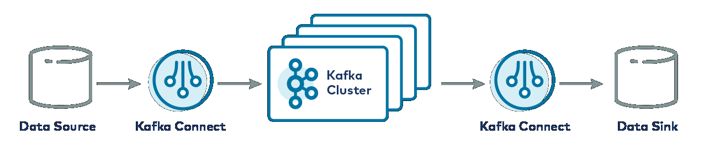
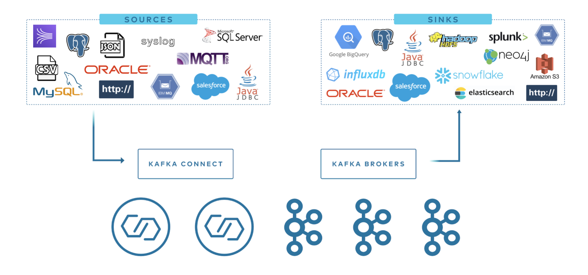

The TDengine Kafka Connector includes two plugins: TDengine Source Connector and TDengine Sink Connector. Users only need to provide a simple configuration file to synchronize data from a specified topic in Kafka to TDengine, or synchronize data from a specified database in TDengine to Kafka, either in batches or in real-time.

## What is Kafka Connect?

Kafka Connect is a component of [Apache Kafka](https://kafka.apache.org/) that facilitates easy connections to Kafka from other systems, such as databases, cloud services, and file systems. Data can flow from these systems to Kafka and from Kafka to these systems through Kafka Connect. Plugins that read data from other systems are called Source Connectors, and plugins that write data to other systems are called Sink Connectors. Neither Source Connectors nor Sink Connectors connect directly to Kafka Brokers; instead, Source Connectors pass data to Kafka Connect, and Sink Connectors receive data from Kafka Connect.



The TDengine Source Connector is used to read data in real-time from TDengine and send it to Kafka Connect. The TDengine Sink Connector receives data from Kafka Connect and writes it to TDengine.



## Prerequisites

Prerequisites for running the examples in this tutorial.

1. Linux operating system
2. Java 8 and Maven installed
3. Git, curl, vi installed
4. TDengine installed and running. If not yet installed, refer to [Installation and Uninstallation](../../../get-started/)

## Installing Kafka

- Execute in any directory:

    ```shell
    KAFKA_PKG="kafka_2.13-3.4.0"
    curl -O "https://archive.apache.org/dist/kafka/3.4.0/${KAFKA_PKG}.tgz"
    tar xzf "${KAFKA_PKG}.tgz" -C /opt/
    ln -s "/opt/${KAFKA_PKG}" /opt/kafka
    ```

- Then, add the `$KAFKA_HOME/bin` directory to PATH.

    ```title=".profile"
    export KAFKA_HOME=/opt/kafka
    export PATH=$PATH:$KAFKA_HOME/bin
    ```

    The above script can be appended to the current user's profile file (~/.profile or ~/.bash_profile)

## Installing TDengine Connector Plugin

### Compiling the Plugin

```shell
git clone --branch 3.0 https://github.com/taosdata/kafka-connect-tdengine.git
cd kafka-connect-tdengine
mvn clean package -Dmaven.test.skip=true
unzip -d $KAFKA_HOME/components/ target/components/packages/taosdata-kafka-connect-tdengine-*.zip
```

The above script first clones the project source code, then compiles and packages it using Maven. After packaging, a zip file of the plugin is generated in the `target/components/packages/` directory. Unzip this package to the installation path for the plugin. The example above uses the built-in plugin installation path: `$KAFKA_HOME/components/`.

### Configuring the Plugin

Add the kafka-connect-tdengine plugin to the `plugin.path` in the `$KAFKA_HOME/config/connect-distributed.properties` configuration file.

```properties
plugin.path=/usr/share/java,/opt/kafka/components
```

## Starting Kafka

```shell
zookeeper-server-start.sh -daemon $KAFKA_HOME/config/zookeeper.properties

kafka-server-start.sh -daemon $KAFKA_HOME/config/server.properties

connect-distributed.sh -daemon $KAFKA_HOME/config/connect-distributed.properties
```

### Verifying if Kafka Connect Has Started Successfully

Enter the command:

```shell
curl http://localhost:8083/connectors
```

If all components have started successfully, the following output will be displayed:

```text
[]
```

## Using the TDengine Sink Connector

The TDengine Sink Connector is used to synchronize data from a specified topic to TDengine. Users do not need to create the database and supertables in advance. You can manually specify the name of the target database (see configuration parameter `connection.database`), or generate it according to certain rules (see configuration parameter `connection.database.prefix`).

The TDengine Sink Connector internally uses TDengine's [schemaless write interface](../../../developer-guide/schemaless-ingestion/) to write data to TDengine, currently supporting three data formats: InfluxDB Line Protocol format, OpenTSDB Telnet Protocol format, and OpenTSDB JSON Protocol format.

The following example synchronizes data from the topic `meters` to the target database `power`. The data format is InfluxDB Line Protocol format.

### Adding a Sink Connector Configuration File

```shell
mkdir ~/test
cd ~/test
vi sink-demo.json
```

Contents of `sink-demo.json`:

```json title="sink-demo.json"
{
  "name": "TDengineSinkConnector",
  "config": {
    "connector.class":"com.taosdata.kafka.connect.sink.TDengineSinkConnector",
    "tasks.max": "1",
    "topics": "meters",
    "connection.url": "jdbc:TAOS://127.0.0.1:6030",
    "connection.user": "root",
    "connection.password": "taosdata",
    "connection.database": "power",
    "db.schemaless": "line",
    "data.precision": "ns",
    "key.converter": "org.apache.kafka.connect.storage.StringConverter",
    "value.converter": "org.apache.kafka.connect.storage.StringConverter",
    "errors.tolerance": "all",
    "errors.deadletterqueue.topic.name": "dead_letter_topic",
    "errors.deadletterqueue.topic.replication.factor": 1
  }
}
```

Key configuration explanations:

1. `"topics": "meters"` and `"connection.database": "power"`, indicate subscribing to the data of the topic `meters` and writing it to the database `power`.
2. `"db.schemaless": "line"`, indicates using data in the InfluxDB Line Protocol format.

### Creating a Sink Connector Instance

```shell
curl -X POST -d @sink-demo.json http://localhost:8083/connectors -H "Content-Type: application/json"
```

If the above command is executed successfully, the following output will be displayed:

```json
{
  "name": "TDengineSinkConnector",
  "config": {
    "connection.database": "power",
    "connection.password": "taosdata",
    "connection.url": "jdbc:TAOS://127.0.0.1:6030",
    "connection.user": "root",
    "connector.class": "com.taosdata.kafka.connect.sink.TDengineSinkConnector",
    "data.precision": "ns",
    "db.schemaless": "line",
    "key.converter": "org.apache.kafka.connect.storage.StringConverter",
    "tasks.max": "1",
    "topics": "meters",
    "value.converter": "org.apache.kafka.connect.storage.StringConverter",
    "name": "TDengineSinkConnector",
    "errors.tolerance": "all",
    "errors.deadletterqueue.topic.name": "dead_letter_topic",
    "errors.deadletterqueue.topic.replication.factor": "1",    
  },
  "tasks": [],
  "type": "sink"
}
```

### Writing Test Data

Prepare a text file with test data, content as follows:

```text title="test-data.txt"
meters,location=California.LosAngeles,groupid=2 current=11.8,voltage=221,phase=0.28 1648432611249000000
meters,location=California.LosAngeles,groupid=2 current=13.4,voltage=223,phase=0.29 1648432611250000000
meters,location=California.LosAngeles,groupid=3 current=10.8,voltage=223,phase=0.29 1648432611249000000
meters,location=California.LosAngeles,groupid=3 current=11.3,voltage=221,phase=0.35 1648432611250000000
```

Use kafka-console-producer to add test data to the topic meters.

```shell
cat test-data.txt | kafka-console-producer.sh --broker-list localhost:9092 --topic meters
```

:::note
If the target database power does not exist, the TDengine Sink Connector will automatically create the database. The database is created with nanosecond precision, which requires that the timestamp precision of the data being written is also in nanoseconds. If the timestamp precision of the data written is not in nanoseconds, an exception will be thrown.
:::

### Verify Synchronization Success

Use TDengine CLI to verify if synchronization was successful.

```sql
taos> use power;
Database changed.

taos> select * from meters;
              _ts               |          current          |          voltage          |           phase           | groupid |            location            |
===============================================================================================================================================================
 2022-03-28 09:56:51.249000000 |              11.800000000 |             221.000000000 |               0.280000000 | 2       | California.LosAngeles          |
 2022-03-28 09:56:51.250000000 |              13.400000000 |             223.000000000 |               0.290000000 | 2       | California.LosAngeles          |
 2022-03-28 09:56:51.249000000 |              10.800000000 |             223.000000000 |               0.290000000 | 3       | California.LosAngeles          |
 2022-03-28 09:56:51.250000000 |              11.300000000 |             221.000000000 |               0.350000000 | 3       | California.LosAngeles          |
Query OK, 4 row(s) in set (0.004208s)
```

If you see the data above, it means the synchronization is successful. If not, please check the Kafka Connect logs. For a detailed explanation of the configuration parameters, see [Configuration Reference](#configuration-reference).

## Using TDengine Source Connector

The TDengine Source Connector is used to push all data from a TDengine database after a certain moment to Kafka. The implementation principle of the TDengine Source Connector is to first pull historical data in batches, then synchronize incremental data using a timed query strategy. It also monitors changes to tables and can automatically synchronize newly added tables. If Kafka Connect is restarted, it will continue to synchronize from the last interrupted position.

The TDengine Source Connector converts data from TDengine tables into InfluxDB Line protocol format or OpenTSDB JSON protocol format before writing it to Kafka.

The example program below synchronizes data from the database test to the topic tdengine-test-meters.

### Adding Source Connector Configuration File

```shell
vi source-demo.json
```

Enter the following content:

```json title="source-demo.json"
{
  "name":"TDengineSourceConnector",
    "config":{
    "connector.class": "com.taosdata.kafka.connect.source.TDengineSourceConnector",
    "tasks.max": 1,
    "subscription.group.id": "source-demo",
    "connection.url": "jdbc:TAOS://127.0.0.1:6030",
    "connection.user": "root",
    "connection.password": "taosdata",
    "connection.database": "test",
    "connection.attempts": 3,
    "connection.backoff.ms": 5000,
    "topic.prefix": "tdengine",
    "topic.delimiter": "-",
    "poll.interval.ms": 1000,
    "fetch.max.rows": 100,
    "topic.per.stable": true,
    "topic.ignore.db": false,
    "out.format": "line",
    "data.precision": "ms",
    "key.converter": "org.apache.kafka.connect.storage.StringConverter",
    "value.converter": "org.apache.kafka.connect.storage.StringConverter"
    }
}
```

### Preparing Test Data

Prepare the SQL file to generate test data.

```sql title="prepare-source-data.sql"
DROP DATABASE IF EXISTS test;
CREATE DATABASE test;
USE test;
CREATE STABLE meters (ts TIMESTAMP, current FLOAT, voltage INT, phase FLOAT) TAGS (location BINARY(64), groupId INT);

INSERT INTO d1001 USING meters TAGS('California.SanFrancisco', 2) VALUES('2018-10-03 14:38:05.000',10.30000,219,0.31000) \
            d1001 USING meters TAGS('California.SanFrancisco', 2) VALUES('2018-10-03 14:38:15.000',12.60000,218,0.33000) \
            d1001 USING meters TAGS('California.SanFrancisco', 2) VALUES('2018-10-03 14:38:16.800',12.30000,221,0.31000) \
            d1002 USING meters TAGS('California.SanFrancisco', 3) VALUES('2018-10-03 14:38:16.650',10.30000,218,0.25000) \
            d1003 USING meters TAGS('California.LosAngeles', 2)   VALUES('2018-10-03 14:38:05.500',11.80000,221,0.28000) \
            d1003 USING meters TAGS('California.LosAngeles', 2)   VALUES('2018-10-03 14:38:16.600',13.40000,223,0.29000) \
            d1004 USING meters TAGS('California.LosAngeles', 3)   VALUES('2018-10-03 14:38:05.000',10.80000,223,0.29000) \
            d1004 USING meters TAGS('California.LosAngeles', 3)   VALUES('2018-10-03 14:38:06.500',11.50000,221,0.35000);
```

Using TDengine CLI, execute the SQL file.

```shell
taos -f prepare-source-data.sql
```

### Create Source Connector Instance

```shell
curl -X POST -d @source-demo.json http://localhost:8083/connectors -H "Content-Type: application/json"
```

### View topic data

Use the kafka-console-consumer command line tool to monitor the data in the topic tdengine-test-meters. Initially, it will output all historical data. After inserting two new data into TDengine, kafka-console-consumer also immediately outputs the added two data. The output data is in the format of InfluxDB line protocol.

```shell
kafka-console-consumer.sh --bootstrap-server localhost:9092 --from-beginning --topic tdengine-test-meters
```

Output:

```text
......
meters,location="California.SanFrancisco",groupid=2i32 current=10.3f32,voltage=219i32,phase=0.31f32 1538548685000000000
meters,location="California.SanFrancisco",groupid=2i32 current=12.6f32,voltage=218i32,phase=0.33f32 1538548695000000000
......
```

At this point, all historical data will be displayed. Switch to TDengine CLI, insert two new data:

```sql
USE test;
INSERT INTO d1001 VALUES (now, 13.3, 229, 0.38);
INSERT INTO d1002 VALUES (now, 16.3, 233, 0.22);
```

Switch back to kafka-console-consumer, and the command line window has already printed the 2 newly inserted data.

### Unload plugin

After testing, use the unload command to stop the loaded connector.

View the currently active connectors:

```shell
curl http://localhost:8083/connectors
```

If you follow the previous operations, there should be two active connectors at this time. Use the following command to unload:

```shell
curl -X DELETE http://localhost:8083/connectors/TDengineSinkConnector
curl -X DELETE http://localhost:8083/connectors/TDengineSourceConnector
```

### Performance Tuning

If you find that the performance is not up to expectations during the process of synchronizing data from TDengine to Kafka, you can try using the following parameters to improve Kafka's write throughput.

1. Open the KAFKA_HOME/config/producer.properties configuration file.
2. Parameter description and configuration suggestions are as follows:

    | **Parameter**         | **Description**                                                                                                                                                                                                                                                                                                                                                                                                                                                                                                                                                                                                          | **Suggested Setting** |
    | --------------------- | ------------------------------------------------------------------------------------------------------------------------------------------------------------------------------------------------------------------------------------------------------------------------------------------------------------------------------------------------------------------------------------------------------------------------------------------------------------------------------------------------------------------------------------------------------------------------------------------------------------------------ | --------------------- |
    | producer.type         | This parameter is used to set the message sending mode, the default value is `sync` which means synchronous sending, `async` means asynchronous sending. Using asynchronous sending can improve the throughput of message sending.                                                                                                                                                                                                                                                                                                                                                                                       | async                 |
    | request.required.acks | This parameter is used to configure the number of acknowledgments that the producer needs to wait for after sending a message. When set to 1, it means that as long as the leader replica successfully writes the message, it will send an acknowledgment to the producer without waiting for other replicas in the cluster to write successfully. This setting can ensure a certain level of message reliability while also ensuring throughput. Since it is not necessary to wait for all replicas to write successfully, it can reduce the waiting time for producers and improve the efficiency of sending messages. | 1                     |
    | max.request.size      | This parameter determines the maximum amount of data that the producer can send in one request. Its default value is 1048576, which is 1M. If set too small, it may lead to frequent network requests, reducing throughput. If set too large, it may lead to high memory usage, or increase the probability of request failure in poor network conditions. It is recommended to set it to 100M.                                                                                                                                                                                                                          | 104857600             |
    | batch.size            | This parameter is used to set the size of the batch, the default value is 16384, which is 16KB. During the message sending process, the messages sent to the Kafka buffer are divided into batches. Therefore, reducing the batch size helps reduce message latency, while increasing the batch size helps improve throughput. It can be reasonably configured according to the actual data volume size. It is recommended to set it to 512K.                                                                                                                                                                            | 524288                |
    | buffer.memory         | This parameter is used to set the total amount of memory for the producer to buffer messages waiting to be sent. A larger buffer can allow the producer to accumulate more messages and send them in batches, improving throughput, but it can also increase latency and memory usage. It can be configured according to machine resources, and it is recommended to set it to 1G.                                                                                                                                                                                                                                       | 1073741824            |

## Configuration Reference

### General Configuration

The following configuration items apply to both TDengine Sink Connector and TDengine Source Connector.

1. `name`: connector name.
1. `connector.class`: the full class name of the connector, e.g., com.taosdata.kafka.connect.sink.TDengineSinkConnector.
1. `tasks.max`: maximum number of tasks, default is 1.
1. `topics`: list of topics to synchronize, separated by commas, e.g., `topic1,topic2`.
1. `connection.url`: TDengine JDBC connection string, e.g., `jdbc:TAOS://127.0.0.1:6030`.
1. `connection.user`: TDengine username, default is root.
1. `connection.password`: TDengine user password, default is taosdata.
1. `connection.attempts`: maximum number of connection attempts. Default is 3.
1. `connection.backoff.ms`: retry interval for failed connection attempts, in milliseconds. Default is 5000.
1. `data.precision`: timestamp precision when using the InfluxDB line protocol format. Options are:
   1. ms: milliseconds
   1. us: microseconds
   1. ns: nanoseconds

### TDengine Sink Connector Specific Configuration

1. `connection.database`: target database name. If the specified database does not exist, it will be automatically created with nanosecond precision. Default is null. If null, the naming rule for the target database refers to the `connection.database.prefix` parameter.
2. `connection.database.prefix`: when `connection.database` is null, the prefix for the target database. Can include the placeholder `${topic}`. For example, `kafka_${topic}`, for the topic 'orders' will write to the database 'kafka_orders'. Default is null. When null, the target database name is the same as the topic name.
3. `batch.size`: number of records per batch write. When the Sink Connector receives more data than this value, it will write in batches.
4. `max.retries`: maximum number of retries in case of an error. Default is 1.
5. `retry.backoff.ms`: retry interval in case of an error, in milliseconds. Default is 3000.
6. `db.schemaless`: data format, options are:
   1. line: represents InfluxDB line protocol format
   2. json: represents OpenTSDB JSON format
   3. telnet: represents OpenTSDB Telnet line protocol format

### TDengine Source Connector Specific Configuration

1. `connection.database`: source database name, no default value.
1. `topic.prefix`: prefix for the topic name when importing data into Kafka. Default is an empty string "".
1. `timestamp.initial`: start time for data synchronization. Format is 'yyyy-MM-dd HH:mm:ss', if not specified, it starts from the earliest record in the specified DB.
1. `poll.interval.ms`: interval for checking new or deleted tables, in milliseconds. Default is 1000.
1. `fetch.max.rows`: maximum number of rows to retrieve from the database. Default is 100.
1. `query.interval.ms`: time span for reading data from TDengine at once, should be configured based on the data characteristics of the table to avoid too large or too small data volumes per query; it is recommended to set an optimal value through testing in specific environments, default is 0, i.e., to fetch all data up to the current latest time.
1. `out.format`: output format of the result set. `line` means output format is InfluxDB Line protocol format, `json` means output format is json. Default is line.
1. `topic.per.stable`: if set to true, indicates that one supertable corresponds to one Kafka topic, the naming rule for the topic is `<topic.prefix><topic.delimiter><connection.database><topic.delimiter><stable.name>`; if set to false, all data in the specified DB goes into one Kafka topic, the naming rule for the topic is `<topic.prefix><topic.delimiter><connection.database>`.
1. `topic.ignore.db`: whether the topic naming rule includes the database name, true means the rule is `<topic.prefix><topic.delimiter><stable.name>`, false means the rule is `<topic.prefix><topic.delimiter><connection.database><topic.delimiter><stable.name>`, default is false. This configuration item does not take effect when `topic.per.stable` is set to false.
1. `topic.delimiter`: topic name delimiter, default is `-`.
1. `read.method`: method of reading data from TDengine, query or subscription. Default is subscription.
1. `subscription.group.id`: specifies the group id for TDengine data subscription, required when `read.method` is subscription.
1. `subscription.from`: specifies the starting position for TDengine data subscription, latest or earliest. Default is latest.

## Additional Information

1. For how to use the Kafka Connect plugin in a standalone Kafka environment, please refer to the official documentation: [https://kafka.apache.org/documentation/#connect](https://kafka.apache.org/documentation/#connect).

## Feedback

If you encounter any issues, feel free to provide feedback in the Github repository of this project: [https://github.com/taosdata/kafka-connect-tdengine/issues](https://github.com/taosdata/kafka-connect-tdengine/issues).

## References

1. [https://kafka.apache.org/documentation/](https://kafka.apache.org/documentation/)
