import Tabs from "@theme/Tabs";
import TabItem from "@theme/TabItem";

## Overview

This document describes how to integrate TDengine as a data source with the open-source data visualization system [Grafana](https://www.grafana.com/) to achieve data visualization and monitoring alarm system construction. With the TDengine plugin, you can easily display the data from TDengine tables on Grafana dashboards without complex development work.

## Grafana Version Requirements

Currently, TDengine supports Grafana versions 7.5 and above. It is recommended to use the latest version. Please download and install the corresponding version of Grafana based on your system environment.

## Prerequisites

To allow Grafana to properly add TDengine as a data source, the following preparations are required.

- Grafana service has been deployed and is running normally.  
  :::note
  Ensure that the account running Grafana has write permissions for its installation directory; otherwise, you may be unable to install plugins later.
  :::
- TDengine cluster has been deployed and is running normally.
- taosAdapter has been installed and is running normally. For specific details, please refer to the [taosAdapter usage manual](../../../tdengine-reference/components/taosadapter/).

Record the following information:

- REST API address of the TDengine cluster, e.g., `http://tdengine.local:6041`.
- Authentication information for the TDengine cluster, which may include a username and password.

## Install Grafana Plugin and Configure Data Source

<Tabs defaultValue="script">
<TabItem value="gui" label="Graphical Interface Installation">

With the latest version of Grafana (8.5+), you can browse and manage plugins directly in Grafana's UI ([Plugin Management](https://grafana.com/docs/grafana/next/administration/plugin-management/#plugin-catalog)). For version 7.x, please use the **Install Script** or **Manual Installation** methods. In the Grafana management interface, navigate to **Configurations > Plugins**, search for `TDengine`, and follow the prompts to install.

After installation, follow the instructions to **Create a TDengine data source** and enter the relevant TDengine configuration:

- Host: IP address and port number providing the REST service in the TDengine cluster, default is `http://localhost:6041`
- User: TDengine username.
- Password: TDengine user password.

Click `Save & Test` to perform a test. If successful, it will indicate: `TDengine Data source is working`.

</TabItem>

<TabItem value="script" label="Install Script">

For users using Grafana 7.x or those configuring with [Grafana Provisioning](https://grafana.com/docs/grafana/latest/administration/provisioning/), you can automatically install the plugin and add the data source provisioning configuration file using the install script on the Grafana server.

```sh
bash -c "$(curl -fsSL \
  https://raw.githubusercontent.com/taosdata/grafanaplugin/master/install.sh)" -- \
  -a http://localhost:6041 \
  -u root \
  -p taosdata
```

After installation, you will need to restart the Grafana service for the changes to take effect.

Save this script and execute `./install.sh --help` to view detailed help documentation.

</TabItem>

<TabItem value="manual" label="Manual Installation">

Use the [`grafana-cli` command line tool](https://grafana.com/docs/grafana/latest/administration/cli/) for plugin [installation](https://grafana.com/grafana/plugins/tdengine-datasource/?tab=installation).

```bash
grafana-cli plugins install tdengine-datasource
# with sudo
sudo -u grafana grafana-cli plugins install tdengine-datasource
```

Alternatively, download the .zip file from [GitHub](https://github.com/taosdata/grafanaplugin/releases/tag/latest) or [Grafana](https://grafana.com/grafana/plugins/tdengine-datasource/?tab=installation) to your local machine and extract it to the Grafana plugin directory. Here is a command line download example:

```bash
GF_VERSION=3.5.1
# from GitHub
wget https://github.com/taosdata/grafanaplugin/releases/download/v$GF_VERSION/tdengine-datasource-$GF_VERSION.zip
# from Grafana
wget -O tdengine-datasource-$GF_VERSION.zip https://grafana.com/api/plugins/tdengine-datasource/versions/$GF_VERSION/download
```

For example, on a CentOS 7.2 operating system, extract the plugin package to the /var/lib/grafana/plugins directory and restart Grafana.

```bash
sudo unzip tdengine-datasource-$GF_VERSION.zip -d /var/lib/grafana/plugins/
```

If Grafana is running in a Docker environment, you can use the following environment variable to automatically install the TDengine data source plugin:

```bash
GF_INSTALL_PLUGINS=tdengine-datasource
```

Then, users can access Grafana through [http://localhost:3000](http://localhost:3000) (username/password: admin/admin) and add the data source through the left-side `Configuration -> Data Sources`.

Click `Add data source` to enter the new data source page, type TDengine into the query box, and then click `select` to configure the data source. You will be prompted to modify the relevant configuration as follows:

- Host: IP address and port number providing the REST service in the TDengine cluster, default is `http://localhost:6041`
- User: TDengine username.
- Password: TDengine user password.

Click `Save & Test` to perform a test. If successful, it will indicate: `TDengine Data source is working`.

</TabItem>

<TabItem value="container" label="K8s/Docker Container">

Refer to [Grafana Container Installation Instructions](https://grafana.com/docs/grafana/next/setup-grafana/installation/docker/#install-plugins-in-the-docker-container). Use the following command to start a container and automatically install the TDengine plugin:

```bash
docker run -d \
  -p 3000:3000 \
  --name=grafana \
  -e "GF_INSTALL_PLUGINS=tdengine-datasource" \
  grafana/grafana
```

Using docker-compose, you can configure Grafana Provisioning for automated configuration and experience zero-configuration startup with TDengine + Grafana:

1. Save this file as `tdengine.yml`.

    ```yml
    apiVersion: 1
    datasources:
    - name: TDengine
      type: tdengine-datasource
      orgId: 1
      url: "$TDENGINE_API"
      isDefault: true
      secureJsonData:
        url: "$TDENGINE_URL"
        basicAuth: "$TDENGINE_BASIC_AUTH"
        token: "$TDENGINE_CLOUD_TOKEN"
      version: 1
      editable: true
    ```

2. Save this file as `docker-compose.yml`.

    ```yml
    version: "3.7"

    services:
      tdengine:
        image: tdengine/tdengine:3.3.0.0
        environment:
          TAOS_FQDN: tdengine
        volumes:
          - tdengine-data:/var/lib/taos/
      grafana:
        image: grafana/grafana:9.3.6
        volumes:
          - ./tdengine.yml/:/etc/grafana/provisioning/tdengine.yml
          - grafana-data:/var/lib/grafana
        environment:
          # install tdengine plugin at start
          GF_INSTALL_PLUGINS: "tdengine-datasource"
          TDENGINE_URL: "http://tdengine:6041"
          #printf "$TDENGINE_USER:$TDENGINE_PASSWORD" | base64
          TDENGINE_BASIC_AUTH: "cm9vdDp0YmFzZTEyNQ=="
        ports:
          - 3000:3000
    volumes:
      grafana-data:
      tdengine-data:
    ```

3. Start TDengine + Grafana using the docker-compose command: `docker-compose up -d`.

Open Grafana at [http://localhost:3000](http://localhost:3000), and you can now add dashboards.

</TabItem>
</Tabs>

:::info

The following sections will use Grafana version 11.0.0 as an example. Other versions may have different functionalities. Please refer to the [Grafana Official Documentation](https://grafana.com/docs/grafana/latest/).

:::

## Dashboard User Guide

This section is organized as follows:

1. Introduces the basics, including Grafana's built-in variables and custom variables, as well as TDengine's support for time series query syntax.
2. Shows how to create a dashboard using the TDengine data source in Grafana, including the unique syntax for time series queries and how to display data in groups.
3. Because the configured dashboard queries TDengine periodically to refresh the display, improper SQL writing may lead to significant performance issues. We provide performance optimization suggestions.
4. Finally, we illustrate how to import the TDinsight dashboard as an example.

### Grafana Built-in Variables and Custom Variables

The Variable feature in Grafana is powerful and can be used in dashboard queries, panel titles, labels, etc., to create more dynamic and interactive dashboards, improving user experience and efficiency.

The main functions and characteristics of variables include:

- Dynamic Data Queries: Variables can be used in query statements, allowing users to dynamically change query conditions by selecting different variable values, thereby viewing different data views. This is useful in scenarios where data needs to be dynamically displayed based on user input.

- Enhanced Reusability: By defining variables, the same configuration or query logic can be reused in multiple places without repeating the same code. This makes the maintenance and updates of the dashboard simpler and more efficient.

- Flexible Configuration Options: Variables offer various configuration options, such as predefined static value lists, dynamically queried values from data sources, regular expression filtering, etc., making the application of variables more flexible and powerful.

Grafana provides built-in variables and custom variables, both of which can be referenced when writing SQL by using `$variableName`, where `variableName` is the name of the variable. For other referencing methods, please refer to [Reference Methods](https://grafana.com/docs/grafana/latest/dashboards/variables/variable-syntax/).

#### Built-in Variables

Grafana has built-in variables like `from`, `to`, and `interval`, which are derived from the Grafana plugin panel. Their meanings are as follows:

- `from`: Start time of the query range
- `to`: End time of the query range
- `interval`: Window slice interval

For each query, it is recommended to set the start and end times of the query range, which can effectively reduce the amount of data scanned by the TDengine server. The `interval` is the size of the window slice; in Grafana version 11, its size is calculated based on the time interval and the number of returned points.

In addition to these three common variables, Grafana also provides variables like `__timezone`, `__org`, and `__user`. For more details, refer to [Built-in Variables](https://grafana.com/docs/grafana/latest/dashboards/variables/add-template-variables/#global-variables).

#### Custom Variables

We can add custom variables to the dashboard. The use of custom variables is no different from built-in variables; they can be referenced in SQL using `$variableName`.
Custom variables support various types, common types include `Query` (query), `Constant` (constant), `Interval` (interval), `Data source` (data source), etc.
Custom variables can reference other custom variables; for example, one variable may represent a region, and another can reference the value of that region to query the devices in that area.

##### Adding Query Type Variables

In the dashboard configuration, select 【Variables】, then click 【New variable】:

1. In the “Name” field, enter your variable name; here we set the variable name as `selected_groups`.
2. In the 【Select variable type】 dropdown, select “Query”.
Based on the selected variable type, configure the corresponding options. For example, if you choose “Query” type, you need to specify the data source and the query statement used to obtain the variable value. Here, we will set the query type, select the data source, and configure SQL as `select distinct(groupid) from power.meters where groupid < 3 and ts > $from and ts < $to;`
3. After clicking the bottom 【Run Query】 button, you can see the variable values generated based on your configuration in the “Preview of values” section.
4. Other configurations will not be elaborated on; after completing the configuration, click the bottom 【Apply】 button, and then click the upper right 【Save dashboard】 to save.

After completing the above steps, we have successfully added a new custom variable `$selected_groups` to the dashboard. We can reference this variable in the dashboard queries later.

We can also add another custom variable to reference the `selected_groups` variable; for example, we can add a query variable named `tbname_max_current` whose SQL is `select tbname from power.meters where groupid = $selected_groups and ts > $from and ts < $to;`.

##### Adding Interval Type Variables

We can customize the time window interval to better fit business needs.

1. In the “Name” field, enter the variable name as `interval`.
2. In the 【Select variable type】 dropdown, select “Interval”.
3. In the 【Interval options】 section, enter `1s,2s,5s,10s,15s,30s,1m`.
4. Other configurations will not be elaborated on; after completing the configuration, click the bottom 【Apply】 button, and then click the upper right 【Save dashboard】 to save.

After completing the above steps, we have successfully added a new custom variable `$interval` to the dashboard. We can reference this variable in the dashboard queries later.

:::note

If a custom variable has the same name as a Grafana built-in variable, the custom variable will be prioritized in references.

:::

### TDengine Time Series Query Support

In addition to supporting standard SQL, TDengine also provides a series of distinctive query syntaxes that meet the needs of time series business scenarios, greatly facilitating the development of applications for time series scenarios.

- The `partition by` clause can segment data based on certain dimensions and then perform a series of calculations within the segmented data space. In most cases, it can replace `group by`.
- The `interval` clause is used to generate equal time period windows.
- The `fill` statement specifies the filling mode in case of data absence in a certain window interval.
- The timestamp pseudo-columns can be used in the SELECT clause to output the time window information corresponding to the aggregation results: start time of the time window (\_wstart), end time of the time window (\_wend), etc.

For a detailed introduction to these features, please refer to [Distinctive Queries](../../../tdengine-reference/sql-manual/time-series-extensions/).

### Creating Dashboards

With the foundational knowledge gained earlier, we can configure a dashboard based on the TDengine data source for time series data display.
In the main Grafana interface, create a dashboard and click 【Add Query】 to enter the panel query page:

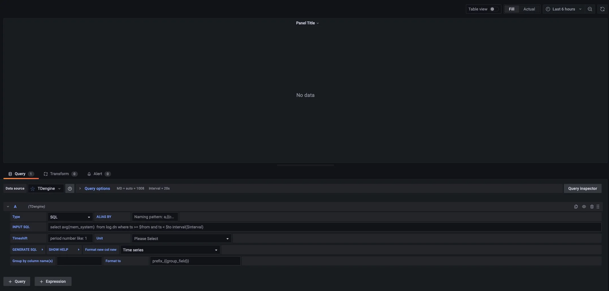

As shown in the image above, select the `TDengine` data source in the “Query” section, and you can enter the corresponding SQL for querying in the query box. Continuing with the smart meter example, we will **use virtual data** here to ensure the curve is aesthetically pleasing.

#### Displaying Time Series Data

Suppose we want to query the average current size over a period of time, using the `$interval` to slice the time window, filling null for missing data in a time window.

- “INPUT SQL”: Enter the SQL query to execute (the result set of this SQL statement should consist of two columns and multiple rows). Here we enter: `select _wstart as ts, avg(current) as current from power.meters where groupid in ($selected_groups) and ts > $from and ts < $to interval($interval) fill(null)`, where from, to, and interval are Grafana built-in variables, and selected_groups is a custom variable.
- “ALIAS BY”: You can set the current query's alias.
- “GENERATE SQL”: Clicking this button will automatically replace the relevant variables and generate the final execution statement.

In the top custom variable, if we select the value of `selected_groups` as 1, the query for the average current of all devices with `groupid` 1 in the `meters` supertable would change as shown below:

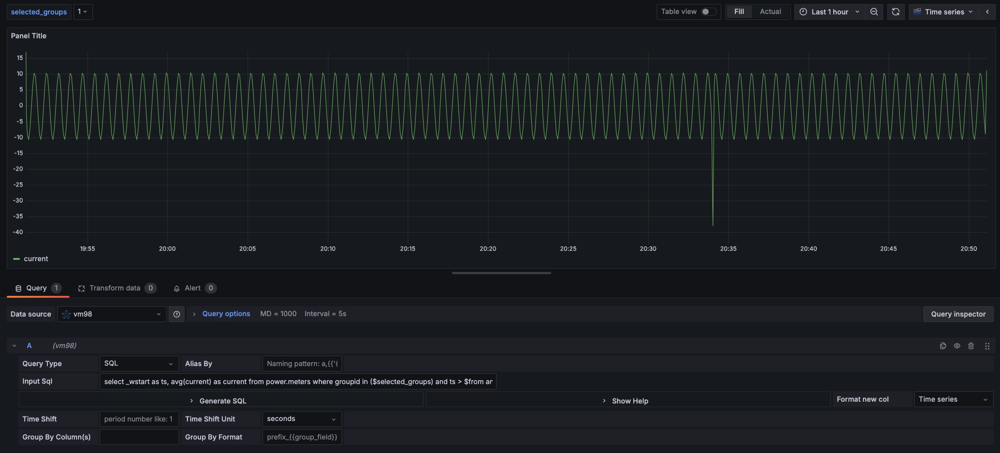

:::note

Since the REST interface is stateless, you cannot use the `use db` statement to switch databases. In the Grafana plugin, you can specify the database in the SQL statement as `<db_name>.<table_name>`.

:::

#### Grouping Time Series Data for Display

Suppose we want to query the average current size over a period of time, displayed by `groupid`. We can modify the previous SQL to `select _wstart as ts, groupid, avg(current) as current from power.meters where ts > $from and ts < $to partition by groupid interval($interval) fill(null)`.

- “Group by column(s)”: Enter the `group by` or `partition by` column names separated by **commas**. If it is a `group by` or `partition by` query, set the “Group by” column to display multidimensional data. Here we set the “Group by” column name as `groupid` to display the data grouped by `groupid`.
- “Group By Format”: In `Group by` or `Partition by` scenarios, you can format the legend name. For the SQL mentioned above, set the “Group By Format” to `groupid-{{groupid}}`, and the legend name will be formatted accordingly.

After completing the settings, the data will be displayed grouped by `groupid`, as shown below:

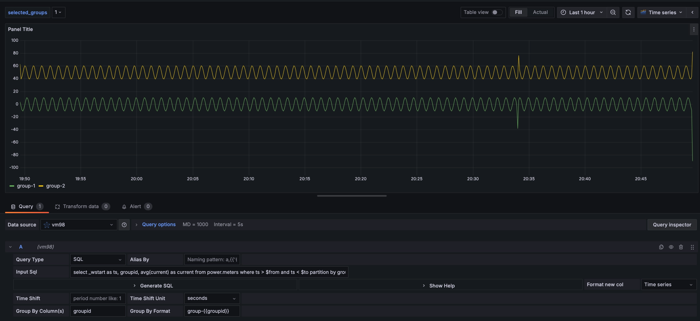

For more information on creating monitoring interfaces using Grafana and other related information, please refer to the official [Grafana documentation](https://grafana.com/docs/).

### Performance Optimization Suggestions

- **Always include a time range in all queries**. In time series databases, failing to include a time range will lead to table scans and poor performance. A common SQL statement format is `select column_name from db.table where ts > $from and ts < $to;`.
- For queries that represent the latest status, it is generally recommended to **enable caching when creating databases** (setting `CACHEMODEL` to last_row or both). A common SQL statement format is `select last(column_name) from db.table where ts > $from and ts < $to;`.

### Importing Dashboards

In the data source configuration page, you can import the TDinsight panel as a monitoring visualization tool for your TDengine cluster. If the TDengine server is version 3.0, please select `TDinsight for 3.x` for import. Note that TDinsight for 3.x requires running and configuring taoskeeper.

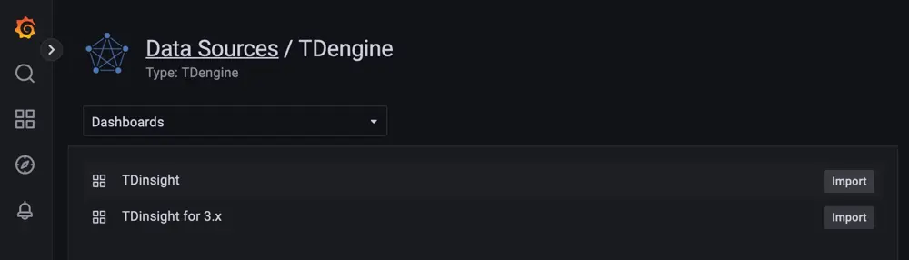

Dashboards compatible with TDengine 2.* have been published on Grafana: [Dashboard 15167 - TDinsight](https://grafana.com/grafana/dashboards/15167)).

You can search for other panels using TDengine as the data source [here](https://grafana.com/grafana/dashboards/?dataSource=tdengine-datasource). Here is an incomplete list:

- [15146](https://grafana.com/grafana/dashboards/15146): Monitoring multiple TDengine clusters
- [15155](https://grafana.com/grafana/dashboards/15155): TDengine alarm examples
- [15167](https://grafana.com/grafana/dashboards/15167): TDinsight
- [16388](https://grafana.com/grafana/dashboards/16388): Data display of node information collected by Telegraf

## Alarm Configuration

The TDengine Grafana plugin supports alarms. To configure alarms, several steps are required:

1. Configure contact points: Set up notification channels, including DingDing, Email, Slack, WebHook, Prometheus Alertmanager, etc.
2. Configure notification policies: Define which channel the alarm is sent to, along with the time and frequency of notifications.
3. Configure alarm rules: Specify detailed alarm rules  
    3.1 Configure the alarm name  
    3.2 Configure the query and alarm triggering conditions  
    3.3 Configure the rule evaluation strategy  
    3.4 Configure labels and alarm channels  
    3.5 Configure notification content  

### Introduction to Alarm Configuration Interface

In Grafana 11, the alarm interface consists of six tabs: “Alert rules,” “Contact points,” “Notification policies,” “Silences,” “Groups,” and “Settings.”

- “Alert rules” lists and configures the alarm rules.
- “Contact points” specifies notification channels, including Email, Slack, WebHook, Prometheus Alertmanager, etc.
- “Notification policies” configures the routing of alarms to specific channels and the timing and frequency of sending notifications.
- “Silences” configures silence periods for alarms.
- “Groups” manages alarm groups, which display triggered alarms in grouped format.
- “Settings” allows modification of alarm configurations via JSON.

### Configure Contact Points

This section provides an example of configuring contact points for email.

#### Configure Email Contact Point

Add SMTP/Emailing and Alerting modules to the Grafana service configuration file (for Linux systems, this configuration file is generally located at `/etc/grafana/grafana.ini`).

Add the following content to the configuration file:

```ini
#################################### SMTP / Emailing ##########################
[smtp]
enabled = true
host = smtp.qq.com:465      # Email server
user = receiver@foxmail.com
password = ***********      # Use email authorization code
skip_verify = true
from_address = sender@foxmail.com
```

Then restart the Grafana service (for Linux systems, execute `systemctl restart grafana-server.service`).

In the Grafana UI, navigate to “Home” -> “Alerting” -> “Contact points” to create a new contact point.

“Name”: Email Contact Point

“Integration”: Select the contact type; here, choose Email and fill in the email address for receiving notifications.  

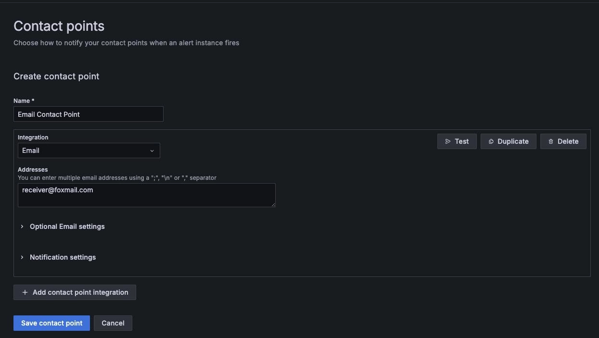

### Configure Notification Policies

After configuring contact points, you will see an existing Default Policy.

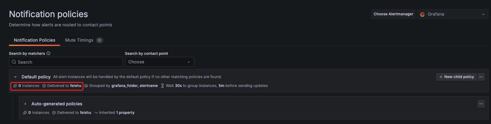

Click the right “...” -> “Edit” to modify the default notification policy, opening the configuration window:

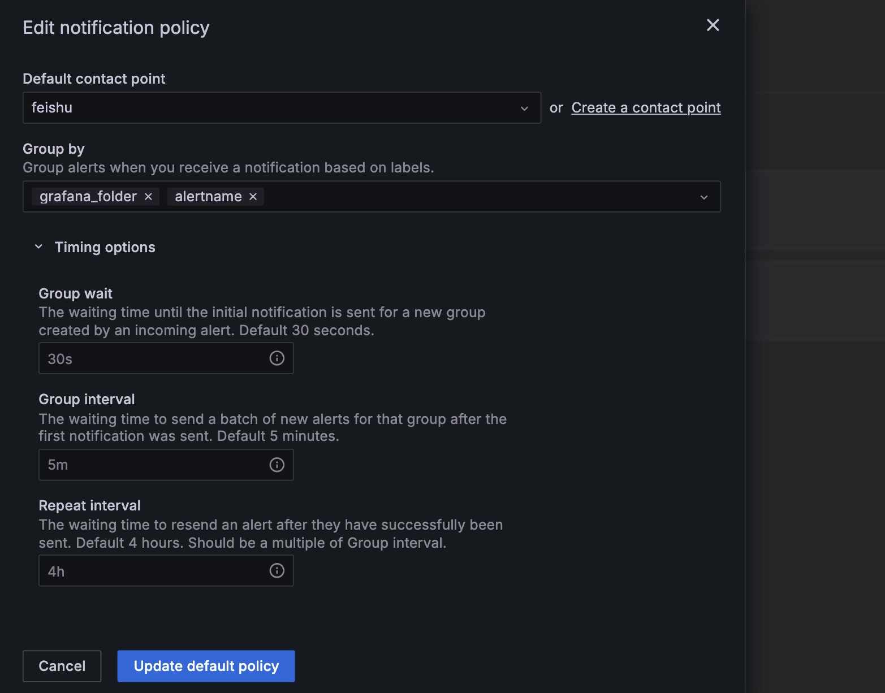

Then configure the following parameters:

- “Group wait”: The waiting time before sending the first alarm.
- “Group interval”: The waiting time for sending the next batch of new alarms after the first alarm is sent.
- “Repeat interval”: The waiting time to resend alarms after successfully sending them.

### Configure Alarm Rules  

Using the smart meter alarm as an example, configuring alarm rules mainly involves the alarm name, query and alarm triggering conditions, rule evaluation strategy, labels and alarm channels, and notification content.

#### Configure Alarm Name

In the panel where you want to configure the alarm, select “Edit” -> “Alert” -> “New alert rule”.

“Enter alert rule name”: For the smart meter example, enter `power meters alert`.

#### Configure Query and Alarm Triggering Conditions

In the “Define query and alert condition” section, configure the alarm rule.

1. Select data source: `TDengine Datasource`  
2. Query statement:

    ```sql
    select _wstart as ts, groupid, avg(current) as current from power.meters where ts > $from and ts < $to partition by groupid interval($interval) fill(null)
    ```

3. Set “Expression”: `Threshold is above 100`  
4. Click 【Set as alert condition】.
5. “Preview”: View the results of the configured rules.

After completing the settings, the interface will look like this:

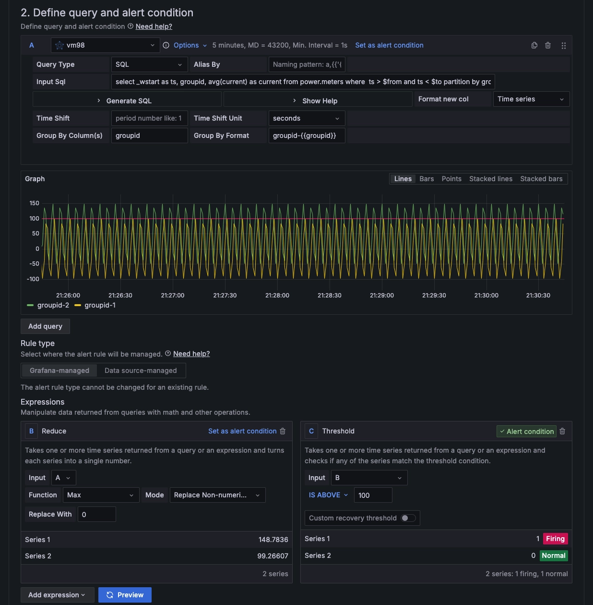

Grafana’s “Expression” supports various operations and calculations on data. The types include:

1. “Reduce”: Aggregates time series values within the selected time range into a single value.
    1.1 “Function” is used to set the aggregation method, supporting Min, Max, Last, Mean, Sum, and Count.  
    1.2 “Mode” supports the following three options:  
        - “Strict”: If no data is queried, it will assign NaN to the data.  
        - “Drop Non-numeric Value”: Removes invalid data results.  
        - “Replace Non-numeric Value”: If invalid data is present, it replaces it with a fixed value.  
2. “Threshold”: Checks if the time series data meets threshold conditions. If false, returns 0; if true, returns 1. The supported conditions include:
    - Is above (x > y)
    - Is below (x < y)
    - Is within range (x > y1 AND x < y2)
    - Is outside range (x < y1 AND x > y2)
3. “Math”: Performs mathematical operations on time series data.
4. “Resample”: Alters the timestamps in each time series to have consistent time intervals for mathematical operations.
5. “Classic condition (legacy)”: Allows configuring multiple logical conditions to determine whether to trigger the alarm.

As shown in the previous screenshot, we set it to trigger an alarm when the maximum value exceeds 100.

#### Configure Rule Evaluation Strategy

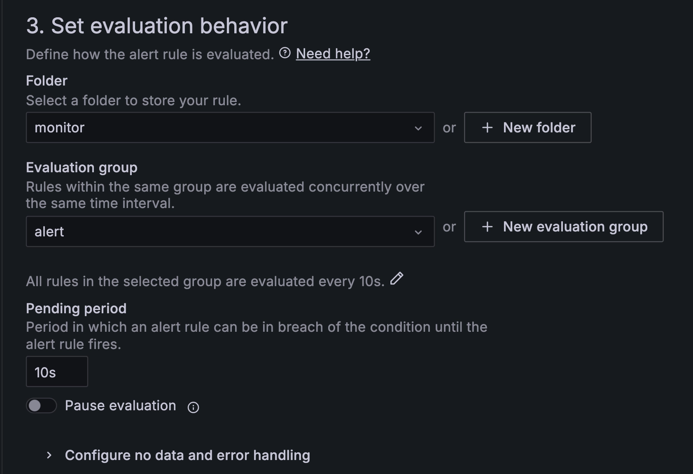

Configure the following:

- “Folder”: Set the folder for the alarm rule.
- “Evaluation group”: Set the evaluation group for the alarm rule. The “Evaluation group” can either choose an existing group or create a new one; new groups can have names and evaluation intervals set.
- “Pending period”: Reasonably set the duration during which the abnormal value persists after the alarm rule threshold is triggered, which helps avoid false positives.

#### Configure Labels and Alarm Channels

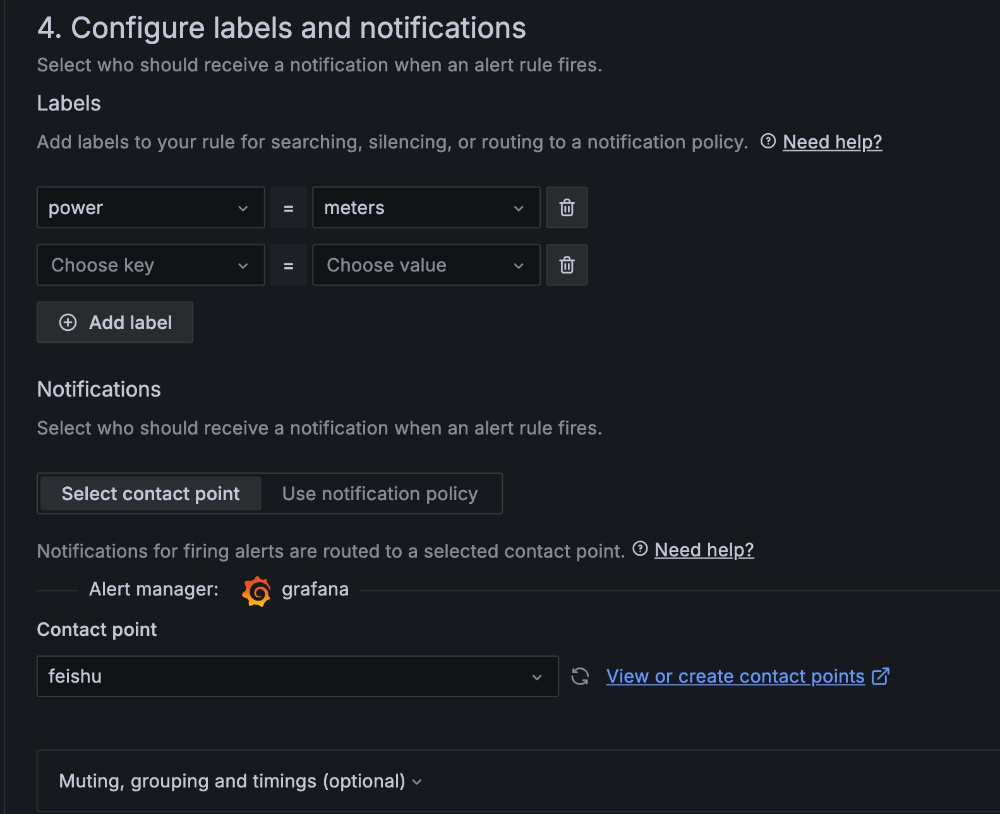

Complete the configuration:

- “Labels”: Add labels to the rule for searching, silencing, or routing to notification policies.
- “Contact point”: Select the contact point; when an alarm occurs, notifications will be sent through the configured contact point.

#### Configure Notification Content

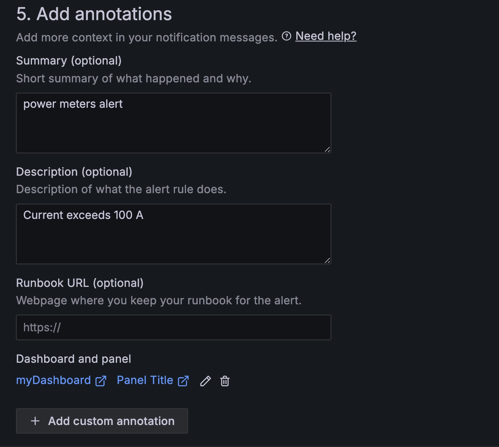

Set the “Summary” and “Description,” so if the alarm triggers, you will receive an alarm notification.
