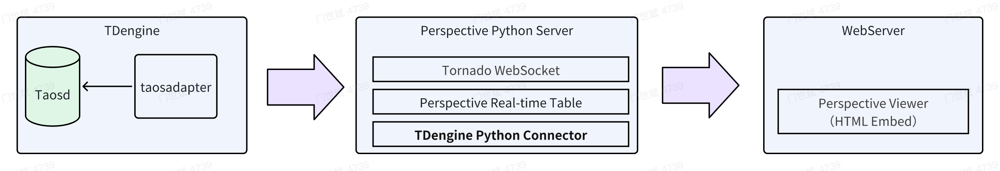
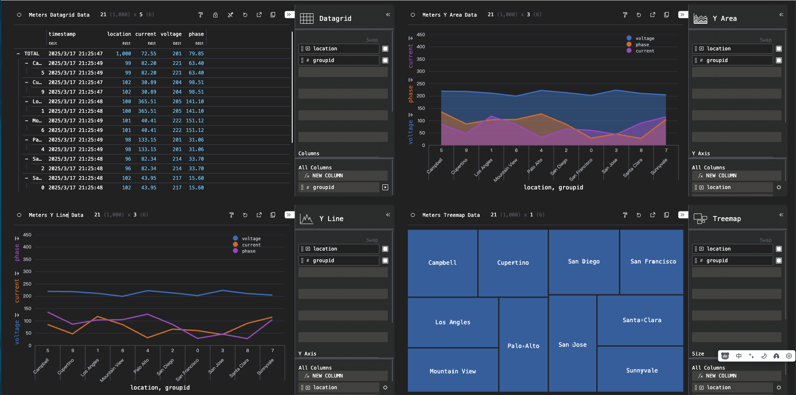

Perspective is an open-source and powerful data visualization library developed by [Prospective.co](https://prospective.co/). Leveraging the technologies of WebAssembly and Web Workers, it enables interactive real-time data analysis in web applications and provides high-performance visualization capabilities on the browser side. With its help, developers can build dashboards, charts, etc. that update in real time, and users can easily interact with the data, filtering, sorting, and exploring it as needed. It boasts high flexibility, adapting to various data formats and business scenarios. It is also fast, ensuring smooth interaction even when dealing with large-scale data. Moreover, it has excellent usability, allowing both beginners and professional developers to quickly build visualization interfaces.

In terms of data connection, Perspective, through the Python connector of TDengine, perfectly supports TDengine data sources. It can efficiently retrieve various types of data, such as massive time-series data, from TDengine. Additionally, it offers real-time functions including the display of complex charts, in-depth statistical analysis, and trend prediction, helping users gain insights into the value of the data and providing strong support for decision-making. It is an ideal choice for building applications with high requirements for real-time data visualization and analysis.



## Prerequisites

Perform the following installation operations in the Linux system:

- TDengine is installed and running normally (both Enterprise and Community versions are available).
- taosAdapter is running normally, refer to [taosAdapter Reference](../../../tdengine-reference/components/taosadapter/).
- Python version 3.10 or higher has been installed (if not installed, please refer to [Python Installation](https://docs.python.org/)).
- Download or clone the [perspective-connect-demo](https://github.com/taosdata/perspective-connect-demo) project. After entering the root directory of the project, run the "install.sh" script to download and install the TDengine client library and related dependencies locally.

## Visualize data

**Step 1**, Run the "run.sh" script in the root directory of the [perspective-connect-demo](https://github.com/taosdata/perspective-connect-demo) project to start the Perspective service. This service will retrieve data from the TDengine database every 300 milliseconds and transmit the data in a streaming form to the web-based `Perspective Viewer`.

```shell
sh run.sh
```

**Step 2**, Start a static web service. Then, access the prsp-viewer.html resource in the browser, and the visualized data can be displayed.

```python
python -m http.server 8081
```

The effect presented after accessing the web page through the browser is shown in the following figure:



## Instructions for use

### Write Data to TDengine

The `producer.py` script in the root directory of the [perspective-connect-demo](https://github.com/taosdata/perspective-connect-demo) project can periodically insert data into the TDengine database with the help of the TDengine Python connector. This script will generate random data and insert it into the database, thus simulating the process of writing real-time data. The specific execution steps are as follows:

1. Establish a connection to TDengine.
2. Create the `power` database and the `meters` table.
3. Generate random data every 300 milliseconds and write it into the TDengine database.

For detailed instructions on writing using the Python connector, please refer to [Python Parameter Binding](../../../tdengine-reference/client-libraries/python/#parameter-binding).

### Load Data from TDengine

The `perspective_server.py` script in the root directory of the [perspective-connect-demo](https://github.com/taosdata/perspective-connect-demo) project will start a Perspective server. This server will read data from TDengine and stream the data to a Perspective table via the Tornado WebSocket.

1. Start a Perspective server.
2. Establish a connection to TDengine.
3. Create a Perspective table (the table structure needs to match the type of the table in the TDengine database).
4. Call the `Tornado.PeriodicCallback` function to start a scheduled task, thereby achieving the update of the data in the Perspective table. The sample code is as follows:

```python
{{#include docs/examples/perspective/perspective_server.py:perspective_server}}
```

### HTML Page Configuration

The `prsp-viewer.html` file in the root directory of the [perspective-connect-demo](https://github.com/taosdata/perspective-connect-demo) project embeds the `Perspective Viewer` into the HTML page. It connects to the Perspective server via a WebSocket and displays real-time data according to the chart configuration.

- Configure the displayed charts and the rules for data analysis.
- Establish a Websocket connection with the Perspective server.
- Import the Perspective library, connect to the Perspective server via a WebSocket, and load the `meters_values` table to display dynamic data.

```html
{{#include docs/examples/perspective/prsp-viewer.html:perspective_viewer}}
```

## Reference Materials

- [Perspective Docs](https://perspective.finos.org/)
- [TDengine Python Connector](../../../tdengine-reference/client-libraries/python/)
- [TDengine Stream Processing](../../../advanced-features/stream-processing/)
