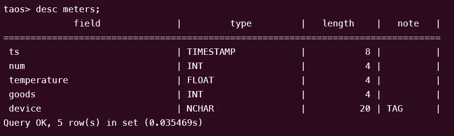
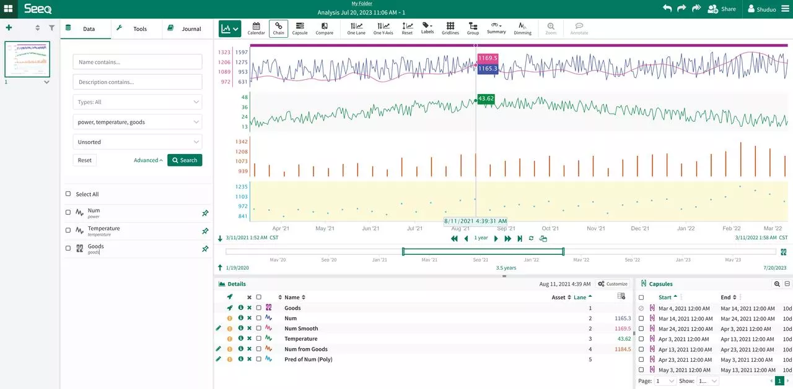
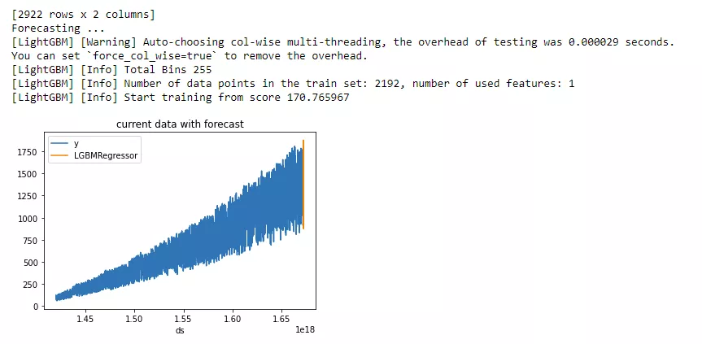
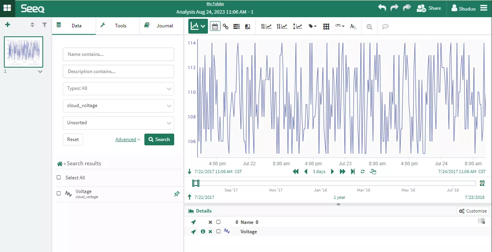

Seeq is an advanced analytics software designed for manufacturing and the Industrial Internet of Things (IIOT). It supports new features that leverage machine learning innovations within process manufacturing organizations. These features enable organizations to deploy their own or third-party machine learning algorithms to frontline process engineers and subject matter experts, thereby scaling the efforts of individual data scientists to many frontline employees.

With the TDengine Java connector, Seeq can easily support querying the time-series data provided by TDengine and offer capabilities for data display, analysis, and forecasting.

## Installing Seeq

Download the relevant software, such as Seeq Server and Seeq Data Lab, from the [Seeq official website](https://www.seeq.com/customer-download). Seeq Data Lab needs to be installed on a different server than Seeq Server and interconnected via configuration. For detailed installation instructions, refer to the [Seeq Knowledge Base](https://support.seeq.com/kb/latest/cloud/).

## Configuring Seeq to Access TDengine

1. Check the data storage location.

```shell
sudo seeq config get Folders/Data
```

2. Download the TDengine Java connector package from maven.org; the latest version is [3.2.5](https://repo1.maven.org/maven2/com/taosdata/jdbc/taos-jdbcdriver/3.2.5/taos-jdbcdriver-3.2.5-dist.jar), and copy it to the plugins\lib directory in the data storage location.

3. Restart the Seeq server.

```shell
sudo seeq restart
```

4. Enter the License.

Access the server via the browser at `ip:34216` and follow the instructions to enter the license.

## Using Seeq to Analyze TDengine Time-Series Data

This section demonstrates how to use Seeq software in conjunction with TDengine for time-series data analysis.

### Scenario Introduction

The example scenario involves a power system where users collect electricity consumption data from station instruments daily and store it in a TDengine cluster. Now, users want to predict how electricity consumption will develop and purchase more equipment to support it. Electricity consumption varies with monthly orders and also changes with the seasons; for example, in summer, electricity consumption tends to be higher in this northern hemisphere city. We simulate data to reflect these assumptions.

### Data Schema

```sql
CREATE STABLE meters (ts TIMESTAMP, num INT, temperature FLOAT, goods INT) TAGS (device NCHAR(20));
CREATE TABLE goods (ts1 TIMESTAMP, ts2 TIMESTAMP, goods FLOAT);
```



### Data Construction Method

```shell
python mockdata.py
taos -s "insert into power.goods select _wstart, _wstart + 10d, avg(goods) from power.meters interval(10d);"
```

The source code is hosted in the [GitHub repository](https://github.com/sangshuduo/td-forecasting).

## Analyzing Data with Seeq

### Configuring Data Source

Log in with a Seeq administrator account and create a new data source.

- Power

```json
{
    "QueryDefinitions": [
        {
            "Name": "PowerNum",
            "Type": "SIGNAL",
            "Sql": "SELECT  ts, num FROM meters",
            "Enabled": true,
            "TestMode": false,
            "TestQueriesDuringSync": true,
            "InProgressCapsulesEnabled": false,
            "Variables": null,
            "Properties": [
                {
                    "Name": "Name",
                    "Value": "Num",
                    "Sql": null,
                    "Uom": "string"
                },
                {
                    "Name": "Interpolation Method",
                    "Value": "linear",
                    "Sql": null,
                    "Uom": "string"
                },
                {
                    "Name": "Maximum Interpolation",
                    "Value": "2day",
                    "Sql": null,
                    "Uom": "string"
                }
            ],
            "CapsuleProperties": null
        }
    ],
    "Type": "GENERIC",
    "Hostname": null,
    "Port": 0,
    "DatabaseName": null,
    "Username": "root",
    "Password": "taosdata",
    "InitialSql": null,
    "TimeZone": null,
    "PrintRows": false,
    "UseWindowsAuth": false,
    "SqlFetchBatchSize": 100000,
    "UseSSL": false,
    "JdbcProperties": null,
    "GenericDatabaseConfig": {
        "DatabaseJdbcUrl": "jdbc:TAOS-RS://127.0.0.1:6041/power?user=root&password=taosdata",
        "SqlDriverClassName": "com.taosdata.jdbc.rs.RestfulDriver",
        "ResolutionInNanoseconds": 1000,
        "ZonedColumnTypes": []
    }
}
```

- Goods

```json
{
    "QueryDefinitions": [
        {
            "Name": "PowerGoods",
            "Type": "CONDITION",
            "Sql": "SELECT ts1, ts2, goods FROM power.goods",
            "Enabled": true,
            "TestMode": false,
            "TestQueriesDuringSync": true,
            "InProgressCapsulesEnabled": false,
            "Variables": null,
            "Properties": [
                {
                    "Name": "Name",
                    "Value": "Goods",
                    "Sql": null,
                    "Uom": "string"
                },
                {
                    "Name": "Maximum Duration",
                    "Value": "10days",
                    "Sql": null,
                    "Uom": "string"
                }
            ],
            "CapsuleProperties": [
                {
                    "Name": "goods",
                    "Value": "${columnResult}",
                    "Column": "goods",
                    "Uom": "string"
                }
            ]
        }
    ],
    "Type": "GENERIC",
    "Hostname": null,
    "Port": 0,
    "DatabaseName": null,
    "Username": "root",
    "Password": "taosdata",
    "InitialSql": null,
    "TimeZone": null,
    "PrintRows": false,
    "UseWindowsAuth": false,
    "SqlFetchBatchSize": 100000,
    "UseSSL": false,
    "JdbcProperties": null,
    "GenericDatabaseConfig": {
        "DatabaseJdbcUrl": "jdbc:TAOS-RS://127.0.0.1:6041/power?user=root&password=taosdata",
        "SqlDriverClassName": "com.taosdata.jdbc.rs.RestfulDriver",
        "ResolutionInNanoseconds": 1000,
        "ZonedColumnTypes": []
    }
}
```

- Temperature

```json
{
    "QueryDefinitions": [
        {
            "Name": "PowerNum",
            "Type": "SIGNAL",
            "Sql": "SELECT  ts, temperature FROM meters",
            "Enabled": true,
            "TestMode": false,
            "TestQueriesDuringSync": true,
            "InProgressCapsulesEnabled": false,
            "Variables": null,
            "Properties": [
                {
                    "Name": "Name",
                    "Value": "Temperature",
                    "Sql": null,
                    "Uom": "string"
                },
                {
                    "Name": "Interpolation Method",
                    "Value": "linear",
                    "Sql": null,
                    "Uom": "string"
                },
                {
                    "Name": "Maximum Interpolation",
                    "Value": "2day",
                    "Sql": null,
                    "Uom": "string"
                }
            ],
            "CapsuleProperties": null
        }
    ],
    "Type": "GENERIC",
    "Hostname": null,
    "Port": 0,
    "DatabaseName": null,
    "Username": "root",
    "Password": "taosdata",
    "InitialSql": null,
    "TimeZone": null,
    "PrintRows": false,
    "UseWindowsAuth": false,
    "SqlFetchBatchSize": 100000,
    "UseSSL": false,
    "JdbcProperties": null,
    "GenericDatabaseConfig": {
        "DatabaseJdbcUrl": "jdbc:TAOS-RS://127.0.0.1:6041/power?user=root&password=taosdata",
        "SqlDriverClassName": "com.taosdata.jdbc.rs.RestfulDriver",
        "ResolutionInNanoseconds": 1000,
        "ZonedColumnTypes": []
    }
}
```

### Using Seeq Workbench

Log in to the Seeq service page and create a new Seeq Workbench. You can display or forecast data by selecting data sources and different tools as needed. For detailed usage instructions, refer to the [official knowledge base](https://support.seeq.com/space/KB/146440193/Seeq+Workbench).



### Further Data Analysis with Seeq Data Lab Server

Log in to the Seeq service page and create a new Seeq Data Lab to use Python programming or other machine learning tools for more complex data mining functions.

```Python
from seeq import spy
spy.options.compatibility = 189
import pandas as pd
import matplotlib
import matplotlib.pyplot as plt
import mlforecast
import lightgbm as lgb
from mlforecast.target_transforms import Differences
from sklearn.linear_model import LinearRegression

ds = spy.search({'ID': "8C91A9C7-B6C2-4E18-AAAF-XXXXXXXXX"})
print(ds)

sig = ds.loc[ds['Name'].isin(['Num'])]
print(sig)

data = spy.pull(sig, start='2015-01-01', end='2022-12-31', grid=None)
print("data.info()")
data.info()
print(data)
#data.plot()

print("data[Num].info()")
data['Num'].info()
da = data['Num'].index.tolist()
#print(da)

li = data['Num'].tolist()
#print(li)

data2 = pd.DataFrame()
data2['ds'] = da
print('1st data2 ds info()')
data2['ds'].info()

#data2['ds'] = pd.to_datetime(data2['ds']).to_timestamp()
data2['ds'] = pd.to_datetime(data2['ds']).astype('int64')
data2['y'] = li
print('2nd data2 ds info()')
data2['ds'].info()
print(data2)

data2.insert(0, column = "unique_id", value="unique_id")

print("Forecasting ...")

forecast = mlforecast.MLForecast(
    models = lgb.LGBMRegressor(),
    freq = 1,
    lags=[365],
    target_transforms=[Differences([365])],
)

forecast.fit(data2)
predicts = forecast.predict(365)

pd.concat([data2, predicts]).set_index("ds").plot(title = "current data with forecast")
plt.show()
```

The output of the program will be:



## Configuring Seeq Data Source to Connect to TDengine Cloud

Configuring the Seeq data source to connect to TDengine Cloud is not fundamentally different from connecting to a locally installed instance of TDengine. Simply log in to TDengine Cloud, choose "Programming - Java," and copy the JDBC URL with the token string to fill in the DatabaseJdbcUrl value of the Seeq Data Source. Note that when using TDengine Cloud, you need to specify the database name in the SQL command.

### Example Configuration for Using TDengine Cloud as Data Source

```json
{
    "QueryDefinitions": [
        {
            "Name": "CloudVoltage",
            "Type": "SIGNAL",
            "Sql": "SELECT  ts, voltage FROM test.meters",
            "Enabled": true,
            "TestMode": false,
            "TestQueriesDuringSync": true,
            "InProgressCapsulesEnabled": false,
            "Variables": null,
            "Properties": [
                {
                    "Name": "Name",
                    "Value": "Voltage",
                    "Sql": null,
                    "Uom": "string"
                },
                {
                    "Name": "Interpolation Method",
                    "Value": "linear",
                    "Sql": null,
                    "Uom": "string"
                },
                {
                    "Name": "Maximum Interpolation",
                    "Value": "2day",
                    "Sql": null,
                    "Uom": "string"
                }
            ],
            "CapsuleProperties": null
        }
    ],
    "Type": "GENERIC",
    "Hostname": null,
    "Port": 0,
    "DatabaseName": null,
    "Username": "root",
    "Password": "taosdata",
    "InitialSql": null,
    "TimeZone": null,
    "PrintRows": false,
    "UseWindowsAuth": false,
    "SqlFetchBatchSize": 100000,
    "UseSSL": false,
    "JdbcProperties": null,
    "GenericDatabaseConfig": {
        "DatabaseJdbcUrl": "jdbc:TAOS-RS://gw.cloud.taosdata.com?useSSL=true&token=41ac9d61d641b6b334e8b76f45f5a8XXXXXXXXXX",
        "SqlDriverClassName": "com.taosdata.jdbc.rs.RestfulDriver",
        "ResolutionInNanoseconds": 1000,
        "ZonedColumnTypes": []
    }
}
```

### Example Seeq Workbench Interface with TDengine Cloud as Data Source



## Solution Summary

By integrating Seeq with TDengine, users can fully leverage TDengine's efficient storage and querying performance while benefiting from the powerful data visualization and analysis capabilities that Seeq offers.

This integration enables users to take full advantage of TDengine's high-performance time-series data storage and retrieval, ensuring efficient processing of large datasets. At the same time, Seeq provides advanced analytics features such as data visualization, anomaly detection, correlation analysis, and predictive modeling, allowing users to gain valuable insights and make data-driven decisions.

Overall, Seeq and TDengine together provide a comprehensive solution for time-series data analysis across various industries, including manufacturing, industrial IoT, and power systems. The combination of efficient data storage and advanced analytics empowers users to unlock the full potential of time-series data, drive operational improvements, and support predictive and planning analytics applications.
