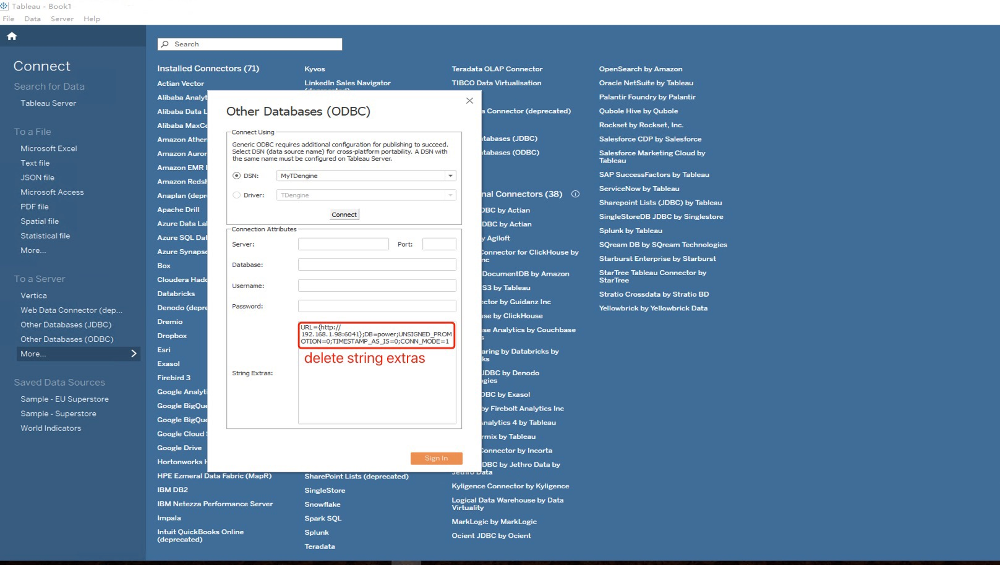
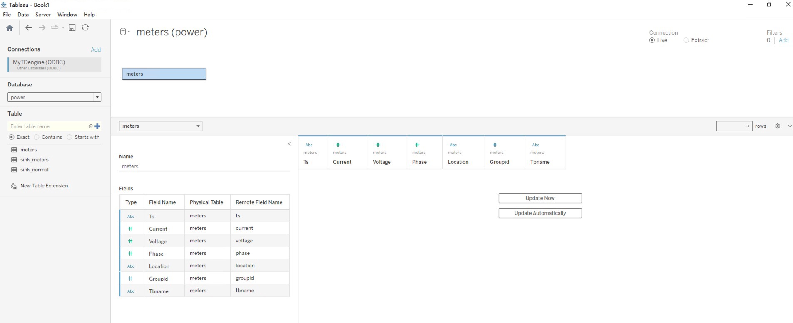
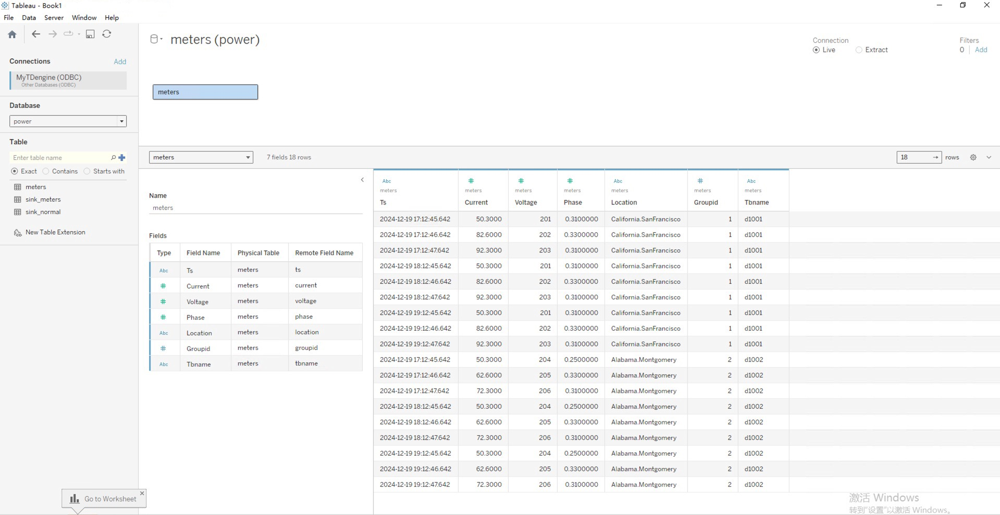
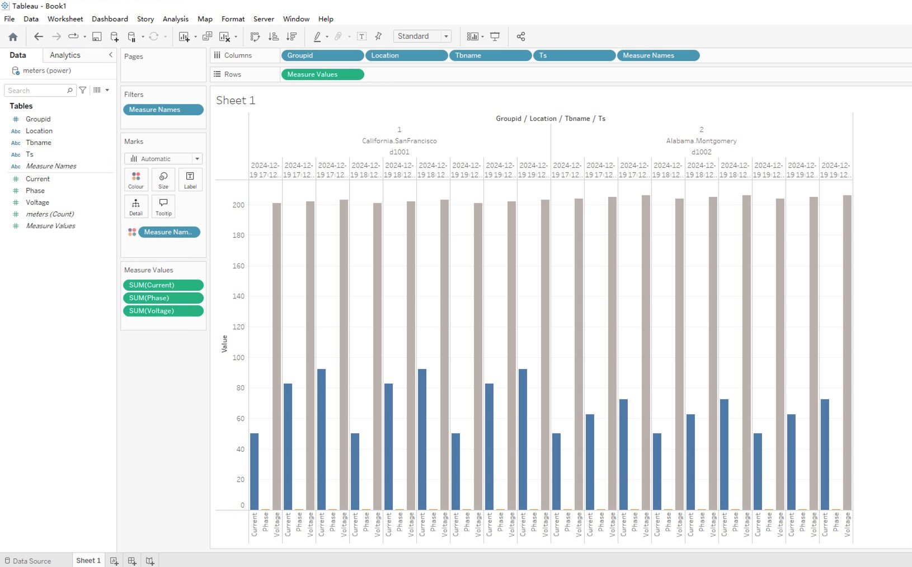

Tableau is a well-known business intelligence tool that supports multiple data sources, making it easy to connect, import, and integrate data. And through an intuitive user interface, users can create rich and diverse visual charts, with powerful analysis and filtering functions, providing strong support for data decision-making. Users can import tag data, raw time-series data, or time-series data aggregated over time from TDengine into Tableau via the TDengine ODBC Connector to create reports or dashboards, and no code writing is required throughout the entire process.

## Prerequisites

Prepare the following environment:

- TDengine 3.3.5.4 version is installed and running normally (both Enterprise and Community versions are available)
- taosAdapter is running normally, refer to [taosAdapter](../../../tdengine-reference/components/taosadapter/)
- Install and run Tableau Desktop (if not installed, please download and install Windows operating system 64-bit [Download Tableau Desktop](https://www.tableau.com/products/desktop/download)). Install Tableau please refer to [Tableau Desktop](https://www.tableau.com).
- ODBC driver installation successful, refer to [Install ODBC Driver](../../../tdengine-reference/client-libraries/odbc/#Installation)
- ODBC data source configuration successful, refer to [Configure Data Source](../../../tdengine-reference/client-libraries/odbc/#configure-data-source)

## Load and analyze TDengine data

**Step 1**, Start Tableau in the Windows system environment, then search for "ODBC" on its connection page and select "Other Databases (ODBC)".

**Step 2**, Click the `DSN` radio button, then select the configured data source (MyTDengine), and click the `Connect` button. After the connection is successful, delete the content of the string attachment, and finally click the `Sign In` button.

**Step 3**, In the pop-up workbook page, the connected data sources will be displayed. Clicking on the dropdown list of databases will display the databases that require data analysis. On this basis, click the search button in the table options to display all tables in the database. Then, drag the table to be analyzed to the right area to display the table structure.

**Step 4**, Click the `Update Now` button below to display the data in the table.

**Step 5**, Click on the "Worksheet" at the bottom of the window to pop up the data analysis window, which displays all the fields of the analysis table. Drag the fields to the rows and columns to display the chart.

