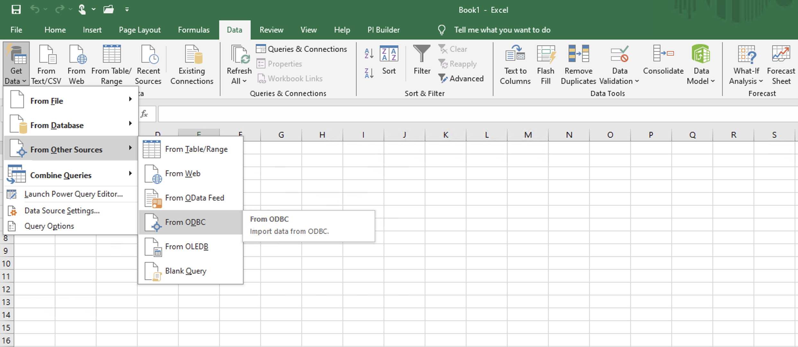
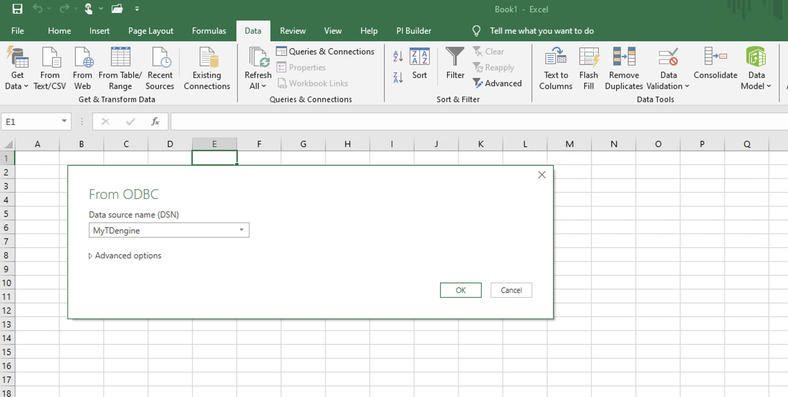
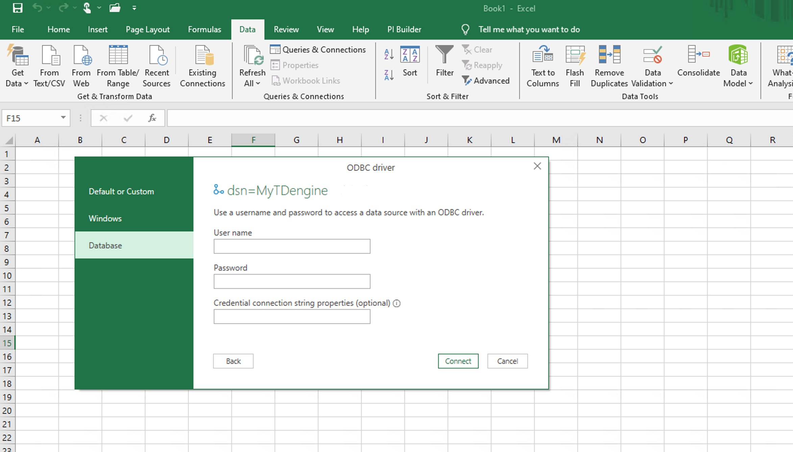
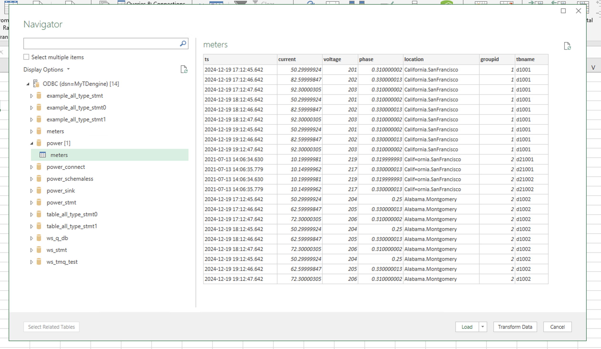
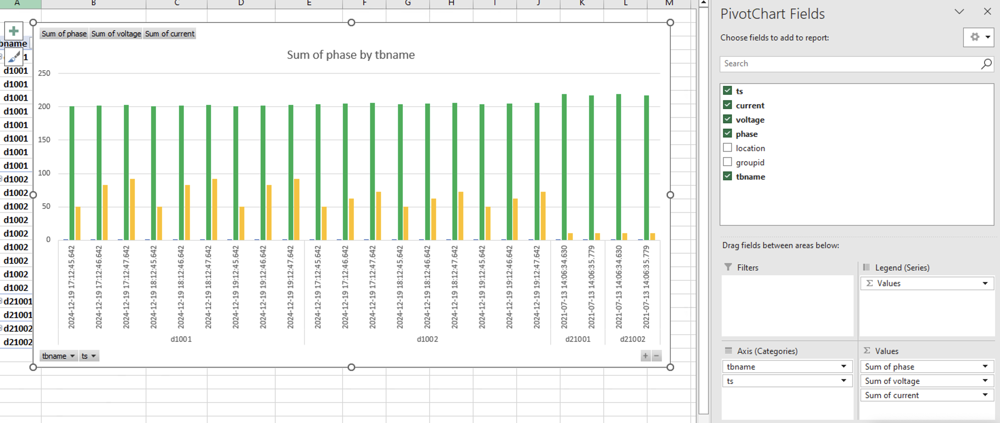

 By configuring the use of the ODBC connector, Excel can quickly access data from TDengine. Users can import tag data, raw time-series data, or time-aggregated time series data from TDengine into Excel to create reports or dashboards, all without the need for any coding.

## Prerequisites

Prepare the following environment:

- TDengine 3.3.5.8 and above version is installed and running normally (both Enterprise and Community versions are available).
- taosAdapter is running normally, refer to [taosAdapter Reference](../../../tdengine-reference/components/taosadapter/).
- Install and run Excel. If not installed, please download and install it. For specific instructions, please refer to Microsoft's official documentation.
- Download the latest Windows operating system X64 client driver from the TDengine official website and install it, refer to [Install ODBC Driver](../../../tdengine-reference/client-libraries/odbc/#installation).

## Configure Data Source

**Step 1**, Search and open the [ODBC Data Source (64 bit)] management tool in the Start menu of the Windows operating system and configure it, refer to [Install ODBC Driver](../../../tdengine-reference/client-libraries/odbc/#installation).

**Step 2**, Start Excel in the Windows system environment, then select [Data] -> [Get Data] -> [From Other Sources] -> [From ODBC].

**Step 3**, In the pop-up window, select the data source you need to connect to from the drop-down list of [Data source name (DSN)], and then click the [OK] button.  

**Step 4**, Enter the username and password for TDengine.

**Step 5**, In the pop-up [Navigator] dialog box, select the database tables you want to load, and then click [Load] to complete the data loading.

## Data Analysis

Select the imported data. On the [Insert] tab, choose the column chart, and then configure the data fields in the [PivotChart Fields] pane on the right.

