Fanruan is a technology company specializing in the field of business intelligence and data analytics. With its self-developed core products, FineBI and FineReport, the company has established a leading position in the industry. Fanruan's BI tools are widely adopted by enterprises across various sectors, empowering users to achieve data visualization analysis, report generation, and data-driven decision support.

By using the TDengine Java connector, FineBI can quickly access the data in TDengine. Users can directly connect to the TDengine database in FineBI, obtain time-series data for analysis, and create visual reports, and the entire process does not require any code writing.

## Prerequisites

- TDengine 3.3.4.0 and above version is installed and running normally (both Enterprise and Community versions are available).
- taosAdapter is running normally, refer to [taosAdapter Reference](../../../tdengine-reference/components/taosadapter/).
- Install FineBI (if not installed, please download and install [Download FineBI](https://intl.finebi.com/download)).
- Download the fine_conf_entity plugin to support the addition of JDBC drivers, [Download link](https://market.fanruan.com/plugin/1052a471-0239-4cd8-b832-045d53182c5d).
- Install the JDBC driver. Download the `TDengine JDBC connector` file `taos-jdbcdriver-3.4.0-dist.jar` or a higher version from `maven.org`.

## Configure Data Source

**Step 1**, In the `db.script` configuration file of the FineBI server, find the `SystemConfig.driverUpload` configuration item and change its value to true.

- Windows system: The path of the configuration file is webapps/webroot/WEB-INF/embed/finedb/db.script under the installation directory.
- Linux/Mac system: The path of the configuration file is /usr/local/FineBI6.1/webapps/webroot/WEB-INF/embed/finedb/db.script.

**Step 2**, Start the FineBI service. Enter `http://ip:37799/webroot/decision` in the browser, where "ip" is the IP address of the FineBI server.

**Step 3**, After logging in to the FineBI Web page, click [System Management] -> [Plugin Management]. In the [Store App] on the right side, click [Install From Local] and select the downloaded `fine_conf_entity` plugin for installation.

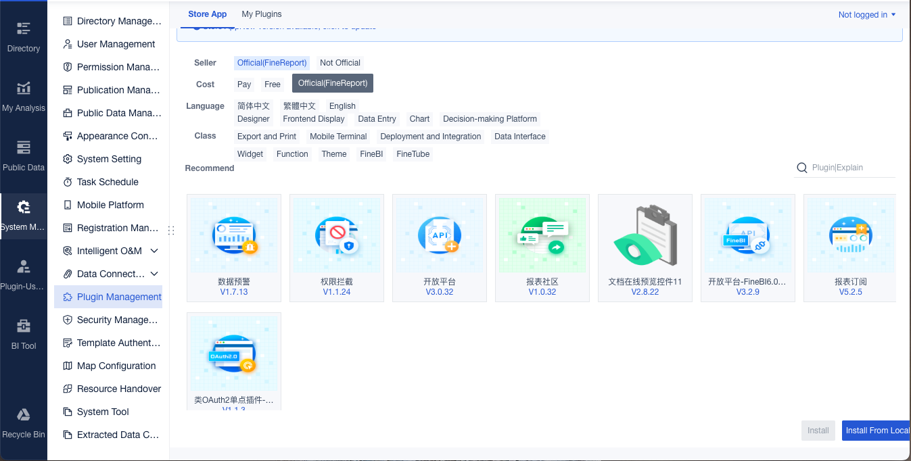

**Step 4**, Click [System Management] -> [Data Connection] -> [Data Connection Management]. On the right-hand page, click the [Driver Management] button to open the configuration page. Then click the [New Driver] button, and in the pop-up window, enter a name (for example, `tdengine-websocket`) to configure the JDBC driver.

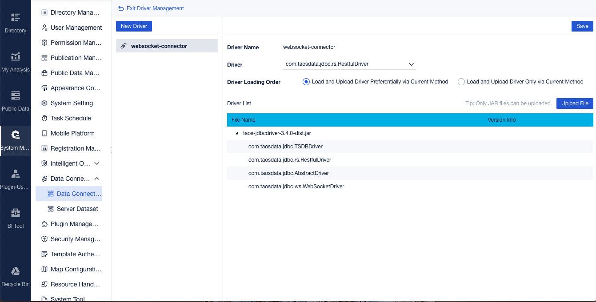

**Step 5**, On the driver configuration page, click the [Upload File] button. Select the downloaded TDengine Java Connector (e.g., `taos-jdbcdriver-3.4.0-dist.jar`) for uploading. After the upload is complete, select `com.taosdata.jdbc.ws.WebSocketDriver` from the drop-down list of [Driver], and then click [Save].

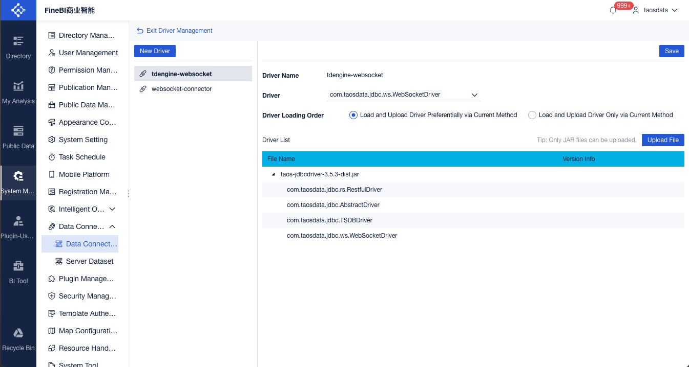

**Step 6**, On the "Data Connection Management" page, click the [New Data Connection] button. Subsequently, click "Others", and then on the right-side page, click "Other JDBC" to perform the connection configuration.

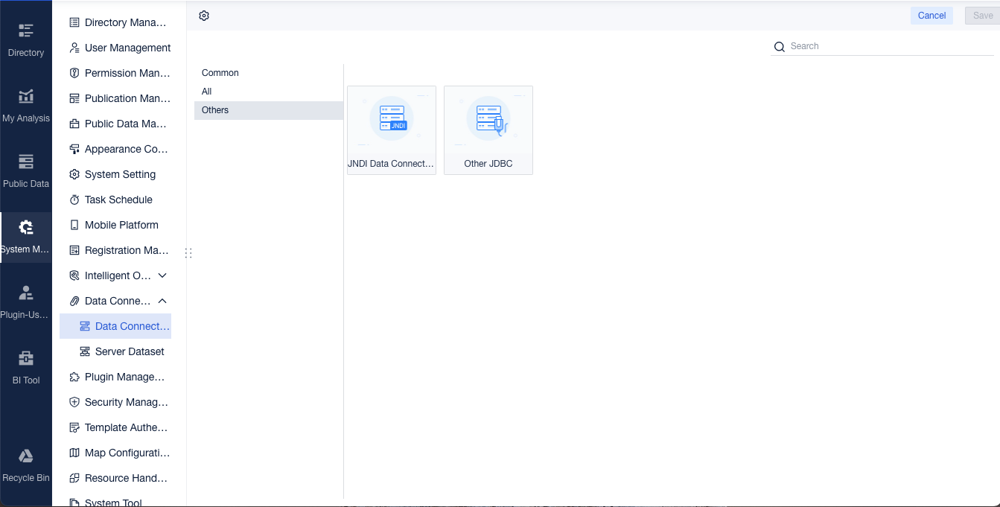

**Step 7**, On the configuration page, first enter the name of the data connection. Then, select "Custom" in the [Driver] option and choose the configured driver from the drop-down list (e.g., `com.taosdata.jdbc.ws.WebSocketDriver (tdengine-websocket)`). After that, configure the "Data Connection URL" (e.g., `jdbc:TAOS-WS://localhost:6041/power?user=root&password=taosdata&fineBIDialect=mysql`). Once the settings are completed, click [Test Connection] in the top-right corner to test the connection. After the verification is successful, click [Save] to finish the configuration.

:::tip
`fineBIDialect=mysql` The meaning of this setting is to adopt the SQL dialect rules of the MySQL database. Simply put, it tells FineBI to parse and execute relevant queries and operations in the specific way that the MySQL database handles SQL statements.
:::

## Data Analysis

### Data preparation

**Step 1**, Click [Public Data]. On the right - hand page, click [New Folder] to create a folder (e.g., TDengine). Then, click the [+] button on the right side of the folder to create a "Database Table" dataset or an "SQL Dataset".

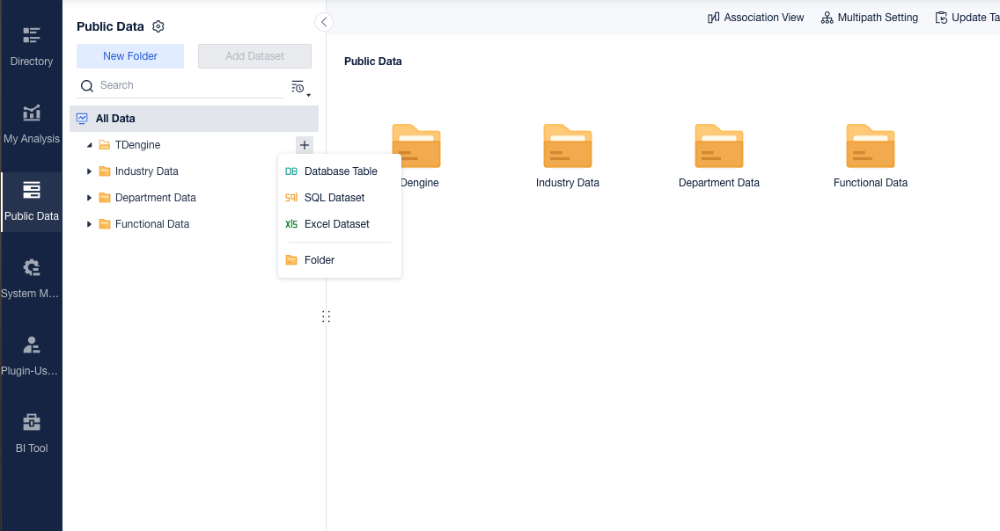

**Step 2**, Click "Database Table" to open the database table selection page. In the "Data Connection" section on the left, select the previously created connection. Then, all the tables in the database of the current connection will be displayed on the right. Select the table you need to load (e.g., meters), and click [OK]. The data in the meters table will then be displayed.

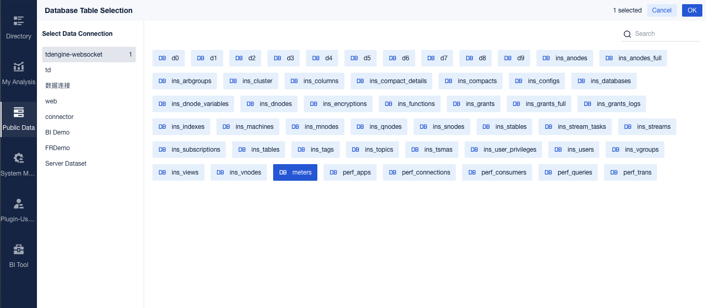

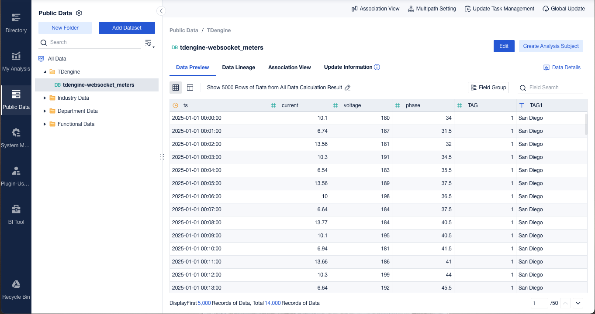

**Step 3**, Click "SQL Dataset" to open the configuration page for the SQL dataset. First, enter the table name (used for display on the FineBI page). Then, select the previously created connection from the drop-down list of "Data from Data Connection". After that, enter the SQL statement and click "Preview" to view the query results. Finally, click [OK] to successfully create the SQL dataset.

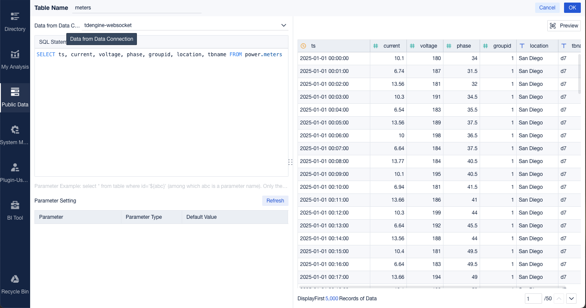

### Smart Meter Example

**Step 1**, Click [My Analysis]. On the right-hand page, click [New Folder] to create a folder (for example, `TDengine`). Then, click the [+] button on the right side of the folder to create an "Analysis Subject".

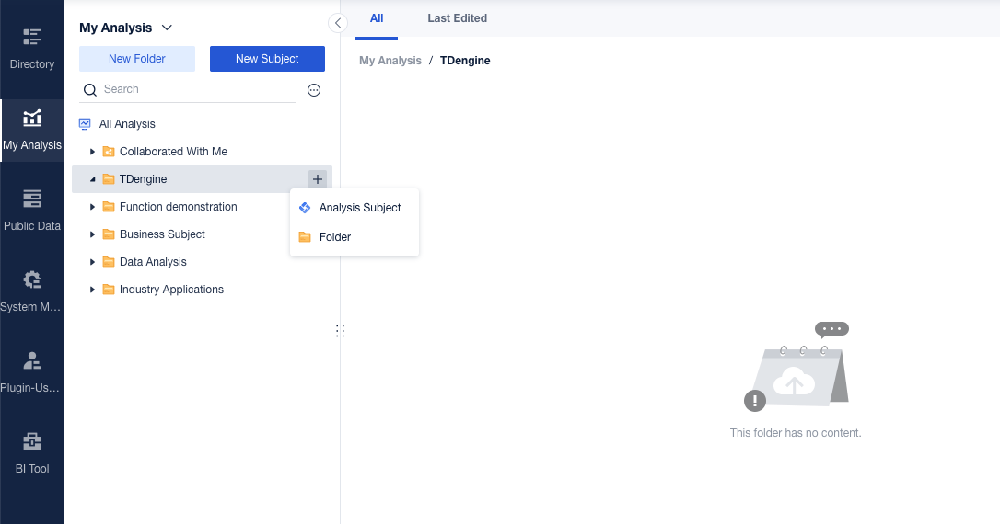

**Step 2**, On the analysis subject page, select the dataset (for example, `meters`) and then click the [OK] button to complete the association of the dataset.

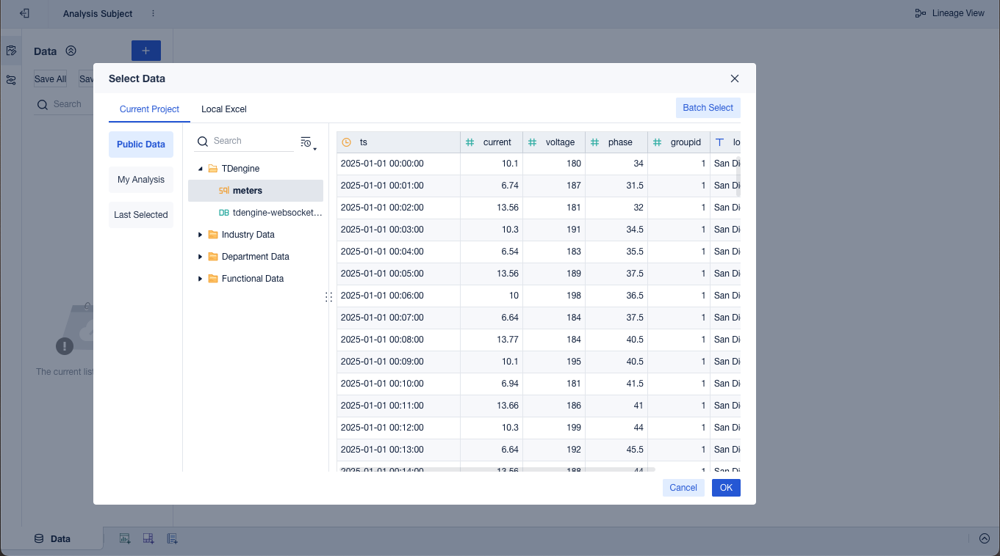

**Step 3**, Click the [Component] tab at the bottom of the analysis subject page to open the chart configuration page. Drag the fields to the horizontal axis or the vertical axis, and then the chart will be displayed.

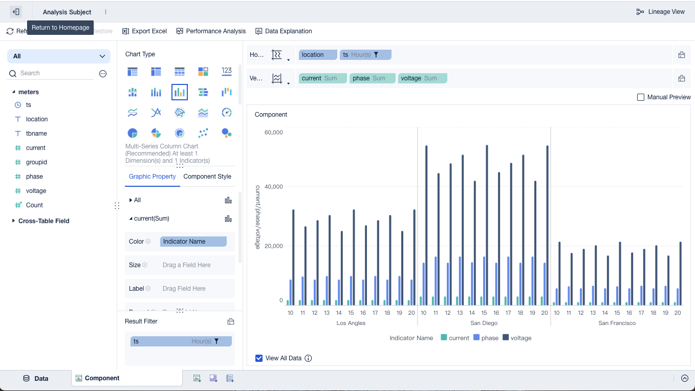
