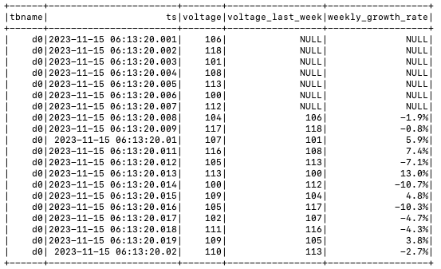

[Apache Spark](https://spark.apache.org/) is an open - source big data processing engine. Based on in - memory computing, it can be applied in various scenarios such as batch processing, stream processing, machine learning, and graph computing. It supports the MapReduce computing model and a rich variety of computing operators and functions, boasting powerful distributed processing and computing capabilities for extremely large - scale data.

By using the [TDengine Java Connector](../../../tdengine-reference/client-libraries/java), Spark can rapidly read TDengine data. Leveraging the powerful Spark engine, the data processing and computing capabilities of TDengine can be expanded. Meanwhile, through it, Spark can also write data into TDengine and subscribe to data from TDengine.

## Prerequisites

Prepare the following environments:

- TDengine 3.3.6.0 and above version is installed and running normally (both Enterprise and Community versions are available).
- taosAdapter is running normally, refer to [taosAdapter Reference](../../../tdengine-reference/components/taosadapter/).
- Spark 3.3.2 and above version ([Spark Down](https://spark.apache.org/downloads.html)).
- JDBC driver 3.6.2 and above version. Download from [maven.org](https://central.sonatype.com/artifact/com.taosdata.jdbc/taos-jdbcdriver).

## Configure Data Source

Connect to the TDengine data source via JDBC WebSocket. The connection URL format is:

``` sql
jdbc:TAOS-WS://[host_name]:[port]/[database_name]?[user={user}|&password={password}]
```

For detailed parameters, see: [URL Parameter](../../../tdengine-reference/client-libraries/java/#url-specification).

Set driverClass  to "com.taosdata.jdbc.ws.WebSocketDriver".

The following example creates a Spark instance and connects to the local TDengine service:

``` java
// create spark instance
SparkSession spark = SparkSession.builder()
    .appName("appSparkTest")
    .master("local[*]")
    .getOrCreate();

// connect TDengine and create reader
String url     = "jdbc:TAOS-WS://localhost:6041/?user=root&password=taosdata";
String driver  = "com.taosdata.jdbc.ws.WebSocketDriver";
DataFrameReader dataFrameReader = spark.read()
    .format("jdbc")
    .option("url", url)
    .option("driver", driver);

```

## Data Interaction

When accessing data, it is necessary to register the TDengine dialect. The dialect mainly deals with backticks. The data - type mapping is the same as that of JDBC and requires no additional processing. see: [JDBC DataType Map](../../../tdengine-reference/client-libraries/java/#data-type-mapping)

The following takes a Spark task written in the JAVA language and submitted for execution via `spark-submit` as an example to introduce data access. The complete example code is attached later.

### Data Writing

Data writing uses parameter binding and is accomplished in three steps:

1. Create a Connection.

    ``` java
      // create connect
      String url = "jdbc:TAOS-WS://localhost:6041/?user=root&password=taosdata";
      Connection connection = DriverManager.getConnection(url);
    ```

2. Bind Data and Submit.  
  The following example directly writes to a supertable and uses the batch - binding method to enhance writing efficiency.

    ``` java
    int childTb    = 1;
    int insertRows = 21;
    String sql = "INSERT INTO test.meters(tbname, groupid, location, ts, current, voltage, phase) " +
        "VALUES (?,?,?,?,?,?,?)";
    System.out.printf("prepare sql:%s\n", sql);
    // prepare
    PreparedStatement preparedStatement = connection.prepareStatement(sql);

    // write
    for (int i = 0; i < childTb; i++ ) {
        for (int j = 0; j < insertRows; j++) {
            float current = (float)(10  + rand.nextInt(100) * 0.01);
            float phase   = (float)(1   + rand.nextInt(100) * 0.0001);
            int   voltage = (int)  (210 + rand.nextInt(20));

            preparedStatement.setString   (1, String.format("d%d", i));        // tbname
            preparedStatement.setInt      (2, i);                              // groupid
            preparedStatement.setString   (3, String.format("location%d", i)); // location

            preparedStatement.setTimestamp(4, new Timestamp(ts + j));
            preparedStatement.setFloat    (5, current);
            preparedStatement.setInt      (6, voltage);
            preparedStatement.setFloat    (7, phase);
            // add batch
            preparedStatement.addBatch();
        }
    }

    // submit
    preparedStatement.executeBatch();

    // close statement
    preparedStatement.close();

    ```

3. Close the Connection.

    ``` java
    // close
    connection.close();
    ```

[Example Source Code](https://github.com/taosdata/tdengine-eco/blob/main/spark/src/main/java/com/taosdata/java/DemoWrite.java)

### Data Reading

Data reading is achieved through table mapping and is completed in four steps:

1. Create a Spark Interaction Instance.

    ``` java
    // create connect
    SparkSession spark = SparkSession.builder()
        .appName("appSparkTest")
        .master("local[*]")
        .getOrCreate();
    ```

2. Create a Data Reader.

    ``` java
    // create reader
    String url = "jdbc:TAOS-WS://localhost:6041/?user=root&password=taosdata";
    int    timeout  = 60; // seconds
    DataFrameReader reader = spark.read()
        .format("jdbc") 
        .option("url", url)
        .option("driver", driver)
        .option("queryTimeout", timeout);

    ```

3. Map the Table and Display the Data in the Table.

    ``` java
    // map table
    String dbtable = "test.meters";
    Dataset<Row> df = reader.option("dbtable", dbtable).load();
    // show
    df.show(Integer.MAX_VALUE, 40, false);
    df.close()
    ```

4. Close the Interaction.

    ``` java
    spark.stop();
    ```

[Example Source Code](https://github.com/taosdata/tdengine-eco/blob/main/spark/src/main/java/com/taosdata/java/DemoRead.java)

### Data Subscription

Data subscription uses the JDBC standard data - subscription method and is completed in four steps:

1. Create a Spark Interaction Instance.

    ``` java
    SparkSession spark = SparkSession.builder()
        .appName("appSparkTest")
        .master("local[*]")
        .getOrCreate();
    ```

2. Create a Consumer.

    ``` java
    // create consumer
    TaosConsumer<ResultBean> consumer = getConsumer();

    // getConsumer
    public static TaosConsumer<ResultBean> getConsumer() throws Exception {
        // property
        String cls        = "com.taosdata.java.DemoSubscribe$ResultDeserializer";
        Properties config = new Properties();
        config.setProperty("td.connect.type",             "ws");
        config.setProperty("bootstrap.servers",           "localhost:6041");
        config.setProperty("auto.offset.reset",           "earliest");
        config.setProperty("msg.with.table.name",         "true");
        config.setProperty("enable.auto.commit",          "true");
        config.setProperty("auto.commit.interval.ms",     "1000");
        config.setProperty("group.id",                    "group1");
        config.setProperty("client.id",                   "client1");
        config.setProperty("td.connect.user",             "root");
        config.setProperty("td.connect.pass",             "taosdata");
        config.setProperty("value.deserializer",          cls);
        config.setProperty("value.deserializer.encoding", "UTF-8");

        try {
            // new consumer
            TaosConsumer<ResultBean> consumer= new TaosConsumer<>(config);
            System.out.printf("Create consumer successfully, host: %s, groupId: %s, clientId: %s%n",
                    config.getProperty("bootstrap.servers"),
                    config.getProperty("group.id"),
                    config.getProperty("client.id"));
            return consumer;
        } catch (Exception ex) {
            // please refer to the JDBC specifications for detailed exceptions info
            System.out.printf("Failed to create websocket consumer, " + 
                    "host: %s, groupId: %s, clientId: %s, ErrMessage: %s%n",
                    config.getProperty("bootstrap.servers"),
                    config.getProperty("group.id"),
                    config.getProperty("client.id"),
                    ex.getMessage());
            // Print stack trace for context in examples. Use logging in production.
            ex.printStackTrace();
            throw ex;
        }
    }  
    ```

3. Subscribe to the Topic, Consume the Data, and Display It in Spark.

    ``` java
    // poll
    pollExample(spark, consumer);

    // pollExample
    public static void pollExample(SparkSession spark, TaosConsumer<ResultBean> consumer) 
                                throws SQLException, JsonProcessingException {
        List<String> topics = Collections.singletonList("topic_meters");
        List<Row> data = new ArrayList<>();

        //
        // obtain data
        //
        try {
            // subscribe  topics
            consumer.subscribe(topics);
            System.out.println("Subscribe topics successfully.");
            for (int i = 0; i < 100; i++) {
                // poll data
                ConsumerRecords<ResultBean> records = consumer.poll(Duration.ofMillis(100));
                for (ConsumerRecord<ResultBean> record : records) {
                    ResultBean bean = record.value();
                    // Add your data processing logic here
                    // covert bean to row
                    data.add(RowFactory.create(
                        bean.getTs(),
                        bean.getCurrent(),
                        bean.getVoltage(),
                        bean.getPhase(),
                        bean.getGroupid(),
                        bean.getLocation()
                    ));
                    
                }
            }

        } catch (Exception ex) {
            // catch except
            System.out.printf("Failed to poll data, topic: %s, ErrMessage: %s%n",
                    topics.get(0),
                    ex.getMessage());
            ex.printStackTrace();
        }

        //
        // put to spark dataframe and show
        //
        StructType schema = generateSchema();
        Dataset<Row> df   = spark.createDataFrame(data, schema);

        // show
        System.out.println("------------- below is subscribe data --------------");
        df.show(Integer.MAX_VALUE, 40, false);
    }
    ```

4. Unsubscribe and Release Resources.

    ``` java
    // close
    consumer.unsubscribe();
    consumer.close();
    // stop
    spark.stop();
    ```

[Example Source Code](https://github.com/taosdata/tdengine-eco/blob/main/spark/src/main/java/com/taosdata/java/DemoSubscribe.java)

## Data Analysis

### Scenario Introduction

The example scenario involves a smart electricity meter used in a household. The data is stored in TDengine, and the goal is to analyze the voltage change of a single smart electricity meter's weekly electricity consumption.

### Data preparation

Generate a supertable and a child table. One piece of data is generated daily, and a total of 21 pieces of data for three weeks are generated. The voltage data randomly varies within the range of 210 - 230.

### Analyze the Weekly Voltage Change Rate

The LAG() function in Spark is used to obtain data from a previous row relative to the current row. This example uses this function to analyze the weekly voltage change rate.

1. Obtain data through TDengine SQL and create a Spark View. See createSparkView() for details.

    ``` sql
    SELECT tbname,* FROM test.meters WHERE tbname='d0'
    ```

2. Use Spark SQL to query the data in the Spark View and calculate the weekly voltage change rate. The SQL is as follows:

    ``` sql
    SELECT tbname, ts, voltage,
        (LAG(voltage, 7) OVER (ORDER BY tbname)) AS voltage_last_week, 
        "CONCAT(ROUND(((voltage - (LAG(voltage, 7) OVER (ORDER BY tbname))) / (LAG(voltage, 7)
        OVER (ORDER BY tbname)) * 100), 1),'%') AS weekly_growth_rate ",
        FROM sparkMeters
    ```

3. Output the analysis results, as shown in the following table:

    

After Spark accesses the TDengine data source, it can further support complex data - processing functions such as cross - database analysis, intersection/union/difference operations of datasets, sub - query filtering with the WHERE clause, and normal - column JOIN.

## Example Source Code

The example is written in the JAVA language. For compilation and running instructions, refer to the README in the example source - code directory.

[Complete Example Source Code](https://github.com/taosdata/tdengine-eco/tree/main/spark)
