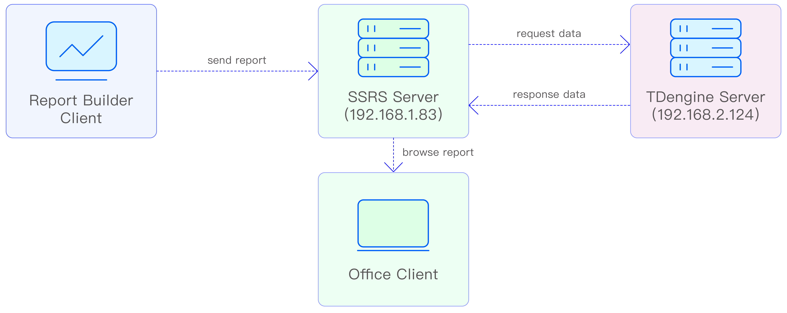

[SQL Server Reporting Services](https://learn.microsoft.com/en-us/sql/reporting-services/create-deploy-and-manage-mobile-and-paginated-reports?view=sql-server-ver16) (SSRS), a built-in component of the Microsoft SQL Server database platform, provides powerful support for enterprise-class report creation, viewing, and management. It provides powerful support for enterprise-level report creation, viewing, and management. SSRS is better suited for traditional fixed-format reports than Power BI, another Microsoft tool for flexible reporting.

SSRS seamlessly connects to TDengine, which supports standard ODBC interfaces. TDengine's high-performance data storage and query capabilities provide a real-time data source for the SSRS reporting engine, while the SSRS visual report generator function transforms time-series data such as IoT and financial data into intuitive business insights to meet the needs of enterprises for a cross-platform reporting solution. The SSRS visual report generation function transforms time-series data from TDengine, such as IoT and finance, into intuitive business insights, meeting the enterprise's need for a cross-platform reporting solution, while safeguarding the security and stability of data interactions through a standardized interface, providing solid technical support for the construction of modern data-driven organizations.

## Prerequisites

This example requires the preparation of two servers and two clients to build the SSRS example environment, network deployment diagram:
  


Prepare the environment as follows:

### TDengine Server

- There is no restriction on the OS.
- TDengine 3.3.3.0 or above server version is installed (both TSDB-Enterprise and TSDB-OSS Edition are available).
- taosAdapter is running normally, refer to [taosAdapter](../../../tdengine-reference/components/taosadapter/).
- Server IP: 192.168.2.124 .
- Providing WebSocket service: port 6041 (default).

### SSRS Server

- Requires Windows OS.
- TDengine 3.3.3.0 or above Windows client version installed (TDengine ODBC driver installed by default).
- Microsoft SQL Server 2022 is installed and the database service is running normally, [download and install](https://www.microsoft.com/en-us/sql-server/sql-server-downloads).
- Install Microsoft SQL Server 2022 Reporting Service and the reporting service is running properly, [download and install](https://learn.microsoft.com/en-us/sql/reporting-services/install-windows/install-reporting-services?view=sql-server-ver16).
- Configure the Microsoft SQL Server 2022 Reporting Service to use an IP address for external services.
  
  

   Record the "Report Server Web Service URLs" address in the above figure, which will be used in the following steps.

### Report Builder Client

- Requires Windows OS.
- TDengine 3.3.3.0 or above Windows client version installed (TDengine ODBC driver installed by default).
- Install Microsoft Report Builder (32-bit), which provides report development services, [download and install](https://www.microsoft.com/en-us/download/details.aspx?id=53613).
- Configure Microsoft Report Builder to report the report server address, you should fill in the "Report Server Web Service URLs" address recorded earlier.
  
  

### Office Client

- There is no restriction on the OS.
- Network requirements are to be able to connect to an SSRS server.
- Install any browser software.

## Configure Data Source

SSRS accesses the TDengine data source through ODBC, and the configuration steps are as follows:

1. Configure ODBC data source on SSRS Server.
   Open ODBC Data Source Manager (64-bit), select "System DSN" -> "Add..." -> "TDengine"->"Finish", the configuration window will pop up as follows:

   

   - DSN: fill in "TDengine".
   - Connect type: select "WebSocket".
   - URL: `http://192.168.2.124:6041`.
   - User/Password: Fill in the TDengine database user name/password, use the default if you don't fill in the fields.

   Click "Test Connection", successful connection means the configuration is correct, click "OK" to save the configuration.

2. Configure the ODBC data source on Report Builder Client.  
   Open ODBC Data Source Manager (32-bit), select "System DSN" -> "Add..." -> "TDengine" -> "Finish", the ODBC Data Source Configuration window will pop up, please fill in the same content as the previous step.

   Click "Test Connection", successful connection means that the configuration is correct, click "OK" to save the configuration.

3. Create data source connection on Report Builder Client.
   Start Report Builder, right-click on the "Data Source" item in the left area and click "Add Data Source..." menu, as shown in Figure:

   

   - Name: fill in the name of the data source.
   - Data Source Method: Select the second item "Use a connection embedded in my report".
   - Select Connection type: Select "ODBC" data source.
   - Connection string: Click the "Build..." button next to it. button next to "Build..." and fill in the fields as shown above.

   Click "Test Connection", successful connection means the configuration is correct, click "OK" to save the configuration.

## Data Analysis

### Scenario Introduction

There are 500 smart meters in a community, and the data is stored in the TDengine database. The electric power company asks the data operation department to create a report that can browse the last reported voltage and current values of each smart meter in the community in a page by page to analyze the electricity consumption of the residents, and at the same time, it is requested that the report can be browsed by logging in to any of the office computers in the company.

The developer uses the SSRS reporting service provided by Microsoft to accomplish this task. The report is created using Report Builder and uploaded to the report server for viewing by the relevant personnel.

### Data Preparation

Create a super meter with 500 sub-meters, each sub-meter represents a smart meter, and generates voltage data that fluctuates between 198 and 235, and current data that fluctuates between 10A and 30A.

### Create Report

1. Open Report Builder to start creating a report.
2. Create a new dataset.  
   In the left area, "DataSource" -> "DataSource1" -> "Add Dataset...".

   

   - Name: Fill in the dataset name.
   - Dataset method: choose the second item "Use a dataset embedded im my report".
   - Data source: choose "DataSource1" created earlier.
   - Query type: choose "text" type query, fill in the following query analysis SQL:

   ```sql
   SELECT 
      tbname        as DeviceID, 
      last(ts)      as last_ts, 
      last(current) as last_current, 
      last(voltage) as last_voltage 
   FROM test.meters 
   GROUP BY tbname 
   ORDER BY tbname;
   ```

3. Create the report page.
   Menu "Insert" -> "Table" -> "Insert Table", insert an empty table, use the mouse to drag the data columns of "DataSet1" to the right side of the report.
   "DataSet1" in the data columns with the mouse dragged to the right side of the report production area placed on the columns they want to show, as shown:

   

4. Preview.
   Click "Home" -> "Run" button to preview the report.

   

5. Exit the preview.  
   Click the first icon "Design" on the left side of the toolbar to close the preview and go back to the design interface to continue designing.

### Send Report

1. Save the report to the server.  
   Click menu "File" -> "Save", as shown in the figure:

   

2. The report data source connection component is published to the server.  
   Click menu "File" -> "Publish Report Parts".

   

   Selecting the first item "Pubsh all report parts with default settings" will send the report to the server with the data source configuration.

### Browse Report

After the report is sent to the server, the report is shared and can be accessed by any client through a browser to browse the report data.

1. View the report viewing address.  
   The report viewing address is in the SSRS server configuration, as follows:

   

2. Enter the access authorization.  
   When the client accesses the report data for the first time, an authorization window will pop up asking for login, enter the report server operating system login account.

   

   After the account is entered successfully, the following page will appear, and you can see the report "meters" saved and uploaded earlier.

   

3. Paging through reports.  
   Click "meters", it will display the latest collected data of all smart meters in the district in pages.

   

### Manage Report

   To manage reports on SSRS server, you can refer to [Microsoft official document](https://learn.microsoft.com/en-us/sql/reporting-services/report-builder/finding-viewing-and-managing-reports-report-builder-and-ssrs?view=sql-server-ver16).

In the above process, we have used SSRS to develop a simple report creation, distribution and browsing system based on TDengine data source, and more rich reports are still waiting for your further development.
