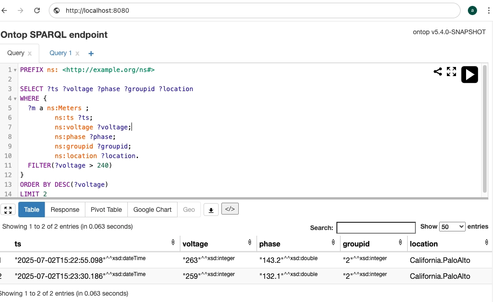

[Ontop](https://ontop-vkg.org/) is an open-source virtual knowledge graph system developed by the KRDB research group at the Free University of Bozen-Bolzano, Italy. It dynamically transforms relational database content into knowledge graphs without requiring data migration from original sources.

Data is queried through SPARQL (W3C-standardized RDF query language) interfaces and results are converted to RDF format.

Supports multiple databases including MySQL, PostgreSQL, Oracle, SQL Server, SQLite, and **TDengine**.

## Prerequisites

Ontop connects to TDengine data sources via the [TDengine Java Connector](../../../reference/connector/java/). Prepare the following environment:

- TDengine cluster version 3.3.6.0 or higher deployed and running (both Enterprise and Community editions supported).
- taosAdapter running normally, see [taosAdapter Reference Manual](../../../reference/components/taosadapter) for details.
- Ontop version 5.4.0 or higher, [download](https://github.com/ontop/ontop).
- JDBC driver version 3.6.0 or higher, [download](https://mvnrepository.com/artifact/com.taosdata.jdbc/taos-jdbcdriver).

## Configuring Data Source

Configuring TDengine data source in Ontop requires the following steps:

### Install JDBC Driver

Download the JDBC DIST driver package (`.jar` file) and place it in the `jdbc/` directory of the Ontop main program.

### Configure JDBC Driver

Configure JDBC connection information in Ontop's `.properties` file:

```sql
jdbc.url = jdbc:TAOS-WS://[host]:[port]/[database]
jdbc.user = [username]
jdbc.password = [password]
jdbc.driver = com.taosdata.jdbc.ws.WebSocketDriver
```

For URL parameter details, refer to: [TDengine URL Specification](../../../reference/connector/java/#url-specification).

### Configure Table Mapping

Define the mapping relationship between TDengine and Ontop in the `.obda` file (using smart meter scenario as example):

```properties
[PrefixDeclaration]
:   http://example.org/tde
ns: http://example.org/ns#

[MappingDeclaration] @collection [[
  mappingId meters-mapping
  target ns:{ts} a ns:Meters ; ns:ts {ts} ; ns:voltage {voltage}; ns:phase {phase}; ns:groupid {groupid}; ns:location {location}^^xsd:string .
  source SELECT ts, voltage, phase, groupid, location  from test.meters
]]
```

**Format Description:**

| Key Field | Description |
|:----------|:------------|
| mappingId | Mapping ID, uniquely identifies the mapping relationship |
| source    | TDengine SQL query statement (supports complex queries) |  
| target    | Field mapping relationship (uses default conversion rules when type not specified) |

**You can specify mapping data types in the target. If not specified, the following conversion rules apply:**

| TDengine JDBC Data Type | Ontop Data Type |
|:------------------------|:----------------|
| java.sql.Timestamp      | xsd:datetime    |  
| java.lang.Boolean       | xsd:boolean     |
| java.lang.Byte          | xsd:byte        |
| java.lang.Short         | xsd:short       |
| java.lang.Integer       | xsd:int         |
| java.lang.Long          | xsd:long        |
| java.math.BigInteger    | xsd:nonNegativeInteger |
| java.lang.Float         | xsd:float       |
| java.lang.Double        | xsd:double      |
| byte[]                  | xsd:base64Binary|
| java.lang.String        | xsd:string      |
| java.math.BigDecimal    | xsd:decimal     |

For complete `.obda` file format documentation, refer to [Ontop OBDA Documentation](https://ontop-vkg.org/guide/advanced/mapping-language.html).

### Test Connection

Start the Ontop endpoint service to verify configuration:

```bash
ontop endpoint -p db.properties -m db.obda --port 8080
```

Access `http://localhost:8080`. If the SPARQL query interface appears, the configuration is successful.

## Data Analysis

### Scenario Overview

Smart meter data from a residential community is stored in TDengine database. Using Ontop to transform TDengine smart meter data into a virtual knowledge graph, query devices with voltage exceeding 240V through SPARQL interface to identify high-load equipment.

### Data Preparation

Generate simulation data using taosBenchmark:

```bash
# Generate 100 devices, 1000 records each
taosBenchmark -t 100 -n 1000 -y
```

### Configuration Files

**db.properties** (connection configuration):

```sql
jdbc.url=jdbc:TAOS-WS://localhost:6041/test
jdbc.user=root
jdbc.password=taosdata
jdbc.driver=com.taosdata.jdbc.ws.WebSocketDriver   
```

**db.obda** (mapping configuration):  
Reuse the example content from the [Configure Table Mapping](#configure-table-mapping) section.

### Analyze Meter Load

1. Create SPARQL query statement.  
   Query smart meter devices with voltage exceeding 240V, display top 2 results ordered by voltage descending:

   ```sparql
    PREFIX ns: <http://example.org/ns#>

    SELECT ?ts ?voltage ?phase ?groupid ?location
    WHERE {
        ?m a ns:Meters ;
                ns:ts ?ts;
                ns:voltage ?voltage;
                ns:phase ?phase;         
                ns:groupid ?groupid;
                ns:location ?location.
        FILTER(?voltage > 240)
    }
    ORDER BY DESC(?voltage)
    LIMIT 2
   ```

   [SPARQL Syntax Reference](https://www.w3.org/TR/sparql11-query/)

2. Enter the above statement in the SPARQL query interface, click the "Run" button. Query results are shown below:

   

3. Results are returned in SPARQL JSON format, containing meter collection timestamps, voltage readings, phase, group ID, and device location information.

   ```json
   {
    "head" : {
        "vars" : [
        "ts",
        "voltage",
        "phase",
        "groupid",
        "location"
        ]
   },
    "results" : {
        "bindings" : [
        {
            "ts" : {
            "datatype" : "http://www.w3.org/2001/XMLSchema#dateTime",
            "type" : "literal",
            "value" : "2025-07-02T15:22:55.098"
            },
            "voltage" : {
            "datatype" : "http://www.w3.org/2001/XMLSchema#integer",
            "type" : "literal",
            "value" : "263"
            },
            "phase" : {
            "datatype" : "http://www.w3.org/2001/XMLSchema#double",
            "type" : "literal",
            "value" : "143.2"
            },
            "groupid" : {
            "datatype" : "http://www.w3.org/2001/XMLSchema#integer",
            "type" : "literal",
            "value" : "2"
            },
            "location" : {
            "type" : "literal",
            "value" : "California.PaloAlto"
            }
        },
        {
            "ts" : {
            "datatype" : "http://www.w3.org/2001/XMLSchema#dateTime",
            "type" : "literal",
            "value" : "2025-07-02T15:23:30.186"
            },
            "voltage" : {
            "datatype" : "http://www.w3.org/2001/XMLSchema#integer",
            "type" : "literal",
            "value" : "259"
            },
            "phase" : {
            "datatype" : "http://www.w3.org/2001/XMLSchema#double",
            "type" : "literal",
            "value" : "132.1"
            },
            "groupid" : {
            "datatype" : "http://www.w3.org/2001/XMLSchema#integer",
            "type" : "literal",
            "value" : "2"
            },
            "location" : {
            "type" : "literal",
            "value" : "California.PaloAlto"
            }
        }
        ]
      }
   }
   ```

## Summary

Through TDengine and Ontop integration, this article demonstrates:

- Automatic conversion of time-series data to RDF, supporting SPARQL semantic queries.
- Unified data access interface compliant with W3C standards.
- Unlocking knowledge graph analysis and reasoning capabilities for industrial IoT.

This integration pioneers a new intelligent paradigm in the time-series database field. By combining the strong logical reasoning of knowledge graphs with the generalization capabilities of large language models, it provides intelligent analysis solutions with cognitive capabilities for complex IoT scenarios (such as device failure root cause analysis, energy efficiency optimization, etc.).