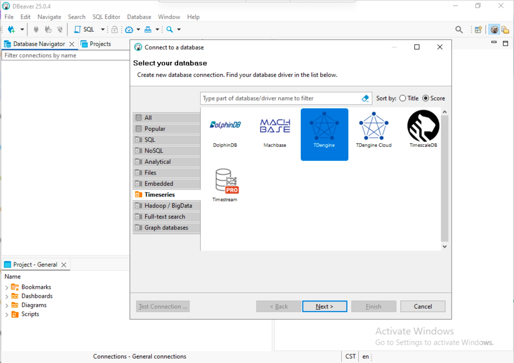
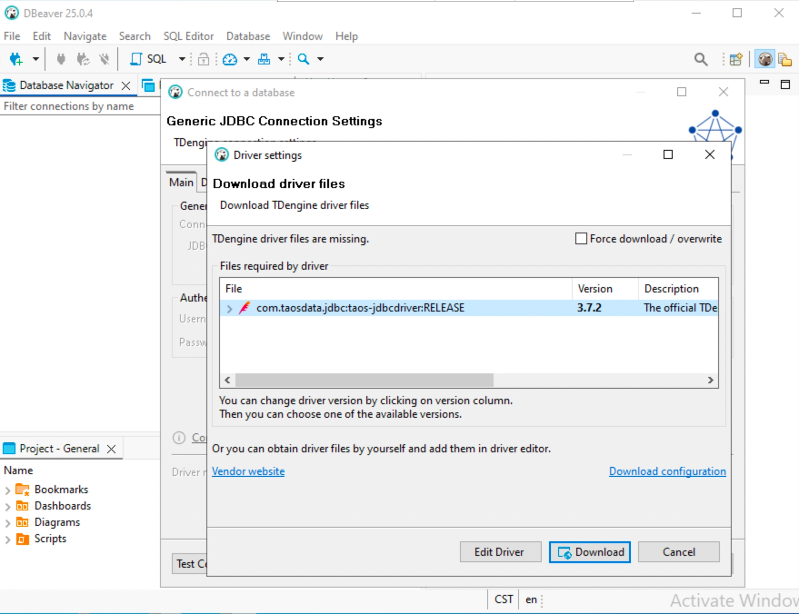
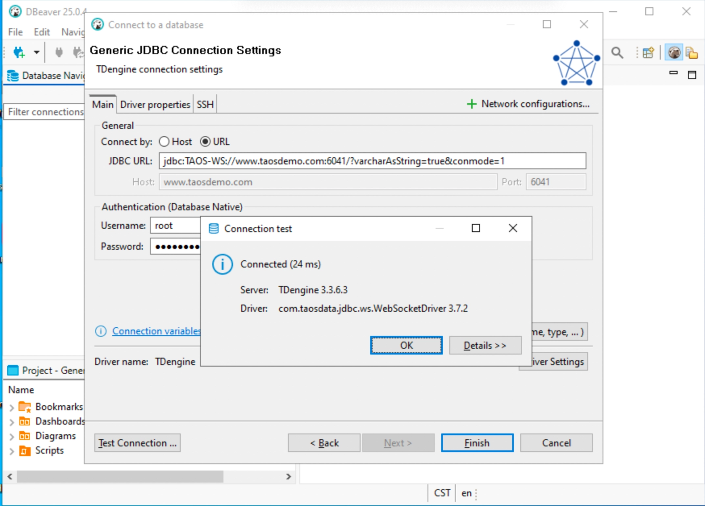
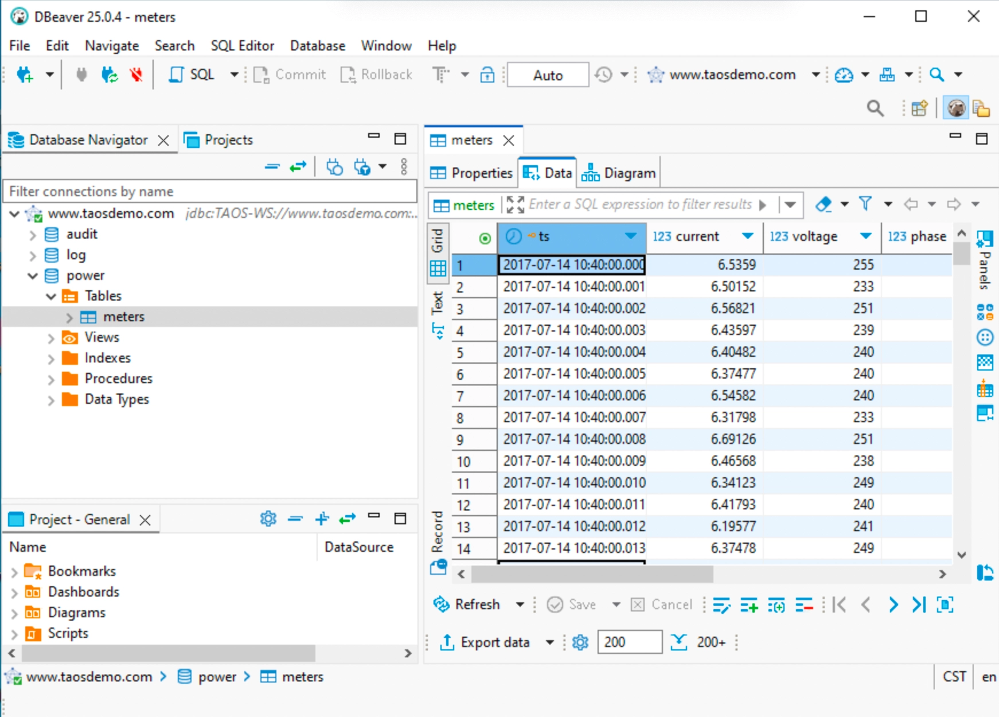
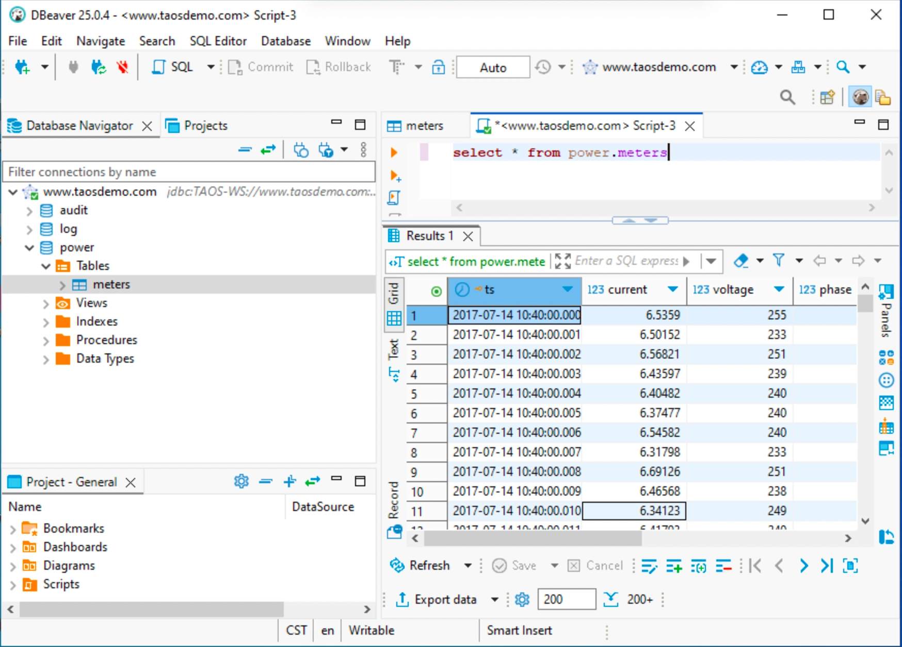

DBeaver is a popular cross-platform database management tool that facilitates data management for developers, database administrators, data analysts, and other users. Starting from version 23.1.1, DBeaver has built-in support for TDengine, accommodating both standalone TDengine clusters and TDengine Cloud.

## Prerequisites

To manage TDengine with DBeaver, the following preparations are necessary:

- Install DBeaver. DBeaver supports major operating systems, including Windows, macOS, and Linux. Please ensure to [download](https://dbeaver.io/download/) the installation package for the correct platform and version (23.1.1+). For detailed installation steps, refer to the [DBeaver official documentation](https://github.com/dbeaver/dbeaver/wiki/Installation).
- If using a standalone TDengine cluster, ensure that TDengine is running normally and that the taosAdapter is installed and functioning correctly. For specific details, refer to the [taosAdapter user manual](../../../tdengine-reference/components/taosadapter/).

## Using DBeaver to Access an On-Premises TDengine

1. Launch the DBeaver application, click the button or menu item to "Connect to Database," and select TDengine from the time series category.

 

2. Configure the TDengine connection by entering the host address, port number, username, and password. If TDengine is deployed on the local machine, you can simply enter the username and password; the default username is root, and the default password is taosdata. Click "Test Connection" to check the availability of the connection. If the TDengine Java connector is not installed on the local machine, DBeaver will prompt you to download it.

 

3. If the connection is successful, it will display as shown in the image below. If the connection fails, please check whether the TDengine service and taosAdapter are running correctly, and verify the host address, port number, username, and password.

 

4. Use DBeaver to select databases and tables to browse the data from the TDengine service.

 

5. You can also perform operations on TDengine data by executing SQL commands.

 
