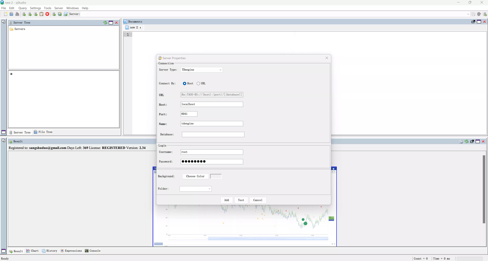
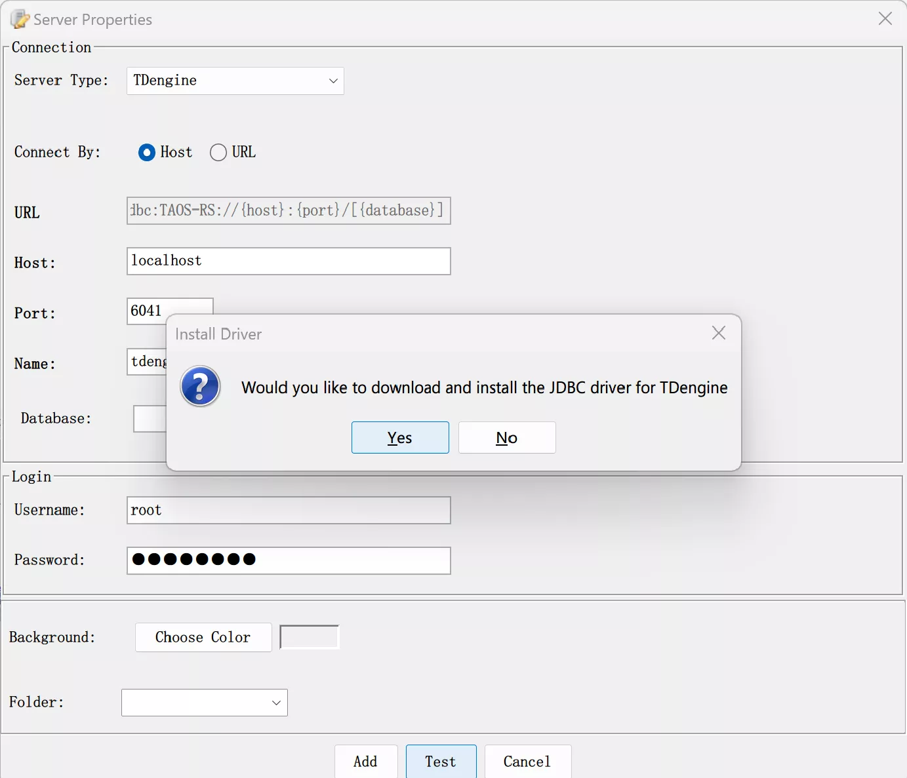
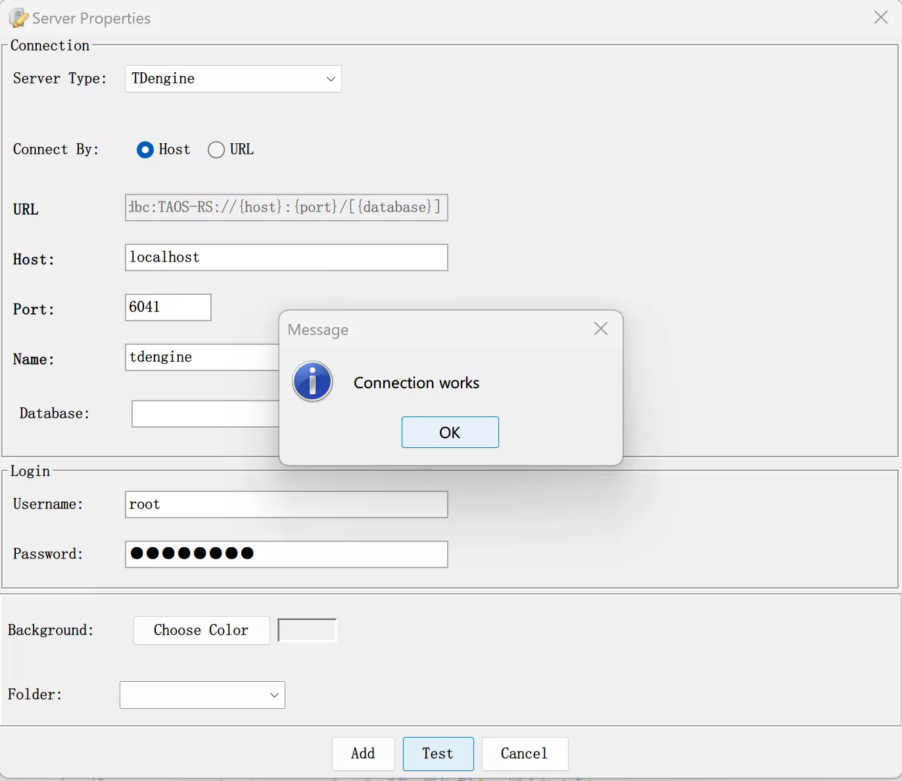
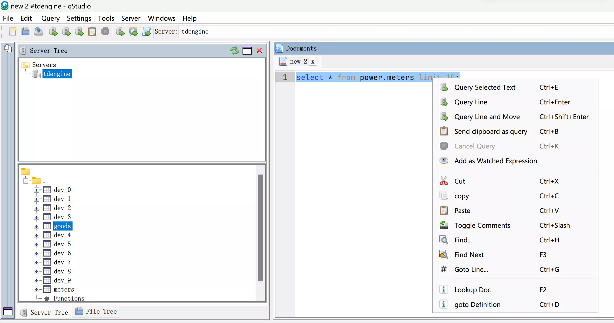

qStudio is a free multi-platform SQL data analysis tool that allows users to easily browse tables, variables, functions, and configuration settings in a database. The latest version of qStudio has built-in support for TDengine.

## Prerequisites

To connect qStudio to TDengine, the following preparations are necessary:

- Install qStudio. qStudio supports major operating systems, including Windows, macOS, and Linux. Please ensure to [download](https://www.timestored.com/qstudio/download/) the installation package for the correct platform.
- Install a TDengine instance. Ensure that TDengine is running normally and that the taosAdapter is installed and functioning correctly. For specific details, refer to the [taosAdapter user manual](../../../tdengine-reference/components/taosadapter/).

## Using qStudio to Connect to TDengine

1. Launch the qStudio application, select “Server” from the menu, and then choose “Add Server...”. In the Server Type dropdown, select TDengine.

 

2. Configure the TDengine connection by entering the host address, port number, username, and password. If TDengine is deployed on the local machine, you can simply enter the username and password; the default username is root, and the default password is taosdata. Click “Test” to check the availability of the connection. If the TDengine Java connector is not installed on the local machine, qStudio will prompt you to download it.

 

3. If the connection is successful, it will display as shown in the image below. If the connection fails, please check whether the TDengine service and taosAdapter are running correctly and verify the host address, port number, username, and password.

 

4. Use qStudio to select databases and tables to browse the data from the TDengine service.

 

5. You can also perform operations on TDengine data by executing SQL commands.

 

6. qStudio supports features such as charting data. Please refer to the [qStudio help documentation](https://www.timestored.com/qstudio/help).

 
