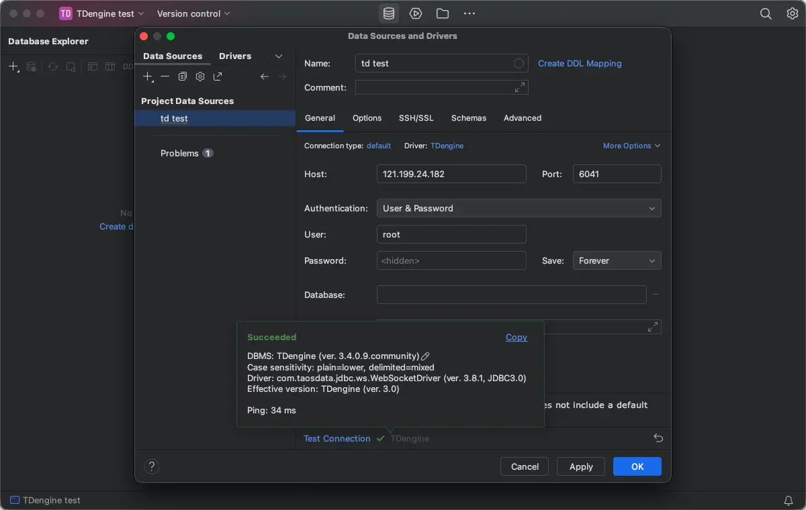
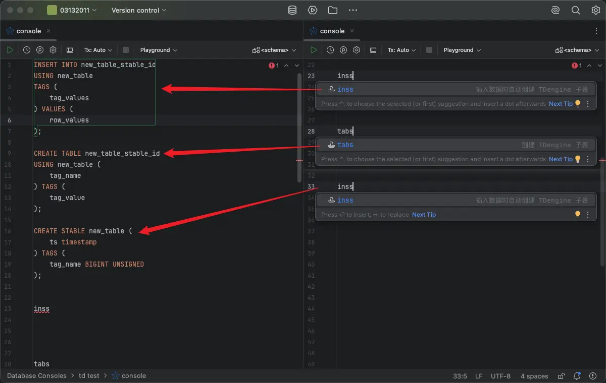

# JetBrains

TDengine Driver Integration provides TDengine data source setup, driver download, and SQL dialect enhancements for JetBrains IDEs, and supports JetBrains IDEs 2024.3 and later.

## Prerequisites

- Install [JetBrains IDEs](https://www.jetbrains.com/products/?lang=sql).
- Install the [TDengine Driver Integration](https://plugins.jetbrains.com/plugin/30538-tdengine-driver-integration) plugin.

## Install the Plugin

1. Open your JetBrains IDE.
2. Go to `Settings` -> `Plugins`.
3. Search for `TDengine Driver Integration`.
4. Install the plugin and restart the IDE.

## Connect to TDengine

1. Open the `Database` tool window.
2. Click `+` and choose `Data Source`.
3. Select `TDengine` from the data source list.
4. Download the built-in TDengine JDBC Driver as needed.
5. Configure the connection parameters and test the connection.

The plugin validates the following settings:

- JDBC Driver Class
- JDBC URL prefix
- Host
- Port
- Default database

## SQL Development Support

After installing the plugin, the TDengine SQL Console provides the following features:

- TDengine keyword completion
- TDengine function completion
- Function highlighting
- Function parameter info
- Function hover documentation
- Comments and basic syntax highlighting
- `SHOW CREATE DATABASE` / `SHOW CREATE TABLE` definition view
- Live Templates

