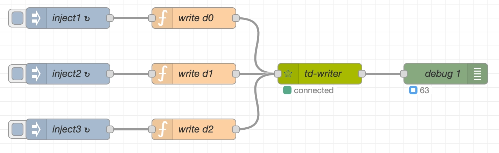

[Node-RED](https://nodered.org/) is an open-source visual programming tool developed by IBM based on Node.js. It enables users to assemble and connect various nodes via a graphical interface to create connections for IoT devices, APIs, and online services. It supports multiple protocols and is cross-platform, has an active community, and is ideal for event-driven application development in smart home, industrial automation, and other scenarios. Its main strengths are low-code and visual programming.

The deep integration between TDengine and Node-RED provides a comprehensive solution for industrial IoT scenarios. Through Node-RED's MQTT/OPC UA/Modbus protocol nodes, data from PLCs, sensors, and other devices can be collected with millisecond-level latency. Real-time queries in TDengine can trigger physical control actions such as relay operations and valve switching, enabling immediate command execution.

node-red-node-tdengine is the official plugin developed by TDengine for Node-RED. It is composed of two nodes:  
- **tdengine-operator**: Provides SQL execution capabilities for data writing/querying and metadata management.  
- **tdengine-consumer**: Offers data subscription and consumption capabilities from specified subscription servers and topics.

## Prerequisites

Prepare the following environment components:
- TDengine cluster version 3.3.2.0 or higher installed and running (Enterprise/Community/Cloud editions all supported).
- taosAdapter running (refer to [taosAdapter Reference Manual](../../../tdengine-reference/components/taosadapter/)).
- Node-RED version 3.0.0 or higher ([Node-RED Installation](https://nodered.org/docs/getting-started/)).
- Node.js connector version 3.1.8 or higher (download from [npmjs.com](https://www.npmjs.com/package/@tdengine/websocket)).
- node-red-node-tdengine plugin version 1.0.0 or higher (download from [npmjs.com](https://www.npmjs.com/package/node-red-node-tdengine)).

Component interaction diagram:  


## Configuring Data Source
Plugin data sources are configured in the node properties using the [Node.js connector](../../../tdengine-reference/client-libraries/node):

1. Start Node-RED service and access the Node-RED homepage in a browser.
2. Drag the tdengine-operator or tdengine-consumer node from the left node palette to the workspace canvas.
3. Double-click the node on the canvas to open property settings.
   - Connection format for tdengine-operator node: `ws://user:password@host:port`.
   - Connection format for tdengine-consumer node: `ws://host:port`.
   - Click the dictionary icon in the upper-right area for detailed documentation.
4. After configuration, click the "Deploy" button in the upper right. Green node status indicates successful connection.


## Usage Examples

### Scenario Preparation

#### Scenario Overview

A workshop has multiple smart power meters, each generating a data record every second. Data is stored in TDengine, with real-time calculations performed every minute showing:  
- Average current/voltage per meter.
- Power consumption.  
Alerts are triggered when current > 25A or voltage > 230V.

Implementation uses Node-RED + TDengine:  
- Inject + function nodes simulate devices. 
- tdengine-operator writes data.
- Real-time queries via tdengine-operator.
- Overload alerts via tdengine-consumer subscription.

Assumptions:  
- TDengine server: `www.example.com`.  
- WEBSOCKET port: 6041.  
- Default credentials.  
- Simulated devices: d0, d1, d2.  

#### Data Modeling
Use taos-CLI to manually create the data model:  
- Super table "meters".  
- Child tables d0, d1, d2.  

```sql
create database test;
create stable test.meters (ts timestamp, current float, voltage int, phase float) 
                     tags (groupid int, location varchar(24));
create table test.d0 using test.meters tags(1, 'workshop1');
create table test.d1 using test.meters tags(2, 'workshop1');
create table test.d2 using test.meters tags(2, 'workshop2');
```

### Business Processing

#### Data Collection
This example uses randomly generated numbers to simulate real device data. The tdengine-operator node is configured with TDengine data source connection information, writes data to TDengine, and uses the debug node to monitor the number of successfully written records displayed on the interface.

Steps:
- **Add Writer Node**
  1. Select the tdengine-operator node in the node palette and drag it to the canvas.
  2. Double-click the node to open property settings, fill in the name as 'td-writer', and click the "+" icon to the right of the database field.
  3. In the pop-up window:
     - Name: 'db-server'.
     - Connection type: "Connection string".
     - Input: 
     ```sql
     ws://root:taosdata@www.example.com:6041 
     ```
  4. Click "Add" and return.

- **Simulate Device Data**
  1. Select the 'function' node from the palette and drag it before 'td-writer' on the canvas.
  2. Double-click the node:
     - Name: 'write d0'.
     - Select “Function” tab and enter:
     ```javascript
      // Generate random values
      const current = Math.floor(Math.random() * (30 - 5 + 1)) + 5; // 5-30A
      const voltage = Math.floor(Math.random() * (240 - 198 + 1)) + 198; // 198-240V
      const phase = Math.floor(Math.random() * (3 - 1 + 1)) + 1; // 1-3
      
      // Create SQL
      msg.topic = `insert into test.d0 values (now, ${current}, ${voltage}, ${phase});`;
      
      return msg;
     ```
  3. Drag an "inject" node before 'write d0'.
  4. Configure the inject node:
     - Name: “inject1”.
     - Trigger: "Repeat".
     - Interval: 1 second.
  5. Repeat steps 1-4 for other devices (d1, d2).

- **Add Output Monitor**
  1. Drag a ‘debug’ node after 'td-writer'.
  2. Configure it:
     - Name: 'debug1'.
     - Node status: checked.
     - Select 'Message count' from the drop-down list.

After adding all nodes, connect them in sequence to form a pipeline. Click "Deploy" to publish changes. When running successfully:
- 'td-writer' turns green.
- 'debug1' shows data count.



Successful write output:
```json
{
  "topic": "insert into test.d1 values (now, 20, 203, 2);",
  "isQuery": false,
  "payload": {
    "affectRows": 1,
    "totalTime": 2,
    "timing": "961982"
  }
}
```

#### Data Query
The data query workflow consists of three nodes (inject/tdengine-operator/debug) designed to calculate the average current, voltage, and power consumption per minute for each smart meter.  
The inject node triggers the query request every minute. The results are sent to the downstream debug node, which displays the count of successful query executions.  

Steps:  
1. Drag an inject node to the canvas: 
   - Name: 'query'.
   - Set msg.topic to:  
   
   ``` sql
   select tbname, avg(current), avg(voltage), sum(p) 
   from ( select tbname,current,voltage,current*voltage/60 as p from test.meters 
          where  ts > now-60s partition by tbname)
   group by tbname;
   ``` 
2. Drag tdengine-operator node to canvas:
   - Database: Select existing 'db-server' connection.
   - Save and return.

3. Drag debug node to canvas and configure it:
     - Name: 'debug2'.
     - Node status: checked.
     - Select 'Message count' from the drop-down list.


4. Connect nodes sequentially → Click "Deploy".  

When the flow is successfully started:
- 'td-reader' node turns green.
- Debug node shows result count.  
  

Output from 'td-reader' (exceptions thrown on failure):  

``` json
{
  "topic":  "select tbname,avg(current) ...",
  "isQuery":  true,
  "payload": [
    {
      "tbname":      "d2",
      "avg(current)": 26.7,
      "avg(voltage)": 235,
      "sum(p)":       6329
    },
    {
      "tbname":       "d0",
      "avg(current)": 16.5,
      "avg(voltage)": 222,
      "sum(p)":       121
    },
    {
      "tbname":       "d1",
      "avg(current)": 29,
      "avg(voltage)": 202,
      "sum(p)":       5833
    }
  ]
}
```

#### Data Subscription
The data subscription workflow consists of two nodes (tdengine-consumer/debug) that provide equipment overload alert functionality.  
The debug node visually displays the count of subscription messages pushed downstream. In production, replace it with functional nodes to process the subscription data.

Steps:

1. Manually create a subscription topic “topic_overload” using taos-CLI:
   ``` sql
   create topic topic_overload as 
        select tbname,* from test.meters 
        where current > 25 or voltage > 230;
   ``` 

2. Drag tdengine-consumer node to canvas:
   - Name: td-consumer.
   - Subscription Server: `ws://www.example.com:6041`.
   - Username: root.
   - Password: taosdata.
   - Topics: topic_overload.
   - Initial Offset: latest.
   - Other settings: default.
   
3. Drag debug node to canvas and configure it:
     - Name: 'debug3'.
     - Node status: checked.
     - Select 'Message count' from the drop-down list.
   
4. Connect nodes sequentially → Click "Deploy".

When operational:
- 'td-consumer' node turns green.
- Debug node shows consumption count.


Alert output from 'td-consumer':

``` json
{
  "topic": "topic_overload",
  "payload": [
    {
      "tbname":   "d1",
      "ts":       "1750140456777",
      "current":  31,
      "voltage":  217,
      "phase":    2,
      "groupid":  4,
      "location": "California.MountainView"
    }
  ],
  "database":  "test",
  "vgroup_id": 4,
  "precision": 0
}
```

### Error Handling
Errors in data collection, querying, and subscription workflows are routed to catch nodes for handling in Node-RED. To implement error monitoring:
1. Drag a 'catch' node to the canvas.  
2. Configure the node:  
   - Name: 'catch all except'.
   - Scope: "All nodes".
3. Drag debug node to canvas and configure it:
     - Name: 'debug4'.
     - Node status: checked.
     - Select 'Message count' from the drop-down list.  
4. Connect nodes and deploy. 

When errors occur:  
- Debug node shows error count.
- View details in Node-RED logs.  
  

### Runtime View
Complete workflow overview after deployment:  
  

## Summary

This article demonstrates, through an industrial monitoring scenario:
1. Three integration patterns between Node-RED and TDengine:
	- Data collection (tdengine-operator writes).
	- Real-time queries (tdengine-operator queries).
	- Event-driven architecture (tdengine-consumer subscriptions).
2. Complete error handling mechanisms.
3. Production-ready deployment reference architecture.

This article focuses on an example-based introduction. For complete documentation, refer to the Node-RED node's online documentation.
