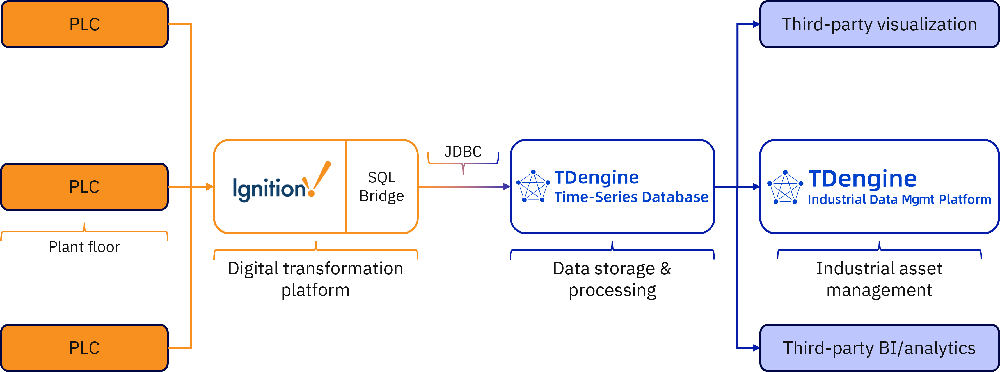

# Integrate TDengine with Ignition

[Ignition](https://inductiveautomation.com/ignition/), produced by Inductive Automation, is a powerful industrial application platform used to build and deploy SCADA, HMI, and Industrial Internet of Things (IIoT) systems. It offers a unified development environment for real-time data collection, visualization, alarming, reporting, and control across industrial operations.

Ignition supports a variety of SQL databases with its SQL Bridge module, and you can add database connections to your Ignition deployment through JDBC. This article describes how to install TDengine TSDB’s JDBC connector in Ignition and integrate the products, allowing you to work with data from Ignition in [TDengine IDMP](https://tdengine.com/idmp/) and other applications.

TDengine–Ignition integration architecture

## Prerequisites

- Install TDengine TSDB. For instructions, see [Get Started](https://docs.tdengine.com/get-started/).
- Install Ignition. For instructions, see the [official documentation](https://www.docs.inductiveautomation.com/).

## Configuring Data Source

1.  Download the TDengine TSDB JDBC connector from [Maven](https://central.sonatype.com/artifact/com.taosdata.jdbc/taos-jdbcdriver).
    - On the **Versions** tab, click Browse next to the latest version of the connector.
    - On the page displayed, download the `taos-jdbcdriver-<version>-dist.jar` file to your local machine.
    
2.  Add a new JDBC driver in Ignition as described in the [Ignition documentation](https://www.docs.inductiveautomation.com/docs/8.1/platform/database-connections/connecting-to-databases/jdbc-drivers-and-translators#add-a-new-jdbc-driver) and select the JAR file that you downloaded in the previous step.

3.  Configure the driver as follows:
    - **Classname:** Enter `com.taosdata.jdbc.rs.RestfulDriver`.
    - **URL Format:** Enter `jdbc:TAOS-RS://<taosAdapter-address:port>/<database-name>`.
    - Retain the default values for other options. It is not necessary to configure a database translator.

4.  Add a new database connection in Ignition as described in the [Ignition documentation](https://www.docs.inductiveautomation.com/docs/8.1/platform/database-connections/connecting-to-databases#add-a-database-connection).
    - Select the JDBC driver that you created in the previous step.
    - In the **Connect URL** field, enter `jdbc:TAOS-RS://<taosAdapter-address:port>/<database-name>`.

## Usage

You can now use TDengine TSDB with the SQL Bridge module in Ignition. With Ignition data streaming into TDengine TSDB, you can also use this data in TDengine IDMP to build asset models, perform real-time analytics, and generate AI-driven visualizations.
