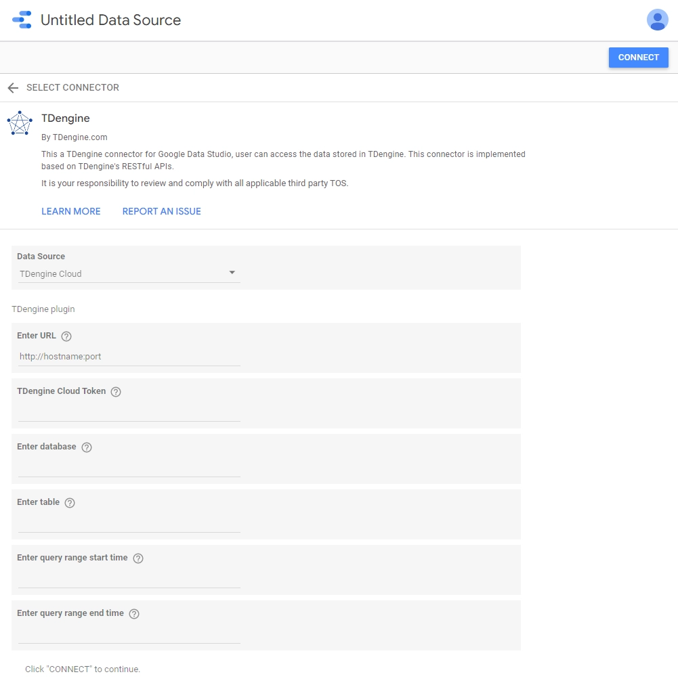

TDengine can be easily accessed by Google Data Studio use its [partner connector](https://datastudio.google.com/data?search=TDengine), and can quickly build interactive reports and dashboards with Data Studio’s web based reporting tools.

The whole process does not require any code development. And you can Share your reports and dashboards with individuals, teams, or the world. Collaborate in real time. Embed your report on any web page.

You can learn more about using the Data Studio with TDengine refer [GitHub](https://github.com/taosdata/gds-connector/blob/master/README.md).

## Choose Data Source

[Current connector](https://datastudio.google.com/data?search=TDengine) support two kinds of data source, one is "TDengine Server" and another is "TDengine Cloud". Choose "TDengine Cloud" and click "NEXT".

## Connector Configuration



- URL, Necessary configuration

For "TDengine Cloud", you can get this URL from your cloud instance information page. Indeed, this URL's instance must be in active status. The following is a "TDengine Cloud" URL example.

``` bash
# For TDengine Cloud 
http://gw.us-east-1.aws.cloud.tdengine.com:80
```

- TDengine Cloud Token, Necessary configuration

This token is from your TDengine cloud, which should correspond with an active instance URL.
The following is a "TDengine Cloud" token example.

``` bash
9da2fda0b141e3c85064cdcca90ea9357c9bd790
```

- database _**Necessary configuration**_

The database name that contains the table(no matter if it is a normal table, a super table or a child table) is the one you want to query for data and make reports on.
In the example, we suggest we want to access a database named `test`.

- table _**Necessary configuration**_

The name of the table you want to connect to and query its data to make a report. In this example, we will create a report for table `meters`.

**Notice** Currently, the maximum number of retrieved records is 1000000 rows.

- Query range start date & end date _**Optional configurations**_

There are two text fields on our connector config page. Generally, these are two date filter conditions which are used to limit the amount of retrieved data, and the date should be entered in `YYYY-MM-DD HH:MM:SS` format.
e.g.

``` bash
2022-05-12 18:24:15
```

The `start date` defines the beginning timestamp of the query result. In other words, records earlier than this `start date` will not be retrieved.

The `end time` indicates the end timestamp of the query result. Which means that records later than this `end date` will not be retrieved.
These conditions are used in SQL statement's where clause like:

``` SQL
-- select * from table_name where ts >= start_date and ts <= end_date
select * from test.demo where ts >= '2022-05-10 18:24:15' and ts<='2022-05-12 18:24:15'
```

Indeed, through these filters, you can improve the data loading speed in your report.

After configuration done, click "connect" button,now you have connect to your "TDengine Cloud" with specified database and table.

## Create Report or Dashboard

Unlock the power of your data with interactive dashboards and beautiful reports with the data stored in TDengine.

And refer to [documentation](https://docs.tdengine.com/third-party/google-data-studio/) for more details.
