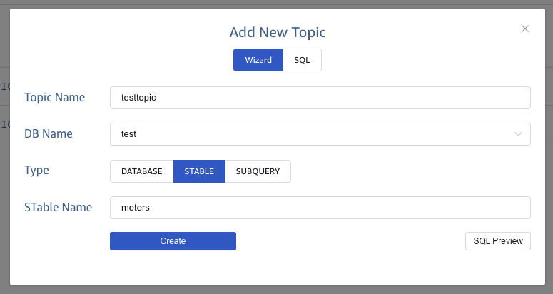
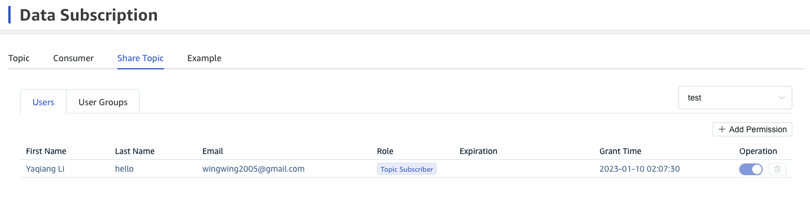
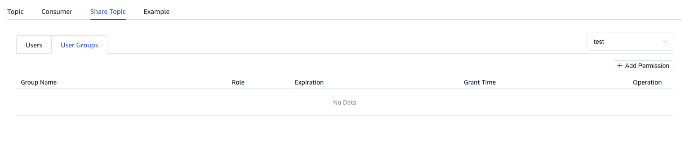

import Tabs from "@theme/Tabs";
import TabItem from "@theme/TabItem";

The topic introduces how to share data from TDengine instance through the access control management of TDengine Cloud and the subscription interfaces of each supported connectors. The data owner first creates the topic through the topic wizard. Then adds the users or user groups which he wants to share the data with to the subscribers of the topic. The subscriber of the topic can get the details about how to access the shared data from TDengine in the data subscription way. In this document we will briefly explain these main steps of data sharing.

## Create Topic

You can create the topic in Topics of TDengine Cloud. In the Create Topic dialog, you can choose wizard or SQL way to create the topic. In the wizard way, you need to input the topic name and select the database of the current TDengine instance. Then select the super table or specify the subquery with the super table or sub table. Also you can add fields selections or add result set and condition set for each field. In the following, you can get the detail of how to create the topic in three levels through wizard way.

### To Database

The default selection in the Add New Topic dialog is database type. After select a database in the selection, you can click Confirm button to create a topic to a database.


### To Super Table

In the opened Add New Topic dialog, you can click STable type and select a specified super table from the selections. Then click Confirm button to create a topic to a super table.



### With Subquery

In the opened Add New Topic dialog, you can click Subquery type to show all subquery form items. The first item is Table Type and the default selection is STable. After you select or input a super table name, the following will show you all fields from the super table. You can check or uncheck each field for the sub query and also you can set the result set or condition set for each field. If you want to preview the SQL based on your chooses, click SQL Preiview to open a SQL dialog to view.


You can select another Table Table Table and then select a table from the selections or input an existed table name. You can get all fields of the selected table. You can check or uncheck each field for the sub query and also you can set the result set or condition set for each field. If you want to preview the SQL based on your chooses, click SQL Preiview to open a SQL dialog to view.


## Share Topic

In each row of the topic list in the Topics page, you can click Share Topic action icon to the Share Topic page. Also you can directly click Share Topic tab to switch to the right location. In the Share Topic tab, you can get only one row for yourself in the Users page.

### Users

In the default tab Users of the Share Topic page, you can click **Add Users** button to add more users who are active in the current organization. In the opened Add New Users dialog, you can select the new users who you want to share the topic with. Then you can set the expired time for the sharing to these users.




### User Groups

You can click User Groups tab to switch to the User Groups page of the Share Topic. Then you can click **Add User Groups** button to add more user groups which are active in the current organization. In the opened Add New User Groups dialog, you can select the new user groups which you want to share the topic with. Then you can set the expired time for the sharing to these user groups.




## Consume Shared Topic

The shared user can get all topics which the creator shared with him, when he goes to the Topic page of Data Subscription. The user can click **Sample Code** icon of each topic **Action** area to the **Sample Code** page. Then he can follow the steps of the sample code how to consume the shared topic from TDengine instance.

### Data Schema and API

The related schemas and APIs in various languages are described as follows:

<Tabs defaultValue="Go" groupId="lang">

<TabItem label="Go" value="Go">

```go
func NewConsumer(conf *Config) (*Consumer, error)

func (c *Consumer) Close() error

func (c *Consumer) Commit(ctx context.Context, message unsafe.Pointer) error

func (c *Consumer) FreeMessage(message unsafe.Pointer)

func (c *Consumer) Poll(timeout time.Duration) (*Result, error)

func (c *Consumer) Subscribe(topics []string) error

func (c *Consumer) Unsubscribe() error
```

</TabItem>

<TabItem label="Rust" value="Rust">

```rust
impl TBuilder for TmqBuilder
  fn from_dsn<D: IntoDsn>(dsn: D) -> Result<Self, Self::Error>
  fn build(&self) -> Result<Self::Target, Self::Error>

impl AsAsyncConsumer for Consumer
  async fn subscribe<T: Into<String>, I: IntoIterator<Item = T> + Send>(
        &mut self,
        topics: I,
    ) -> Result<(), Self::Error>;
  fn stream(
        &self,
    ) -> Pin<
        Box<
            dyn '_
                + Send
                + futures::Stream<
                    Item = Result<(Self::Offset, MessageSet<Self::Meta, Self::Data>), Self::Error>,
                >,
        >,
    >;
  async fn commit(&self, offset: Self::Offset) -> Result<(), Self::Error>;

  async fn unsubscribe(self);
```

For more information, see [Crate taos](https://docs.rs/taos).

</TabItem>

<TabItem value="Python" label="Python">

```python
class TaosConsumer():
    def __init__(self, *topics, **configs)

    def __iter__(self)

    def __next__(self)

    def sync_next(self)
    
    def subscription(self)

    def unsubscribe(self)

    def close(self)
    
    def __del__(self)
```

</TabItem>
</Tabs>

### Configure TDengine DSN

You can set the following for Go and Rust:

<Tabs defaultValue="Bash" groupId="config">
<TabItem value="Bash" label="Bash">

```shell
export TDENGINE_CLOUD_TMQ="<TDENGINE_CLOUD_TMQ>"
```

</TabItem>
<TabItem value="CMD" label="CMD">

```shell
set TDENGINE_CLOUD_TMQ="<TDENGINE_CLOUD_TMQ>"
```

</TabItem>
<TabItem value="Powershell" label="Powershell">

```shell
$env:TDENGINE_CLOUD_TMQ="<TDENGINE_CLOUD_TMQ>"
```

</TabItem>
</Tabs>

:::note
Replace <TDENGINE_CLOUD_TMQ> with the real value, the format should be `wss://<cloud_endpoint>)/rest/tmq?token=<token>`.
To obtain the value of `TDENGINE_CLOUD_TMQ`, please log in [TDengine Cloud](https://cloud.tdengine.com) and click **Topcis** on the left menu, then click **Sample Code** action of the each topic to **Example** part.
:::

Especially, for Python, you need to set the following variables:

<Tabs defaultValue="Bash" groupId="config">
<TabItem value="Bash" label="Bash">

```shell
export TDENGINE_CLOUD_ENDPOINT="<TDENGINE_CLOUD_ENDPOINT>"
export TDENGINE_CLOUD_TOKEN="<TDENGINE_CLOUD_TOKEN>"
```

</TabItem>
<TabItem value="CMD" label="CMD">

```shell
set TDENGINE_CLOUD_ENDPOINT="<TDENGINE_CLOUD_ENDPOINT>"
set TDENGINE_CLOUD_TOKEN="<TDENGINE_CLOUD_TOKEN>"
```

</TabItem>
<TabItem value="Powershell" label="Powershell">

```shell
$env:TDENGINE_CLOUD_ENDPOINT="<TDENGINE_CLOUD_ENDPOINT>"
$env:TDENGINE_CLOUD_TOKEN="<TDENGINE_CLOUD_TOKEN>"
```

</TabItem>
</Tabs>

:::note
Replace <TDENGINE_CLOUD_ENDPOINT> and <TDENGINE_CLOUD_TOKEN> with the real values. To obtain the value of these, please log in [TDengine Cloud](https://cloud.tdengine.com) and click **Topcis** on the left menu, then click **Sample Code** action of the each topic to the **Python** tab of the **Example** part.
:::
### Create a Consumer from Instance

You configure the following parameters when creating a consumer:

|            Parameter            |  Type   | Description                                                 | Remarks                                        |
| :----------------------------: | :-----: | -------------------------------------------------------- | ------------------------------------------- |
|        `td.connect.ip`         | string  | Used in establishing a connection; same as `taos_connect`                          |                                             |
|        `td.connect.user`         | string  | Used in establishing a connection; same as `taos_connect`                          |                                             |
|        `td.connect.pass`         | string  | Used in establishing a connection; same as `taos_connect`                          |                                             |
|        `td.connect.port`         | string  | Used in establishing a connection; same as `taos_connect`                          |                                             |
|           `group.id`           | string  | Consumer group ID; consumers with the same ID are in the same group                        | **Required**. Maximum length: 192.                 |
|          `client.id`           | string  | Client ID                                                | Maximum length: 192.                             |
|      `auto.offset.reset`       |  enum   | Initial offset for the consumer group                                     | Specify `earliest`, `latest`, or `none`(default) |
|      `enable.auto.commit`      | boolean | Commit automatically                                             | Specify `true` or `false`.                   |
|   `auto.commit.interval.ms`    | integer | Interval for automatic commits, in milliseconds                           |
| `enable.heartbeat.background`  | boolean | Backend heartbeat; if enabled, the consumer does not go offline even if it has not polled for a long time |                                             |
| `experimental.snapshot.enable` | boolean | Specify whether to consume messages from the WAL or from TSBS                    |                                             |
|     `msg.with.table.name`      | boolean | Specify whether to deserialize table names from messages                                 |

The method of specifying these parameters depends on the language used:

<Tabs defaultValue="Go" groupId="lang">

<TabItem label="Go" value="Go">

```go
import (
  "github.com/taosdata/driver-go/v3/common"
	tmqcommon "github.com/taosdata/driver-go/v3/common/tmq"
	"github.com/taosdata/driver-go/v3/ws/tmq"
)
tmqStr := os.Getenv("TDENGINE_CLOUD_TMQ")
consumer, err := tmq.NewConsumer(&tmqcommon.ConfigMap{
  "ws.url":                tmqStr,
  "ws.message.channelLen": uint(0),
  "ws.message.timeout":    common.DefaultMessageTimeout,
  "ws.message.writeWait":  common.DefaultWriteWait,
  "group.id":              "test_group",
  "client.id":             "test_consumer_ws",
  "auto.offset.reset":     "earliest",
})
if err != nil {
  panic(err)
}
```

</TabItem>

<TabItem label="Rust" value="Rust">

```rust
let tmq_str = std::env::var("TDENGINE_CLOUD_TMQ")?;
let tmq_uri = format!( "{}&group.id=test_group_rs&client.id=test_consumer_ws", tmq_str);
println!("request tmq URI is {tmq_uri}\n");
let tmq = TmqBuilder::from_dsn(tmq_uri,)?;
let mut consumer = tmq.build()?;
```

</TabItem>

<TabItem value="Python" label="Python">

Python programs use the following parameters:

|            Parameter            |  Type   | Description                                                 | Remarks                                        |
| :----------------------------: | :----: | -------------------------------------------------------- | ------------------------------------------- |
|        `td_connect_ip`         | string  | Used in establishing a connection; same as `taos_connect`                          |                                             |
|        `td_connect_user`         | string  | Used in establishing a connection; same as `taos_connect`                          |                                             |
|        `td_connect_pass`         | string  | Used in establishing a connection; same as `taos_connect`                          |                                             |
|        `td_connect_port`         | string  | Used in establishing a connection; same as `taos_connect`                          |                                             |
|           `group_id`           | string  | Consumer group ID; consumers with the same ID are in the same group                        | **Required**. Maximum length: 192.                 |
|          `client_id`           | string  | Client ID                                                | Maximum length: 192.                             |
|      `auto_offset_reset`       |  string   | Initial offset for the consumer group                                     | Specify `earliest`, `latest`, or `none`(default) |
|      `enable_auto_commit`      | string | Commit automatically                                             | Specify `true` or `false`.                   |
|   `auto_commit_interval_ms`    | string | Interval for automatic commits, in milliseconds                           |
| `enable_heartbeat_background`  | string | Backend heartbeat; if enabled, the consumer does not go offline even if it has not polled for a long time |  Specify `true` or `false`.                                           |
| `experimental_snapshot_enable` | string | Specify whether to consume messages from the WAL or from TSBS                    | Specify `true` or `false`.                                            |
|     `msg_with_table_name`      | string | Specify whether to deserialize table names from messages                                 | Specify `true` or `false`.
|           `timeout`            |  int   | Consumer pull timeout                                     |                                      |

```python
endpoint = os.environ["TDENGINE_CLOUD_ENDPOINT"]
token = os.environ["TDENGINE_CLOUD_TOKEN"]
urlparts = endpoint.split(":", 1)

conf = {
    # auth options
    "td.connect.websocket.scheme": "wss",
    "td.connect.ip": urlparts[0],
    "td.connect.port": urlparts[1],
    "td.connect.token": token,
    # consume options
    "group.id": "test_group_py",
    "client.id": "test_consumer_ws_py",
}
consumer = Consumer(conf)
```

</TabItem>
</Tabs>

A consumer group is automatically created when multiple consumers are configured with the same consumer group ID.

### Subscribe to a Topic

A single consumer can subscribe to multiple topics.

<Tabs defaultValue="Go" groupId="lang">

<TabItem value="Go" label="Go">

```go
err = consumer.Subscribe("<TDC_TOPIC>", nil)
if err != nil {
  panic(err)
}
```

</TabItem>
<TabItem value="Rust" label="Rust">

```rust
consumer.subscribe(["<TDC_TOPIC>"]).await?;
```

</TabItem>

<TabItem value="Python" label="Python">

```python
consumer.subscribe(["<TDC_TOPIC>"])
```

</TabItem>
</Tabs>

:::note

Replace <TDC_TOPIC\> with the real value. To obtain the value of `TDC_TOPIC`, please log in [TDengine Cloud](https://cloud.tdengine.com) and click **Topcis** on the left menu, then copy the topic name you want to consume.

:::

## Consume messages

The following code demonstrates how to consume the messages in a queue.

<Tabs defaultValue="Go" groupId="lang">

<TabItem value="Go" label="Go">

```go
for {
  ev := consumer.Poll(0)
  if ev != nil {
    switch e := ev.(type) {
    case *tmqcommon.DataMessage:
      fmt.Printf("get message:%v\n", e.String())
      consumer.Commit()
    case tmqcommon.Error:
      fmt.Printf("%% Error: %v: %v\n", e.Code(), e)
      return
    default:
      fmt.Printf("unexpected event:%v\n", e)
      return
    }
  }
}
```

</TabItem>

<TabItem value="Rust" label="Rust">

```rust
// consume loop
consumer
    .stream()
    .try_for_each_concurrent(10, |(offset, message)| async {
      let topic = offset.topic();
      // the vgroup id, like partition id in kafka.
      let vgroup_id = offset.vgroup_id();
      println!("* in vgroup id {vgroup_id} of topic {topic}\n");

      if let Some(data) = message.into_data() {
        while let Some(block) = data.fetch_raw_block().await? {
          // A two-dimension matrix while each cell is a [taos::Value] object.
          let values = block.to_values();
          // Number of rows.
          assert_eq!(values.len(), block.nrows());
          // Number of columns
          assert_eq!(values[0].len(), block.ncols());
          println!("first row: {}", values[0].iter().join(", "));
        }
      }
      consumer.commit(offset).await?;
      Ok(())
    })
    .await?;
```

</TabItem>
<TabItem value="Python" label="Python">

```python
while 1:
  message = consumer.poll(timeout=1.0)
  if message:
    id = message.vgroup()
    topic = message.topic()
    database = message.database()

    for block in message:
      nrows = block.nrows()
      ncols = block.ncols()
      for row in block:
          print(row)
      values = block.fetchall()
      print(nrows, ncols)
  else:
    break
```

</TabItem>
</Tabs>

## Close the consumer

After message consumption is finished, the consumer is unsubscribed.

<Tabs defaultValue="Go" groupId="lang">

<TabItem value="Go" label="Go">

```go
consumer.Close()
```

</TabItem>

<TabItem value="Rust" label="Rust">

```rust
consumer.unsubscribe().await;
```

</TabItem>

<TabItem value="Python" label="Python">

```py
# Unsubscribe
consumer.unsubscribe()
# Close consumer
consumer.close()
```

</TabItem>

</Tabs>

### Sample Code

The following are full sample codes about how to consume the shared topic **test**:

<Tabs defaultValue="Go" groupId="lang">

<TabItem label="Go" value="Go">

```go
{{#include docs/examples/go/sub/cloud/main.go}}
```

</TabItem>

<TabItem label="Rust" value="Rust">

```rust
{{#include docs/examples/rust/cloud-example/examples/sub.rs}}
```

</TabItem>

<TabItem value="Python" label="Python">

```python
{{#include docs/examples/python/cloud/sub.py}}
```

</TabItem>

</Tabs>
