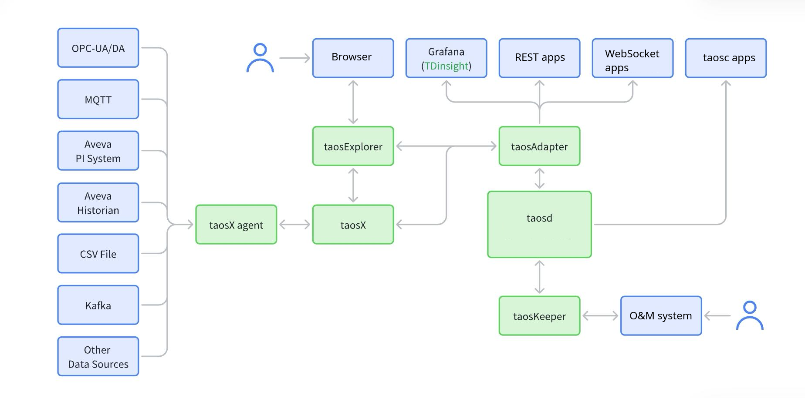

Component-level hardening guidance; for layered security capabilities, see the [Security Guide home](./index.md).

## Background

The distributed and multi-component nature of TDengine makes security configuration a common production concern. This document explains security considerations for TDengine components and deployment methods, and provides deployment and configuration suggestions. For transport certificate steps, see [Full-Trace Transport Security and Compression](./02-full-trace-transport.md); for client practices, see [Client and Connector Security](./05-client-connector-security.md); for account and authorization practices, see [Full-Trace Authentication · Practice Suggestions](./01-full-trace-auth.md#practice-suggestions); for audit configuration, see [Audit and Compliance](./07-audit-and-compliance.md).

## Components Involved in Security Configuration

TDengine includes multiple components:

- `taosd`: Core component.
- `taosc`: Client library.
- `taosAdapter`: REST API and WebSocket service.
- `taosKeeper`: Monitoring service component.
- `taosX`: Data pipeline and backup recovery component.
- `taosX-Agent`: Auxiliary component for external data source access.
- `taosExplorer`: Web visualization management interface.

In addition to TDengine deployment and applications, there are also the following components:

- Applications that access and use the TDengine database through various connectors.
- External data sources: Other data sources that access TDengine, such as MQTT, OPC, Kafka, etc.

The relationship between the components is as follows:



For detailed component descriptions, see [Overview and Architecture](../12-operations-and-tooling/01-overview.md).

## TDengine Security Settings

### `taosd`

`taosd` clusters exchange data over TCP with a proprietary protocol. Transport can be plaintext by default, so production deployments should enable TLS (`enableTLS` and certificate parameters; see [Full-Trace Transport Security and Compression](./02-full-trace-transport.md)).

Enabling compression can reduce bandwidth usage, but it does not replace transport encryption.

- **compressMsgSize**: Whether to compress RPC messages. Integer, optional: `-1`: do not compress any messages; `0`: compress all messages; `N` (`N > 0`): only compress messages larger than `N` bytes.

To make database operations traceable, enable auditing in Enterprise deployments. For complete parameters and audit database constraints, see [Audit and Compliance](./07-audit-and-compliance.md) and [taosd](../12-operations-and-tooling/03-components/01-taosd.md).

- **audit**: Audit function switch, `0` disables and `1` enables auditing. Enterprise default is enabled.
- **auditInterval**: Reporting interval in milliseconds. Default `5000`.
- **auditLevel**: Audit level (`1`-`5`, default `3`).
- **auditCreateTable**: Whether to audit child-table creation. `0` disables and `1` enables it. Default enabled.
- **auditSaveInSelf**: Whether to record audit logs in the local cluster without `taosKeeper` (`v3.4.1.0+`).

To secure data files, enable transparent data encryption; see [Data-at-Rest Protection](./06-data-security.md). For `v3.4+`, the recommended path is to generate hierarchical keys with `taosk`, then specify `ENCRYPT_ALGORITHM` per database.

- **encryptAlgorithm** / **encryptScope**: Enterprise parameters that declare algorithms and encryption scopes. Their relationship to the `taosk` main path is described in Data-at-Rest Protection.

Enabling the whitelist can restrict access addresses and further enhance privacy.

- **enableWhiteList**: Allowlist switch, `0` disables and `1` enables it; default disabled. User-side `HOST` / `NOT_ALLOW_HOST` settings are described in [Users · IP Allowlist and Blocklist](../05-tdengine-sql/07-user-and-privilege/01-user.md#ip-allowlist-and-blocklist).

### `taosc`

Users and other components use the native client library (`taosc`) and TDengine's private protocol to connect to `taosd`. Configure client and server TLS / CA consistently; see [Full-Trace Transport Security and Compression](./02-full-trace-transport.md) and [Client and Connector Security](./05-client-connector-security.md).

### `taosAdapter`

`taosAdapter` uses the native client library (`taosc`) and TDengine's private protocol to connect to `taosd`, and also supports RPC message compression.

Applications and other components connect to `taosAdapter` through various language connectors. By default, the connection is based on HTTP 1.1 and is not encrypted. To ensure the security of data transmission between `taosAdapter` and other components, SSL encrypted connections need to be configured. Modify the following configuration in the `/etc/taos/taosadapter.toml` configuration file:

```toml
[ssl]
enable = true
certFile = "/path/to/certificate-file"
keyFile = "/path/to/private-key"
```

Configure HTTPS/SSL access in the connector to complete encrypted access.

:::info
The taosAdapter `[ssl]` section is an Enterprise feature. See [Full-Trace Transport Security and Compression](./02-full-trace-transport.md) for setup instructions.
:::

In production, set `debug` to `false`; when it is `true`, `/debug/pprof` is exposed. To further harden access, enable the allowlist in `taosd`, which also applies to `taosAdapter`. When access goes through Adapter, account allowlists usually see the Adapter host IP. To control by original client IP, handle it at the gateway layer; see [Full-Trace Authentication](./01-full-trace-auth.md).

### `taosX`

`taosX` includes REST API and gRPC interfaces, where the gRPC interface is used for `taosX-Agent` connections.

- The REST API interface is based on HTTP 1.1 and is not encrypted, posing a security risk.
- The gRPC interface is based on HTTP 2 and is not encrypted, posing a security risk.

To ensure data security, it is recommended that the `taosX` API interface is limited to internal access only. Modify the following configuration in the `/etc/taos/taosx.toml` configuration file:

```toml
[serve]
listen = "127.0.0.1:6050"
grpc = "127.0.0.1:6055"
```

Starting with TDengine `v3.3.6.0`, `taosX` supports HTTPS connections. Add the following configuration in the `/etc/taos/taosx.toml` file:

```toml
[serve]
ssl_cert = "/path/to/server.pem"
ssl_key = "/path/to/server.key"
ssl_ca = "/path/to/ca.pem"
```

To specify certificates for gRPC separately, configure `grpc_ssl_cert` / `grpc_ssl_key` / `grpc_ssl_ca`; see [Full-Trace Transport Security and Compression](./02-full-trace-transport.md).

Then change the API address to HTTPS in taosExplorer:

```toml
# Local connection to taosX API
x_api = "https://127.0.0.1:6050"
# Public IP or domain address
grpc = "https://public.domain.name:6055"
```

### `taosExplorer`

Similar to the `taosAdapter` component, the `taosExplorer` component provides HTTP services for external access. Modify the following configuration in the `/etc/taos/explorer.toml` configuration file:

```toml
[ssl]
# SSL certificate file
certificate = "/path/to/ca.file"

# SSL certificate private key
certificate_key = "/path/to/key.file"
```

Then, use HTTPS to access taosExplorer, for example `https://192.168.12.34:6060`.

### `taosX-Agent`

After `taosX` enables HTTPS, `taosX-Agent` and `taosX` use HTTP/2 encrypted connections and Arrow Flight RPC for data exchange. The payload is binary, and only registered `taosX-Agent` connections are valid.

It is recommended to always enable HTTPS connections for `taosX-Agent` services in insecure or public network environments.

### `taosKeeper`

`taosKeeper` uses WebSocket connections to communicate with `taosAdapter`, writing monitoring information reported by other components into TDengine. In classic deployments, it can also receive and forward audit logs; see [Audit and Compliance](./07-audit-and-compliance.md).

The current version of `taosKeeper` has security risks:

- The default listening address is broad, and exposing port `6043` to the public network creates attack risk. Bind `host` through configuration, startup parameters, or environment variables to localhost or an internal address, and restrict access with firewalls. This risk can be ignored when Docker or Kubernetes deployments do not expose the port. Note that this port has **no authentication** for reporters.
- The configuration file contains plaintext passwords, so the visibility of the configuration file needs to be reduced. In `/etc/taos/taoskeeper.toml`:

```toml
[tdengine]
host = "localhost"
port = 6041
username = "root"
password = "taosdata"
usessl = false
```

In production, set `usessl` to `true` with taosAdapter SSL, and avoid default credentials.

## Security Enhancements

We recommend using TDengine within a local area network.

If you must provide access outside the local area network, consider the following configurations. For a fuller gateway discussion on authentication, see [Full-Trace Authentication · API Gateway](./01-full-trace-auth.md#73-api-gateway-authentication-enhancement).

### Load Balancing

Use load balancing to provide `taosAdapter` services externally.

Take Nginx as an example to configure multi-node load balancing:

```nginx
http {
    server {
        listen 6041;
        
        location / {
            proxy_pass http://websocket;
            # Headers for websocket compatible
            proxy_http_version 1.1;
            proxy_set_header Upgrade $http_upgrade;
            proxy_set_header Connection $connection_upgrade;
            # Forwarded headers
            proxy_set_header X-Forwarded-For $proxy_add_x_forwarded_for;
            proxy_set_header X-Forwarded-Proto $scheme;
            proxy_set_header X-Forwarded-Host $host;
            proxy_set_header X-Forwarded-Port $server_port;
            proxy_set_header X-Forwarded-Server $hostname;
            proxy_set_header X-Real-IP $remote_addr;
        }
    }
 
    upstream websocket {
        server 192.168.11.61:6041;
        server 192.168.11.62:6041;
        server 192.168.11.63:6041;
   }
}
```

If the `taosAdapter` component is not configured with SSL secure connections, SSL needs to be configured to ensure secure access. SSL can be configured at a higher-level API Gateway or in Nginx; if you have stronger security requirements for the connections between components, you can configure SSL in all components. The Nginx configuration is as follows:

```nginx
http {
    server {
        listen 443 ssl;

        ssl_certificate /path/to/your/certificate.crt;
        ssl_certificate_key /path/to/your/private.key;
    }
}
```

### Security Gateway

In modern internet production systems, the use of security gateways is also very common. [traefik](https://traefik.io/) is a good open-source choice. We take traefik as an example to explain the security configuration in the API gateway.

Traefik provides various security configurations through middleware, including:

1. Authentication: Traefik provides multiple authentication methods such as BasicAuth, DigestAuth, custom authentication middleware, and OAuth 2.0.
2. IP Whitelist: Restrict the allowed client IPs.
3. Rate Limit: Control the number of requests sent to the service.
4. Custom Headers: Add configurations such as `allowedHosts` through custom headers to improve security.

A common middleware example is as follows:

```yaml
labels:
  - "traefik.enable=true"
  - "traefik.http.routers.tdengine.rule=Host(`api.tdengine.example.com`)"
  - "traefik.http.routers.tdengine.entrypoints=https"
  - "traefik.http.routers.tdengine.tls.certresolver=default"
  - "traefik.http.routers.tdengine.service=tdengine"
  - "traefik.http.services.tdengine.loadbalancer.server.port=6041"
  - "traefik.http.middlewares.redirect-to-https.redirectscheme.scheme=https"
  - "traefik.http.middlewares.check-header.headers.customrequestheaders.X-Secret-Header=SecretValue"
  - "traefik.http.middlewares.check-header.headers.customresponseheaders.X-Header-Check=true"
  - "traefik.http.middlewares.tdengine-ipwhitelist.ipwhitelist.sourcerange=127.0.0.1/32, 192.168.1.7"
  - "traefik.http.routers.tdengine.middlewares=redirect-to-https,check-header,tdengine-ipwhitelist"
```

The above example completes the following configurations:

- TLS authentication uses the `default` configuration, which can be configured in the configuration file or traefik startup parameters, as follows:

    ```yaml
    traefik:
    image: "traefik:v2.3.2"
    hostname: "traefik"
    networks:
    - traefik
    command:
    - "--log.level=INFO"
    - "--api.insecure=true"
    - "--providers.docker=true"
    - "--providers.docker.exposedbydefault=false"
    - "--providers.docker.swarmmode=true"
    - "--providers.docker.network=traefik"
    - "--providers.docker.watch=true"
    - "--entrypoints.http.address=:80"
    - "--entrypoints.https.address=:443"
    - "--certificatesresolvers.default.acme.dnschallenge=true"
    - "--certificatesresolvers.default.acme.dnschallenge.provider=alidns"
    - "--certificatesresolvers.default.acme.dnschallenge.resolvers=ns1.alidns.com"
    - "--certificatesresolvers.default.acme.email=ops@example.com"
    - "--certificatesresolvers.default.acme.storage=/letsencrypt/acme.json"
    ```

The startup parameters configure the `default` TLS certificate resolver and automatic ACME authentication for certificate issuance and renewal. Replace the email and DNS provider according to the actual environment.

- Middleware `redirect-to-https`: Configure redirection from HTTP to HTTPS, forcing the use of secure connections.

    ```yaml
    - "traefik.http.middlewares.redirect-to-https.redirectscheme.scheme=https"
    ```

- Middleware `check-header`: Configure custom header checks. External access must add custom headers and match header values to prevent unauthorized access. This is a very simple and effective security mechanism when providing API access.
- Middleware `tdengine-ipwhitelist`: Configure IP whitelist. Only allow specified IPs to access, using CIDR routing rules for matching, and can set internal and external IP addresses.

## Summary

Data security is a key indicator of the TDengine product. These measures are designed to protect TDengine deployments from unauthorized access and data breaches while maintaining performance and functionality. However, TDengine configuration alone is not sufficient; deployments must be secured together with the surrounding business system. For known vulnerabilities and fixed versions, see [Security Advisories](./09-security-advisories.md).
