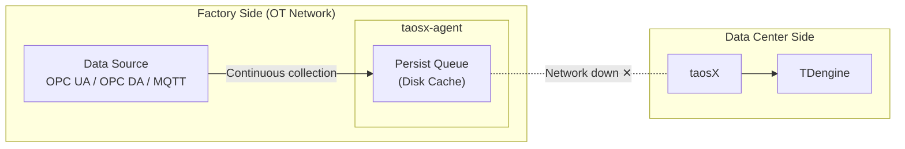
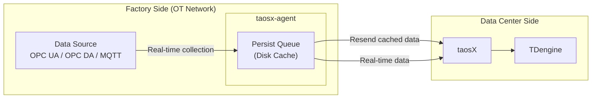
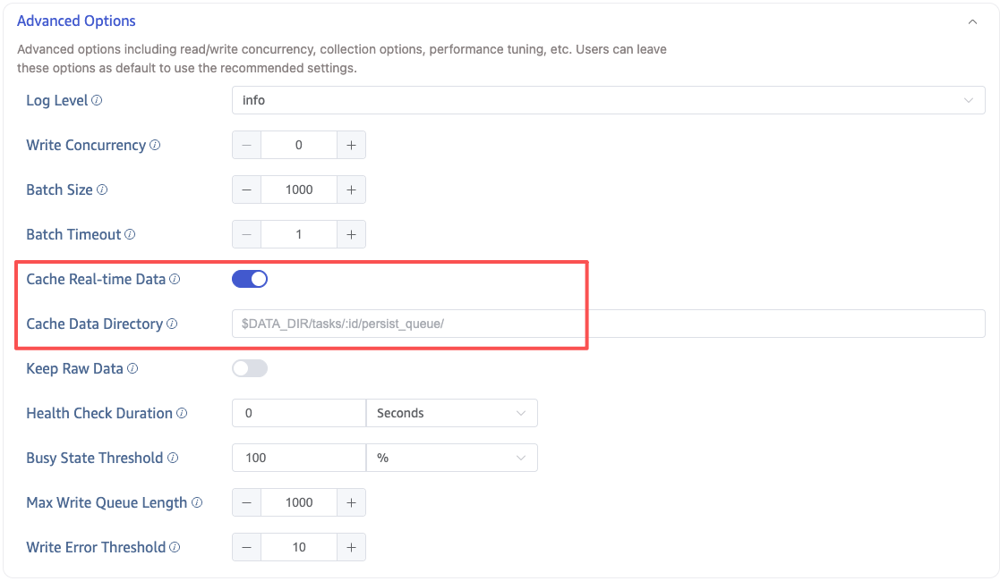

## Overview

In industrial data collection scenarios, taosX-Agent is typically deployed on the factory side (OT network) and communicates with taosX on the data center side via VPN or dedicated lines. When the network is interrupted (e.g., VPN disconnection, weekend shutdowns), data collected during the outage would be lost without a caching mechanism.

The **Store and Forward** feature solves this problem: when the network between Agent and taosX is interrupted, Agent continues to collect data from the data source and persists it to local disk. Once the network recovers, the cached data is automatically resent to taosX, ensuring zero data loss.

**During network outage**: Agent continues collecting data and writes it to local disk cache.

**After network recovery**: Cached data is automatically resent and real-time data synchronization resumes.

## Use Cases

| Scenario | Description |
| --- | --- |
| Unstable VPN | VPN between factory and data center may disconnect periodically |
| Planned downtime | Data center network goes offline during weekends or maintenance, while factory must continue data collection |
| Poor network quality | Remote sites with limited bandwidth and occasional disconnections |

:::note
Store and Forward is currently supported for **OPC UA**, **OPC DA**, and **MQTT** data source types in real-time collection tasks.
:::

## How to Enable

Store and Forward is enabled through the advanced options of a data ingestion task, not through the Agent's own configuration.

When creating or editing an OPC UA / OPC DA / MQTT data ingestion task in taosExplorer, configure the following parameters in **Advanced Options**:

| Parameter | DSN Parameter | Default | Description |
| --- | --- | --- | --- |
| **Cache Real-time Data** | `persist_data_enable` | `false` | Whether to enable disk-level data caching (Store and Forward) |
| **Cache Data Directory** | `persist_data_dir` | `$DATA_DIR/tasks/:id/persist_queue/` | Directory for storing cached data |

Turn on the **Cache Real-time Data** toggle to enable Store and Forward.

## How It Works

When Store and Forward is enabled, Agent creates a **persist_queue** (persistent queue) internally. The data flow is split into two paths — write and read:

### Write Path (Data Source → Local Disk)

1. The connector (e.g., taosx-opc) collects data from the data source and passes it to Agent via an IPC pipe.
2. Agent serializes the data and writes it to persist_queue disk files.
3. After writing to disk, Agent replies with an ACK (confirming data is persisted) to the connector.

### Read Path (Local Disk → taosX)

1. The persist_queue reader reads data from the disk files.
2. Data is sent to taosX via Arrow Flight RPC.
3. taosX writes data to TDengine successfully and returns a confirmation.
4. Agent updates the breakpoint position upon receiving the confirmation.

### Breakpoint Recovery

persist_queue uses a breakpoint database to record the confirmed read position. When the network recovers or Agent restarts, it resumes reading from the last breakpoint position, preventing data duplication or loss.

### Behavior During Network Outage

When the network between Agent and taosX is interrupted:

1. **Data collection continues**: The connector continues collecting data from the data source and writing to the local persist_queue.
2. **Data transfer pauses**: The persist_queue reader detects the network is unavailable and pauses sending data to taosX.
3. **Automatic resend on recovery**: After Agent reconnects to taosX, it resumes reading cached data from the persist_queue starting at the breakpoint position.

## Behavior Comparison: Enabled vs. Disabled

| Behavior | Disabled (Default) | Enabled |
| --- | --- | --- |
| Data buffering | In-memory only (default 64 batches) | Disk-based persistent queue (capacity limited only by disk space) |
| Agent ↔ taosX disconnect | Collection task terminates; data lost during outage | Collection task continues; data written to local disk |
| Reconnection strategy | Limited retries | Unlimited retries (`retry_forever=true`) |
| Breakpoint recovery | Not supported | Supported (breakpoint mechanism) |
| Data acknowledgment | Acknowledged after sending to in-memory buffer | Acknowledged only after writing to disk |
| Write latency | Low (in-memory direct transfer) | Slightly increased (requires disk write and read) |

:::warning
When Cache Real-time Data is enabled, data must be written to local disk first and then read from disk before being reported to taosX. This increases end-to-end latency from the data source to TDengine TSDB writes. If your scenario is highly sensitive to write latency and the network environment is stable, you may choose not to enable this feature.
:::

## Disk Space Considerations

When Store and Forward is enabled, cached data occupies disk space on the Agent host. Please note:

- **Cache capacity is limited only by disk space**: During prolonged network outages, cached data will continue to grow.
- **Ensure sufficient disk space**: Estimate the required space based on data collection volume and expected maximum outage duration. For example, 1,000 OPC UA points updating once per second may generate hundreds of MB to several GB of cached data per day (depending on data types and sizes).
- **After resend completes**: Cache files that have been confirmed as successfully sent are automatically cleaned up.

:::tip
You can configure the **Cache Data Directory** to point to a disk partition with sufficient space.
:::
