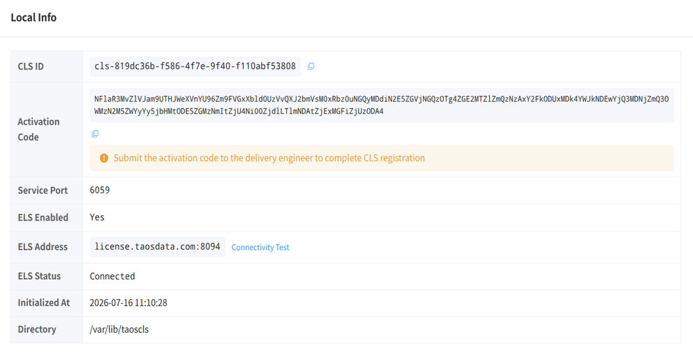
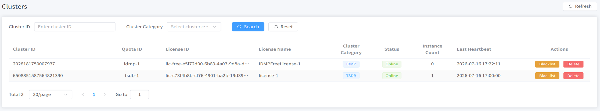

This page describes how to deploy CLS in the customer environment, complete online or offline licensing, and connect TDengine TSDB / IDMP instances to CLS. For architecture and the quota model, see [License Center Reference](./index.md) and [Quotas and Slots](./02-quota-and-slots.md).

## Deployment and Installation

Example package name:

```bash
license-center-cls-1.0.0-linux-amd64.tar.gz
```

After extraction, the deployment scripts are available:

```bash
scripts/
├── install.sh
├── start.sh
├── status.sh
├── stop.sh
└── uninstall.sh
```

Run `install.sh`, then `start.sh`, to start the service.

## Configuration

The default configuration file is `/etc/taoscls/taoscls.toml`:

```toml
[local]
# The address the service listens on. The default 0.0.0.0 means listening on all network interfaces.
listen = "0.0.0.0"
# The HTTP API service port.
http_port = 6059

[els]
# The address of the ELS service.
host = "license.tdengine.com"
# The port of the ELS service.
port = 8094
# Whether to enable communication with ELS.
enable = true

[database]
# The data storage path.
path = "/var/lib/taoscls"

[log]
# The log level.
level = "info"
# The log file path.
file = "/var/log/taoscls/taoscls.log"
# The maximum size of a single rolling log file.
max_size = "1GB"
# The number of rolling log files.
max_files = 3
# Optional fixed timezone offset for log timestamps. When omitted, the system local timezone is used.
# timezone = "+08:00"
```

## Local Access

- After starting CLS, open `http://localhost:6059` in a browser (adjust host and port as needed).
- Demo accounts used in this document:
  - Username: `root`
  - Password: `taosdata`

## Service Information

1. After the service starts, open the CLS console in a browser and log in.
2. On the **Local Information** page, view the **Public Key Token** and related details:



## Offline Licensing

### Obtain a License

Provide the **Public Key Token** from the CLS **Local Information** page to the TDengine service provider. The provider returns a license file named `offline-license.key`.

### Import the License

On the CLS **License** page, click **Offline Import**, select `offline-license.key`, then click **Import**. After a successful import, the license appears in the list.

### View Quotas

Open the **Quota** page to view quotas and authorization items split from the license, including license ID, quota ID, authorization item, category, type, value, and expiration time.


For how slot count and per-slot quotas are adjusted, see [Quotas and Slots](./02-quota-and-slots.md).

## Online Licensing

Online licensing follows the same overall flow as offline licensing. The difference is how the license is obtained: if CLS is connected to ELS, licenses authorized on ELS sync to CLS automatically; offline mode requires importing a file or similar channel.

## Connecting to CLS

TSDB / IDMP clusters can communicate with CLS through configuration. After configuration succeeds, instance information appears on CLS cluster pages. For usage views, see [Usage and Availability](./03-usage-and-availability.md).

### TSDB Configuration

Configure via taosExplorer or SQL.

#### taosExplorer

On **System Management / License** in taosExplorer, click **Activate License**:


Field meanings match the SQL parameters below. After confirmation, the License page shows the CLS configuration:


#### SQL

Example:

```sql
ALTER ALL DNODES 'clsEnabled' '1';
ALTER ALL DNODES 'clsRefreshInterval' '15';
ALTER ALL DNODES 'clsUrl' 'http://192.168.2.158:6059';
ALTER ALL DNODES 'clsLicenseId' 'lic-53467044-2dad-4be2-9280-adacb201a644';
ALTER ALL DNODES 'clsQuotaSlotId' 'tsdb-1';
```

| Parameter | Description |
| --------- | ----------- |
| `clsEnabled` | Whether to enable CLS licensing |
| `clsRefreshInterval` | Interval for communicating with CLS |
| `clsUrl` | CLS service URL |
| `clsLicenseId` | License ID to use |
| `clsQuotaSlotId` | Quota slot ID (Slot) to use |

End users typically enter a License Key / ID (required) and a Slot (optional, depending on whether the license is split into slots). In multi-instance setups, use different `clsQuotaSlotId` values per instance, and keep the sum of slot quotas within the license total.

### IDMP Configuration

UI configuration for newer IDMP versions is still being improved. IDMP also connects to CLS with a license ID and quota slot; follow the UI for your product version.

### CLS Cluster Management

After TSDB / IDMP are configured for CLS, clusters appear on the CLS **Cluster** page:



The **Cluster Usage** page shows authorization-item usage:


