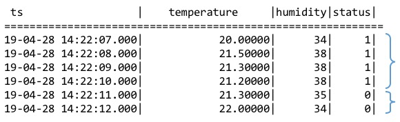

As a purpose-built database for storing and processing time-series data, TDengine provides time-series-specific extensions to standard SQL.

These extensions include partitioned queries and windowed queries.

## Partitioned Queries

When you query a supertable, you may need to partition the supertable by some dimensions and perform additional operations on a specific partition. In this case, you can use the following SQL clause:

```sql
PARTITION BY part_list
```

part_list can be any scalar expression, such as a column, constant, scalar function, or a combination of the preceding items.

A PARTITION BY clause is processed as follows:

- The PARTITION BY clause must occur after the WHERE clause
- The PARTITION BY caluse partitions the data according to the specified dimentions, then perform computation on each partition. The performed computation is determined by the rest of the statement - a window clause, GROUP BY clause, or SELECT clause.
- The PARTITION BY clause can be used together with a window clause or GROUP BY clause. In this case, the window or GROUP BY clause takes effect on every partition. For example, the following statement partitions the table by the location tag, performs downsampling over a 10 minute window, and returns the maximum value:

```sql
select max(current) from meters partition by location interval(10m)
```

The most common usage of PARTITION BY is partitioning the data in subtables by tags then perform computation when querying data in a supertable. More specifically, `PARTITION BY TBNAME` partitions the data of each subtable into a single timeline, and this method facilitates the statistical analysis in many use cases of processing timeseries data.

## Windowed Queries

Aggregation by time window is supported in TDengine. For example, in the case where temperature sensors report the temperature every seconds, the average temperature for every 10 minutes can be retrieved by performing a query with a time window. Window related clauses are used to divide the data set to be queried into subsets and then aggregation is performed across the subsets. There are three kinds of windows: time window, status window, and session window. There are two kinds of time windows: sliding window and flip time/tumbling window. The query syntax is as follows:

```sql
SELECT select_list FROM tb_name
  [WHERE where_condition]
  [SESSION(ts_col, tol_val)]
  [STATE_WINDOW(col)]
  [INTERVAL(interval [, offset]) [SLIDING sliding]]
  [FILL({NONE | VALUE | PREV | NULL | LINEAR | NEXT})]
```

The following restrictions apply:

### Other Rules

- The window clause must occur after the PARTITION BY clause. It cannot be used with a GROUP BY clause.
- SELECT clauses on windows can contain only the following expressions:
  - Constants
  - Aggregate functions
  - Expressions that include the preceding expressions.
- The window clause cannot be used with a GROUP BY clause.
- `WHERE` clause can be used to specify the starting and ending time and other filter conditions


### Window Pseudocolumns

**\_WSTART, \_WEND, and \_WDURATION**

The \_WSTART, \_WEND, and \_WDURATION pseudocolumns indicate the beginning, end, and duration of a window.

These pseudocolumns occur after the aggregation clause.

### FILL Clause

`FILL` clause is used to specify how to fill when there is data missing in any window, including:

1. NONE: No fill (the default fill mode)
2. VALUE：Fill with a fixed value, which should be specified together, for example `FILL(VALUE, 1.23)` Note: The value filled depends on the data type. For example, if you run FILL(VALUE 1.23) on an integer column, the value 1 is filled.
3. PREV：Fill with the previous non-NULL value, `FILL(PREV)`
4. NULL：Fill with NULL, `FILL(NULL)`
5. LINEAR：Fill with the closest non-NULL value, `FILL(LINEAR)`
6. NEXT：Fill with the next non-NULL value, `FILL(NEXT)`

:::info

1. A huge volume of interpolation output may be returned using `FILL`, so it's recommended to specify the time range when using `FILL`. The maximum number of interpolation values that can be returned in a single query is 10,000,000.
2. The result set is in ascending order of timestamp when you aggregate by time window.
3. If aggregate by window is used on STable, the aggregate function is performed on all the rows matching the filter conditions. If `PARTITION BY` is not used in the query, the result set will be returned in strict ascending order of timestamp; otherwise the result set will be returned in the order of ascending timestamp in each group.

:::

### Time Window

There are two kinds of time windows: sliding window and flip time/tumbling window.

The `INTERVAL` clause is used to generate time windows of the same time interval. The `SLIDING` parameter is used to specify the time step for which the time window moves forward. The query is performed on one time window each time, and the time window moves forward with time. When defining a continuous query, both the size of the time window and the step of forward sliding time need to be specified. As shown in the figure blow, [t0s, t0e] ，[t1s , t1e]， [t2s, t2e] are respectively the time ranges of three time windows on which continuous queries are executed. The time step for which time window moves forward is marked by `sliding time`. Query, filter and aggregate operations are executed on each time window respectively. When the time step specified by `SLIDING` is same as the time interval specified by `INTERVAL`, the sliding time window is actually a flip time/tumbling window.


`INTERVAL` and `SLIDING` should be used with aggregate functions and select functions. The SQL statement below is illegal because no aggregate or selection function is used with `INTERVAL`.

```
SELECT * FROM temp_tb_1 INTERVAL(1m);
```

The time step specified by `SLIDING` cannot exceed the time interval specified by `INTERVAL`. The SQL statement below is illegal because the time length specified by `SLIDING` exceeds that specified by `INTERVAL`.

```
SELECT COUNT(*) FROM temp_tb_1 INTERVAL(1m) SLIDING(2m);
```

When using time windows, note the following:

- The window length for aggregation depends on the value of INTERVAL. The minimum interval is 10 ms. You can configure a window as an offset from UTC 0:00. The offset cannot be smaler than the interval. You can use SLIDING to specify the length of time that the window moves forward. 
Please note that the `timezone` parameter should be configured to be the same value in the `taos.cfg` configuration file on client side and server side.
- The result set is in ascending order of timestamp when you aggregate by time window.

### State Window

In case of using integer, bool, or string to represent the status of a device at any given moment, continuous rows with the same status belong to a status window. Once the status changes, the status window closes. As shown in the following figure, there are two state windows according to status, [2019-04-28 14:22:07，2019-04-28 14:22:10] and [2019-04-28 14:22:11，2019-04-28 14:22:12]. 



`STATE_WINDOW` is used to specify the column on which the status window will be based. For example:

```
SELECT COUNT(*), FIRST(ts), status FROM temp_tb_1 STATE_WINDOW(status);
```

Only care about the information of the status window when the status is 2. For example:

```
SELECT * FROM (SELECT COUNT(*) AS cnt, FIRST(ts) AS fst, status FROM temp_tb_1 STATE_WINDOW(status)) t WHERE status = 2;
```

TDengine also supports the use of CASE expressions in state quantities. It can express that the beginning of a state is triggered by meeting a certain condition, and the end of this state is triggered by meeting another condition. For example, if the normal voltage range of the smart meter is 205V to 235V, you can judge whether the circuit is normal by monitoring the voltage.

```
SELECT tbname, _wstart, CASE WHEN voltage >= 205 and voltage <= 235 THEN 1 ELSE 0 END status FROM meters PARTITION BY tbname STATE_WINDOW(CASE WHEN voltage >= 205 and voltage <= 235 THEN 1 ELSE 0 END);
```

### Session Window

The primary key, i.e. timestamp, is used to determine which session window a row belongs to. As shown in the figure below, if the limit of time interval for the session window is specified as 12 seconds, then the 6 rows in the figure constitutes 2 time windows, [2019-04-28 14:22:10，2019-04-28 14:22:30] and [2019-04-28 14:23:10，2019-04-28 14:23:30] because the time difference between 2019-04-28 14:22:30 and 2019-04-28 14:23:10 is 40 seconds, which exceeds the time interval limit of 12 seconds.


If the time interval between two continuous rows are within the time interval specified by `tol_value` they belong to the same session window; otherwise a new session window is started automatically. 

```

SELECT COUNT(*), FIRST(ts) FROM temp_tb_1 SESSION(ts, tol_val);
```

### Examples

A table of intelligent meters can be created by the SQL statement below：

```
CREATE TABLE meters (ts TIMESTAMP, current FLOAT, voltage INT, phase FLOAT) TAGS (location BINARY(64), groupId INT);
```

The average current, maximum current and median of current in every 10 minutes for the past 24 hours can be calculated using the SQL statement below, with missing values filled with the previous non-NULL values. The query statement is as follows:

```
SELECT AVG(current), MAX(current), APERCENTILE(current, 50) FROM meters
  WHERE ts>=NOW-1d and ts<=now
  INTERVAL(10m)
  FILL(PREV);
```
