FanRuan develops business intelligence and data analytics products including FineBI and FineReport. By using the TDengine Java connector, FineBI can access TDengine data directly for analysis and visualization without custom code.

## Prerequisites

Prepare the following environment:

- Deploy and start TDengine v3.3.4.0 or later (Enterprise or Community Edition).
- Start taosAdapter. For details, see the [taosAdapter Reference](../../12-operations-and-tooling/03-components/03-taosadapter.md).
- [Download and install FineBI](https://www.finebi.com/product/download).
- Download the [`fine_conf_entity` plugin](https://market.fanruan.com/plugin/1052a471-0239-4cd8-b832-045d53182c5d), which enables JDBC driver uploads.
- Download a recent TDengine JDBC connector from Maven Central. This example uses `taos-jdbcdriver-3.4.0-dist.jar`.

## Configure the Data Source

1. In the `db.script` configuration file on the FineBI server, locate `SystemConfig.driverUpload` and set it to `true`.

   - Windows: `webapps/webroot/WEB-INF/embed/finedb/db.script` under the installation directory.
   - Linux/macOS: `/usr/local/FineBI6.1/webapps/webroot/WEB-INF/embed/finedb/db.script`.

1. Start FineBI and open `http://<finebi-server-ip>:37799/webroot/decision` in a browser.

1. Log in, choose **Management System > Plugin Management**, and then choose **Install from Local** in the application marketplace to install the downloaded `fine_conf_entity` plugin.

   <!-- 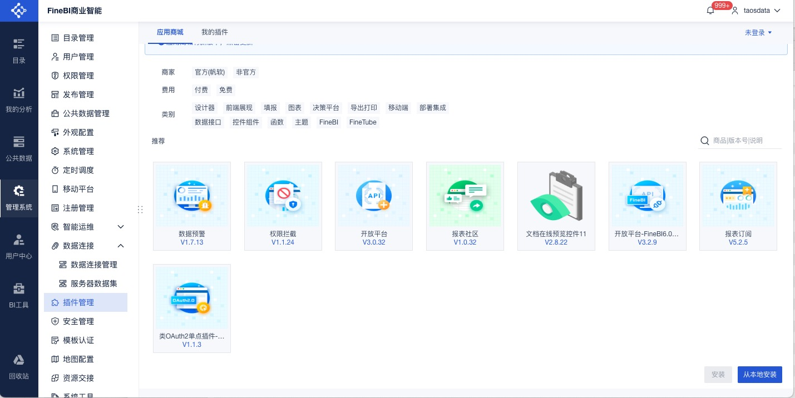 -->

1. Choose **Management System > Data Connection > Data Connection Management**. Open **Driver Management**, choose **New Driver**, and enter a name such as `tdengine-websocket`.

   <!-- 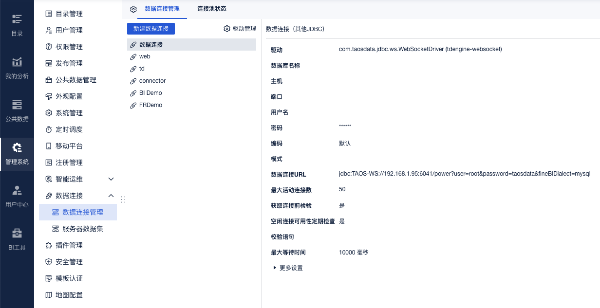 -->

1. Choose **Upload File** and upload the TDengine Java connector, such as `taos-jdbcdriver-3.4.0-dist.jar`. Select `com.taosdata.jdbc.ws.WebSocketDriver` from the driver list and save the driver.

   <!-- 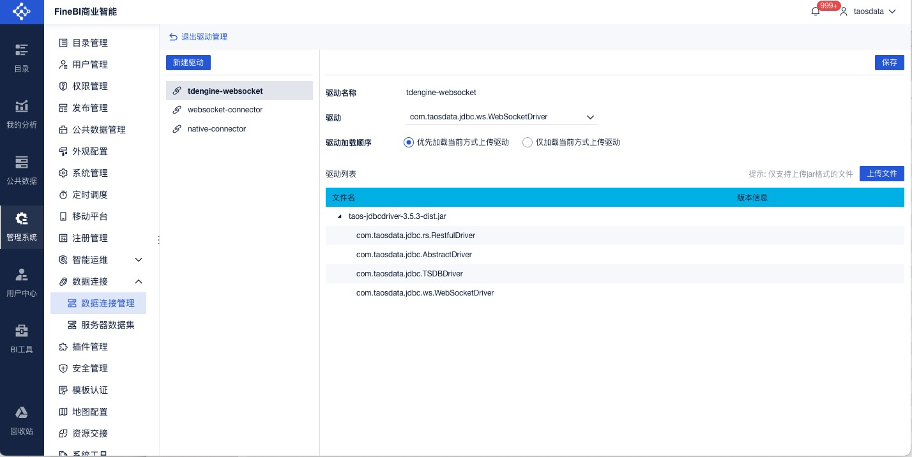 -->

1. On the **Data Connection Management** page, choose **New Data Connection > Other > Other JDBC**.

   <!-- 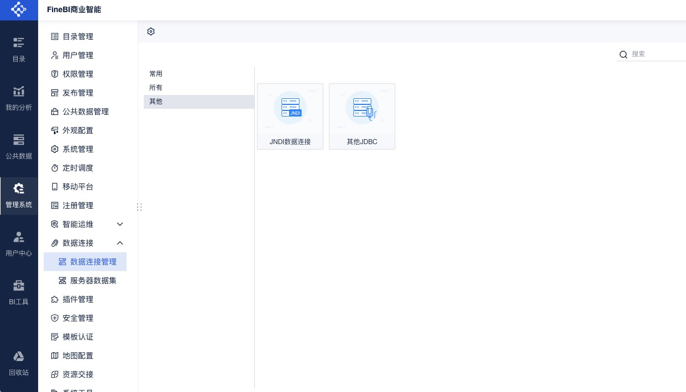 -->

1. Enter a connection name, choose **Custom** as the driver type, and select the configured driver. Enter a connection URL such as:

   ```text
   jdbc:TAOS-WS://localhost:6041/power?user=root&password=taosdata&fineBIDialect=mysql&varcharAsString=true
   ```

   Test the connection and save it after the test succeeds.

   :::tip

   `fineBIDialect=mysql` tells FineBI to parse and execute SQL using its MySQL dialect rules.

   :::

   <!-- 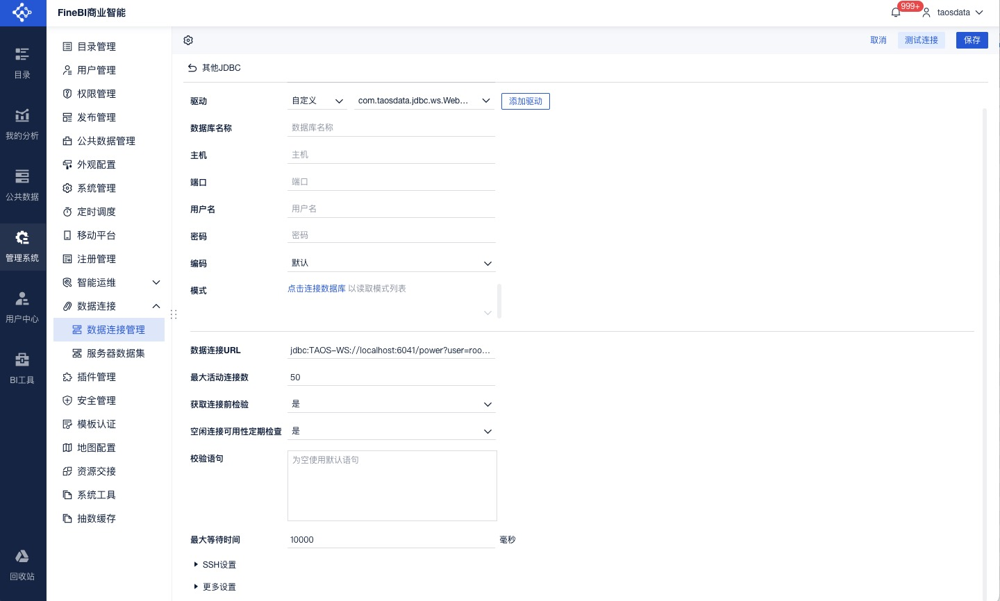 -->

## Analyze Data

### Prepare Data

1. Choose **Public Data**, create a folder such as `TDengine`, and use the **+** button to create either a database-table dataset or an SQL dataset.

   <!-- 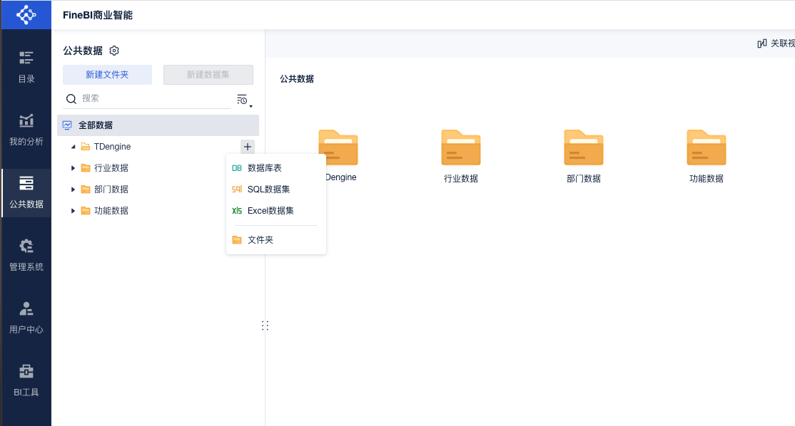 -->

1. To create a database-table dataset, select the TDengine connection, choose a table such as `meters`, and confirm the selection.

   <!-- 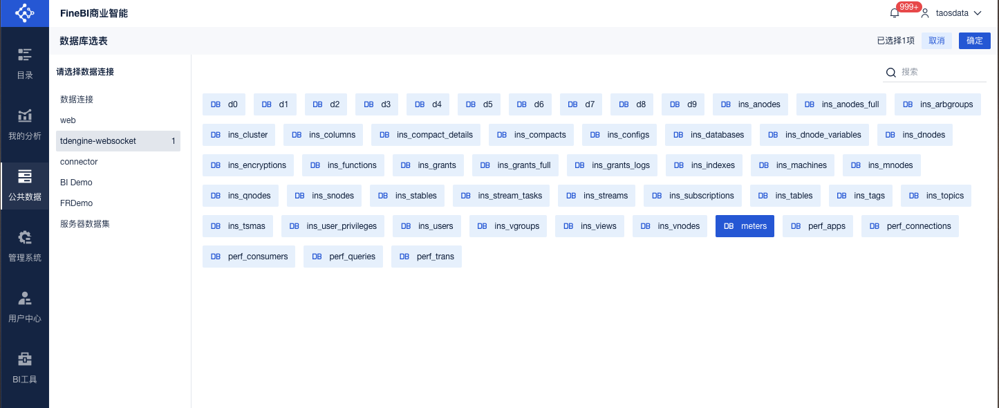 -->

   <!-- 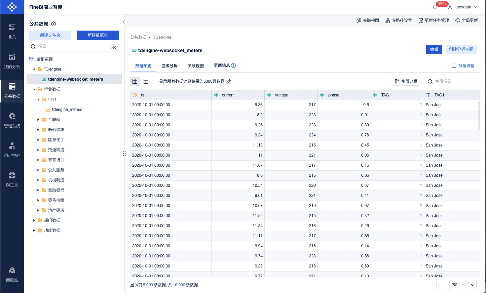 -->

1. To create an SQL dataset, enter a display name, select the TDengine connection, enter the SQL statement, preview the result, and confirm the dataset.

   <!-- 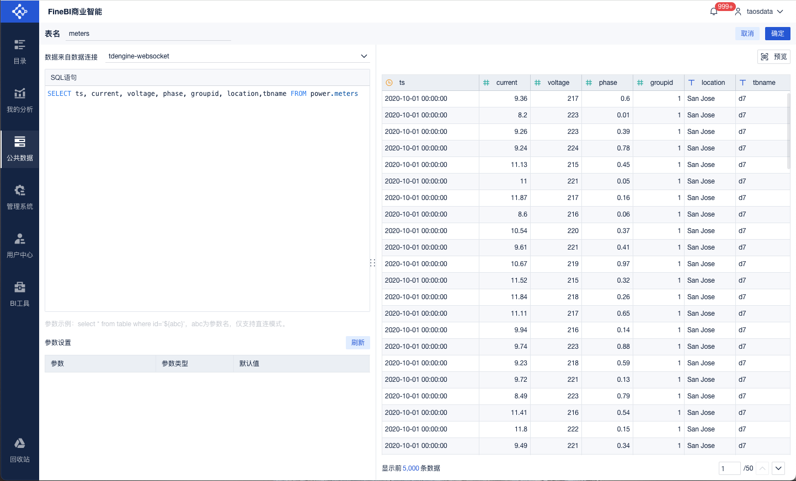 -->

### Smart Meter Example

1. Choose **My Analysis**, create a folder such as `TDengine`, and use the **+** button to create an analysis subject.

   <!-- 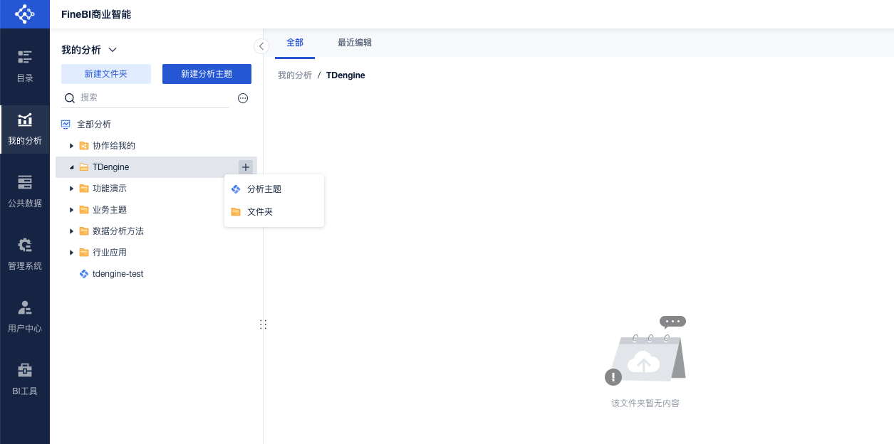 -->

1. Select a dataset such as `meters` and confirm the association.

   <!-- 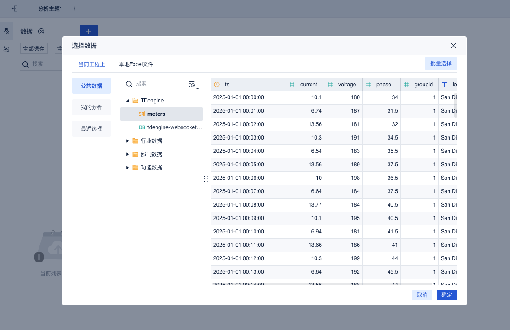 -->

1. Open the **Components** tab and drag fields to the horizontal or vertical axis to create a chart.

   <!-- 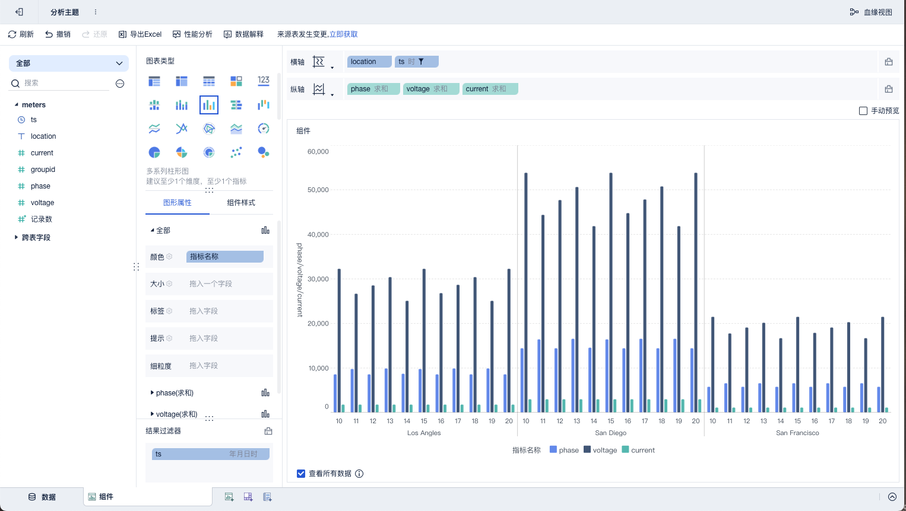 -->
