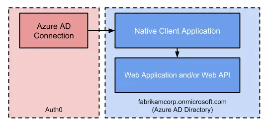
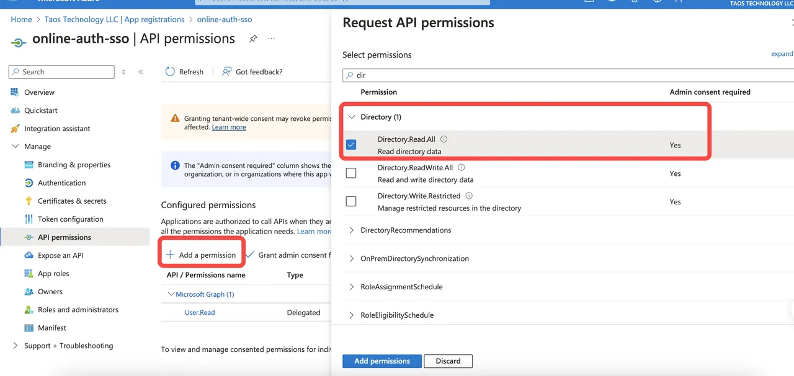
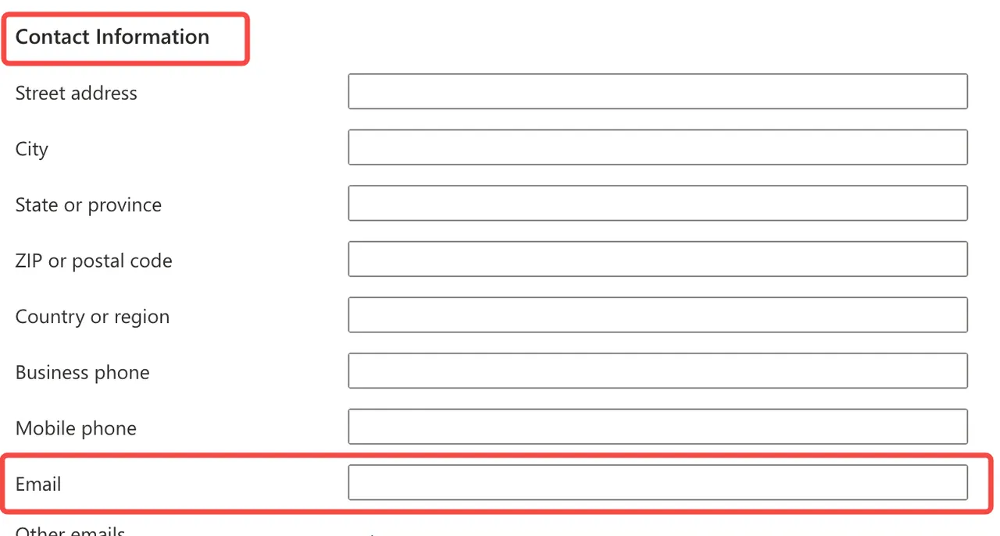

<!-- markdownlint-disable MD033 -->
## Introduction

Azure AD is the new enterprise single sign-on login method in TDengine Cloud, usually for Azure customers.
You can simply configure your Azure AD and TDengine Cloud integration in the TDengine Cloud portal.

For more details of the Azure AD SSO integration, please see the following Azure documents:  
[Register an application with the Microsoft identity platform](https://learn.microsoft.com/en-us/entra/identity-platform/quickstart-register-app)  
[Register your app for Auth0 with Azure AD](https://auth0.com/docs/authenticate/identity-providers/enterprise-identity-providers/azure-active-directory/v2#register-your-app-with-azure-ad)  

## Register an application for Azure AD

### Step 1: Sign in to the [Azure portal](https://portal.azure.com/)

### Step 2: Make sure you're using the Microsoft Entra tenant that contains your subscription

1. In the Azure portal toolbar, select the Directories + subscriptions icon.
2. On the Portal settings | Directories + subscriptions page, find your Microsoft Entra directory that contains your subscription in the Directory list, and then select Switch button next to it.

   

### Step 3: Register Application

1. On the portal homepage, select Microsoft Entra ID and click to enter the Microsoft Entra tenant management page.

   

2. Select "App Registrations" menu, then click "New Registration" button.

   

3. Input a Name for the application.

   

4. Under "Supported account types", please select "Accounts in this organizational directory only".

5. Under Redirect URI, select Web and enter `https://tdengine.us.auth0.com/login/callback`.

6. Click Register button to go to the next page.

7. Add permissions:

   

   Configure the following permissions for the Microsoft Graph API.

   | Delegated permissions          | Description                                                                    |
   |:-------------------------------|:-------------------------------------------------------------------------------|
   | **User > User.Read**             | So your app can log in the user and read the logged in user's profile.         |
   | **Directory > Directory.Read All** | Therefore, your app can read directory data on behalf of the logged in user.   |

8. Record the **application (client) ID** shown on the application overview page. You will need the client ID when configuring the identity provider in the next step.
9. Create client secret:
   1. Click New Client Secret.
   2. Enter a description for the key, for example "sso TDengine Cloud" , and click Add.

   

10. Record the application password that appears in the Value column. You will need the **client secret** when configuring the identity provider in the next section.

### Step 4: Configure Azure AD single sign-on in TDengine Cloud

1. Sign in to the [TDengine Cloud portal](https://cloud.tdengine.com/). (If you don’t have an account yet, please register an account as an administrator account first.)
2. Create an organization or edit an existing organization:
   1. Enable SSO and select **Azure AD** in the drop-down options.
   2. Input **Domain**, **Client ID** and **Client Secret** values which you configured in the Azure portal, and click the "Save SSO Config" button.
   3. Verify your configured Azure AD single sign-on integration.
    Save the SSO configuration successfully, and you can see a verified URL link returned on the interface. Click or copy the link to your browser to verify that your configuration is valid.
   4. After you verify your configuration, select the "Verified" option and click the Save button to create your organization. All members of the organization will sign on to TDengine Cloud through the Azure AD domain you have configured.
   5. Copy the unique TDengine Cloud login URL, such as `https://cloud.tdengine.com/auth/login?azure_sso=xxxx` to your organization and send it to your organization members to login to TDengine Cloud.

## How to update the Azure AD single sign-on configuration

1. Log in to TDengine Cloud as an administrator. Go to the Organization Management page. Click the Change Organization button.
2. Then you can modify the configuration of the Azure AD SSO configuration in the form. Only Client ID and Client Secret can be modified.

## How to invite a new Azure organization user to your TDengine Cloud organization

1. Create a new user under your Azure AD organization.
   1. Select “Manage”, then select “Users”. Click "New User", then fill in the user information to create a new organization user.
   2. Make sure to fill in a valid email address in the "Properties" --> "Contact information" Form. This is so that the users you invite can receive an email to activate their TDengine Cloud account.

      

2. Log in to TDengine Cloud to invite users using the organization you've created and configured with Azure AD SSO.
   1. In the top organization drop-down selection box, select the organization that has the Azure AD SSO tag.
   2. Click the "Users" menu on the left, then click "Add new user" button.
   3. In the pop-up box, fill in the contact email address configured by the user you added in the Azure organization in the previous step. The new user will then receive an email to activate their TDengine Cloud account.
   4. Notify the user to activate their account to join your TDengine Cloud organization using Azure AD SSO.
