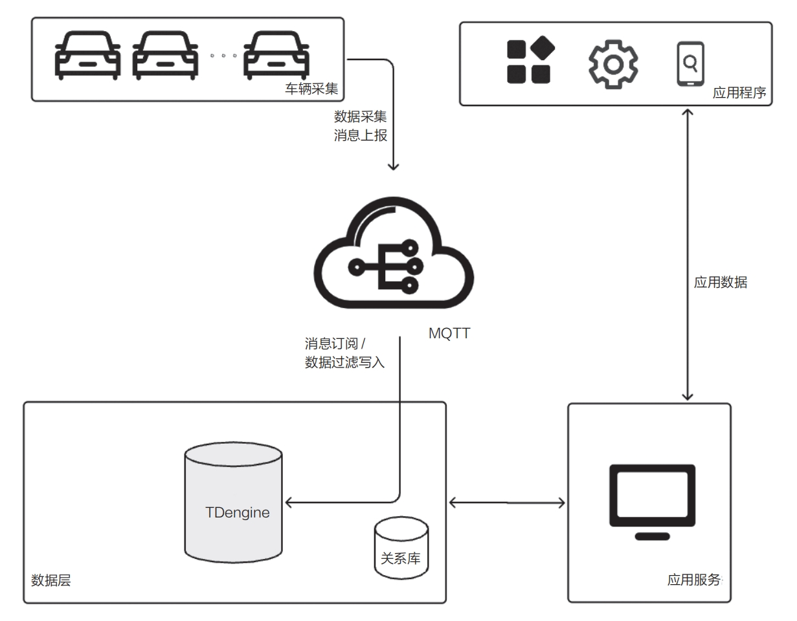

Connected vehicles generate continuous streams of location, speed, energy-consumption, diagnostic, and other operating data. A suitable time-series database must ingest and retain this data at scale while supporting real-time monitoring, historical analysis, and vehicle-management applications.

## Challenges in Connected-Vehicle Systems

Connected-vehicle data is predominantly time-series data. As fleets grow, systems must solve several related problems:

- **Massive ingestion:** Passenger and commercial vehicles use T-Box or OBD (On-Board Diagnostics) terminals to upload operating parameters. In one production example, each vehicle reports 140 high-frequency measurements every second and 280 lower-frequency measurements every 30 seconds. A fleet of 800,000 online vehicles produces about 4.5 TB per day.
- **Massive storage:** High ingest volume makes compression and storage cost critical. Hot and cold data should be separated automatically so frequently queried data remains on high-performance storage while older data moves to lower-cost media.
- **Out-of-order writes:** Vehicles cache data when connectivity is poor and upload it after communication resumes. Interleaving real-time and delayed data, together with message-queue consumption order, can create out-of-order writes and storage fragmentation.
- **Query and analysis:** The system must support standard SQL for status, duration, location, trajectory replay, route comparison, and alert analysis. It should also support UDFs for specialized algorithms not covered by built-in functions.

## Core Value of TDengine for Connected Vehicles

- **Simple ingestion:** Visual ingestion tasks can import and transform data from Kafka, MQTT, and other message systems without application code.
- **Efficient storage:** The one-vehicle-one-table model preserves the relationships among measurements from the same vehicle. Cloud-native scaling, tiered storage, columnar storage, and online capacity expansion improve both performance and cost.
- **Powerful analytics:** TDengine provides SQL, more than 70 built-in operators, state/count/time/event/session windows, and APIs for languages and BI tools. C and Python UDFs can extend the built-in analysis capabilities.

## Applications

Connected-vehicle systems use TDengine for component health monitoring, driving-behavior analysis, in-vehicle system security, compliance checks, network-quality monitoring, trajectory supervision, historical route replay, and latest-location queries. Geometry data and functions support location-based applications.

### Telematics Service Provider

Vehicle manufacturers collect speed, direction, accelerator position, brake-pedal position, gear, motor speed, battery-pack data, and other signals through T-Box terminals. MQTT carries the data to TDengine for real-time monitoring and historical trajectory replay.

<!--  -->

TDengine can subscribe to external queues, parse, filter, and map messages, and monitor ingestion-task status. The system uses one table per vehicle so records for each vehicle can normally be appended in time order while different vehicles remain independent.

- **High-frequency ingestion:** Multi-node, two- or three-replica clusters provide distributed deployment, high availability, and load balancing. A core node can manage up to one million subtables.
- **Tiered storage:** Hot data can remain on high-performance disks while cold data moves to S3-compatible object storage. Columnar continuous storage and lossless compression can reduce data to less than 10% of its original size.
- **Precomputation and caching:** Data blocks retain statistics such as max, min, avg, and count, and the latest-data cache provides millisecond-level access to current values.
- **Online reorganization:** Out-of-order data and fragments created by deletion can be reorganized without stopping normal writes or queries.
- **Integrated platform:** Message queues, stream processing, real-time caching, ETL, and database capabilities can be combined in one simpler architecture.

### Logistics Fleets

Logistics operators use trajectory supervision, anomaly alerts, historical replay, large-scale analysis, and visualization to monitor vehicles. A GIS gateway collects location and driving data from tens of thousands of vehicles, downstream services publish the parsed messages to a queue, and TDengine ingestion tasks load, filter, transform, and store the data.

The solution also follows the one-vehicle-one-table model:

- **Performance:** In one deployment serving 10,000 vehicles, daily writes reached about one billion records and lossless compression reduced the data to about 4% of its original size.
- **Out-of-order data:** Delayed uploads and queue ordering can write timestamps older than the latest vehicle record. TDengine can reorganize these records online and reclaim space from deleted ranges without relying only on index masking.
- **Data applications:** Latest-position queries remain millisecond-level as stored history grows, while historical route replay, mileage analysis, and time-segment analysis use the same data platform.
