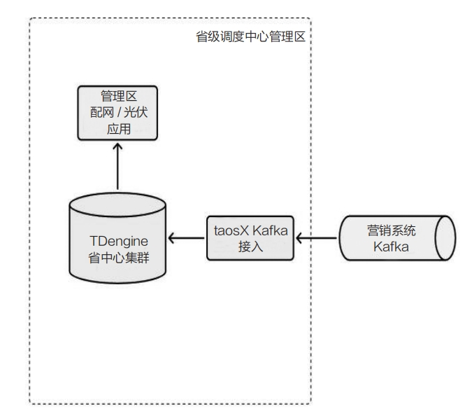
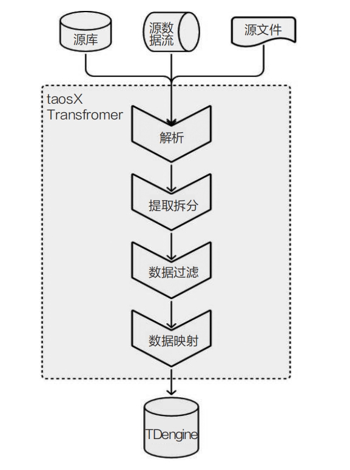
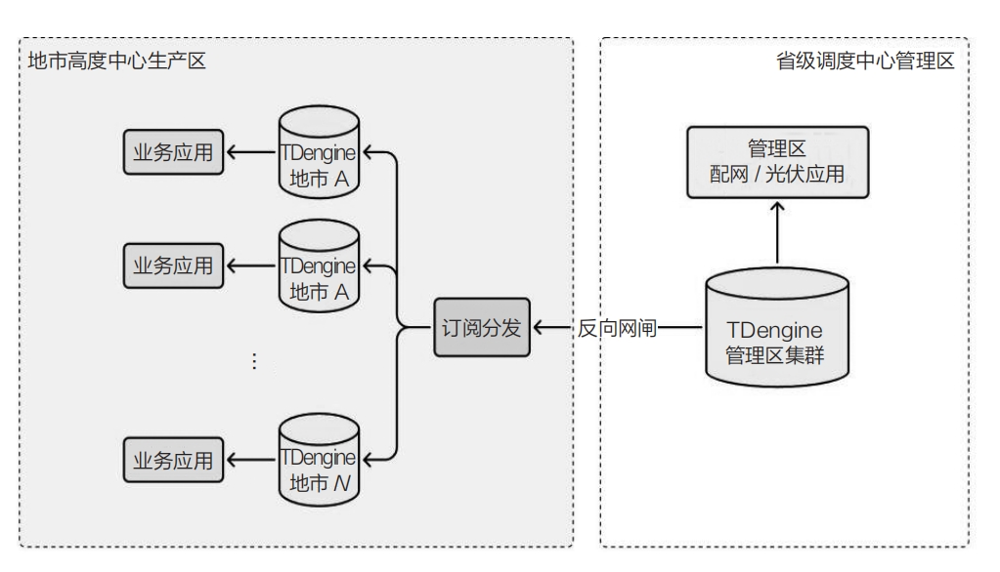

Distributed photovoltaic (PV) generation and energy storage are expanding rapidly. After these resources connect to the grid, operators must account for variable output, dispatch requirements, supply reliability, and system stability.

A distributed PV system installs panels on roofs, walls, farmland, or hillsides and supplies nearby consumers directly or connects through distribution transformers. A typical station includes PV panels, string inverters, distribution equipment, and a monitoring system. Utilities often use HPLC (High-speed Power Line Communication) to collect operating data at one-minute or 15-minute intervals.

Energy-storage systems smooth variable renewable output and support peak shaving. Their battery cells require continuous monitoring of current, voltage, temperature, internal resistance, and other parameters.

## Challenges in New-Energy Systems

- **Large numbers of measurements:** Large PV and storage installations contain hundreds of thousands to tens of millions of measurement points and generate high-frequency data that must be retained for long periods.
- **Difficult ingestion:** Dispatch centers need real-time operating data, but extraction rules are complex, source systems differ, and traditional collection solutions consume substantial resources.
- **Difficult distribution:** Data collected by a provincial dispatch center must be distributed quickly to municipal production systems.
- **Aggregation at scale:** Operators aggregate generation according to grid topology, such as region, distribution transformer, feeder, 10 kV line, and 110 kV main transformer. Existing approaches may be too slow for these multidimensional calculations.

## Core Value of TDengine for New Energy

- **Massive scale:** TDengine supports up to one billion time series, covering large PV fleets and battery-cell monitoring.
- **High performance:** The one-measurement-point-one-table model supports minute-level collection from tens of millions of points.
- **Fast latest-state queries:** Supertables and the latest-data cache let dispatch and operations systems retrieve current device and cell status quickly.
- **Subscription and distribution:** The built-in message queue simplifies real-time downstream distribution.
- **Open ecosystem:** TDengine integrates with common development languages, analytics systems, and big-data frameworks.

## Applications

### Ingesting Distributed-PV Data from Marketing Systems

PV operating data often enters the dispatch platform from an external marketing system over Kafka.

<!--  -->

TDengine TSDB Enterprise provides taosX for no-code ingestion from Kafka. Configuration defines extraction, parsing, filtering, and mapping before data is written into TDengine, eliminating a separate ETL application.

<!--  -->

taosX supports diverse source formats, filtering options, and mappings. Compared with general-purpose open-source ETL tools, it can reduce the CPU resources required for Kafka ingestion and shorten delivery time.

### Immediate Distribution to Municipal Dispatch Centers

Provincial dispatch centers can subscribe to instantaneous PV power in TDengine, classify records by municipality, and distribute them in real time to the corresponding TDengine systems. Municipal systems then use the data for local load regulation and other operations.

<!--  -->

### Aggregating Instantaneous Generation by Grid Topology

PV stations connect through distribution transformers and aggregate upward through 10 kV lines, feeders, and 110 kV main transformers. A province can contain millions of stations and transformers, each with 8 to 10 measurements, for a total exceeding ten million points.

TDengine typically models PV power and transformer power in separate supertables, with one subtable per station or transformer. Static tags record classification data such as region, transformer, feeder, 10 kV line, and 110 kV transformer. Applications can then aggregate by any of these dimensions without application-side joins.

```sql
SELECT sum(val) FROM dpv_power_1m WHERE ts > now-1m GROUP BY dtr;
```

Such conditional aggregation can return result sets ranging from hundreds to hundreds of thousands of records, commonly within seconds.

### Real-Time Monitoring

In energy-storage projects, TDengine records each cell's charge and discharge data for real-time safety monitoring and subsequent analysis.

### Intelligent Operations

In one storage operations system, station-side memory, CPU, and I/O limitations delayed deployment. TDengine met the workload with lower resource consumption and enabled remote monitoring, coordinated control, and operations capabilities.
