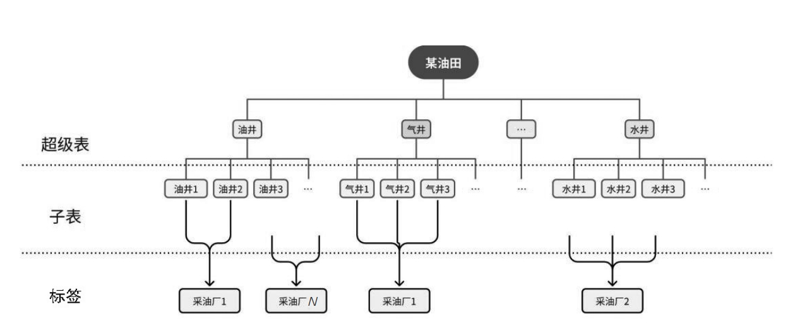
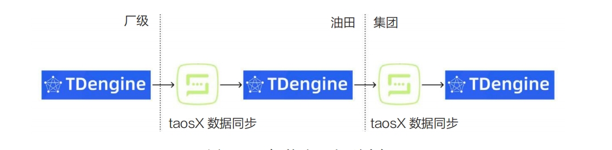

A smart oilfield, also called a digital or intelligent oilfield, combines information technology, sensors, and control equipment to update reservoir models and production data in real time. Its main characteristics include:

- **Data-driven decisions:** Operational decisions are based on field data rather than only experience and intuition.
- **Real-time monitoring:** Continuous collection and transmission help operators identify problems and prevent losses.
- **Intelligent decisions:** Analytics and predictive models provide deeper operational insight.
- **Automation:** Equipment performs repetitive, labor-intensive, and hazardous work to improve efficiency and safety.

## Challenges in Smart Oilfields

Oilfield systems must process drilling, mud-logging, well-logging, and production data while controlling storage cost through effective compression. They must also scale without service interruption as data and workloads grow.

High-value oilfield data requires continuous backup, health monitoring, recovery plans, encryption, and access control. Systems also need simple interfaces and standardized workflows so operational teams can use them efficiently.

## TDengine in Smart Oilfields

In one large oilfield modernization project, the required platform integrated:

- Automated field collection and control
- Production video monitoring
- Industrial IoT connectivity
- Production-data services
- Intelligent production-control applications
- Standardized information collection

Earlier solutions collected field data in conventional real-time databases and then moved it to Oracle for consolidation and analysis. As collection volume and frequency increased, this architecture suffered from slower writes and aggregation, low compression, concurrency and lock contention, complex partitioning and archiving, long recovery times, and poor synchronization efficiency.

TDengine addressed these problems with high write and query performance, compression, horizontal scaling, lifecycle management, and security controls. Its one-measurement-point-one-table and supertable model lets each business domain define a supertable, create one subtable per well, and attach static tags such as production plant and business unit.

<!--  -->

After migration from Oracle to TDengine, the project achieved:

- Higher write throughput with lower hardware consumption
- Online horizontal scaling
- Configurable data lifecycles
- Synchronization of five million measurement points per second for edge-cloud collaboration

Oilfield organizations often consolidate plant-level real-time data at a company or group headquarters for AI research, data mining, and predictive maintenance. TDengine and taosX can synchronize historical and newly generated data from distributed edge clusters to a central cluster.

<!--  -->

For example, the following command synchronizes historical and real-time data from `db1` to local database `db2`:

```shell
taosx run -f'taos://192.168.1.101:6030/db1?mode=all'-t'taos://localhost:6030/db2'-v
```

taosX can also synchronize data from subscriptions in event-arrival order so that both real-time records and later historical backfills reach the target. In one deployment, multiple provincial systems synchronized to a headquarters cluster containing 36 TB and more than 103.4 billion records, with compression below 10% of the original size.

This edge-cloud design supports horizontal scaling, real-time analysis, edge integration, and security while reducing storage and maintenance cost. Downsampling can retain representative points for long-term trends and integrate TDengine with a data platform based on systems such as Kudu.
