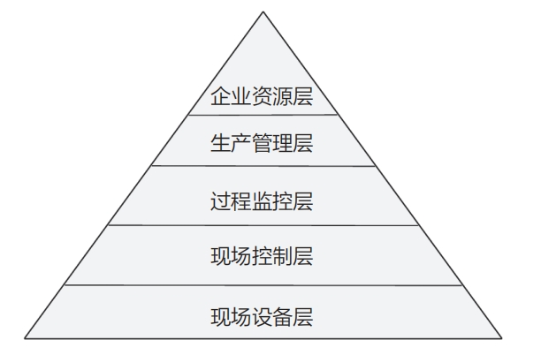
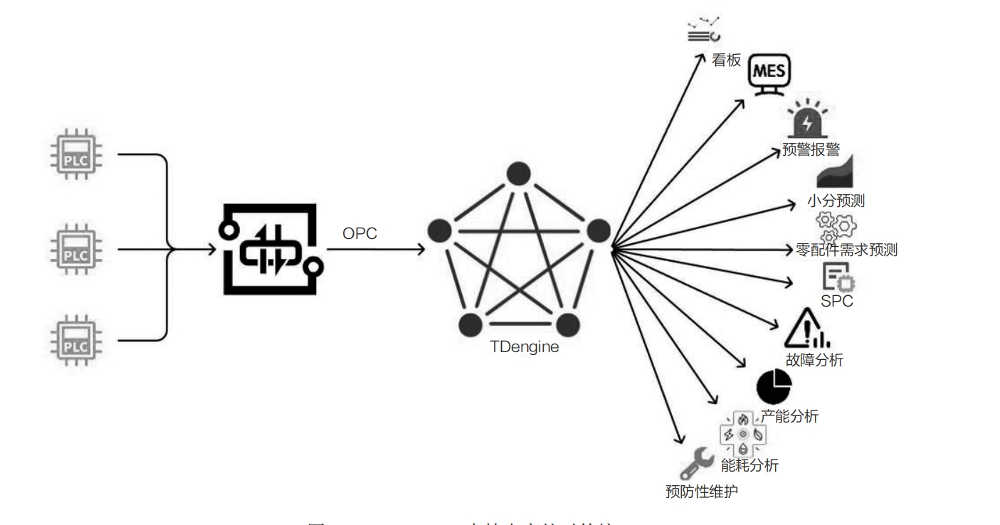
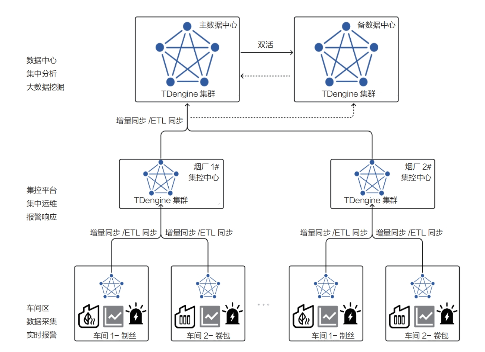

Smart manufacturing combines production equipment, industrial systems, and database technology. TDengine stores and analyzes data for real-time production-line monitoring, quality management, supply-chain coordination, and related applications.

## Challenges in Smart Manufacturing

The IEC 62264-1 hierarchy divides manufacturing systems into field devices, field control, process monitoring, production management, and enterprise resources.

<!--  -->

Digital manufacturing introduces several data challenges:

- **Massive device ingestion:** Factory measurement points have grown from thousands to hundreds of thousands or millions, exceeding the capacity of many traditional real-time databases.
- **Online scaling:** Initial hardware is often limited, but production systems cannot stop when capacity must expand.
- **Data relationships and multidimensional analysis:** Traditional industrial databases commonly store only variable name, value, quality, and timestamp, making richer analysis difficult.
- **Snapshot and interpolation queries:** Reports require historical snapshots and linear interpolation at specified intervals.
- **Third-party databases:** Production systems must collect real-time and historical data from SQL Server, Oracle, AVEVA PI System, AVEVA Historian, and similar systems, including resume-after-disconnection behavior.
- **SCADA integration:** SCADA databases may have limited analytics and measurement-point capacity, so they need a scalable analytical store.

## Core Value of TDengine for Smart Manufacturing

- **Broad system compatibility:** Visual collectors connect to SQL Server, MySQL, Oracle, AVEVA PI System, AVEVA Historian, InfluxDB, OpenTSDB, ClickHouse, Kafka, and industrial gateways such as Kepware and KingIOServer.
- **Cluster management:** A cloud-native architecture supports online vertical and horizontal expansion. Raft replication, automatic partitioning, high availability, and load balancing simplify operations.
- **Device model:** One table per device and supertable tags create a relationship model centered on physical assets.
- **Time-series analysis:** Snapshot, step, interpolation, state-duration, continuous-alert, and window queries support industrial analytics.

## Applications

In one tobacco-factory deployment, TDengine provides time-series services for dashboards, alerts, and other applications. The system has run for more than two years, stores more than two trillion records, and returns latest values with millisecond-level latency.

- **Efficient ingestion:** OPC and Kafka data enter TDengine without custom interfaces. Visual SQL Server and AVEVA Historian collectors provide incremental synchronization, historical migration, resume-after-disconnection, and diagnostics. Tasks that once required months of custom delivery can be configured in minutes.
- **Expansion and rebalancing:** Virtual nodes can be split to use additional CPU resources, or physical nodes can be added for automatic load redistribution without stopping service.
- **Wide tables:** Supertable columns and static tags support correlated, multidimensional analysis that fixed-format real-time databases cannot provide.
- **External interfaces:** TDengine supplies data to dashboards, MES, alerts, moisture prediction, spare-parts forecasting, SPC, fault analysis, capacity analysis, energy analysis, and predictive maintenance.

<!--  -->

- **SCADA integration:** SCADA systems use TDengine ODBC to store real-time and historical values, alarms, operation records, login information, and system events. Historical curves and reports respond faster and reduce pressure on the SCADA historian.

TDengine also supports edge-cloud deployment:

<!--  -->

Factory-side TDengine instances provide local storage, queries, and analysis while synchronizing data to a group data center. The synchronization design supports:

- **Statistical downsampling:** Stream processing computes representative lower-frequency data using SQL before synchronization.
- **Subscription-based transfer:** Kafka-like subscriptions isolate load, smooth traffic, provide at-least-once consumption, and resume after network interruption.
- **Operation synchronization:** Updates and deletions at the edge can be reflected at the center.
- **Transfer compression:** Compression can reduce bandwidth use, especially when combined with downsampling.
- **Flexible topology:** Many-to-one, one-to-many, and many-to-many synchronization are supported.
- **Active-active recovery:** Edge systems and clients can switch to a remote standby center and later synchronize cached and real-time data back after the primary recovers.
