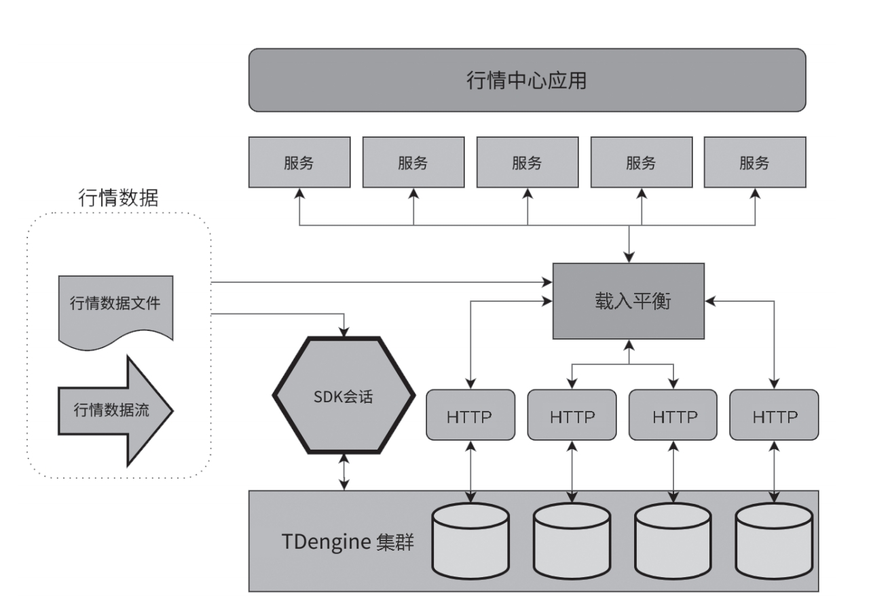

Financial institutions process large, high-frequency, and diverse time-series datasets. Market-data systems may retain terabytes of standardized data for 5 to 10 years, and some critical datasets for more than 30 years, while managing hundreds of thousands to tens of millions of instruments.

## Challenges in Processing Financial Time-Series Data

- **High-performance writes:** Real-time market feeds may require hundreds of millions of data points per second while preserving timeliness and integrity.
- **Read and consumption performance:** Quantitative research, model backtesting, strategy optimization, and real-time learning require rapid access to both live and historical data.
- **Computation:** Instrument and derivative monitoring requires statistical analysis, risk prediction, price discovery, and other low-latency calculations.

## Core Value of TDengine for Finance

- **Write performance:** TDengine can sustain up to 100 million data points per second in suitable deployments.
- **High availability:** Multi-replica storage and consistency mechanisms keep data available during node or network failures.
- **Query performance:** Queries against a single subtable can complete within milliseconds.
- **Compression:** Two-stage and floating-point compression reduce long-term storage cost.
- **Full-timeline access:** Historical ranges remain directly queryable for model training and validation.
- **Localized platforms:** TDengine supports domestic CPU architectures and operating systems used by financial institutions in China.

## Applications

### Quantitative Trading

Quantitative platforms combine market analysis, algorithms, and models to identify opportunities, manage risk, and adjust strategies. TDengine supports several important functions.

1. **Multi-source validation**

   - Compare feeds from multiple channels to verify authenticity and consistency.
   - Analyze differences between sources and identify erroneous or abnormal records.
   - Reduce investment errors caused by bad market data.

2. **Data lineage**

   - Track the origin and movement of each record for validation and audit.
   - Analyze transformation logic and dependencies.
   - Provide a unified, reliable view for downstream analysis.

3. **Intelligent monitoring and analysis**

   - Combine aggregation and stream processing for real-time market, volatility, and trading alerts.
   - Use high-speed reads with external AI models for analysis and prediction.
   - Adjust strategies with functions, UDFs, stream processing, and other computation frameworks.
   - Produce clear execution plans from market analysis and risk evaluation.

After files and live streams are loaded into TDengine, applications can access all time-series data through HTTP and other interfaces.

<!--  -->

### Market Data Center

A market data center collects, processes, stores, distributes, and displays information for securities trading, futures, quantitative investment, and risk management. Its core requirements are:

- **Real time:** Price and order changes must be available immediately.
- **Massive scale:** Data volume grows rapidly as markets and trading speeds increase.
- **High concurrency:** Real-time trading, backtesting, factor calculation, and risk systems access the same platform concurrently.
- **Stability:** Downtime or data inconsistency can cause direct financial loss.

TDengine addresses these requirements with high-throughput writes, millisecond or sub-millisecond reads in suitable workloads, concurrent access, long-term compressed storage, service availability, and strong data consistency. Production deployments at securities firms have used TDengine as the time-series core of market data centers for multiple years.
