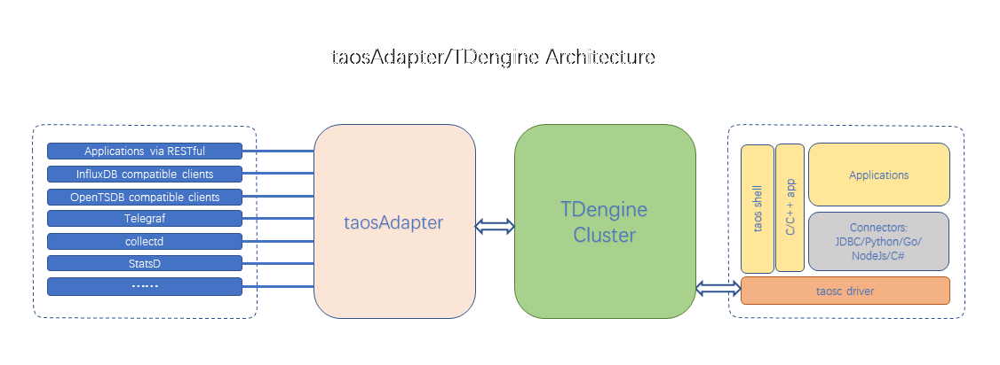

import Prometheus from "../../assets/resources/_prometheus.mdx"
import CollectD from "../../assets/resources/_collectd.mdx"
import StatsD from "../../assets/resources/_statsd.mdx"
import Icinga2 from "../../assets/resources/_icinga2.mdx"
import TCollector from "../../assets/resources/_tcollector.mdx"

taosAdapter is a companion tool for TDengine, serving as a bridge and adapter between the TDengine cluster and applications. It provides an easy and efficient way to ingest data directly from data collection agents (such as Telegraf, StatsD, collectd, etc.). It also offers InfluxDB/OpenTSDB compatible data ingestion interfaces, allowing InfluxDB/OpenTSDB applications to be seamlessly ported to TDengine.
The connectors of TDengine in various languages communicate with TDengine through the WebSocket interface, hence the taosAdapter must be installed.

The architecture diagram is as follows:



## Feature List

The taosAdapter provides the following features:

- WebSocket Interface:
  Supports executing SQL, schemaless writing, parameter binding, and data subscription through the WebSocket protocol.
- InfluxDB v1 write interface:
  [https://docs.influxdata.com/influxdb/v2.0/reference/api/influxdb-1x/write/](https://docs.influxdata.com/influxdb/v2.0/reference/api/influxdb-1x/write/)
- Compatible with OpenTSDB JSON and telnet format writing:
  - [http://opentsdb.net/docs/build/html/api_http/put.html](http://opentsdb.net/docs/build/html/api_http/put.html)
  - [http://opentsdb .net/docs/build/html/api_telnet/put.html](http://opentsdb.net/docs/build/html/api_telnet/put.html)
- collectd data writing:
  collectd is a system statistics collection daemon, visit [https://collectd.org/](https://collectd.org/) for more information.
- StatsD data writing:
  StatsD is a simple yet powerful daemon for gathering statistics. Visit [https://github.com/statsd/statsd](https://github.com/statsd/statsd) for more information.
- icinga2 OpenTSDB writer data writing:
  icinga2 is a software for collecting check results metrics and performance data. Visit [https://icinga.com/docs/icinga-2/latest/doc/14-features/#opentsdb-writer](https://icinga.com/docs/icinga-2/latest/doc/14-features/#opentsdb-writer) for more information.
- TCollector data writing:
  TCollector is a client process that collects data from local collectors and pushes it to OpenTSDB. Visit [http://opentsdb.net/docs/build/html/user_guide/utilities/tcollector.html](http://opentsdb.net/docs/build/html/user_guide/utilities/tcollector.html) for more information.
- OpenMetrics data collection and writing:
  OpenMetrics is an emerging standard in the field of cloud-native monitoring. It extends and standardizes the Prometheus metric format and has become the de facto standard for modern monitoring tools. Visit [OpenMetrics Specification](https://github.com/prometheus/OpenMetrics/blob/main/specification/OpenMetrics.md) for more information.
- Supports Prometheus remote_read and remote_write:
  remote_read and remote_write are Prometheus's data read-write separation cluster solutions. Visit [https://prometheus.io/blog/2019/10/10/remote-read-meets-streaming/#remote-apis](https://prometheus.io/blog/2019/10/10/remote-read-meets-streaming/#remote-apis) for more information.
- node_exporter data collection and writing:
  node_exporter is an exporter of machine metrics. Visit [https://github.com/prometheus/node_exporter](https://github.com/prometheus/node_exporter) for more information.
- JSON data writing:
  Supports writing JSON-formatted data to TDengine TSDB through the RESTful interface.
- RESTful API:
  [RESTful API](../../client-libraries/rest-api/)

### WebSocket Interface

Through the WebSocket interface of taosAdapter, connectors in various languages can achieve SQL execution, schemaless writing, parameter binding, and data subscription functionalities. Refer to the [Development Guide](../../../developer-guide/connecting-to-tdengine/#websocket-connection) for more details.

### InfluxDB v1 write interface

You can use any client that supports the HTTP protocol to write data in InfluxDB compatible format to TDengine by accessing the Restful interface URL `http://<fqdn>:6041/influxdb/v1/write`.

Supported InfluxDB parameters are as follows:

- `db` specifies the database name used by TDengine
- `precision` the time precision used by TDengine
- `u` TDengine username
- `p` TDengine password
- `ttl` the lifespan of automatically created subtables, determined by the TTL parameter of the first data entry in the subtable, which cannot be updated. For more information, please refer to the TTL parameter in the [table creation document](../../sql-manual/manage-tables/).
- `table_name_key` the custom tag key for subtable names. If set, the subtable name will use the value of this tag key

Note: Currently, InfluxDB's token authentication method is not supported, only Basic authentication and query parameter verification are supported.
Example: `curl --request POST http://127.0.0.1:6041/influxdb/v1/write?db=test --user "root:taosdata" --data-binary "measurement,host=host1 field1=2i,field2=2.0 1577836800000000000"`

### OpenTSDB JSON and telnet format writing

You can use any client that supports the HTTP protocol to write data in OpenTSDB compatible format to TDengine by accessing the Restful interface URL `http://<fqdn>:6041/<APIEndPoint>`. EndPoint as follows:

```text
/opentsdb/v1/put/json/<db>
/opentsdb/v1/put/telnet/<db>
```

### collectd data writing

<CollectD />

### StatsD data writing

<StatsD />

### icinga2 OpenTSDB writer data writing

<Icinga2 />

### TCollector data writing

<TCollector />

### OpenMetrics data collection and writing

OpenMetrics is an open standard supported by CNCF (Cloud Native Computing Foundation) that focuses on standardizing the collection and transmission of metric data. 
It serves as one of the core specifications for monitoring and observability systems in the cloud-native ecosystem.

Starting from version **3.3.7.0**, taosAdapter supports OpenMetrics v1.0.0 data collection and writing, 
while maintaining compatibility with Prometheus 0.0.4 protocol to ensure seamless integration with the Prometheus ecosystem.

To enable OpenMetrics data collection and writing, follow these steps:

1. Enable taosAdapter configuration by setting `open_metrics.enable`
2. Configure OpenMetrics related settings
3. Restart taosAdapter service

### Supports Prometheus remote_read and remote_write

<Prometheus />

### node_exporter data collection and writing

Starting with version **3.3.7.0**, you can use the OpenMetrics plugin as a replacement for node_exporter to perform data collection and writing.

An exporter used by Prometheus that exposes hardware and operating system metrics from \*NIX kernels

- Enable configuration of taosAdapter node_exporter.enable
- Set the relevant configuration for node_exporter
- Restart taosAdapter

### JSON data writing

taosAdapter has supported writing JSON-formatted data to TDengine TSDB through the RESTful interface since version **3.4.0.0**. You can use any HTTP-compatible client to send JSON-formatted data to TDengine TSDB via the POST RESTful endpoint at `http://<fqdn>:6041/input_json/v1/{endpoint}`.

The required JSON format is an array containing multiple rows of data, with each row being a JSON object. Each JSON object corresponds to a single data record. Data extraction can be defined through configuration files. If the input JSON format does not meet the requirements, it can be transformed using [JSONata](https://jsonata.org/) expressions(supports JSONata version 1.5.4).

A sample configuration is as follows (default configuration file path: `/etc/taos/taosadapter.toml`):

```toml
[input_json]
enable = true
[[input_json.rules]]
endpoint = "rule1"
dbKey = "db"
superTableKey = "stb"
subTableKey = "table"
timeKey = "time"
timeFormat = "datetime"
timezone = "UTC"
transformation = '''
$sort(
    (
        $ts := time;
        $each($, function($value, $key) {
            $key = "time" ? [] : (
                $each($value, function($groupValue, $groupKey) {
                    $each($groupValue, function($deviceValue, $deviceKey) {
                        {
                            "db": "test_input_json",
                            "time": $ts,
                            "location": $key,
                            "groupid": $number($split($groupKey, "_")[1]),
                            "stb": "meters",
                            "table": $deviceKey,
                            "current": $deviceValue.current,
                            "voltage": $deviceValue.voltage,
                            "phase": $deviceValue.phase
                        }
                    })[]
                })[]
            )
        })
    ).[*][*],
    function($l, $r) {
        $l.table > $r.table
    }
)
'''
fields = [
    {key = "current", optional = false},
    {key = "voltage", optional = false},
    {key = "phase", optional = false},
    {key = "location", optional = false},
    {key = "groupid", optional = false},
]
```

After modifying the configuration file, you need to restart the taosAdapter service for the changes to take effect.

Complete configuration parameter description:

- `input_json.enable`: Enable or disable the JSON data writing function (default value: `false`).
- `input_json.rules`: An array defining JSON data writing rules, allowing multiple rules to be configured.
  - `endpoint`: Specifies the endpoint name for the RESTful interface, allowing only uppercase and lowercase letters, numbers, as well as `_` and `-`.
  - `db`: Specifies the target database name for writing data, prohibiting the inclusion of backticks `` ` ``.
  - `dbKey`: Specifies the key name in the JSON object used to represent the database name. Cannot be configured simultaneously with `db`.
  - `superTable`: Specifies the target supertable name for writing data, prohibiting the inclusion of backticks `` ` ``.
  - `superTableKey`: Specifies the key name in the JSON object used to represent the supertable name. Cannot be configured simultaneously with `superTable`.
  - `subTable`: Specifies the target subtable name for writing data.
  - `subTableKey`: Specifies the key name in the JSON object used to represent the subtable name. Cannot be configured simultaneously with `subTable`.
  - `timeKey`: Specifies the key name in the JSON object used to represent the timestamp. Defaults to `ts` if not set.
  - `timeFormat`: Specifies the format for time parsing. Effective when timeKey is set. See [Time Parsing Format Description](#time-parsing-format-description) for supported formats.
  - `timezone`: Specifies the timezone for the timestamp. Effective when timeKey is set. Uses IANA timezone format, defaulting to the timezone of the machine where taosAdapter is located.
  - `transformation`: Uses JSONata expressions to transform the input JSON data to meet TDengine TSDB's data writing requirements. For specific syntax, refer to the [JSONata documentation](https://jsonata.org/).
  - `fields`: Defines the list of fields to be written, with each field containing the following attributes:
    - `key`: Specifies the key name in the JSON object used to represent the field value. Must match the database field name and cannot contain backticks `` ` ``.
    - `optional`: Specifies whether the field is optional. The default value is `false`, indicating the field is mandatory. An error will occur if the `key` does not exist. If set to `true`, the field is optional, and no error will be generated if the `key` is missing; the column will be excluded from the generated SQL.

Before writing data, ensure that the target database and supertable have been created. Assume the following database and supertable have been created:

```sql
create database test_input_json;
create table test_input_json.meters (ts timestamp, current float, voltage int, phase float) tags (location nchar(64), `groupid` int);
```

Request example:

```shell
```shell
curl -L 'http://localhost:6041/input_json/v1/rule1' \
-u root:taosdata \
-d '{"time":"2025-11-04 09:24:13.123","Los Angeles":{"group_1":{"d_001":{"current":10.5,"voltage":220,"phase":30},"d_002":{"current":15.2,"voltage":230,"phase":45},"d_003":{"current":8.7,"voltage":210,"phase":60}},"group_2":{"d_004":{"current":12.3,"voltage":225,"phase":15},"d_005":{"current":9.8,"voltage":215,"phase":75}}},"New York":{"group_1":{"d_006":{"current":11.0,"voltage":240,"phase":20},"d_007":{"current":14.5,"voltage":235,"phase":50}},"group_2":{"d_008":{"current":13.2,"voltage":245,"phase":10},"d_009":{"current":7.9,"voltage":220,"phase":80}}}}'
```

Response example:

```json
{
  "code": 0,
  "desc": "",
  "affected": 9
}
```

- `code`: Indicates the status code of the request. `0` indicates success, while non-`0` indicates failure.
- `desc`: Provides a description of the request. If `code` is non-`0`, it includes error information.
- `affected`: Indicates the number of records successfully written.

Check the write result:

```bash
taos> select tbname,* from test_input_json.meters order by tbname asc;
             tbname             |           ts            |       current        |   voltage   |        phase         |            location            |   groupid   |
======================================================================================================================================================================
 d_001                          | 2025-11-04 17:24:13.123 |                 10.5 |         220 |                   30 | Los Angeles                    |           1 |
 d_002                          | 2025-11-04 17:24:13.123 |                 15.2 |         230 |                   45 | Los Angeles                    |           1 |
 d_003                          | 2025-11-04 17:24:13.123 |                  8.7 |         210 |                   60 | Los Angeles                    |           1 |
 d_004                          | 2025-11-04 17:24:13.123 |                 12.3 |         225 |                   15 | Los Angeles                    |           2 |
 d_005                          | 2025-11-04 17:24:13.123 |                  9.8 |         215 |                   75 | Los Angeles                    |           2 |
 d_006                          | 2025-11-04 17:24:13.123 |                   11 |         240 |                   20 | New York                       |           1 |
 d_007                          | 2025-11-04 17:24:13.123 |                 14.5 |         235 |                   50 | New York                       |           1 |
 d_008                          | 2025-11-04 17:24:13.123 |                 13.2 |         245 |                   10 | New York                       |           2 |
 d_009                          | 2025-11-04 17:24:13.123 |                  7.9 |         220 |                   80 | New York                       |           2 |
```

The data has been successfully written to TDengine TSDB. Since TDengine is configured with the UTC+8 timezone, the time is displayed as `2025-11-04 17:24:13.123`.

#### Time Parsing Format Description

The following time format presets are available:

- `unix`: Timestamp as integer or floating-point number in seconds
- `unix_ms`: Timestamp as integer or floating-point number in milliseconds
- `unix_us`: Timestamp as integer or floating-point number in microseconds
- `unix_ns`: Timestamp as integer or floating-point number in nanoseconds
- `ansic`: Time format as `Mon Jan _2 15:04:05 2006`
- `rubydate`: Time format as `Mon Jan 02 15:04:05 -0700 2006`
- `rfc822z`: Time format as `02 Jan 06 15:04 -0700`
- `rfc1123z`: Time format as `Mon, 02 Jan 2006 15:04:05 -0700`
- `rfc3339`: Time format as `2006-01-02T15:04:05Z07:00`
- `rfc3339nano`: Time format as `2006-01-02T15:04:05.999999999Z07:00`
- `stamp`: Time format as `Jan _2 15:04:05`
- `stampmilli`: Time format as `Jan _2 15:04:05.000`
- `datetime`: Time format as `2006-01-02 15:04:05.999999999`

If these presets do not meet your requirements, you can extend the format using the [strftime parsing method](https://pkg.go.dev/github.com/ncruces/go-strftime@v1.0.0).

#### Transformation Example Description

For complex JSON data formats, you can use the `transformation` configuration with JSONata expressions to transform the input JSON data to meet TDengine TSDB's data writing requirements. You can use the [JSONata online editor](https://try.jsonata.org/) to debug and validate JSONata expressions.

Assume the input JSON data is as follows:

```json
{
    "time": "2025-11-04 09:24:13.123",
    "Los Angeles": {
        "group_1": {
            "d_001": {
                "current": 10.5,
                "voltage": 220,
                "phase": 30
            },
            "d_002": {
                "current": 15.2,
                "voltage": 230,
                "phase": 45
            },
            "d_003": {
                "current": 8.7,
                "voltage": 210,
                "phase": 60
            }
        },
        "group_2": {
            "d_004": {
                "current": 12.3,
                "voltage": 225,
                "phase": 15
            },
            "d_005": {
                "current": 9.8,
                "voltage": 215,
                "phase": 75
            }
        }
    },
    "New York": {
        "group_1": {
            "d_006": {
                "current": 11.0,
                "voltage": 240,
                "phase": 20
            },
            "d_007": {
                "current": 14.5,
                "voltage": 235,
                "phase": 50
            }
        },
        "group_2": {
            "d_008": {
                "current": 13.2,
                "voltage": 245,
                "phase": 10
            },
            "d_009": {
                "current": 7.9,
                "voltage": 220,
                "phase": 80
            }
        }
    }
}
```

Using the configuration from the example transformation expression, the converted data is as follows:

```json
[
  {
    "db": "test_input_json",
    "time": "2025-11-04 09:24:13.123",
    "location": "Los Angeles",
    "groupid": 1,
    "stb": "meters",
    "table": "d_001",
    "current": 10.5,
    "voltage": 220,
    "phase": 30
  },
  {
    "db": "test_input_json",
    "time": "2025-11-04 09:24:13.123",
    "location": "Los Angeles",
    "groupid": 1,
    "stb": "meters",
    "table": "d_002",
    "current": 15.2,
    "voltage": 230,
    "phase": 45
  },
  {
    "db": "test_input_json",
    "time": "2025-11-04 09:24:13.123",
    "location": "Los Angeles",
    "groupid": 1,
    "stb": "meters",
    "table": "d_003",
    "current": 8.7,
    "voltage": 210,
    "phase": 60
  },
  {
    "db": "test_input_json",
    "time": "2025-11-04 09:24:13.123",
    "location": "Los Angeles",
    "groupid": 2,
    "stb": "meters",
    "table": "d_004",
    "current": 12.3,
    "voltage": 225,
    "phase": 15
  },
  {
    "db": "test_input_json",
    "time": "2025-11-04 09:24:13.123",
    "location": "Los Angeles",
    "groupid": 2,
    "stb": "meters",
    "table": "d_005",
    "current": 9.8,
    "voltage": 215,
    "phase": 75
  },
  {
    "db": "test_input_json",
    "time": "2025-11-04 09:24:13.123",
    "location": "New York",
    "groupid": 1,
    "stb": "meters",
    "table": "d_006",
    "current": 11,
    "voltage": 240,
    "phase": 20
  },
  {
    "db": "test_input_json",
    "time": "2025-11-04 09:24:13.123",
    "location": "New York",
    "groupid": 1,
    "stb": "meters",
    "table": "d_007",
    "current": 14.5,
    "voltage": 235,
    "phase": 50
  },
  {
    "db": "test_input_json",
    "time": "2025-11-04 09:24:13.123",
    "location": "New York",
    "groupid": 2,
    "stb": "meters",
    "table": "d_008",
    "current": 13.2,
    "voltage": 245,
    "phase": 10
  },
  {
    "db": "test_input_json",
    "time": "2025-11-04 09:24:13.123",
    "location": "New York",
    "groupid": 2,
    "stb": "meters",
    "table": "d_009",
    "current": 7.9,
    "voltage": 220,
    "phase": 80
  }
]
```

It should be noted that the `$each` function in the transformation expression is used to iterate over the key-value pairs of a JSON Object. Although the documentation states that the return value of the `$each` function is an array, when there is only one key-value pair, the return value will be a single object instead of an array. Therefore, when using the `$each` function, it is necessary to wrap the result with `[]` to forcibly convert it into an array, ensuring consistency in subsequent processing.

For details, please refer to the [JSONata documentation](https://docs.jsonata.org/predicate#singleton-array-and-value-equivalence).

#### SQL Conversion Example

Taking the reference configuration example, inputting the JSON data from the [Transformation Example Description](#transformation-example-description), the generated SQL is as follows:

```sql
insert into `test_input_json`.`meters`(`tbname`,`ts`,`current`,`voltage`,`phase`,`location`,`groupid`)values
('d_001','2025-11-04T09:24:13.123Z',10.5,220,30,'Los Angeles',1)
('d_002','2025-11-04T09:24:13.123Z',15.2,230,45,'Los Angeles',1)
('d_003','2025-11-04T09:24:13.123Z',8.7,210,60,'Los Angeles',1)
('d_004','2025-11-04T09:24:13.123Z',12.3,225,15,'Los Angeles',2)
('d_005','2025-11-04T09:24:13.123Z',9.8,215,75,'Los Angeles',2)
('d_006','2025-11-04T09:24:13.123Z',11,240,20,'New York',1)
('d_007','2025-11-04T09:24:13.123Z',14.5,235,50,'New York',1)
('d_008','2025-11-04T09:24:13.123Z',13.2,245,10,'New York',2)
('d_009','2025-11-04T09:24:13.123Z',7.9,220,80,'New York',2)
```

SQL generation description:

1. The timestamp in the generated SQL will be parsed and converted according to the configured `timeFormat` and `timezone`, and ultimately formatted in RFC3339nano format when concatenated into the SQL statement.
2. Data will be grouped based on `db`, `superTable`, `subTable`, and the obtained `fields` (note that `optional` may be set to `true`, so the obtained data may not include all `fields`). After grouping, the data will be sorted in ascending time order before generating the SQL statement.
3. The generated SQL statements will be concatenated to approach approximately 1MB in size for batch writing to improve write performance. If the data volume is too large, it will be split into multiple SQL statements for writing.

#### Dry-run Mode

To facilitate debugging and validating the correctness of JSON configuration rules, taosAdapter provides a dry run mode. This mode can be enabled by adding the query parameter `dry_run=true` to the write request. In dry-run mode, taosAdapter does not write data to TDengine TSDB but instead returns the converted JSON and generated SQL statements for user review and validation.

Request example:

```shell
curl -L 'http://localhost:6041/input_json/v1/rule1?dry_run=true' \
-u root:taosdata \
-d '{"time":"2025-11-04 09:24:13.123","Los Angeles":{"group_1":{"d_001":{"current":10.5,"voltage":220,"phase":30},"d_002":{"current":15.2,"voltage":230,"phase":45},"d_003":{"current":8.7,"voltage":210,"phase":60}},"group_2":{"d_004":{"current":12.3,"voltage":225,"phase":15},"d_005":{"current":9.8,"voltage":215,"phase":75}}},"New York":{"group_1":{"d_006":{"current":11.0,"voltage":240,"phase":20},"d_007":{"current":14.5,"voltage":235,"phase":50}},"group_2":{"d_008":{"current":13.2,"voltage":245,"phase":10},"d_009":{"current":7.9,"voltage":220,"phase":80}}}}'
```

Response example:

```json
{
  "code": 0,
  "desc": "",
  "json": "[{\"current\":10.5,\"db\":\"test_input_json\",\"groupid\":1,\"location\":\"Los Angeles\",\"phase\":30,\"stb\":\"meters\",\"table\":\"d_001\",\"time\":\"2025-11-04 09:24:13.123\",\"voltage\":220},{\"current\":15.2,\"db\":\"test_input_json\",\"groupid\":1,\"location\":\"Los Angeles\",\"phase\":45,\"stb\":\"meters\",\"table\":\"d_002\",\"time\":\"2025-11-04 09:24:13.123\",\"voltage\":230},{\"current\":8.7,\"db\":\"test_input_json\",\"groupid\":1,\"location\":\"Los Angeles\",\"phase\":60,\"stb\":\"meters\",\"table\":\"d_003\",\"time\":\"2025-11-04 09:24:13.123\",\"voltage\":210},{\"current\":12.3,\"db\":\"test_input_json\",\"groupid\":2,\"location\":\"Los Angeles\",\"phase\":15,\"stb\":\"meters\",\"table\":\"d_004\",\"time\":\"2025-11-04 09:24:13.123\",\"voltage\":225},{\"current\":9.8,\"db\":\"test_input_json\",\"groupid\":2,\"location\":\"Los Angeles\",\"phase\":75,\"stb\":\"meters\",\"table\":\"d_005\",\"time\":\"2025-11-04 09:24:13.123\",\"voltage\":215},{\"current\":11,\"db\":\"test_input_json\",\"groupid\":1,\"location\":\"New York\",\"phase\":20,\"stb\":\"meters\",\"table\":\"d_006\",\"time\":\"2025-11-04 09:24:13.123\",\"voltage\":240},{\"current\":14.5,\"db\":\"test_input_json\",\"groupid\":1,\"location\":\"New York\",\"phase\":50,\"stb\":\"meters\",\"table\":\"d_007\",\"time\":\"2025-11-04 09:24:13.123\",\"voltage\":235},{\"current\":13.2,\"db\":\"test_input_json\",\"groupid\":2,\"location\":\"New York\",\"phase\":10,\"stb\":\"meters\",\"table\":\"d_008\",\"time\":\"2025-11-04 09:24:13.123\",\"voltage\":245},{\"current\":7.9,\"db\":\"test_input_json\",\"groupid\":2,\"location\":\"New York\",\"phase\":80,\"stb\":\"meters\",\"table\":\"d_009\",\"time\":\"2025-11-04 09:24:13.123\",\"voltage\":220}]",
  "sql": [
    "insert into `test_input_json`.`meters`(`tbname`,`ts`,`current`,`voltage`,`phase`,`location`,`groupid`)values('d_001','2025-11-04T09:24:13.123Z',10.5,220,30,'Los Angeles',1)('d_002','2025-11-04T09:24:13.123Z',15.2,230,45,'Los Angeles',1)('d_003','2025-11-04T09:24:13.123Z',8.7,210,60,'Los Angeles',1)('d_004','2025-11-04T09:24:13.123Z',12.3,225,15,'Los Angeles',2)('d_005','2025-11-04T09:24:13.123Z',9.8,215,75,'Los Angeles',2)('d_006','2025-11-04T09:24:13.123Z',11,240,20,'New York',1)('d_007','2025-11-04T09:24:13.123Z',14.5,235,50,'New York',1)('d_008','2025-11-04T09:24:13.123Z',13.2,245,10,'New York',2)('d_009','2025-11-04T09:24:13.123Z',7.9,220,80,'New York',2)"
  ]
}
```

- `code`: Indicates the status code of the request. `0` indicates success, while non-`0` indicates failure.
- `desc`: Provides a description of the request. If `code` is non-`0`, it includes error information.
- `json`: Represents the converted JSON data.
- `sql`: Represents the array of generated SQL statements.

### RESTful API

You can use any client that supports the HTTP protocol to write data to TDengine or query data from TDengine by accessing the RESTful interface URL `http://<fqdn>:6041/rest/sql`. For details, please refer to the [REST API documentation](../../client-libraries/rest-api/).

## Installation

taosAdapter is part of the TDengine server software. If you are using TDengine server, you do not need any additional steps to install taosAdapter. If you need to deploy taosAdapter separately from the TDengine server, you should install the complete TDengine on that server to install taosAdapter. If you need to compile taosAdapter from source code, you can refer to the [Build taosAdapter](https://github.com/taosdata/taosadapter/blob/3.0/BUILD.md) document.

After the installation is complete, you can start the taosAdapter service using the command `systemctl start taosadapter`.

## Configuration

taosAdapter supports configuration through command-line parameters, environment variables, and configuration files. The default configuration file is `/etc/taos/taosadapter.toml`, and you can specify the configuration file using the -c or --config command-line parameter..

Command-line parameters take precedence over environment variables, which take precedence over configuration files. The command-line usage is arg=val, such as taosadapter -p=30000 --debug=true.

See the example configuration file at [example/config/taosadapter.toml](https://github.com/taosdata/taosadapter/blob/3.0/example/config/taosadapter.toml).

### Basic Configuration

The basic configuration parameters for `taosAdapter` are as follows:

- **`debug`**: Whether to enable debug mode (pprof)
  - **When set to `true` (default)**: Enables Go pprof debug mode, allowing access to debug information via `http://<fqdn>:<port>/debug/pprof`.
  - **When set to `false`**: Disables debug mode, preventing access to debug information.

- **`instanceId`**: The instance ID of `taosAdapter`, used to distinguish logs from different instances. Default value: `32`.

- **`port`**: The port on which `taosAdapter` provides HTTP/WebSocket services. Default value: `6041`.

- **`taosConfigDir`**: The configuration file directory for TDengine. Default value: `/etc/taos`. The `taos.cfg` file in this directory will be loaded.

Starting from version 3.3.4.0, taosAdapter supports setting the number of concurrent calls for invoking C methods:

- **`maxAsyncConcurrentLimit`**

  Sets the maximum number of concurrent calls for C asynchronous methods (`0` means using the number of CPU cores).

- **`maxSyncConcurrentLimit`**

  Sets the maximum number of concurrent calls for C synchronous methods (`0` means using the number of CPU cores).

### Cross-Origin Configuration

When making API calls from the browser, please configure the following Cross-Origin Resource Sharing (CORS) parameters based on your actual situation:

- **`cors.allowAllOrigins`**: Whether to allow all origins to access, default is true.
- **`cors.allowOrigins`**: A comma-separated list of origins allowed to access. Multiple origins can be specified.
- **`cors.allowHeaders`**: A comma-separated list of request headers allowed for cross-origin access. Multiple headers can be specified.
- **`cors.exposeHeaders`**: A comma-separated list of response headers exposed for cross-origin access. Multiple headers can be specified.
- **`cors.allowCredentials`**: Whether to allow cross-origin requests to include user credentials, such as cookies, HTTP authentication information, or client SSL certificates.
- **`cors.allowWebSockets`**: Whether to allow WebSockets connections.

If you are not making API calls through a browser, you do not need to worry about these configurations.

The above configurations take effect for the following interfaces:

- RESTful API requests
- WebSocket API requests
- InfluxDB v1 write interface
- OpenTSDB HTTP write interface

For details about the CORS protocol, please refer to: [https://www.w3.org/wiki/CORS_Enabled](https://www.w3.org/wiki/CORS_Enabled) or [https://developer.mozilla.org/docs/Web/HTTP/CORS](https://developer.mozilla.org/docs/Web/HTTP/CORS).

### Connection Pool Configuration

taosAdapter uses a connection pool to manage connections to TDengine, improving concurrency performance and resource utilization. The connection pool configuration applies to the following interfaces, and these interfaces share a single connection pool:

- RESTful API requests
- InfluxDB v1 write interface
- OpenTSDB JSON and telnet format writing
- Telegraf data writing
- collectd data writing
- StatsD data writing
- node_exporter data collection writing
- OpenMetrics data collection and writing
- Prometheus remote_read and remote_write

The configuration parameters for the connection pool are as follows:

- **`pool.maxConnect`**: The maximum number of connections allowed in the pool, default is twice the number of CPU cores. It is recommended to keep the default setting.
- **`pool.maxIdle`**: The maximum number of idle connections in the pool, default is the same as `pool.maxConnect`. It is recommended to keep the default setting.
- **`pool.idleTimeout`**: Connection idle timeout, default is never timeout. It is recommended to keep the default setting.
- **`pool.waitTimeout`**: Timeout for obtaining a connection from the pool, default is set to 60 seconds. If a connection is not obtained within the timeout period, HTTP status code 503 will be returned. This parameter is available starting from version 3.3.3.0.
- **`pool.maxWait`**: The maximum number of requests waiting to get a connection in the pool, default is 0, which means no limit. When the number of queued requests exceeds this value, new requests will return HTTP status code 503. This parameter is available starting from version 3.3.3.0.

### HTTP Response Code Configuration

taosAdapter uses the parameter `httpCodeServerError` to set whether to return a non-200 HTTP status code when the C interface returns an error. When set to true, it will return different HTTP status codes based on the error code returned by C. See [HTTP Response Codes](../../client-libraries/rest-api/) for details.

This configuration only affects the **RESTful interface**.

Parameter Description:

- **`httpCodeServerError`**:
  - **When set to `true`**: Map the error code returned by the C interface to the corresponding HTTP status code.
  - **When set to `false`**: Regardless of the error returned by the C interface, always return the HTTP status code `200` (default value).

### Memory limit configuration

taosAdapter will monitor the memory usage during its operation and adjust it through two thresholds. The valid value range is an integer from 1 to 100, and the unit is the percentage of system physical memory.

This configuration only affects the following interfaces:

- RESTful interface request
- InfluxDB v1 write interface
- OpenTSDB HTTP write interface
- Prometheus remote_read and remote_write interfaces

#### Parameter Description

- **`pauseQueryMemoryThreshold`**:
  - When memory usage exceeds this threshold, taosAdapter will stop processing query requests.
  - Default value: `70` (i.e. 70% of system physical memory).
- **`pauseAllMemoryThreshold`**:
  - When memory usage exceeds this threshold, taosAdapter will stop processing all requests (including writes and queries).
  - Default value: `80` (i.e. 80% of system physical memory).

When memory usage falls below the threshold, taosAdapter will automatically resume the corresponding function.

#### HTTP return content

- **When `pauseQueryMemoryThreshold` is exceeded**:
  - HTTP status code: `503`
  - Return content: `"query memory exceeds threshold"`

- **When `pauseAllMemoryThreshold` is exceeded**:
  - HTTP status code: `503`
  - Return content: `"memory exceeds threshold"`

#### Status check interface

The memory status of taosAdapter can be checked through the following interface:

- **Normal status**: `http://<fqdn>:6041/-/ping` returns `code 200`.
- **Memory exceeds threshold**:
  - If the memory exceeds `pauseAllMemoryThreshold`, `code 503` is returned.
  - If the memory exceeds `pauseQueryMemoryThreshold` and the request parameter contains `action=query`, `code 503` is returned.

#### Related configuration parameters

- **`monitor.collectDuration`**: memory monitoring interval, default value is `3s`, environment variable is `TAOS_MONITOR_COLLECT_DURATION`.
- **`monitor.incgroup`**: whether to run in a container (set to `true` for running in a container), default value is `false`, environment variable is `TAOS_MONITOR_INCGROUP`.
- **`monitor.pauseQueryMemoryThreshold`**: memory threshold (percentage) for query request pause, default value is `70`, environment variable is `TAOS_MONITOR_PAUSE_QUERY_MEMORY_THRESHOLD`.
- **`monitor.pauseAllMemoryThreshold`**: memory threshold (percentage) for query and write request pause, default value is `80`, environment variable is `TAOS_MONITOR_PAUSE_ALL_MEMORY_THRESHOLD`.

You can make corresponding adjustments based on the specific project application scenario and operation strategy, and it is recommended to use operation monitoring software to monitor the system memory status in a timely manner. The load balancer can also check the operation status of taosAdapter through this interface.

### Schemaless write create DB configuration

Starting from **version 3.0.4.0**, taosAdapter provides the parameter `smlAutoCreateDB` to control whether to automatically create a database (DB) when writing to the schemaless protocol.

The `smlAutoCreateDB` parameter only affects the following interfaces:

- InfluxDB v1 write interface
- OpenTSDB JSON and telnet format writing
- Telegraf data writing
- collectd data writing
- StatsD data writing
- node_exporter data writing
- OpenMetrics data collection and writing

#### Parameter Description

- **`smlAutoCreateDB`**:
  - **When set to `true`**: When writing to the schemaless protocol, if the target database does not exist, taosAdapter will automatically create the database.
  - **When set to `false`**: The user needs to manually create the database, otherwise the write will fail (default value).

### Number of results returned configuration

taosAdapter provides the parameter `restfulRowLimit` to control the number of results returned by the HTTP interface.

The `restfulRowLimit` parameter only affects the return results of the following interfaces:

- RESTful interface
- Prometheus remote_read interface

#### Parameter Description

- **`restfulRowLimit`**:
  - **When set to a positive integer**: The number of results returned by the interface will not exceed this value.
  - **When set to `-1`**: The number of results returned by the interface is unlimited (default value).

### Log configuration

The log can be configured with the following parameters:

- **`log.path`**

  Specifies the log storage path (Default: `"/var/log/taos"`).

- **`log.level`**

  Sets the log level (Default: `"info"`).

- **`log.keepDays`**

  Number of days to retain logs (Positive integer, Default: `30`).

- **`log.rotationCount`**

  Number of log files to rotate (Default: `30`).

- **`log.rotationSize`**

  Maximum size of a single log file (Supports KB/MB/GB units, Default: `"1GB"`).

- **`log.compress`**

  Whether to compress old log files (Default: `false`).

- **`log.rotationTime`**

  Log rotation interval (Deprecated, fixed at 24-hour rotation).

- **`log.reservedDiskSize`**

  Disk space reserved for log directory (Supports KB/MB/GB units, Default: `"1GB"`).

- **`log.enableSqlToCsvLogging`**

  Whether to record SQL to CSV files(Default: `false`).For details, see [Recording SQL to CSV Files](#recording-sql-to-csv-files).

- **`log.enableRecordHttpSql`**

  **It is not recommended to continue using this parameter. We suggest using [Recording SQL to CSV Files](#recording-sql-to-csv-files) as the alternative solution.**
  Whether to record HTTP SQL requests (Default: `false`).

- **`log.sqlRotationCount`**

  **It is not recommended to continue using this parameter. We suggest using [Recording SQL to CSV Files](#recording-sql-to-csv-files) as the alternative solution.**
  Number of SQL log files to rotate (Default: `2`).

- **`log.sqlRotationSize`**

  **It is not recommended to continue using this parameter. We suggest using [Recording SQL to CSV Files](#recording-sql-to-csv-files) as the alternative solution.**
  Maximum size of a single SQL log file (Supports KB/MB/GB units, Default: `"1GB"`).

- **`log.sqlRotationTime`**

  **It is not recommended to continue using this parameter. We suggest using [Recording SQL to CSV Files](#recording-sql-to-csv-files) as the alternative solution.**
  SQL log rotation interval (Default: `24h`).

1. You can set the taosAdapter log output detail level by setting the --log.level parameter or the environment variable TAOS_ADAPTER_LOG_LEVEL. Valid values include: panic, fatal, error, warn, warning, info, debug, and trace.
2. Starting from **3.3.5.0 version**, taosAdapter supports dynamic modification of log level through HTTP interface. Users can dynamically adjust the log level by sending HTTP PUT request to /config interface. The authentication method of this interface is the same as /rest/sql interface, and the configuration item key-value pair in JSON format must be passed in the request body.

The following is an example of setting the log level to debug through the curl command:

```shell
curl --location --request PUT 'http://127.0.0.1:6041/config' \
-u root:taosdata \
--data '{"log.level": "debug"}'
```

### Third-party Data Source Configuration

#### Collectd Configuration

- **`collectd.enable`**

  Enable/disable collectd protocol support (Default: `false`)

- **`collectd.port`**

  Collectd service listening port (Default: `6045`)

- **`collectd.db`**

  Target database for collectd data (Default: `"collectd"`)

- **`collectd.user`**

  Database username (Default: `"root"`)

- **`collectd.password`**

  Database password (Default: `"taosdata"`)

- **`collectd.ttl`**

  Data time-to-live (Default: `0` = no expiration)

- **`collectd.worker`**

  Number of write worker threads (Default: `10`)

#### InfluxDB Configuration

- **`influxdb.enable`**

  Enable/disable InfluxDB protocol support (Default: `true`)

#### OpenTSDB Configuration

- **`opentsdb.enable`**

  Enable OpenTSDB HTTP protocol (Default: `true`)

- **`opentsdb_telnet.enable`**

  Enable OpenTSDB Telnet (Warning: no auth, Default: `false`)

- **`opentsdb_telnet.ports`**

  Listening ports (Default: `[6046,6047,6048,6049]`)

- **`opentsdb_telnet.dbs`**

  Target databases (Default: `["opentsdb_telnet","collectd_tsdb","icinga2_tsdb","tcollector_tsdb"]`)

- **`opentsdb_telnet.user`**

  Database username (Default: `"root"`)

- **`opentsdb_telnet.password`**

  Database password (Default: `"taosdata"`)

- **`opentsdb_telnet.ttl`**

  Data TTL (Default: `0`)

- **`opentsdb_telnet.batchSize`**

  Batch write size (Default: `1`)

- **`opentsdb_telnet.flushInterval`**

  Flush interval (Default: `0s`)

- **`opentsdb_telnet.maxTCPConnections`**

  Max TCP connections (Default: `250`)

- **`opentsdb_telnet.tcpKeepAlive`**

  Enable TCP KeepAlive (Default: `false`)

#### StatsD Configuration

- **`statsd.enable`**

  Enable StatsD protocol (Default: `false`)

- **`statsd.port`**

  Listening port (Default: `6044`)

- **`statsd.protocol`**

  Transport protocol (Options: tcp/udp/tcp4/udp4, Default: `"udp4"`)

- **`statsd.db`**

  Target database (Default: `"statsd"`)

- **`statsd.user`**

  Database username (Default: `"root"`)

- **`statsd.password`**

  Database password (Default: `"taosdata"`)

- **`statsd.ttl`**

  Data TTL (Default: `0`)

- **`statsd.gatherInterval`**

  Collection interval (Default: `5s`)

- **`statsd.worker`**

  Worker threads (Default: `10`)

- **`statsd.allowPendingMessages`**

  Max pending messages (Default: `50000`)

- **`statsd.maxTCPConnections`**

  Max TCP connections (Default: `250`)

- **`statsd.tcpKeepAlive`**

  Enable TCP KeepAlive (Default: `false`)

- **`statsd.deleteCounters`**

  Clear counter cache after collection (Default: `true`)

- **`statsd.deleteGauges`**

  Clear gauge cache after collection (Default: `true`)

- **`statsd.deleteSets`**

  Clear sets cache after collection (Default: `true`)

- **`statsd.deleteTimings`**

  Clear timings cache after collection (Default: `true`)

#### Prometheus Configuration

- **`prometheus.enable`**

  Enable Prometheus protocol (Default: `true`)

#### OpenMetrics Configuration

- **`open_metrics.enable`**

  Enable/disable OpenMetrics data collection (Default: `false`).

- **`open_metrics.user`**

  Username for TDengine connection (Default: `"root"`).

- **`open_metrics.password`**

  Password for TDengine connection (Default: `"taosdata"`).

- **`open_metrics.urls`**

  List of OpenMetrics data collection endpoints (Default: `["http://localhost:9100"]`, automatically appends `/metrics` if no route specified).

- **`open_metrics.dbs`**

  Target databases for data writing (Default: `["open_metrics"]`, must match number of collection URLs).

- **`open_metrics.responseTimeoutSeconds`**

  Collection timeout in seconds (Default: `[5]`, must match number of collection URLs).

- **`open_metrics.httpUsernames`**

  Basic authentication usernames (If enabled, must match number of collection URLs, Default: empty).

- **`open_metrics.httpPasswords`**

  Basic authentication passwords (If enabled, must match number of collection URLs, Default: empty).

- **`open_metrics.httpBearerTokenStrings`**

  Bearer token authentication strings (If enabled, must match number of collection URLs, Default: empty).

- **`open_metrics.caCertFiles`**

  Root certificate file paths (If enabled, must match number of collection URLs, Default: empty).

- **`open_metrics.certFiles`**

  Client certificate file paths (If enabled, must match number of collection URLs, Default: empty).

- **`open_metrics.keyFiles`**

  Client certificate key file paths (If enabled, must match number of collection URLs, Default: empty).

- **`open_metrics.insecureSkipVerify`**

  Skip HTTPS certificate verification (Default: `true`).

- **`open_metrics.gatherDurationSeconds`**

  Collection interval in seconds (Default: `[5]`, must match number of collection URLs).

- **`open_metrics.ttl`**

  Table Time-To-Live in seconds (`0` means no expiration, if enabled must match number of collection URLs, Default: empty).

- **`open_metrics.ignoreTimestamp`**

  Ignore timestamps in collected data (uses collection time if ignored, Default: `false`).

#### Node Exporter Configuration

- **`node_exporter.enable`**

  Enable node_exporter data collection (Default: `false`)

- **`node_exporter.db`**

  Target database name (Default: `"node_exporter"`)

- **`node_exporter.urls`**

  Service endpoints (Default: `["http://localhost:9100"]`)

- **`node_exporter.gatherDuration`**

  Collection interval (Default: `5s`)

- **`node_exporter.responseTimeout`**

  Request timeout (Default: `5s`)

- **`node_exporter.user`**

  Database username (Default: `"root"`)

- **`node_exporter.password`**

  Database password (Default: `"taosdata"`)

- **`node_exporter.ttl`**

  Data TTL (Default: `0`)

- **`node_exporter.httpUsername`**

  HTTP Basic Auth username (Optional)

- **`node_exporter.httpPassword`**

  HTTP Basic Auth password (Optional)

- **`node_exporter.httpBearerTokenString`**

  HTTP Bearer Token (Optional)

- **`node_exporter.insecureSkipVerify`**

  Skip SSL verification (Default: `true`)

- **`node_exporter.certFile`**

  Client certificate path (Optional)

- **`node_exporter.keyFile`**

  Client key path (Optional)

- **`node_exporter.caCertFile`**

  CA certificate path (Optional)

### Metrics Reporting Configuration

taosAdapter reports metrics to taosKeeper with these parameters:

- **`uploadKeeper.enable`**

  Enable metrics reporting (Default: `true`)

- **`uploadKeeper.url`**

  taosKeeper endpoint (Default: `http://127.0.0.1:6043/adapter_report`)

- **`uploadKeeper.interval`**

  Reporting interval (Default: `15s`)

- **`uploadKeeper.timeout`**

  Request timeout (Default: `5s`)

- **`uploadKeeper.retryTimes`**

  Max retries (Default: `3`)

- **`uploadKeeper.retryInterval`**

  Retry interval (Default: `5s`)

### Query Request Concurrency Limit Configuration

Starting from version **3.3.6.29**/**3.3.8.3**, taosAdapter supports configuring concurrency limits for query requests to prevent excessive concurrent queries from exhausting system resources.
When this feature is enabled, taosAdapter controls the number of concurrent query requests being processed simultaneously based on the configured concurrency limit. Requests exceeding the limit will enter a waiting state until processing resources become available.

If the waiting time exceeds the configured timeout or the number of waiting requests exceeds the configured maximum waiting requests, taosAdapter will directly return an error response, indicating that there are too many requests.
RESTful requests will return HTTP status code `503`, and WebSocket requests will return error code `0xFFFE`.

This configuration affects the following interfaces:

- **RESTful Interface**
- **WebSocket SQL Execution Interface**

**Parameter Description**

- **`request.queryLimitEnable`**
  - **When set to `true`**: Enables the query request concurrency limit feature.
  - **When set to `false`**: Disables the query request concurrency limit feature (default value).
- **`request.default.queryLimit`**
  - Sets the default concurrency limit for query requests (default value: `0`, meaning no limit).
- **`request.default.queryWaitTimeout`**
  - Sets the maximum waiting time (in seconds) for requests that exceed the concurrency limit. Requests that time out while waiting will return an error directly. Default value: `900`.
- **`request.default.queryMaxWait`**
  - Sets the maximum number of waiting requests allowed when the concurrency limit is exceeded. Requests exceeding this number will return an error directly. Default value: `0`, meaning no limit.
- **`request.excludeQueryLimitSql`**
  - Configures a list of SQL statements that are not subject to concurrency limits. Must start with `select` (case-insensitive).
- **`request.excludeQueryLimitSqlRegex`**
  - Configures a list of regular expressions for SQL statements that are not subject to concurrency limits.

**Customizable per User**

Configurable only via the configuration file:

- **`request.users.<username>.queryLimit`**
  - Sets the query request concurrency limit for the specified user. Takes precedence over the default setting.
- **`request.users.<username>.queryWaitTimeout`**
  - Sets the maximum waiting time (in seconds) for requests that exceed the concurrency limit for the specified user. Takes precedence over the default setting.
- **`request.users.<username>.queryMaxWait`**
  - Sets the maximum number of waiting requests allowed when the concurrency limit is exceeded for the specified user. Takes precedence over the default setting.

**Example**

```toml
[request]
queryLimitEnable = true
excludeQueryLimitSql = ["select 1","select server_version()"]
excludeQueryLimitSqlRegex = ['(?i)^select\s+.*from\s+information_schema.*']

[request.default]
queryLimit = 200
queryWaitTimeout = 900
queryMaxWait = 0

[request.users.root]
queryLimit = 100
queryWaitTimeout = 200
queryMaxWait = 10
```

- `queryLimitEnable = true` enables the query request concurrency limit feature.
- `excludeQueryLimitSql = ["select 1","select server_version()"]` excludes two commonly used SQL queries for ping.
- `excludeQueryLimitSqlRegex = ['(?i)^select\s+.*from\s+information_schema.*']` excludes all SQL queries that query the information_schema database.
- `request.default` configures the default query request concurrency limit to 200, wait timeout to 900 seconds, and maximum wait requests to 0 (unlimited).
- `request.users.root` configures the query request concurrency limit for user root to 100, wait timeout to 200 seconds, and maximum wait requests to 10.

When user root initiates a query request, taosAdapter will perform concurrency limit processing based on the above configuration. 
When the number of query requests exceeds 100, subsequent requests will enter a waiting state until resources are available. 
If the wait time exceeds 200 seconds or the number of waiting requests exceeds 10, taosAdapter will directly return an error response.

When other users initiate query requests, the default concurrency limit configuration will be used for processing. 
Each user's configuration is independent and does not share the concurrency limit of `request.default`. 
For example, when user user1 initiates 200 concurrent query requests, user user2 can also initiate 200 concurrent query requests simultaneously without blocking.

### Environment Variables

Configuration Parameters and their corresponding environment variables:

<details>
<summary>Details</summary>

| Configuration Parameter               | Environment Variable                                  |
|:--------------------------------------|:------------------------------------------------------|
| `collectd.db`                         | `TAOS_ADAPTER_COLLECTD_DB`                            |
| `collectd.enable`                     | `TAOS_ADAPTER_COLLECTD_ENABLE`                        |
| `collectd.password`                   | `TAOS_ADAPTER_COLLECTD_PASSWORD`                      |
| `collectd.port`                       | `TAOS_ADAPTER_COLLECTD_PORT`                          |
| `collectd.ttl`                        | `TAOS_ADAPTER_COLLECTD_TTL`                           |
| `collectd.user`                       | `TAOS_ADAPTER_COLLECTD_USER`                          |
| `collectd.worker`                     | `TAOS_ADAPTER_COLLECTD_WORKER`                        |
| `cors.allowAllOrigins`                | `TAOS_ADAPTER_CORS_ALLOW_ALL_ORIGINS`                 |
| `cors.allowCredentials`               | `TAOS_ADAPTER_CORS_ALLOW_Credentials`                 |
| `cors.allowHeaders`                   | `TAOS_ADAPTER_ALLOW_HEADERS`                          |
| `cors.allowOrigins`                   | `TAOS_ADAPTER_ALLOW_ORIGINS`                          |
| `cors.allowWebSockets`                | `TAOS_ADAPTER_CORS_ALLOW_WebSockets`                  |
| `cors.exposeHeaders`                  | `TAOS_ADAPTER_Expose_Headers`                         |
| `debug`                               | `TAOS_ADAPTER_DEBUG`                                  |
| `httpCodeServerError`                 | `TAOS_ADAPTER_HTTP_CODE_SERVER_ERROR`                 |
| `influxdb.enable`                     | `TAOS_ADAPTER_INFLUXDB_ENABLE`                        |
| `instanceId`                          | `TAOS_ADAPTER_INSTANCE_ID`                            |
| `log.compress`                        | `TAOS_ADAPTER_LOG_COMPRESS`                           |
| `log.enableRecordHttpSql`             | `TAOS_ADAPTER_LOG_ENABLE_RECORD_HTTP_SQL`             |
| `log.enableSqlToCsvLogging`           | `TAOS_ADAPTER_LOG_ENABLE_SQL_TO_CSV_LOGGING`          |
| `log.keepDays`                        | `TAOS_ADAPTER_LOG_KEEP_DAYS`                          |
| `log.level`                           | `TAOS_ADAPTER_LOG_LEVEL`                              |
| `log.path`                            | `TAOS_ADAPTER_LOG_PATH`                               |
| `log.reservedDiskSize`                | `TAOS_ADAPTER_LOG_RESERVED_DISK_SIZE`                 |
| `log.rotationCount`                   | `TAOS_ADAPTER_LOG_ROTATION_COUNT`                     |
| `log.rotationSize`                    | `TAOS_ADAPTER_LOG_ROTATION_SIZE`                      |
| `log.rotationTime`                    | `TAOS_ADAPTER_LOG_ROTATION_TIME`                      |
| `log.sqlRotationCount`                | `TAOS_ADAPTER_LOG_SQL_ROTATION_COUNT`                 |
| `log.sqlRotationSize`                 | `TAOS_ADAPTER_LOG_SQL_ROTATION_SIZE`                  |
| `log.sqlRotationTime`                 | `TAOS_ADAPTER_LOG_SQL_ROTATION_TIME`                  |
| `logLevel`                            | `TAOS_ADAPTER_LOG_LEVEL`                              |
| `maxAsyncConcurrentLimit`             | `TAOS_ADAPTER_MAX_ASYNC_CONCURRENT_LIMIT`             |
| `maxSyncConcurrentLimit`              | `TAOS_ADAPTER_MAX_SYNC_CONCURRENT_LIMIT`              |
| `monitor.collectDuration`             | `TAOS_ADAPTER_MONITOR_COLLECT_DURATION`               |
| `monitor.disable`                     | `TAOS_ADAPTER_MONITOR_DISABLE`                        |
| `monitor.identity`                    | `TAOS_ADAPTER_MONITOR_IDENTITY`                       |
| `monitor.incgroup`                    | `TAOS_ADAPTER_MONITOR_INCGROUP`                       |
| `monitor.pauseAllMemoryThreshold`     | `TAOS_ADAPTER_MONITOR_PAUSE_ALL_MEMORY_THRESHOLD`     |
| `monitor.pauseQueryMemoryThreshold`   | `TAOS_ADAPTER_MONITOR_PAUSE_QUERY_MEMORY_THRESHOLD`   |
| `node_exporter.caCertFile`            | `TAOS_ADAPTER_NODE_EXPORTER_CA_CERT_FILE`             |
| `node_exporter.certFile`              | `TAOS_ADAPTER_NODE_EXPORTER_CERT_FILE`                |
| `node_exporter.db`                    | `TAOS_ADAPTER_NODE_EXPORTER_DB`                       |
| `node_exporter.enable`                | `TAOS_ADAPTER_NODE_EXPORTER_ENABLE`                   |
| `node_exporter.gatherDuration`        | `TAOS_ADAPTER_NODE_EXPORTER_GATHER_DURATION`          |
| `node_exporter.httpBearerTokenString` | `TAOS_ADAPTER_NODE_EXPORTER_HTTP_BEARER_TOKEN_STRING` |
| `node_exporter.httpPassword`          | `TAOS_ADAPTER_NODE_EXPORTER_HTTP_PASSWORD`            |
| `node_exporter.httpUsername`          | `TAOS_ADAPTER_NODE_EXPORTER_HTTP_USERNAME`            |
| `node_exporter.insecureSkipVerify`    | `TAOS_ADAPTER_NODE_EXPORTER_INSECURE_SKIP_VERIFY`     |
| `node_exporter.keyFile`               | `TAOS_ADAPTER_NODE_EXPORTER_KEY_FILE`                 |
| `node_exporter.password`              | `TAOS_ADAPTER_NODE_EXPORTER_PASSWORD`                 |
| `node_exporter.responseTimeout`       | `TAOS_ADAPTER_NODE_EXPORTER_RESPONSE_TIMEOUT`         |
| `node_exporter.ttl`                   | `TAOS_ADAPTER_NODE_EXPORTER_TTL`                      |
| `node_exporter.urls`                  | `TAOS_ADAPTER_NODE_EXPORTER_URLS`                     |
| `node_exporter.user`                  | `TAOS_ADAPTER_NODE_EXPORTER_USER`                     |
| `open_metrics.enable`                 | `TAOS_ADAPTER_OPEN_METRICS_ENABLE`                    |
| `open_metrics.user`                   | `TAOS_ADAPTER_OPEN_METRICS_USER`                      |
| `open_metrics.password`               | `TAOS_ADAPTER_OPEN_METRICS_PASSWORD`                  |
| `open_metrics.urls`                   | `TAOS_ADAPTER_OPEN_METRICS_URLS`                      |
| `open_metrics.dbs`                    | `TAOS_ADAPTER_OPEN_METRICS_DBS`                       |
| `open_metrics.responseTimeoutSeconds` | `TAOS_ADAPTER_OPEN_METRICS_RESPONSE_TIMEOUT_SECONDS`  |
| `open_metrics.httpUsernames`          | `TAOS_ADAPTER_OPEN_METRICS_HTTP_USERNAMES`            |
| `open_metrics.httpPasswords`          | `TAOS_ADAPTER_OPEN_METRICS_HTTP_PASSWORDS`            |
| `open_metrics.httpBearerTokenStrings` | `TAOS_ADAPTER_OPEN_METRICS_HTTP_BEARER_TOKEN_STRINGS` |
| `open_metrics.caCertFiles`            | `TAOS_ADAPTER_OPEN_METRICS_CA_CERT_FILES`             |
| `open_metrics.certFiles`              | `TAOS_ADAPTER_OPEN_METRICS_CERT_FILES`                |
| `open_metrics.keyFiles`               | `TAOS_ADAPTER_OPEN_METRICS_KEY_FILES`                 |
| `open_metrics.insecureSkipVerify`     | `TAOS_ADAPTER_OPEN_METRICS_INSECURE_SKIP_VERIFY`      |
| `open_metrics.gatherDurationSeconds`  | `TAOS_ADAPTER_OPEN_METRICS_GATHER_DURATION_SECONDS`   |
| `open_metrics.ignoreTimestamp`        | `TAOS_ADAPTER_OPEN_METRICS_IGNORE_TIMESTAMP`          |
| `open_metrics.ttl`                    | `TAOS_ADAPTER_OPEN_METRICS_TTL`                       |
| `opentsdb.enable`                     | `TAOS_ADAPTER_OPENTSDB_ENABLE`                        |
| `opentsdb_telnet.batchSize`           | `TAOS_ADAPTER_OPENTSDB_TELNET_BATCH_SIZE`             |
| `opentsdb_telnet.dbs`                 | `TAOS_ADAPTER_OPENTSDB_TELNET_DBS`                    |
| `opentsdb_telnet.enable`              | `TAOS_ADAPTER_OPENTSDB_TELNET_ENABLE`                 |
| `opentsdb_telnet.flushInterval`       | `TAOS_ADAPTER_OPENTSDB_TELNET_FLUSH_INTERVAL`         |
| `opentsdb_telnet.maxTCPConnections`   | `TAOS_ADAPTER_OPENTSDB_TELNET_MAX_TCP_CONNECTIONS`    |
| `opentsdb_telnet.password`            | `TAOS_ADAPTER_OPENTSDB_TELNET_PASSWORD`               |
| `opentsdb_telnet.ports`               | `TAOS_ADAPTER_OPENTSDB_TELNET_PORTS`                  |
| `opentsdb_telnet.tcpKeepAlive`        | `TAOS_ADAPTER_OPENTSDB_TELNET_TCP_KEEP_ALIVE`         |
| `opentsdb_telnet.ttl`                 | `TAOS_ADAPTER_OPENTSDB_TELNET_TTL`                    |
| `opentsdb_telnet.user`                | `TAOS_ADAPTER_OPENTSDB_TELNET_USER`                   |
| `pool.idleTimeout`                    | `TAOS_ADAPTER_POOL_IDLE_TIMEOUT`                      |
| `pool.maxConnect`                     | `TAOS_ADAPTER_POOL_MAX_CONNECT`                       |
| `pool.maxIdle`                        | `TAOS_ADAPTER_POOL_MAX_IDLE`                          |
| `pool.maxWait`                        | `TAOS_ADAPTER_POOL_MAX_WAIT`                          |
| `pool.waitTimeout`                    | `TAOS_ADAPTER_POOL_WAIT_TIMEOUT`                      |
| `P`, `port`                           | `TAOS_ADAPTER_PORT`                                   |
| `prometheus.enable`                   | `TAOS_ADAPTER_PROMETHEUS_ENABLE`                      |
| `request.default.queryLimit`          | `TAOS_ADAPTER_REQUEST_DEFAULT_QUERY_LIMIT`            |
| `request.default.queryMaxWait`        | `TAOS_ADAPTER_REQUEST_DEFAULT_QUERY_MAX_WAIT`         |
| `request.default.queryWaitTimeout`    | `TAOS_ADAPTER_REQUEST_DEFAULT_QUERY_WAIT_TIMEOUT`     |
| `request.excludeQueryLimitSql`        | `TAOS_ADAPTER_REQUEST_EXCLUDE_QUERY_LIMIT_SQL`        |
| `request.excludeQueryLimitSqlRegex`   | `TAOS_ADAPTER_REQUEST_EXCLUDE_QUERY_LIMIT_SQL_REGEX`  |
| `request.queryLimitEnable`            | `TAOS_ADAPTER_REQUEST_QUERY_LIMIT_ENABLE`             |
| `restfulRowLimit`                     | `TAOS_ADAPTER_RESTFUL_ROW_LIMIT`                      |
| `smlAutoCreateDB`                     | `TAOS_ADAPTER_SML_AUTO_CREATE_DB`                     |
| `statsd.allowPendingMessages`         | `TAOS_ADAPTER_STATSD_ALLOW_PENDING_MESSAGES`          |
| `statsd.db`                           | `TAOS_ADAPTER_STATSD_DB`                              |
| `statsd.deleteCounters`               | `TAOS_ADAPTER_STATSD_DELETE_COUNTERS`                 |
| `statsd.deleteGauges`                 | `TAOS_ADAPTER_STATSD_DELETE_GAUGES`                   |
| `statsd.deleteSets`                   | `TAOS_ADAPTER_STATSD_DELETE_SETS`                     |
| `statsd.deleteTimings`                | `TAOS_ADAPTER_STATSD_DELETE_TIMINGS`                  |
| `statsd.enable`                       | `TAOS_ADAPTER_STATSD_ENABLE`                          |
| `statsd.gatherInterval`               | `TAOS_ADAPTER_STATSD_GATHER_INTERVAL`                 |
| `statsd.maxTCPConnections`            | `TAOS_ADAPTER_STATSD_MAX_TCP_CONNECTIONS`             |
| `statsd.password`                     | `TAOS_ADAPTER_STATSD_PASSWORD`                        |
| `statsd.port`                         | `TAOS_ADAPTER_STATSD_PORT`                            |
| `statsd.protocol`                     | `TAOS_ADAPTER_STATSD_PROTOCOL`                        |
| `statsd.tcpKeepAlive`                 | `TAOS_ADAPTER_STATSD_TCP_KEEP_ALIVE`                  |
| `statsd.ttl`                          | `TAOS_ADAPTER_STATSD_TTL`                             |
| `statsd.user`                         | `TAOS_ADAPTER_STATSD_USER`                            |
| `statsd.worker`                       | `TAOS_ADAPTER_STATSD_WORKER`                          |
| `taosConfigDir`                       | `TAOS_ADAPTER_TAOS_CONFIG_FILE`                       |
| `uploadKeeper.enable`                 | `TAOS_ADAPTER_UPLOAD_KEEPER_ENABLE`                   |
| `uploadKeeper.interval`               | `TAOS_ADAPTER_UPLOAD_KEEPER_INTERVAL`                 |
| `uploadKeeper.retryInterval`          | `TAOS_ADAPTER_UPLOAD_KEEPER_RETRY_INTERVAL`           |
| `uploadKeeper.retryTimes`             | `TAOS_ADAPTER_UPLOAD_KEEPER_RETRY_TIMES`              |
| `uploadKeeper.timeout`                | `TAOS_ADAPTER_UPLOAD_KEEPER_TIMEOUT`                  |
| `uploadKeeper.url`                    | `TAOS_ADAPTER_UPLOAD_KEEPER_URL`                      |

</details>

## Service Management

### Starting/Stopping taosAdapter

On Linux systems, the taosAdapter service is managed by default by systemd. Use the command `systemctl start taosadapter` to start the taosAdapter service. Use the command `systemctl stop taosadapter` to stop the taosAdapter service.

### Upgrading taosAdapter

taosAdapter and TDengine server need to use the same version. Please upgrade taosAdapter by upgrading the TDengine server.
taosAdapter deployed separately from taosd must be upgraded by upgrading the TDengine server on its server.

### Removing taosAdapter

Use the command rmtaos to remove the TDengine server software, including taosAdapter.

## IPv6 Support

Starting from **version 3.3.6.13**, taosAdapter supports IPv6. No additional configuration is required.
taosAdapter automatically detects the system's IPv6 support: when available, it enables IPv6 and simultaneously listens on both IPv4 and IPv6 addresses.

## Recording SQL to CSV Files

taosAdapter supports recording SQL requests to CSV files. Users can enable this feature through the configuration parameter `log.enableSqlToCsvLogging` or dynamically enable/disable it via HTTP requests.

### Configuration Parameters

1. New configuration item `log.enableSqlToCsvLogging` (boolean, default: false) determines whether SQL logging is enabled. 
When set to true, SQL records will be saved to CSV files. 
The recording start time is the service startup time, and the end time is `2300-01-01 00:00:00`.

2. File naming follows the same rules as logs: `taosadapterSql_{instanceId}_{yyyyMMdd}.csv[.index]`
   - `instanceId`: taosAdapter instance ID, configurable via the instanceId parameter.
   - `yyyyMMdd`: Date in year-month-day format.
   - `index`: If multiple files exist, a numeric suffix will be appended to the filename.

3. Existing log parameters are used for space retention, file splitting, and storage path:
   - `log.path`: Storage path
   - `log.keepDays`: Retention period in days
   - `log.rotationCount`: Maximum number of retained files
   - `log.rotationSize`: Maximum size per file
   - `log.compress`: Whether compression is enabled
   - `log.reservedDiskSize`: Reserved disk space size

### Dynamic Enablement

Send an HTTP POST request to the `/record_sql` endpoint to dynamically enable recording. Authentication is the same as for `/rest/sql`. Example:

```bash
curl --location --request POST 'http://127.0.0.1:6041/record_sql' \
-u root:taosdata \
--data '{"start_time":"2025-07-15 17:00:00","end_time":"2025-07-15 18:00:00","location":"Asia/Shanghai"}'
```

Supported parameters:
- `start_time`: [Optional] Start time for recording, formatted as `yyyy-MM-dd HH:mm:ss`. Defaults to the current time if not specified.
- `end_time`: [Optional] End time for recording, formatted as `yyyy-MM-dd HH:mm:ss`. Defaults to 2300-01-01 00:00:00 if not specified.
- `location`: [Optional] Timezone for parsing start and end times, using IANA format (e.g., `Asia/Shanghai`). Defaults to the server's timezone.

If all parameters use default values, the data field can be omitted. Example:

```bash
curl --location --request POST 'http://127.0.0.1:6041/record_sql' \
-u root:taosdata
```

Successful response: HTTP code 200 with the following structure:

```json
{"code":0,"desc":""}
```

Failed response: Non-200 HTTP code with the following JSON structure (non-zero code and error description in desc):

```json
{"code":65535,"desc":"unmarshal json error"}
```

### Dynamic Disablement

Send an HTTP DELETE request to the `/record_sql` endpoint to disable recording. Authentication is the same as for `/rest/sql`. Example:

```bash
curl --location --request DELETE 'http://127.0.0.1:6041/record_sql' \
-u root:taosdata
```

Successful response: HTTP code 200.

1. If a task exists, the response is:

```json
{
        "code": 0,
        "message": "",
        "start_time": "2025-07-23 17:00:00",
        "end_time": "2025-07-23 18:00:00"
}
```

- `start_time`: Configured start time of the canceled task (timezone: server's timezone).
- `end_time`: Configured end time of the canceled task (timezone: server's timezone).

2. If no task exists, the response is:

```json
{
        "code": 0,
        "message": ""
}
```

### Query Status

Send an HTTP GET request to the `/record_sql` endpoint to query the task status. Authentication is the same as for `/rest/sql`. Example:

```bash
curl --location 'http://127.0.0.1:6041/record_sql' \
-u root:taosdata
```

Successful response: HTTP code 200 with the following structure:

```json
{
        "code": 0,
        "desc": "",
        "exists": true,
        "running": true,
        "start_time": "2025-07-16 17:00:00",
        "end_time": "2025-07-16 18:00:00",
        "current_concurrent": 100
}
```

- `code`: Error code (0 for success).
- `desc`: Error message (empty string for success).
- `exists`: Whether the task exists.
- `running`: Whether the task is active.
- `start_time`: Start time (timezone: server's timezone).
- `end_time`: End time (timezone: server's timezone).
- `current_concurrent`: Current SQL recording concurrency.

### Recording Format

Records are written before `taos_free_result` is executed or when the task ends (reaching the end time or being manually stopped). 
Records are stored in CSV format without headers. Each line includes the following fields:

1. `TS`: Log timestamp (format: yyyy-MM-dd HH:mm:ss.SSSSSS, timezone: server's timezone).
2. `SQL`: Executed SQL statement. Line breaks in SQL are preserved per CSV standards. Special characters (\n, \r, ") are wrapped in double quotes. 
SQL containing special characters cannot be directly copied for use. Example:

Original SQL:

 ```sql
   select * from t1
   where c1 = "ab"
 ```

CSV record:

   ```csv
   "select * from t1
   where c1 = ""ab"""
   ```

3. `IP`: Client IP.
4. `User`: Username executing the SQL.
5. `ConnType`: Connection type (HTTP, WS).
6. `QID`: Request ID (saved as hexadecimal).
7. `ReceiveTime`: Time when the SQL was received (format: `yyyy-MM-dd HH:mm:ss.SSSSSS`, timezone: server's timezone).
8. `FreeTime`: Time when the SQL was released (format: `yyyy-MM-dd HH:mm:ss.SSSSSS`, timezone: server's timezone).
9. `QueryDuration(us)`: Time consumed from taos_query_a to callback completion (microseconds).
10. `FetchDuration(us)`: Cumulative time consumed by multiple taos_fetch_raw_block_a executions until callback completion (microseconds).
11. `GetConnDuration(us)`: Time consumed to obtain a connection from the HTTP connection pool (microseconds).
12. `TotalDuration(us)`: Total SQL request completion time (microseconds). For completed SQL: FreeTime - ReceiveTime. For incomplete SQL when the task ends: CurrentTime - ReceiveTime.
13. `SourcePort`: Client port. (Added in version 3.3.6.26 and above / 3.3.8.0 and above). 
14. `AppName`: Client application name. (Added in version 3.3.6.26 and above / 3.3.8.0 and above).

Example:

```csv
2025-07-23 17:10:08.724775,show databases,127.0.0.1,root,http,0x2000000000000008,2025-07-23 17:10:08.707741,2025-07-23 17:10:08.724775,14191,965,1706,17034,53600,jdbc_test_app
```

## Monitoring Metrics

Currently, taosAdapter only collects monitoring indicators for RESTful/WebSocket related requests. There are no monitoring indicators for other interfaces.

taosAdapter reports monitoring indicators to taosKeeper, which will be written to the monitoring database by taosKeeper. The default is the `log` database, which can be modified in the taoskeeper configuration file. The following is a detailed introduction to these monitoring indicators.

The `adapter_requests` table records taosAdapter monitoring data:

<details>
<summary>Details</summary>

| field            | type             | is_tag | comment                                   |
|:-----------------|:-----------------|:-------|:------------------------------------------|
| ts               | TIMESTAMP        |        | data collection timestamp                 |
| total            | INT UNSIGNED     |        | total number of requests                  |
| query            | INT UNSIGNED     |        | number of query requests                  |
| write            | INT UNSIGNED     |        | number of write requests                  |
| other            | INT UNSIGNED     |        | number of other requests                  |
| in_process       | INT UNSIGNED     |        | number of requests in process             |
| success          | INT UNSIGNED     |        | number of successful requests             |
| fail             | INT UNSIGNED     |        | number of failed requests                 |
| query_success    | INT UNSIGNED     |        | number of successful query requests       |
| query_fail       | INT UNSIGNED     |        | number of failed query requests           |
| write_success    | INT UNSIGNED     |        | number of successful write requests       |
| write_fail       | INT UNSIGNED     |        | number of failed write requests           |
| other_success    | INT UNSIGNED     |        | number of successful other requests       |
| other_fail       | INT UNSIGNED     |        | number of failed other requests           |
| query_in_process | INT UNSIGNED     |        | number of query requests in process       |
| write_in_process | INT UNSIGNED     |        | number of write requests in process       |
| endpoint         | VARCHAR          | TAG    | request endpoint                          |
| req_type         | TINYINT UNSIGNED | TAG    | request type: 0 for REST, 1 for WebSocket |

</details>

The `adapter_status` table records the status data of taosAdapter:

<details>
<summary>Details</summary>

| field                     | type      | is\_tag | comment                                                                            |
|:--------------------------|:----------|:--------|:-----------------------------------------------------------------------------------|
| _ts                       | TIMESTAMP |         | data collection timestamp                                                          |
| go_heap_sys               | DOUBLE    |         | heap memory allocated by Go runtime (bytes)                                        |
| go_heap_inuse             | DOUBLE    |         | heap memory in use by Go runtime (bytes)                                           |
| go_stack_sys              | DOUBLE    |         | stack memory allocated by Go runtime (bytes)                                       |
| go_stack_inuse            | DOUBLE    |         | stack memory in use by Go runtime (bytes)                                          |
| rss                       | DOUBLE    |         | actual physical memory occupied by the process (bytes)                             |
| ws_query_conn             | DOUBLE    |         | current WebSocket connections for `/rest/ws` endpoint                              |
| ws_stmt_conn              | DOUBLE    |         | current WebSocket connections for `/rest/stmt` endpoint                            |
| ws_sml_conn               | DOUBLE    |         | current WebSocket connections for `/rest/schemaless` endpoint                      |
| ws_ws_conn                | DOUBLE    |         | current WebSocket connections for `/ws` endpoint                                   |
| ws_tmq_conn               | DOUBLE    |         | current WebSocket connections for `/rest/tmq` endpoint                             |
| async_c_limit             | DOUBLE    |         | total concurrency limit for the C asynchronous interface                           |
| async_c_inflight          | DOUBLE    |         | current concurrency for the C asynchronous interface                               |
| sync_c_limit              | DOUBLE    |         | total concurrency limit for the C synchronous interface                            |
| sync_c_inflight           | DOUBLE    |         | current concurrency for the C synchronous interface                                |
| ws_query_conn_inc         | DOUBLE    |         | New connections on `/rest/ws` interface (Available since v3.3.6.10)                |
| ws_query_conn_dec         | DOUBLE    |         | Closed connections on `/rest/ws` interface (Available since v3.3.6.10)             |
| ws_stmt_conn_inc          | DOUBLE    |         | New connections on `/rest/stmt` interface (Available since v3.3.6.10)              |
| ws_stmt_conn_dec          | DOUBLE    |         | Closed connections on `/rest/stmt` interface (Available since v3.3.6.10)           |
| ws_sml_conn_inc           | DOUBLE    |         | New connections on `/rest/schemaless` interface (Available since v3.3.6.10)        |
| ws_sml_conn_dec           | DOUBLE    |         | Closed connections on `/rest/schemaless` interface (Available since v3.3.6.10)     |
| ws_ws_conn_inc            | DOUBLE    |         | New connections on `/ws` interface (Available since v3.3.6.10)                     |
| ws_ws_conn_dec            | DOUBLE    |         | Closed connections on `/ws` interface (Available since v3.3.6.10)                  |
| ws_tmq_conn_inc           | DOUBLE    |         | New connections on `/rest/tmq` interface (Available since v3.3.6.10)               |
| ws_tmq_conn_dec           | DOUBLE    |         | Closed connections on `/rest/tmq` interface (Available since v3.3.6.10)            |
| ws_query_sql_result_count | DOUBLE    |         | Current SQL query results held by `/rest/ws` interface (Available since v3.3.6.10) |
| ws_stmt_stmt_count        | DOUBLE    |         | Current stmt objects held by `/rest/stmt` interface (Available since v3.3.6.10)    |
| ws_ws_sql_result_count    | DOUBLE    |         | Current SQL query results held by `/ws` interface (Available since v3.3.6.10)      |
| ws_ws_stmt_count          | DOUBLE    |         | Current stmt objects held by `/ws` interface (Available since v3.3.6.10)           |
| ws_ws_stmt2_count         | DOUBLE    |         | Current stmt2 objects held by `/ws` interface (Available since v3.3.6.10)          |
| cpu_percent               | DOUBLE    |         | CPU usage percentage of taosAdapter (Available since v3.3.6.24/v3.3.7.7)           |
| endpoint                  | NCHAR     | TAG     | request endpoint                                                                   |

</details>

The `adapter_conn_pool` table records the connection pool monitoring data of taosAdapter:

<details>
<summary>Details</summary>

| field            | type      | is\_tag | comment                                                     |
|:-----------------|:----------|:--------|:------------------------------------------------------------|
| _ts              | TIMESTAMP |         | data collection timestamp                                   |
| conn_pool_total  | DOUBLE    |         | maximum connection limit for the connection pool            |
| conn_pool_in_use | DOUBLE    |         | current number of connections in use in the connection pool |
| endpoint         | NCHAR     | TAG     | request endpoint                                            |
| user             | NCHAR     | TAG     | username to which the connection pool belongs               |

</details>

Starting from version **3.3.6.10**, the `adapter_c_interface` table has been added to record taosAdapter C interface call metrics:

<details>
<summary>Details</summary>

| field                                               | type      | is\_tag | comment                                                  |
|:----------------------------------------------------|:----------|:--------|:---------------------------------------------------------|
| _ts                                                 | TIMESTAMP |         | Data collection timestamp                                |
| taos_connect_total                                  | DOUBLE    |         | Count of total connection attempts                       |
| taos_connect_success                                | DOUBLE    |         | Count of successful connections                          |
| taos_connect_fail                                   | DOUBLE    |         | Count of failed connections                              |
| taos_close_total                                    | DOUBLE    |         | Count of total close attempts                            |
| taos_close_success                                  | DOUBLE    |         | Count of successful closes                               |
| taos_schemaless_insert_total                        | DOUBLE    |         | Count of schemaless insert operations                    |
| taos_schemaless_insert_success                      | DOUBLE    |         | Count of successful schemaless inserts                   |
| taos_schemaless_insert_fail                         | DOUBLE    |         | Count of failed schemaless inserts                       |
| taos_schemaless_free_result_total                   | DOUBLE    |         | Count of schemaless result set releases                  |
| taos_schemaless_free_result_success                 | DOUBLE    |         | Count of successful schemaless result set releases       |
| taos_query_total                                    | DOUBLE    |         | Count of synchronous SQL executions                      |
| taos_query_success                                  | DOUBLE    |         | Count of successful synchronous SQL executions           |
| taos_query_fail                                     | DOUBLE    |         | Count of failed synchronous SQL executions               |
| taos_query_free_result_total                        | DOUBLE    |         | Count of synchronous SQL result set releases             |
| taos_query_free_result_success                      | DOUBLE    |         | Count of successful synchronous SQL result set releases  |
| taos_query_a_with_reqid_total                       | DOUBLE    |         | Count of async SQL with request ID                       |
| taos_query_a_with_reqid_success                     | DOUBLE    |         | Count of successful async SQL with request ID            |
| taos_query_a_with_reqid_callback_total              | DOUBLE    |         | Count of async SQL callbacks with request ID             |
| taos_query_a_with_reqid_callback_success            | DOUBLE    |         | Count of successful async SQL callbacks with request ID  |
| taos_query_a_with_reqid_callback_fail               | DOUBLE    |         | Count of failed async SQL callbacks with request ID      |
| taos_query_a_free_result_total                      | DOUBLE    |         | Count of async SQL result set releases                   |
| taos_query_a_free_result_success                    | DOUBLE    |         | Count of successful async SQL result set releases        |
| tmq_consumer_poll_result_total                      | DOUBLE    |         | Count of consumer polls with data                        |
| tmq_free_result_total                               | DOUBLE    |         | Count of TMQ data releases                               |
| tmq_free_result_success                             | DOUBLE    |         | Count of successful TMQ data releases                    |
| taos_stmt2_init_total                               | DOUBLE    |         | Count of stmt2 initializations                           |
| taos_stmt2_init_success                             | DOUBLE    |         | Count of successful stmt2 initializations                |
| taos_stmt2_init_fail                                | DOUBLE    |         | Count of failed stmt2 initializations                    |
| taos_stmt2_close_total                              | DOUBLE    |         | Count of stmt2 closes                                    |
| taos_stmt2_close_success                            | DOUBLE    |         | Count of successful stmt2 closes                         |
| taos_stmt2_close_fail                               | DOUBLE    |         | Count of failed stmt2 closes                             |
| taos_stmt2_get_fields_total                         | DOUBLE    |         | Count of stmt2 field fetches                             |
| taos_stmt2_get_fields_success                       | DOUBLE    |         | Count of successful stmt2 field fetches                  |
| taos_stmt2_get_fields_fail                          | DOUBLE    |         | Count of failed stmt2 field fetches                      |
| taos_stmt2_free_fields_total                        | DOUBLE    |         | Count of stmt2 field releases                            |
| taos_stmt2_free_fields_success                      | DOUBLE    |         | Count of successful stmt2 field releases                 |
| taos_stmt_init_with_reqid_total                     | DOUBLE    |         | Count of stmt initializations with request ID            |
| taos_stmt_init_with_reqid_success                   | DOUBLE    |         | Count of successful stmt initializations with request ID |
| taos_stmt_init_with_reqid_fail                      | DOUBLE    |         | Count of failed stmt initializations with request ID     |
| taos_stmt_close_total                               | DOUBLE    |         | Count of stmt closes                                     |
| taos_stmt_close_success                             | DOUBLE    |         | Count of successful stmt closes                          |
| taos_stmt_close_fail                                | DOUBLE    |         | Count of failed stmt closes                              |
| taos_stmt_get_tag_fields_total                      | DOUBLE    |         | Count of stmt tag field fetches                          |
| taos_stmt_get_tag_fields_success                    | DOUBLE    |         | Count of successful stmt tag field fetches               |
| taos_stmt_get_tag_fields_fail                       | DOUBLE    |         | Count of failed stmt tag field fetches                   |
| taos_stmt_get_col_fields_total                      | DOUBLE    |         | Count of stmt column field fetches                       |
| taos_stmt_get_col_fields_success                    | DOUBLE    |         | Count of successful stmt column field fetches            |
| taos_stmt_get_col_fields_fail                       | DOUBLE    |         | Count of failed stmt column field fetches                |
| taos_stmt_reclaim_fields_total                      | DOUBLE    |         | Count of stmt field releases                             |
| taos_stmt_reclaim_fields_success                    | DOUBLE    |         | Count of successful stmt field releases                  |
| tmq_get_json_meta_total                             | DOUBLE    |         | Count of TMQ JSON metadata fetches                       |
| tmq_get_json_meta_success                           | DOUBLE    |         | Count of successful TMQ JSON metadata fetches            |
| tmq_free_json_meta_total                            | DOUBLE    |         | Count of TMQ JSON metadata releases                      |
| tmq_free_json_meta_success                          | DOUBLE    |         | Count of successful TMQ JSON metadata releases           |
| taos_fetch_whitelist_a_total                        | DOUBLE    |         | Count of async whitelist fetches                         |
| taos_fetch_whitelist_a_success                      | DOUBLE    |         | Count of successful async whitelist fetches              |
| taos_fetch_whitelist_a_callback_total               | DOUBLE    |         | Count of async whitelist callbacks                       |
| taos_fetch_whitelist_a_callback_success             | DOUBLE    |         | Count of successful async whitelist callbacks            |
| taos_fetch_whitelist_a_callback_fail                | DOUBLE    |         | Count of failed async whitelist callbacks                |
| taos_fetch_rows_a_total                             | DOUBLE    |         | Count of async row fetches                               |
| taos_fetch_rows_a_success                           | DOUBLE    |         | Count of successful async row fetches                    |
| taos_fetch_rows_a_callback_total                    | DOUBLE    |         | Count of async row callbacks                             |
| taos_fetch_rows_a_callback_success                  | DOUBLE    |         | Count of successful async row callbacks                  |
| taos_fetch_rows_a_callback_fail                     | DOUBLE    |         | Count of failed async row callbacks                      |
| taos_fetch_raw_block_a_total                        | DOUBLE    |         | Count of async raw block fetches                         |
| taos_fetch_raw_block_a_success                      | DOUBLE    |         | Count of successful async raw block fetches              |
| taos_fetch_raw_block_a_callback_total               | DOUBLE    |         | Count of async raw block callbacks                       |
| taos_fetch_raw_block_a_callback_success             | DOUBLE    |         | Count of successful async raw block callbacks            |
| taos_fetch_raw_block_a_callback_fail                | DOUBLE    |         | Count of failed async raw block callbacks                |
| tmq_get_raw_total                                   | DOUBLE    |         | Count of raw data fetches                                |
| tmq_get_raw_success                                 | DOUBLE    |         | Count of successful raw data fetches                     |
| tmq_get_raw_fail                                    | DOUBLE    |         | Count of failed raw data fetches                         |
| tmq_free_raw_total                                  | DOUBLE    |         | Count of raw data releases                               |
| tmq_free_raw_success                                | DOUBLE    |         | Count of successful raw data releases                    |
| tmq_consumer_new_total                              | DOUBLE    |         | Count of new consumer creations                          |
| tmq_consumer_new_success                            | DOUBLE    |         | Count of successful new consumer creations               |
| tmq_consumer_new_fail                               | DOUBLE    |         | Count of failed new consumer creations                   |
| tmq_consumer_close_total                            | DOUBLE    |         | Count of consumer closes                                 |
| tmq_consumer_close_success                          | DOUBLE    |         | Count of successful consumer closes                      |
| tmq_consumer_close_fail                             | DOUBLE    |         | Count of failed consumer closes                          |
| tmq_subscribe_total                                 | DOUBLE    |         | Count of topic subscriptions                             |
| tmq_subscribe_success                               | DOUBLE    |         | Count of successful topic subscriptions                  |
| tmq_subscribe_fail                                  | DOUBLE    |         | Count of failed topic subscriptions                      |
| tmq_unsubscribe_total                               | DOUBLE    |         | Count of unsubscriptions                                 |
| tmq_unsubscribe_success                             | DOUBLE    |         | Count of successful unsubscriptions                      |
| tmq_unsubscribe_fail                                | DOUBLE    |         | Count of failed unsubscriptions                          |
| tmq_list_new_total                                  | DOUBLE    |         | Count of new topic list creations                        |
| tmq_list_new_success                                | DOUBLE    |         | Count of successful new topic list creations             |
| tmq_list_new_fail                                   | DOUBLE    |         | Count of failed new topic list creations                 |
| tmq_list_destroy_total                              | DOUBLE    |         | Count of topic list destructions                         |
| tmq_list_destroy_success                            | DOUBLE    |         | Count of successful topic list destructions              |
| tmq_conf_new_total                                  | DOUBLE    |         | Count of TMQ new config creations                        |
| tmq_conf_new_success                                | DOUBLE    |         | Count of successful TMQ new config creations             |
| tmq_conf_new_fail                                   | DOUBLE    |         | Count of failed TMQ new config creations                 |
| tmq_conf_destroy_total                              | DOUBLE    |         | Count of TMQ config destructions                         |
| tmq_conf_destroy_success                            | DOUBLE    |         | Count of successful TMQ config destructions              |
| taos_stmt2_prepare_total                            | DOUBLE    |         | Count of stmt2 prepares                                  |
| taos_stmt2_prepare_success                          | DOUBLE    |         | Count of successful stmt2 prepares                       |
| taos_stmt2_prepare_fail                             | DOUBLE    |         | Count of failed stmt2 prepares                           |
| taos_stmt2_is_insert_total                          | DOUBLE    |         | Count of insert checks                                   |
| taos_stmt2_is_insert_success                        | DOUBLE    |         | Count of successful insert checks                        |
| taos_stmt2_is_insert_fail                           | DOUBLE    |         | Count of failed insert checks                            |
| taos_stmt2_bind_param_total                         | DOUBLE    |         | Count of stmt2 parameter bindings                        |
| taos_stmt2_bind_param_success                       | DOUBLE    |         | Count of successful stmt2 parameter bindings             |
| taos_stmt2_bind_param_fail                          | DOUBLE    |         | Count of failed stmt2 parameter bindings                 |
| taos_stmt2_exec_total                               | DOUBLE    |         | Count of stmt2 executions                                |
| taos_stmt2_exec_success                             | DOUBLE    |         | Count of successful stmt2 executions                     |
| taos_stmt2_exec_fail                                | DOUBLE    |         | Count of failed stmt2 executions                         |
| taos_stmt2_error_total                              | DOUBLE    |         | Count of stmt2 error checks                              |
| taos_stmt2_error_success                            | DOUBLE    |         | Count of successful stmt2 error checks                   |
| taos_fetch_row_total                                | DOUBLE    |         | Count of sync row fetches                                |
| taos_fetch_row_success                              | DOUBLE    |         | Count of successful sync row fetches                     |
| taos_is_update_query_total                          | DOUBLE    |         | Count of update statement checks                         |
| taos_is_update_query_success                        | DOUBLE    |         | Count of successful update statement checks              |
| taos_affected_rows_total                            | DOUBLE    |         | Count of SQL affected rows fetches                       |
| taos_affected_rows_success                          | DOUBLE    |         | Count of successful SQL affected rows fetches            |
| taos_num_fields_total                               | DOUBLE    |         | Count of field count fetches                             |
| taos_num_fields_success                             | DOUBLE    |         | Count of successful field count fetches                  |
| taos_fetch_fields_e_total                           | DOUBLE    |         | Count of extended field info fetches                     |
| taos_fetch_fields_e_success                         | DOUBLE    |         | Count of successful extended field info fetches          |
| taos_fetch_fields_e_fail                            | DOUBLE    |         | Count of failed extended field info fetches              |
| taos_result_precision_total                         | DOUBLE    |         | Count of precision fetches                               |
| taos_result_precision_success                       | DOUBLE    |         | Count of successful precision fetches                    |
| taos_get_raw_block_total                            | DOUBLE    |         | Count of raw block fetches                               |
| taos_get_raw_block_success                          | DOUBLE    |         | Count of successful raw block fetches                    |
| taos_fetch_raw_block_total                          | DOUBLE    |         | Count of raw block pulls                                 |
| taos_fetch_raw_block_success                        | DOUBLE    |         | Count of successful raw block pulls                      |
| taos_fetch_raw_block_fail                           | DOUBLE    |         | Count of failed raw block pulls                          |
| taos_fetch_lengths_total                            | DOUBLE    |         | Count of field length fetches                            |
| taos_fetch_lengths_success                          | DOUBLE    |         | Count of successful field length fetches                 |
| taos_write_raw_block_with_reqid_total               | DOUBLE    |         | Count of request ID raw block writes                     |
| taos_write_raw_block_with_reqid_success             | DOUBLE    |         | Count of successful request ID raw block writes          |
| taos_write_raw_block_with_reqid_fail                | DOUBLE    |         | Count of failed request ID raw block writes              |
| taos_write_raw_block_with_fields_with_reqid_total   | DOUBLE    |         | Count of request ID field raw block writes               |
| taos_write_raw_block_with_fields_with_reqid_success | DOUBLE    |         | Count of successful request ID field raw block writes    |
| taos_write_raw_block_with_fields_with_reqid_fail    | DOUBLE    |         | Count of failed request ID field raw block writes        |
| tmq_write_raw_total                                 | DOUBLE    |         | Count of TMQ raw data writes                             |
| tmq_write_raw_success                               | DOUBLE    |         | Count of successful TMQ raw data writes                  |
| tmq_write_raw_fail                                  | DOUBLE    |         | Count of failed TMQ raw data writes                      |
| taos_stmt_prepare_total                             | DOUBLE    |         | Count of stmt prepares                                   |
| taos_stmt_prepare_success                           | DOUBLE    |         | Count of successful stmt prepares                        |
| taos_stmt_prepare_fail                              | DOUBLE    |         | Count of failed stmt prepares                            |
| taos_stmt_is_insert_total                           | DOUBLE    |         | Count of stmt insert checks                              |
| taos_stmt_is_insert_success                         | DOUBLE    |         | Count of successful stmt insert checks                   |
| taos_stmt_is_insert_fail                            | DOUBLE    |         | Count of failed stmt insert checks                       |
| taos_stmt_set_tbname_total                          | DOUBLE    |         | Count of stmt table name sets                            |
| taos_stmt_set_tbname_success                        | DOUBLE    |         | Count of successful stmt table name sets                 |
| taos_stmt_set_tbname_fail                           | DOUBLE    |         | Count of failed stmt table name sets                     |
| taos_stmt_set_tags_total                            | DOUBLE    |         | Count of stmt tag sets                                   |
| taos_stmt_set_tags_success                          | DOUBLE    |         | Count of successful stmt tag sets                        |
| taos_stmt_set_tags_fail                             | DOUBLE    |         | Count of failed stmt tag sets                            |
| taos_stmt_bind_param_batch_total                    | DOUBLE    |         | Count of stmt batch parameter bindings                   |
| taos_stmt_bind_param_batch_success                  | DOUBLE    |         | Count of successful stmt batch parameter bindings        |
| taos_stmt_bind_param_batch_fail                     | DOUBLE    |         | Count of failed stmt batch parameter bindings            |
| taos_stmt_add_batch_total                           | DOUBLE    |         | Count of stmt batch additions                            |
| taos_stmt_add_batch_success                         | DOUBLE    |         | Count of successful stmt batch additions                 |
| taos_stmt_add_batch_fail                            | DOUBLE    |         | Count of failed stmt batch additions                     |
| taos_stmt_execute_total                             | DOUBLE    |         | Count of stmt executions                                 |
| taos_stmt_execute_success                           | DOUBLE    |         | Count of successful stmt executions                      |
| taos_stmt_execute_fail                              | DOUBLE    |         | Count of failed stmt executions                          |
| taos_stmt_num_params_total                          | DOUBLE    |         | Count of stmt parameter count fetches                    |
| taos_stmt_num_params_success                        | DOUBLE    |         | Count of successful stmt parameter count fetches         |
| taos_stmt_num_params_fail                           | DOUBLE    |         | Count of failed stmt parameter count fetches             |
| taos_stmt_get_param_total                           | DOUBLE    |         | Count of stmt parameter fetches                          |
| taos_stmt_get_param_success                         | DOUBLE    |         | Count of successful stmt parameter fetches               |
| taos_stmt_get_param_fail                            | DOUBLE    |         | Count of failed stmt parameter fetches                   |
| taos_stmt_errstr_total                              | DOUBLE    |         | Count of stmt error info fetches                         |
| taos_stmt_errstr_success                            | DOUBLE    |         | Count of successful stmt error info fetches              |
| taos_stmt_affected_rows_once_total                  | DOUBLE    |         | Count of stmt affected rows fetches                      |
| taos_stmt_affected_rows_once_success                | DOUBLE    |         | Count of successful stmt affected rows fetches           |
| taos_stmt_use_result_total                          | DOUBLE    |         | Count of stmt result set uses                            |
| taos_stmt_use_result_success                        | DOUBLE    |         | Count of successful stmt result set uses                 |
| taos_stmt_use_result_fail                           | DOUBLE    |         | Count of failed stmt result set uses                     |
| taos_select_db_total                                | DOUBLE    |         | Count of database selections                             |
| taos_select_db_success                              | DOUBLE    |         | Count of successful database selections                  |
| taos_select_db_fail                                 | DOUBLE    |         | Count of failed database selections                      |
| taos_get_tables_vgId_total                          | DOUBLE    |         | Count of table vgroup ID fetches                         |
| taos_get_tables_vgId_success                        | DOUBLE    |         | Count of successful table vgroup ID fetches              |
| taos_get_tables_vgId_fail                           | DOUBLE    |         | Count of failed table vgroup ID fetches                  |
| taos_options_connection_total                       | DOUBLE    |         | Count of connection option sets                          |
| taos_options_connection_success                     | DOUBLE    |         | Count of successful connection option sets               |
| taos_options_connection_fail                        | DOUBLE    |         | Count of failed connection option sets                   |
| taos_validate_sql_total                             | DOUBLE    |         | Count of SQL validations                                 |
| taos_validate_sql_success                           | DOUBLE    |         | Count of successful SQL validations                      |
| taos_validate_sql_fail                              | DOUBLE    |         | Count of failed SQL validations                          |
| taos_check_server_status_total                      | DOUBLE    |         | Count of server status checks                            |
| taos_check_server_status_success                    | DOUBLE    |         | Count of successful server status checks                 |
| taos_get_current_db_total                           | DOUBLE    |         | Count of current database fetches                        |
| taos_get_current_db_success                         | DOUBLE    |         | Count of successful current database fetches             |
| taos_get_current_db_fail                            | DOUBLE    |         | Count of failed current database fetches                 |
| taos_get_server_info_total                          | DOUBLE    |         | Count of server info fetches                             |
| taos_get_server_info_success                        | DOUBLE    |         | Count of successful server info fetches                  |
| taos_options_total                                  | DOUBLE    |         | Count of option sets                                     |
| taos_options_success                                | DOUBLE    |         | Count of successful option sets                          |
| taos_options_fail                                   | DOUBLE    |         | Count of failed option sets                              |
| taos_set_conn_mode_total                            | DOUBLE    |         | Count of connection mode sets                            |
| taos_set_conn_mode_success                          | DOUBLE    |         | Count of successful connection mode sets                 |
| taos_set_conn_mode_fail                             | DOUBLE    |         | Count of failed connection mode sets                     |
| taos_reset_current_db_total                         | DOUBLE    |         | Count of current database resets                         |
| taos_reset_current_db_success                       | DOUBLE    |         | Count of successful current database resets              |
| taos_set_notify_cb_total                            | DOUBLE    |         | Count of notification callback sets                      |
| taos_set_notify_cb_success                          | DOUBLE    |         | Count of successful notification callback sets           |
| taos_set_notify_cb_fail                             | DOUBLE    |         | Count of failed notification callback sets               |
| taos_errno_total                                    | DOUBLE    |         | Count of error code fetches                              |
| taos_errno_success                                  | DOUBLE    |         | Count of successful error code fetches                   |
| taos_errstr_total                                   | DOUBLE    |         | Count of error message fetches                           |
| taos_errstr_success                                 | DOUBLE    |         | Count of successful error message fetches                |
| tmq_consumer_poll_total                             | DOUBLE    |         | Count of TMQ consumer polls                              |
| tmq_consumer_poll_success                           | DOUBLE    |         | Count of successful TMQ consumer polls                   |
| tmq_consumer_poll_fail                              | DOUBLE    |         | Count of failed TMQ consumer polls                       |
| tmq_subscription_total                              | DOUBLE    |         | Count of TMQ subscription info fetches                   |
| tmq_subscription_success                            | DOUBLE    |         | Count of successful TMQ subscription info fetches        |
| tmq_subscription_fail                               | DOUBLE    |         | Count of failed TMQ subscription info fetches            |
| tmq_list_append_total                               | DOUBLE    |         | Count of TMQ list appends                                |
| tmq_list_append_success                             | DOUBLE    |         | Count of successful TMQ list appends                     |
| tmq_list_append_fail                                | DOUBLE    |         | Count of failed TMQ list appends                         |
| tmq_list_get_size_total                             | DOUBLE    |         | Count of TMQ list size fetches                           |
| tmq_list_get_size_success                           | DOUBLE    |         | Count of successful TMQ list size fetches                |
| tmq_err2str_total                                   | DOUBLE    |         | Count of TMQ error code to string conversions            |
| tmq_err2str_success                                 | DOUBLE    |         | Count of successful TMQ error code to string conversions |
| tmq_conf_set_total                                  | DOUBLE    |         | Count of TMQ config sets                                 |
| tmq_conf_set_success                                | DOUBLE    |         | Count of successful TMQ config sets                      |
| tmq_conf_set_fail                                   | DOUBLE    |         | Count of failed TMQ config sets                          |
| tmq_get_res_type_total                              | DOUBLE    |         | Count of TMQ resource type fetches                       |
| tmq_get_res_type_success                            | DOUBLE    |         | Count of successful TMQ resource type fetches            |
| tmq_get_topic_name_total                            | DOUBLE    |         | Count of TMQ topic name fetches                          |
| tmq_get_topic_name_success                          | DOUBLE    |         | Count of successful TMQ topic name fetches               |
| tmq_get_vgroup_id_total                             | DOUBLE    |         | Count of TMQ vgroup ID fetches                           |
| tmq_get_vgroup_id_success                           | DOUBLE    |         | Count of successful TMQ vgroup ID fetches                |
| tmq_get_vgroup_offset_total                         | DOUBLE    |         | Count of TMQ vgroup offset fetches                       |
| tmq_get_vgroup_offset_success                       | DOUBLE    |         | Count of successful TMQ vgroup offset fetches            |
| tmq_get_db_name_total                               | DOUBLE    |         | Count of TMQ database name fetches                       |
| tmq_get_db_name_success                             | DOUBLE    |         | Count of successful TMQ database name fetches            |
| tmq_get_table_name_total                            | DOUBLE    |         | Count of TMQ table name fetches                          |
| tmq_get_table_name_success                          | DOUBLE    |         | Count of successful TMQ table name fetches               |
| tmq_get_connect_total                               | DOUBLE    |         | Count of TMQ connection fetches                          |
| tmq_get_connect_success                             | DOUBLE    |         | Count of successful TMQ connection fetches               |
| tmq_commit_sync_total                               | DOUBLE    |         | Count of TMQ sync commits                                |
| tmq_commit_sync_success                             | DOUBLE    |         | Count of successful TMQ sync commits                     |
| tmq_commit_sync_fail                                | DOUBLE    |         | Count of failed TMQ sync commits                         |
| tmq_fetch_raw_block_total                           | DOUBLE    |         | Count of TMQ raw block fetches                           |
| tmq_fetch_raw_block_success                         | DOUBLE    |         | Count of successful TMQ raw block fetches                |
| tmq_fetch_raw_block_fail                            | DOUBLE    |         | Count of failed TMQ raw block fetches                    |
| tmq_get_topic_assignment_total                      | DOUBLE    |         | Count of TMQ topic assignment fetches                    |
| tmq_get_topic_assignment_success                    | DOUBLE    |         | Count of successful TMQ topic assignment fetches         |
| tmq_get_topic_assignment_fail                       | DOUBLE    |         | Count of failed TMQ topic assignment fetches             |
| tmq_offset_seek_total                               | DOUBLE    |         | Count of TMQ offset seeks                                |
| tmq_offset_seek_success                             | DOUBLE    |         | Count of successful TMQ offset seeks                     |
| tmq_offset_seek_fail                                | DOUBLE    |         | Count of failed TMQ offset seeks                         |
| tmq_committed_total                                 | DOUBLE    |         | Count of TMQ committed offset fetches                    |
| tmq_committed_success                               | DOUBLE    |         | Count of successful TMQ committed offset fetches         |
| tmq_commit_offset_sync_fail                         | DOUBLE    |         | Count of failed TMQ sync offset commits                  |
| tmq_position_total                                  | DOUBLE    |         | Count of TMQ current position fetches                    |
| tmq_position_success                                | DOUBLE    |         | Count of successful TMQ current position fetches         |
| tmq_commit_offset_sync_total                        | DOUBLE    |         | Count of TMQ sync offset commits                         |
| tmq_commit_offset_sync_success                      | DOUBLE    |         | Count of successful TMQ sync offset commits              |
| endpoint                                            | NCHAR     | TAG     | Request endpoint                                         |

</details>

Starting from version **3.3.6.29**/**3.3.8.3**, the `adapter_request_limit` table has been added to record taosAdapter query request throttling metrics:

<details>
<summary>Details</summary>

| field                 | type      | is\_tag | comment                                                                                                                            |
|:----------------------|:----------|:--------|:-----------------------------------------------------------------------------------------------------------------------------------|
| _ts                   | TIMESTAMP |         | Data collection timestamp                                                                                                          |
| query_limit           | DOUBLE    |         | Maximum concurrency of query requests allowed to execute simultaneously                                                            |
| query_max_wait        | DOUBLE    |         | Maximum number of queries allowed to wait in the queue for execution                                                               |
| query_inflight        | DOUBLE    |         | Current number of queries being executed that are subject to concurrency limits                                                    |
| query_wait_count      | DOUBLE    |         | Current number of queries waiting in the queue for execution                                                                       |
| query_count           | DOUBLE    |         | Total number of query requests subject to concurrency limits received in this collection cycle                                     |
| query_wait_fail_count | DOUBLE    |         | Number of query requests that failed due to waiting timeout or exceeding the maximum waiting queue length in this collection cycle |
| endpoint              | NCHAR     | TAG     | Request endpoint                                                                                                                   |
| user                  | NCHAR     | TAG     | Authenticated username that initiated the query request                                                                            |

</details>

Starting from version **3.4.0.0**, the `adapter_input_json` table has been added to record taosAdapter JSON write input metrics:

<details>
<summary>Details</summary>

| field         | type      | is\_tag | comment                                |
|:--------------|:----------|:--------|:---------------------------------------|
| _ts           | TIMESTAMP |         | Data collection timestamp              |
| total_rows    | DOUBLE    |         | Total number of rows in JSON write     |
| success_rows  | DOUBLE    |         | Number of successfully written rows    |
| fail_rows     | DOUBLE    |         | Number of failed rows in JSON write    |
| inflight_rows | DOUBLE    |         | Number of rows currently being written |
| affected_rows | DOUBLE    |         | Number of rows affected by JSON write  |
| url_endpoint  | NCHAR     | TAG     | URL endpoint of the JSON write request |
| endpoint      | NCHAR     | TAG     | Request taosAdapter endpoint           |

</details>

## Changes after upgrading httpd to taosAdapter

In TDengine server version 2.2.x.x or earlier, the taosd process included an embedded HTTP service(httpd). As mentioned earlier, taosAdapter is a standalone software managed by systemd, having its own process. Moreover, there are some differences in configuration parameters and behaviors between the two, as shown in the table below:

| **#** | **embedded httpd**  | **taosAdapter**                                            | **comment**                                                                                                                                                                                                                                        |
|-------|---------------------|------------------------------------------------------------|----------------------------------------------------------------------------------------------------------------------------------------------------------------------------------------------------------------------------------------------------|
| 1     | httpEnableRecordSql | --logLevel=debug                                           |                                                                                                                                                                                                                                                    |
| 2     | httpMaxThreads      | n/a                                                        | taosAdapter automatically manages the thread pool, this parameter is not needed                                                                                                                                                                    |
| 3     | telegrafUseFieldNum | Please refer to taosAdapter telegraf configuration methods |                                                                                                                                                                                                                                                    |
| 4     | restfulRowLimit     | restfulRowLimit                                            | The embedded httpd defaults to outputting 10240 rows of data, with a maximum allowable value of 102400. taosAdapter also provides restfulRowLimit but does not impose a limit by default. You can configure it according to actual scenario needs. |
| 5     | httpDebugFlag       | Not applicable                                             | httpdDebugFlag does not affect taosAdapter                                                                                                                                                                                                         |
| 6     | httpDBNameMandatory | Not applicable                                             | taosAdapter requires the database name to be specified in the URL                                                                                                                                                                                  |
