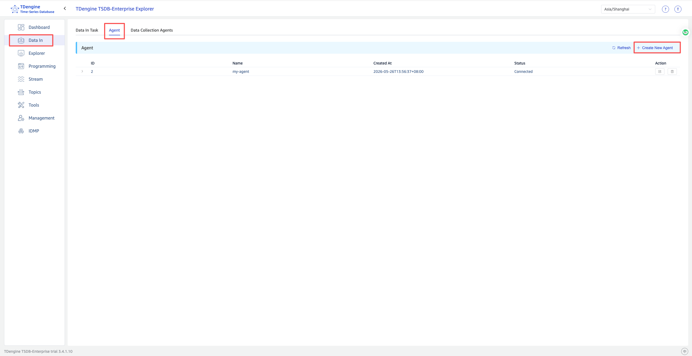
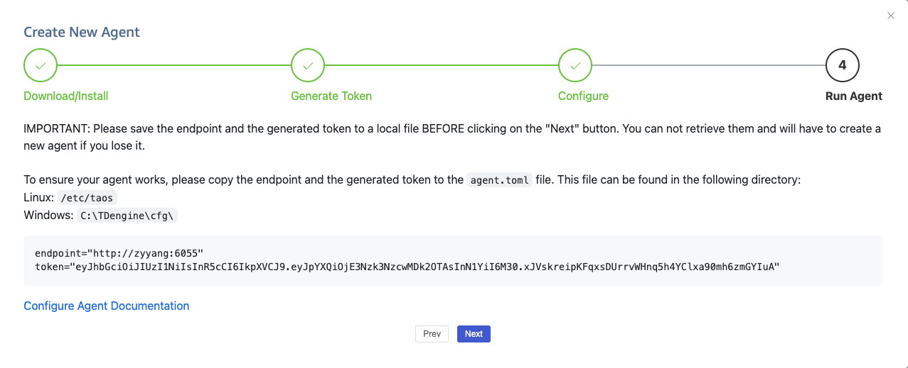
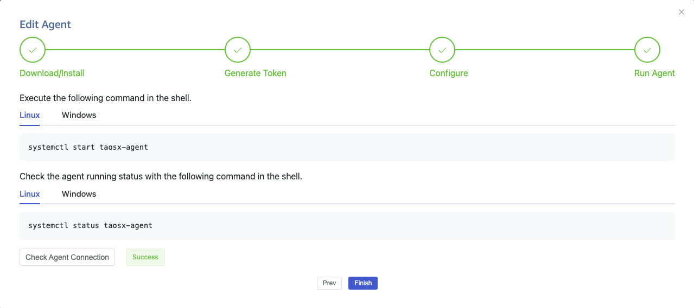

import Tabs from "@theme/Tabs";
import TabItem from "@theme/TabItem";

## Overview

taosX-Agent is a component of TDengine TSDB Enterprise that acts as a proxy for taosX. It is deployed close to data sources and is responsible for collecting data and forwarding it to taosX.

When taosX cannot directly access a data source — for example, when the data source is in an isolated OT network, an industrial control network segment, or a restricted intranet — you can deploy taosX-Agent in the same network as the data source to proxy data collection and forwarding.

Typical use cases:

- **OPC UA/DA data ingestion**: The OPC Server is deployed in an isolated industrial control network, while taosX is deployed in the IT network or cloud. Agent proxies the data collection.
- **PI system data ingestion**: The PI system is deployed in the OT network. taosX-Agent is deployed on a Windows host that can access the PI system to proxy data transfer.
- **Other restricted network scenarios**: Any scenario where taosX and the data source cannot communicate directly can be resolved through Agent proxying.

### Features

| Feature | Description |
| --- | --- |
| Data proxy collection | Proxies taosX to collect data from OPC UA, OPC DA, PI, and other data sources |
| Compressed data transfer | Supports enabling communication data compression between Agent and taosX to reduce bandwidth consumption |
| In-memory cache | Supports configuring the number of in-memory cache batches to improve data transfer efficiency |
| Auto-reconnect | Supports keeping the Agent running and automatically reconnecting when the taosX service is unavailable |
| Store and Forward | Persists collected data to local disk during network outages and automatically resends it when the network recovers, ensuring zero data loss. See [Store and Forward](./store-and-forward.md) |
| Multi-instance deployment | Multiple Agent instances can be deployed on the same machine, distinguished by instanceId |

## Getting taosX-Agent

taosX-Agent must be downloaded separately; it is not included in the TDengine TSDB Enterprise installation package.

Visit the [TDengine Download Center](https://tdengine.com/downloads/), select **TDengine taosX-Agent** from the product list, then choose the appropriate version, operating system, and architecture to download the installation package.

:::note
taosX-Agent is only available in TDengine TSDB Enterprise. It is not included in the Community Edition.
:::

## Prerequisites

### Network Requirements

taosX-Agent must maintain network connectivity with both the taosX service and the data source:

| Direction | Description |
| --- | --- |
| Agent → taosX | Agent must be able to access the taosX gRPC service port (default 6055) |
| Agent → Data source | Agent must be able to access the data source (e.g., OPC UA Server, PI Data Archive) |

:::tip
Before deployment, verify network connectivity from Agent to taosX:

```bash
# Linux
nc -zv <taosX_host> 6055

# Windows PowerShell
Test-NetConnection -ComputerName <taosX_host> -Port 6055
```

:::

### Platform Requirements

- **General scenarios**: Agent can be deployed on both Linux and Windows.
- **PI data ingestion**: Agent must be deployed on Windows because PI AF SDK only supports Windows. The Agent host must also have PI AF SDK (PI AF Client 2018+) and .NET Framework 4.8+ installed.

### Dependencies

- **taosX**: taosX-Agent must connect to a running taosX instance.
- **taosExplorer**: You need to create an Agent and obtain a Token through the Explorer interface.

## Installation

After downloading the taosX-Agent installation package for your platform from the [TDengine Download Center](https://tdengine.com/downloads/), follow the installer instructions to complete the installation.

After installation, taosX-Agent files are located at:

| Item | Linux | Windows |
| --- | --- | --- |
| Executable | `/usr/bin/taosx-agent` | `C:\TDengine\taosx-agent.exe` |
| Configuration file | `/etc/taos/agent.toml` | `C:\TDengine\cfg\agent.toml` |
| Log directory | `/var/log/taos/` | `C:\TDengine\log\` |
| Service name | `taosx-agent` (systemd) | `taosx-agent` (Windows Service) |

## Usage

### Step 1: Create an Agent in Explorer

1. Log in to the taosExplorer interface.
2. Click **Data In** in the left navigation bar.
3. Select the **Agent** tab at the top.
4. Click the **+Create New Agent** button in the upper right corner.



5. Follow the wizard instructions. The system will generate an **endpoint** and **token**. Copy and save them to the `agent.toml` configuration file.



:::warning
Save the endpoint and token before clicking "Next". If lost, they cannot be recovered and you must create a new agent.
:::

### Step 2: Edit the Configuration File

Edit the configuration file and fill in the information obtained from Explorer:

```toml
# taosX gRPC service address (required)
endpoint = "http://<taosX_host>:6055"

# Token generated when creating the Agent in Explorer (required)
token = "<your_token>"
```

For a full list of configuration options, see [Configuration Reference](./configuration.md).

### Step 3: Start the Service

<Tabs>
<TabItem value="linux" label="Linux" default>

```bash
systemctl start taosx-agent
```

Enable auto-start on boot:

```bash
systemctl enable taosx-agent
```

</TabItem>
<TabItem value="windows" label="Windows">

Open the Windows **Services** management tool, find the `taosx-agent` service, and start it.

Or use the command line:

```cmd
sc start taosx-agent
```

</TabItem>
</Tabs>

### Step 4: Verify Agent Status

After starting, go back to the Explorer agent creation wizard page and click the **Check Agent Connection** button. A status of **Normal** indicates the Agent is online.



You can also check the logs to confirm startup:

<Tabs>
<TabItem value="linux" label="Linux" default>

```bash
journalctl -u taosx-agent -f
```

Or view the log file directly:

```bash
tail -f /var/log/taos/taosx-agent.log
```

</TabItem>
<TabItem value="windows" label="Windows">

View the log file: `C:\TDengine\log\taosx-agent.log`

</TabItem>
</Tabs>

### Step 5: Create a Data Ingestion Task

Once the Agent is online, go to the **Data In** page in Explorer. When creating a data source task, select the online Agent from the **Agent** dropdown to collect data through it.

## Troubleshooting

### Viewing Logs

<Tabs>
<TabItem value="linux" label="Linux" default>

```bash
# View service logs with journalctl
journalctl -u taosx-agent -f

# Or view the log file directly
tail -f /var/log/taos/taosx-agent.log
```

</TabItem>
<TabItem value="windows" label="Windows">

View the log file `C:\TDengine\log\taosx-agent.log`.

</TabItem>
</Tabs>

### Common Issues

| Symptom | Possible Cause | Solution |
| --- | --- | --- |
| Agent cannot come online | Incorrect `endpoint` or network connectivity issue | Check the taosX address and port; verify network connectivity |
| Agent cannot come online | Incorrect `token` | Recreate the Agent in Explorer to obtain a new Token |
| Agent frequently disconnects and reconnects | Unstable network | Check the network quality between Agent and taosX; ensure `keep_online = true` |
| Data collection fails | Agent cannot access the data source | Check network connectivity and permissions from Agent to the data source |

## Uninstall

taosX-Agent is installed as a standalone component and must be uninstalled separately.

To stop the taosX-Agent service:

<Tabs>
<TabItem value="linux" label="Linux" default>

```bash
# Stop the service
systemctl stop taosx-agent

# Disable auto-start on boot
systemctl disable taosx-agent
```

</TabItem>
<TabItem value="windows" label="Windows">

Open the Windows **Services** management tool and stop the `taosx-agent` service.

Or use the command line:

```cmd
sc stop taosx-agent
```

</TabItem>
</Tabs>

To fully uninstall taosX-Agent, use the appropriate uninstall method for your operating system (e.g., package manager on Linux, "Add or remove programs" on Windows).
