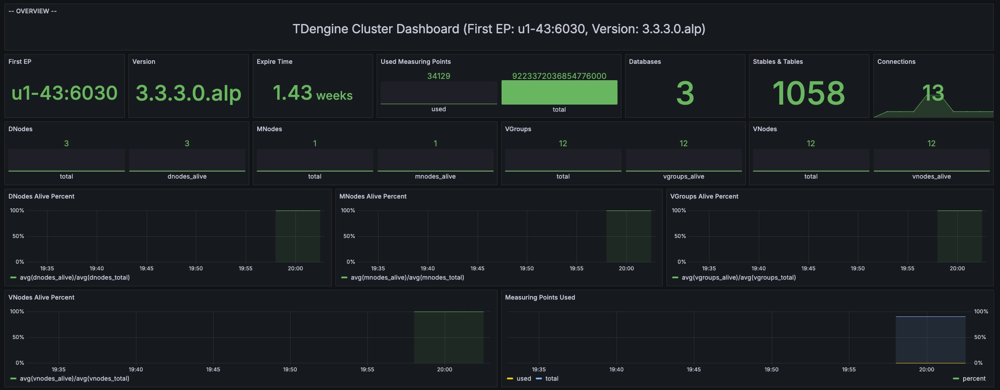
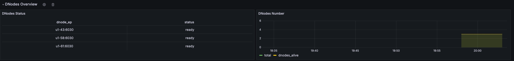
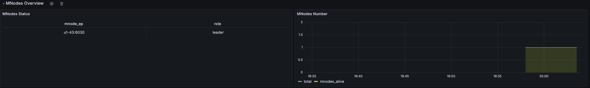
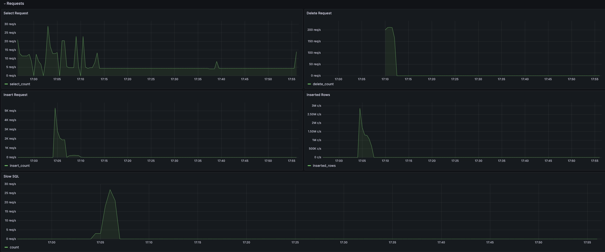
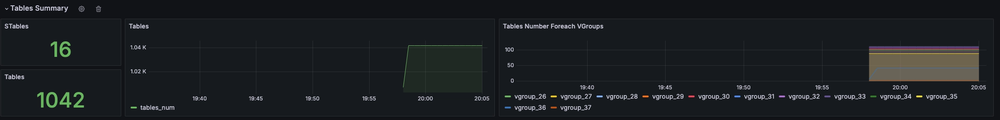
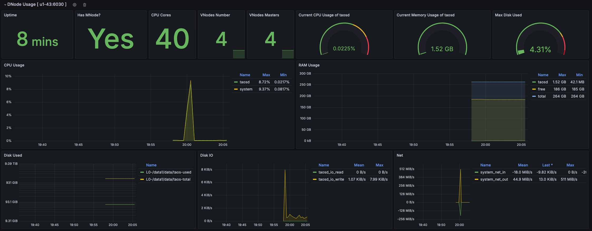
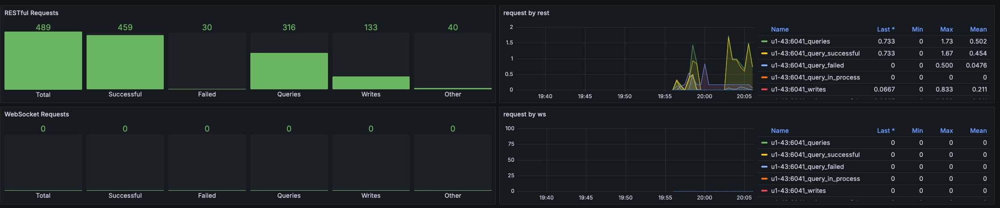

import Tabs from '@theme/Tabs'
import TabItem from '@theme/TabItem'

TDinsight is a solution for monitoring TDengine using Grafana.

TDengine periodically writes server information such as CPU, memory, disk space, bandwidth, request count, disk read/write speed, and slow queries into a specified database through taosKeeper. With Grafana and the TDengine data source plugin, TDinsight visualizes cluster status, node information, insert and query requests, and resource usage, providing developers with convenient real-time monitoring of TDengine cluster operation. This article will guide users on how to install the TDengine data source plugin and deploy the TDinsight visualization panel.

## Prerequisites

First, check the following services:

- TDengine has been installed and is running correctly. This dashboard requires TDengine version 3.0.0.0 or above, with monitoring reporting configured. For detailed configuration, please refer to: [TDengine Monitoring Configuration](../taosd/#monitoring-related).
- taosAdapter has been installed and is running correctly. For specific details, please refer to: [taosAdapter Reference Manual](../taosadapter).
- taosKeeper has been installed and is running correctly. For specific details, please refer to: [taosKeeper Reference Manual](../taoskeeper).
- Grafana has been installed and is running correctly. We recommend using the latest version of Grafana, with TDInsight supporting Grafana version 7.5 or above.
  :::info
  The following descriptions use Grafana v11.0.0 as an example; other versions may have differences. Please refer to the [Grafana Official Site](https://grafana.com/docs/grafana/latest/).
  :::

Then, note the following information:

- The REST API address for the taosAdapter cluster, e.g., `http://localhost:6041`.
- Authentication information for the taosAdapter cluster, which can be a username and password.
- The name of the database where taosKeeper records monitoring metrics.

## Install the TDengine Data Source Plugin and Configure the Data Source

For steps on installing the Grafana TDengine data source plugin and configuring the data source, please refer to: [Integrating with Grafana](../../../third-party-tools/visualization/grafana/#install-grafana-plugin-and-configure-data-source).

## Import the TDinsightV3 Dashboard

On the TDengine data source configuration page, click the “Dashboards” tab, then click “import” to import the “TDengine for 3.x” dashboard. After successful import, you can access this dashboard and select the database set in taosKeeper for recording monitoring metrics in the “Log from” option at the top left to view the monitoring results.

## TDinsightV3 Dashboard Details

The TDinsight dashboard is designed to provide usage and status information about TDengine-related resources, such as dnodes, mnodes, vnodes, and databases. It is mainly divided into cluster status, DNodes overview, MNodes overview, request statistics, database statistics, DNode resource usage, and taosAdapter monitoring information. Below, we will introduce each section in detail.

### Cluster Status

This section includes the current information and status of the cluster.



**Metrics Details (from top to bottom, left to right):**

- **First EP**: The current `firstEp` setting in the TDengine cluster.
- **Version**: TDengine server version (master mnode).
- **Expire Time**: Expiration time for the enterprise edition.
- **Used Measuring Points**: Number of measuring points used in the enterprise edition.
- **Databases**: Number of databases.
- **Connections**: Current number of connections.
- **DNodes/MNodes/VGroups/VNodes**: Total number and alive count of each resource.
- **DNodes/MNodes/VGroups/VNodes Alive Percent**: Ratio of alive to total resources for each type; enables alert rules to trigger when the resource survival rate (average healthy resource ratio over one minute) is below 100%.
- **Measuring Points Used**: Usage of measuring points with alert rules enabled (no data for community edition, default is healthy).

### DNodes Overview

This section includes basic information about the cluster's dnodes.



**Metrics Details:**

- **DNodes Status**: A simple table view of `show dnodes`.
- **DNodes Number**: Changes in the number of DNodes.

### MNodes Overview

This section includes basic information about the cluster's mnodes.



**Metrics Details:**

1. **MNodes Status**: A simple table view of `show mnodes`.
2. **MNodes Number**: Changes in the number of MNodes, similar to `DNodes Number`.

### Request Statistics

This section includes statistical metrics for SQL execution in the cluster.



**Metrics Details:**

1. **Select Request**: Count of select requests.
2. **Delete Request**: Count of delete requests.
3. **Insert Request**: Count of insert requests.
4. **Inserted Rows**: Actual number of inserted rows.
5. **Slow Sql**: Number of slow queries, which can be filtered by duration at the top.

### Table Statistics

This section includes statistical metrics for tables in the cluster.



**Metrics Details:**

1. **STables**: Number of supertables.
2. **Total Tables**: Total number of all tables.
3. **Tables**: Time series graph showing the number of all basic tables over time.
4. **Tables Number For Each VGroups**: Number of tables contained in each VGroup.

### DNode Resource Usage

This section presents the resource usage status of all data nodes in the cluster, with each data node displayed as a row.



**Metrics Details (from top to bottom, left to right):**

1. **Uptime**: Time elapsed since the creation of the dnode.
2. **Has MNodes?**: Whether the current dnode is an mnode.
3. **CPU Cores**: Number of CPU cores.
4. **VNodes Number**: Current number of VNodes for the dnode.
5. **VNodes Masters**: Number of vnodes in the master role.
6. **Current CPU Usage of taosd**: CPU usage of the taosd process.
7. **Current Memory Usage of taosd**: Memory usage of the taosd process.
8. **Max Disk Used**: Maximum disk usage of all data directories for taosd.
9. **CPU Usage**: CPU usage metrics for both process and system.
10. **RAM Usage**: RAM usage time series view.
11. **Disk Used**: Disk usage for each level of multi-level storage (default is level0).
12. **Disk IO**: Disk IO rate.
13. **Net IO**: Total network IO rate excluding local network.

### taosAdapter Monitoring

This section includes detailed statistics of taosAdapter REST and WebSocket requests.



**Metrics Details:**

1. **Total**: Total number of requests.
2. **Successful**: Total number of successful requests.
3. **Failed**: Total number of failed requests.
4. **Queries**: Total number of queries.
5. **Writes**: Total number of writes.
6. **Other**: Total number of other requests.

There are also detailed line charts for the above categories.

## Upgrade

You can upgrade using one of the following three methods:

- Through the graphical interface: If there is a new version available, click update on the “TDengine Datasource” plugin page.
- Follow the manual installation steps to install the new Grafana plugin and dashboard.
- Run the `TDinsight.sh` script again to upgrade to the latest Grafana plugin and TDinsight dashboard.

## Uninstall

For different installation methods, during uninstallation:

- Through the graphical interface, click “Uninstall” on the “TDengine Datasource” plugin page.
- For TDinsight installed via `TDinsight.sh` script, you can use the command `TDinsight.sh -R` to clean up relevant resources.
- For manually installed TDinsight, to fully uninstall, you need to clean the following content:
  1. TDinsight Dashboard in Grafana.
  2. Data Source in Grafana.
  3. Delete the `tdengine-datasource` plugin from the plugin installation directory.

## Appendix

### TDinsight.sh Detailed Explanation

Here is a detailed explanation of the usage of TDinsight.sh:

```text
Usage:
   ./TDinsight.sh
   ./TDinsight.sh -h|--help
   ./TDinsight.sh -n <ds-name> -a <api-url> -u <user> -p <password>

Install and configure TDinsight dashboard in Grafana on Ubuntu 18.04/20.04 system.

-h, -help,          --help                  Display help

-V, -verbose,       --verbose               Run script in verbose mode. Will print out each step of execution.

-v, --plugin-version <version>              TDengine datasource plugin version, [default: latest]

-P, --grafana-provisioning-dir <dir>        Grafana provisioning directory, [default: /etc/grafana/provisioning/]
-G, --grafana-plugins-dir <dir>             Grafana plugins directory, [default: /var/lib/grafana/plugins]
-O, --grafana-org-id <number>               Grafana organization id. [default: 1]

-n, --tdengine-ds-name <string>             TDengine datasource name, no space. [default: TDengine]
-a, --tdengine-api <url>                    TDengine REST API endpoint. [default: http://127.0.0.1:6041]
-u, --tdengine-user <string>                TDengine user name. [default: root]
-p, --tdengine-password <string>            TDengine password. [default: taosdata]

-i, --tdinsight-uid <string>                Replace with a non-space ASCII code as the dashboard id. [default: tdinsight]
-t, --tdinsight-title <string>              Dashboard title. [default: TDinsight]
-e, --tdinsight-editable                    If the provisioning dashboard could be editable. [default: false]
```

Most command line options can achieve the same effect through environment variables.

| Short Option | Long Option                   | Environment Variable           | Description                                                   |
|--------------|-------------------------------|--------------------------------|---------------------------------------------------------------|
| -v           | --plugin-version              | TDENGINE_PLUGIN_VERSION        | TDengine datasource plugin version, default uses latest.      |
| -P           | --grafana-provisioning-dir    | GF_PROVISIONING_DIR            | Grafana configuration directory, default is `/etc/grafana/provisioning/` |
| -G           | --grafana-plugins-dir         | GF_PLUGINS_DIR                 | Grafana plugins directory, default is `/var/lib/grafana/plugins`. |
| -O           | --grafana-org-id              | GF_ORG_ID                      | Grafana organization ID, default is 1.                        |
| -n           | --tdengine-ds-name            | TDENGINE_DS_NAME               | TDengine datasource name, default is TDengine.                |
| -a           | --tdengine-api                | TDENGINE_API                   | TDengine REST API endpoint, default is `http://127.0.0.1:6041`. |
| -u           | --tdengine-user               | TDENGINE_USER                  | TDengine username, [default: root]                           |
| -p           | --tdengine-password           | TDENGINE_PASSWORD              | TDengine password, [default: taosdata]                      |
| -i           | --tdinsight-uid               | TDINSIGHT_DASHBOARD_UID        | TDinsight dashboard `uid`, [default: tdinsight]             |
| -t           | --tdinsight-title             | TDINSIGHT_DASHBOARD_TITLE      | TDinsight dashboard title, [default: TDinsight]              |
| -e           | --tdinsight-editable          | TDINSIGHT_DASHBOARD_EDITABLE   | Whether the provisioning dashboard can be editable, [default: false] |

:::note
The new version of the plugin uses the Grafana unified alerting feature, and the `-E` option is no longer supported.
:::

Assuming you start the TDengine database on the host `tdengine`, with the HTTP API port at `6041`, user as `root1`, and password as `pass5ord`. Execute the script:

```bash
./TDinsight.sh -a http://tdengine:6041 -u root1 -p pass5ord
```

If you need to monitor multiple TDengine clusters, you will need to set up separate TDinsight dashboards for each. Non-default TDinsight configurations will require some changes: the `-n`, `-i`, and `-t` options must be changed to non-default names. If using the built-in SMS alert feature, `-N` and `-L` should also be modified.

```bash
sudo ./TDengine.sh -n TDengine-Env1 -a http://another:6041 -u root -p taosdata -i tdinsight-env1 -t 'TDinsight Env1'
```

Please note that the data source configuration, notification channels, and dashboards in the frontend cannot be changed. You should either run this script again to update the configuration or manually change the configuration files in the `/etc/grafana/provisioning` directory (this is the default directory for Grafana; change using the `-P` option if needed).

Specifically, when using Grafana Cloud or other organizations, `-O` can be used to set the organization ID. The `-G` option can specify the Grafana plugin installation directory. The `-e` parameter sets the dashboard as editable.
