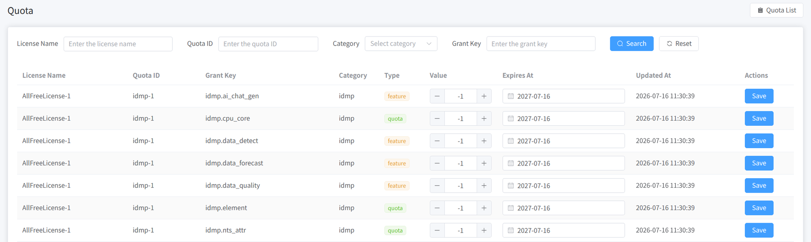
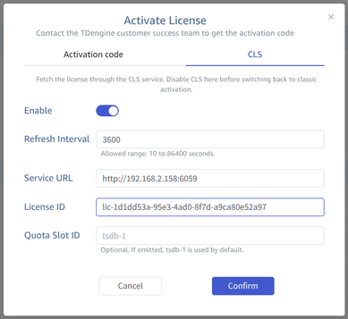
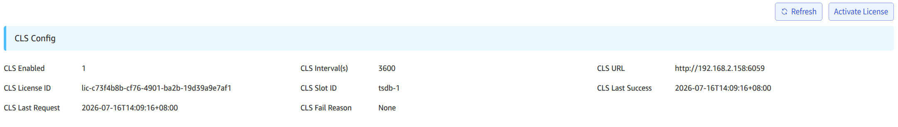
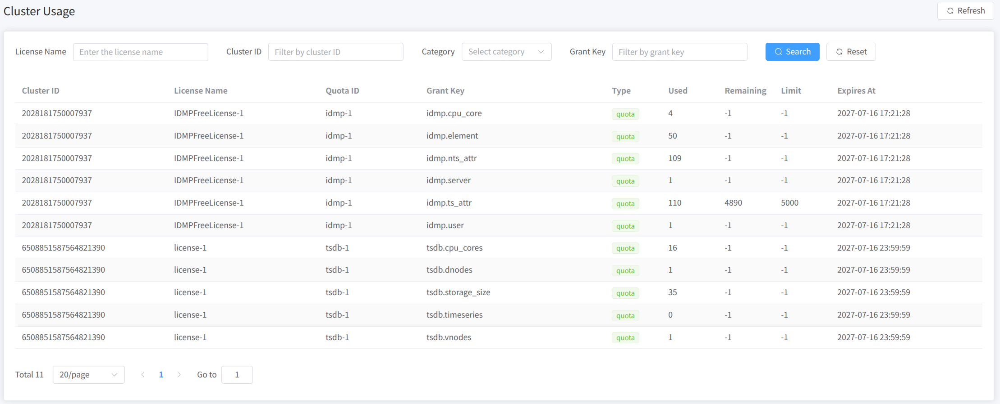

The License Center is a service used to manage TDengine TSDB / IDMP licensing. It consists of the ELS (Enterprise License Server) management component on the central side and the CLS (Customer License Server) management component on the local side. ELS is mainly deployed by the TDengine service provider, while CLS is deployed on the customer's premises. This document uses a locally deployed CLS as an example to introduce the complete licensing workflow. (Note: All IDs and licenses shown in this document are for demonstration purposes only and have no real meaning.)

## Prerequisites

### Deployment and Installation

Installation package:

```bash
license-center-cls-1.0.0-linux-amd64.tar.gz
```

After extracting it, you can see the deployment-related scripts:

```bash
scripts/
├── install.sh
├── start.sh
├── status.sh
├── stop.sh
└── uninstall.sh
```

Run `install.sh` and then `start.sh` to start the service.

### Configuration

The default configuration file is located at `/etc/taoscls/taoscls.toml`:

```toml
[local]
# The address the service listens on. The default 0.0.0.0 means listening on all network interfaces.
listen = "0.0.0.0"
# The HTTP API service port.
http_port = 6059

[els]
# The address of the ELS service.
host = "license.tdengine.com"
# The port of the ELS service.
port = 8094
# Whether to enable communication with ELS.
enable = true

[database]
# The data storage path.
path = "/var/lib/taoscls"

[log]
# The log level.
level = "info"
# The log file path.
file = "/var/log/taoscls/taoscls.log"
# The maximum size of a single rolling log file.
max_size = "1GB"
# The number of rolling log files.
max_files = 3
# Optional fixed timezone offset for log timestamps. When omitted, the system local timezone is used.
# timezone = "+08:00"
```

### Local Access

- After starting the CLS service locally, access it in a browser at:
  - CLS: `http://localhost:6059`
- The local demo accounts used in this document are:
  - Username: `root`
  - Password: `taosdata`

## Service Information

1. After the service starts, open the CLS management console in a browser and log in.

2. After logging in, you can view information such as the **Public Key Token** on the **Local Information** page, as shown in the following figure:


## Offline Licensing

### 1. Obtain a License

Provide the **Public Key Token** from the CLS **Local Information** page to the TDengine service provider. The provider will return a license file named `offline-license.key`.

### 2. Import the License

On the CLS **License** page, click **Offline Import** in the upper right corner, select `offline-license.key`, and then click **Import**. After a successful import, the license appears in the license list on the CLS **License** page.

### 3. View Quotas

Go to the **Quota** page on the left to view the quotas and authorization item details split from the license, including the license ID, quota ID, authorization item, category, type, value, and expiration time.



## Online Licensing

The overall workflow of online licensing is essentially the same as offline licensing. The difference lies in how the license is obtained. In online mode, if the CLS is connected to the ELS, the license authorized on the ELS side is automatically synchronized to the CLS. In offline mode, you must manually import the license through an offline channel such as a file.

## Connecting to CLS

Currently, both TSDB/IDMP clusters can communicate with the CLS through the relevant configuration, and the specific information can be viewed on the CLS cluster management page.

### TSDB Configuration

TSDB can be configured to connect to the CLS service via the taosExplorer page, or by using TSDB SQL commands.

#### taosExplorer

On the **System Management / License** page of the taosExplorer component, click the **Activate License** button to see the following configuration page:



The meaning of each configuration field is the same as the SQL configuration parameters below. After clicking OK, you can see the CLS configuration information on the License page:



#### SQL

TSDB can use the following SQL commands to configure CLS service information. An example is shown below:

```sql
ALTER ALL DNODES 'clsEnabled' '1';
ALTER ALL DNODES 'clsRefreshInterval' '15';
ALTER ALL DNODES 'clsUrl' 'http://192.168.2.158:6059';
ALTER ALL DNODES 'clsLicenseId' 'lic-53467044-2dad-4be2-9280-adacb201a644';
ALTER ALL DNODES 'clsQuotaSlotId' 'tsdb-1';
```

Description:

`clsEnabled`: Indicates whether to enable the CLS license feature.

`clsRefreshInterval`: Indicates the interval for communicating with the CLS service.

`clsUrl`: Indicates the CLS service address.

`clsLicenseId`: Indicates the license ID to obtain.

`clsQuotaSlotId`: Indicates the quota ID to obtain.

### IDMP Configuration

The page configuration for the new version is currently under development. Stay tuned.

### CLS Cluster Management

After configuring the CLS in TSDB/IDMP, you can see the corresponding cluster information on the CLS **Cluster** page:


On the **Cluster Usage** page, you can view the usage information of specific authorization items:


