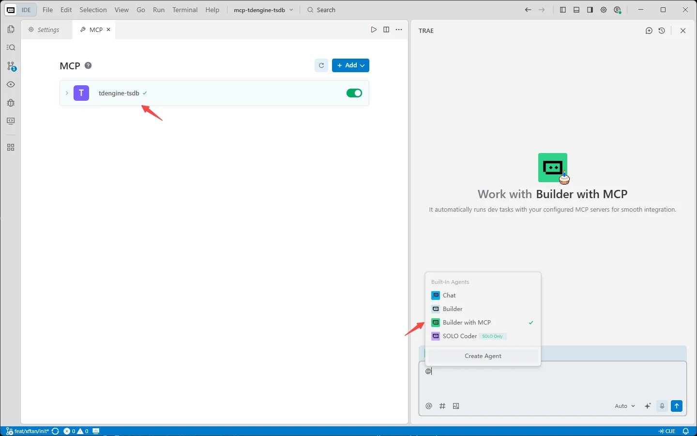
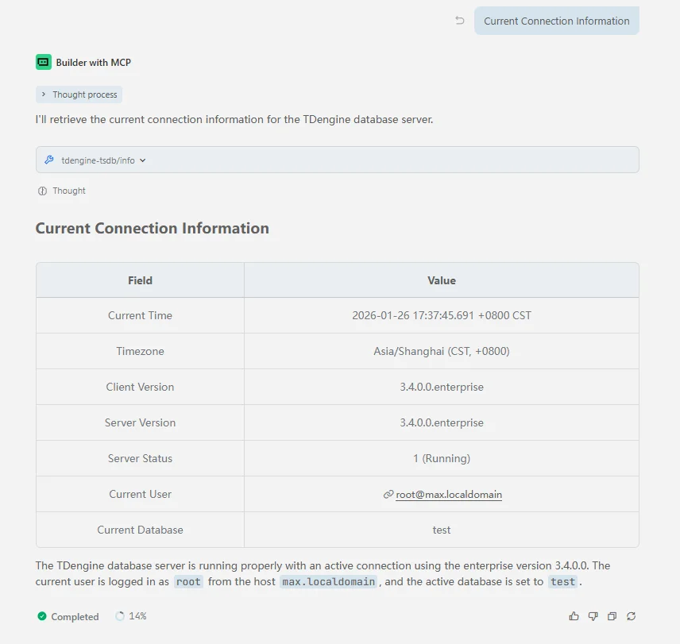
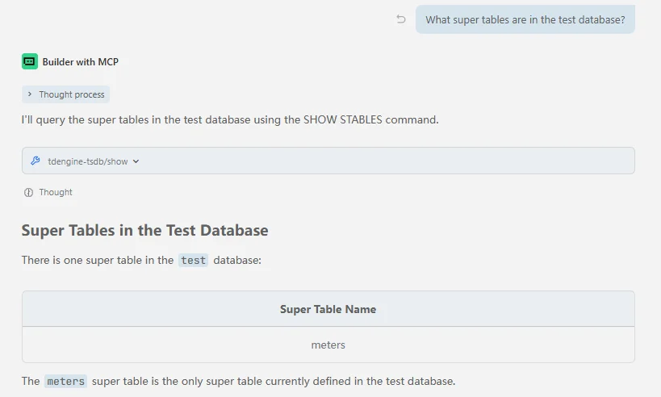
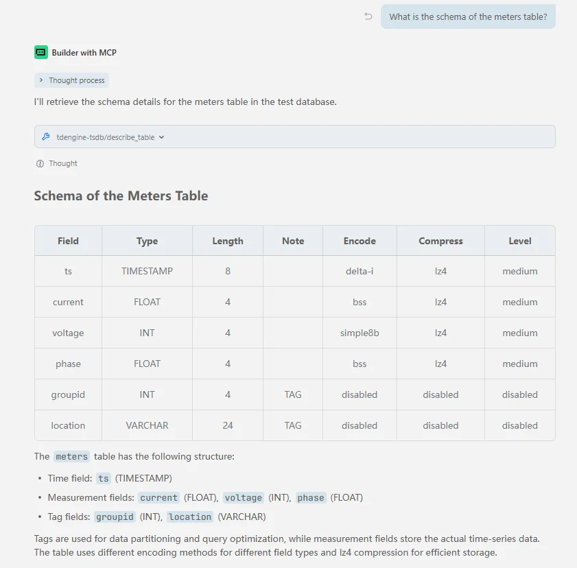
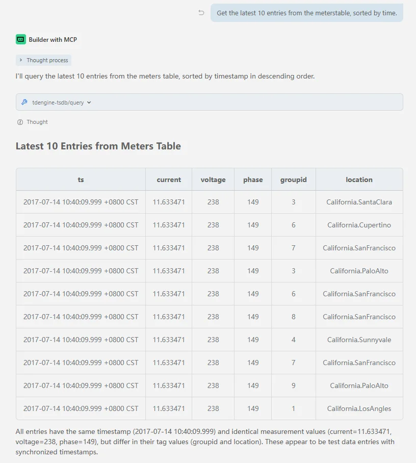

mcp-tdengine-tsdb (MCP Server for TDengine TSDB) provides a complete set of tools for querying, managing, and monitoring TDengine time-series databases.

mcp-tdengine-tsdb currently supports Windows x64, Linux x64/arm64, and macOS x64/arm64 systems.

## Features

mcp-tdengine-tsdb provides a series of tools for operating TDengine TSDB:

- **Query Tool (query)** - Execute TDengine SELECT queries and return results
- **Show Tool (show)** - Execute various SHOW commands to query metadata, supporting multiple parameter options
- **Info Tool (info)** - Provide TDengine server information, including version, status, etc.
- **Describe Table Tool (describe_table)** - Describe the structure of a specified table
- **Predefined Schema Retrieval Tool (get_schema_overview)** - Get database structure overview information; takes effect after the `schema_overview_file` parameter is configured, reading and returning file content directly.

mcp-tdengine-tsdb cannot perform data writing, deletion, or table structure modification operations; it only supports read-only queries.

## Tool Acquisition

Get the latest MCP Server from [mcp-tdengine-tsdb](https://github.com/taosdata/mcp-tdengine-tsdb/releases) and select the appropriate system and architecture for download.

## Configuration

mcp-tdengine-tsdb supports configuring the information needed to connect to TDengine through command-line parameters or environment variables, with command-line parameters taking precedence over environment variables. Below is the list of available parameters:

| Parameter                | Environment Variable            | Default Value | Description                                                                             |
|:-------------------------|:--------------------------------|:--------------|:----------------------------------------------------------------------------------------|
| `--host`                 | `TDENGINE_HOST`                 | `localhost`   | TDengine hostname                                                                       |
| `--port`                 | `TDENGINE_PORT`                 | `6041`        | TDengine port (taosAdapter port)                                                        |
| `--user`                 | `TDENGINE_USER`                 | `root`        | TDengine username                                                                       |
| `--pass`                 | `TDENGINE_PASS`                 | `taosdata`    | TDengine password                                                                       |
| `--db`                   | `TDENGINE_DB`                   |               | TDengine database name                                                                  |
| `--dsn`                  | `TDENGINE_DSN`                  |               | TDengine Data Source Name (DSN), takes precedence over individual connection parameters |
| `--schema_overview_file` | `TDENGINE_SCHEMA_OVERVIEW_FILE` |               | Predefined database schema overview file path                                           |

When connecting to cloud services, DSN connection parameters can be configured, for example:

```bash
--dsn=wss(gw.us-west-2.aws.cloud.tdengine.com:443)/test?readTimeout=1m&token=xxxxxxxx
```

## Adding MCP

After downloading mcp-tdengine-tsdb, place it in any directory, then configure the MCP Server path and connection parameters in various AI assistants.

### Adding MCP Using Trae as an Example

1. In the upper right corner of the Trae AI chat window, click the settings icon -> MCP, which will open the MCP window

   

2. After clicking "Add Manually", fill in the following content. Change the command to the full path where mcp-tdengine-tsdb is located. For Windows systems, note that path escaping is required. Fill in the database name you want to operate in the db parameter. After clicking confirm, you can use the MCP Server for TDengine TSDB for data querying and management operations.

   ```json
   {
     "mcpServers": {
       "tdengine-tsdb": {
         "command": "E:\\github\\mcp-tdengine-tsdb\\mcp-tdengine-tsdb.exe",
         "args": [
           "--host", "localhost",
           "--port", "6041",
           "--user", "root",
           "--pass", "taosdata",
           "--db", "test"
         ]
       }
     }
   }
   ```

   

3. Select "Builder with MCP" in the AI box, and you can see that the tdengine-tsdb mcp has been started.

   

### Adding MCP Using Claude Code as an Example

Use the `claude mcp add` command to add the MCP Server for TDengine TSDB:

```bash
claude mcp add tdengine-tsdb -- /path-to-mcp/mcp-tdengine-tsdb --host localhost --port 6041 --user root --pass taosdata --db test
```

Then use the `claude mcp list` command to view the added MCPs

## Using MCP

Here are some usage examples:

1. Get connection information

   

2. Get dnode list

   

3. Get database list

   

4. Get supertable list

   

5. Get table structure

   

6. Execute query statements

   
