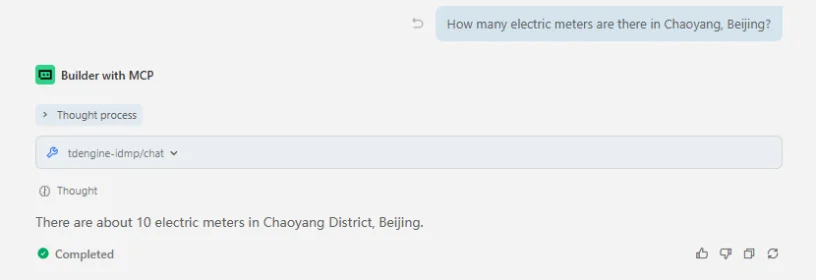

mcp-tdengine-idmp (MCP Server for TDengine IDMP) provides a complete toolset for querying and reading information from the IDMP platform.

mcp-tdengine-idmp currently supports Windows x64, Linux x64/arm64, and macOS x64/arm64.

## Features

mcp-tdengine-idmp provides a set of tools for working with TDengine IDMP:

- **Chat Tool (`chat`)** - Calls the IDMP AI Chat Stream API with `prompt` and returns text output
- **System Config Tool (`system_config`)** - Retrieves IDMP system configuration and returns JSON output

mcp-tdengine-idmp only supports read-only queries and does not provide write, delete, or configuration change operations.

## Download

Download the latest MCP Server from [mcp-tdengine-idmp](https://github.com/taosdata/mcp-tdengine-idmp/releases), and choose the package for your OS and architecture.

After downloading from Release on Linux or macOS, you may need to add execute permission first:

```bash
chmod +x /path-to-mcp/mcp-tdengine-idmp
```

## Configuration

mcp-tdengine-idmp supports configuring IDMP connection information through command-line arguments or environment variables. Command-line arguments take higher priority than environment variables.

| Parameter     | Environment Variable | Default Value | Description            |
|:--------------|:---------------------|:--------------|:-----------------------|
| `--base_url`  | `IDMP_BASE_URL`      |               | IDMP service base URL  |
| `--user`      | `IDMP_USER`          |               | IDMP login username    |
| `--pass`      | `IDMP_PASS`          |               | IDMP login password    |

> Note: If captcha login is enabled in IDMP, the server cannot start. Please disable captcha first.

## Add MCP

After downloading mcp-tdengine-idmp, place it in any directory, then configure the MCP Server path and connection parameters in your AI assistant.

### Add MCP in Trae (Example)

Fill in the following MCP config in Trae (`command` should be replaced with the absolute path of your executable):

```json
{
  "mcpServers": {
    "tdengine-idmp": {
      "command": "E:\\github\\mcp-tdengine-idmp\\mcp-tdengine-idmp.exe",
      "args": [
        "--base_url", "http://127.0.0.1:6042",
        "--user", "your_user",
        "--pass", "your_pass"
      ]
    }
  }
}
```

### Add MCP in Claude Code (Example)

Use `claude mcp add` to add MCP Server for TDengine IDMP:

```bash
claude mcp add tdengine-idmp -- /path-to-mcp/mcp-tdengine-idmp --base_url http://127.0.0.1:6042 --user your_user --pass your_pass
```

Then run `claude mcp list` to check added MCP servers.

## Use MCP

Here are some example usages:

1. Get system configuration

   

2. Get information through AI chat

   

## Mechanism Notes

- On startup, MCP Server first checks login configuration, then performs account login.
- When an API call detects session invalidation (4xx), the server automatically re-logins and retries once.
- Communication uses stdio transport, which is suitable for local MCP hosts such as Trae and Claude Code.
