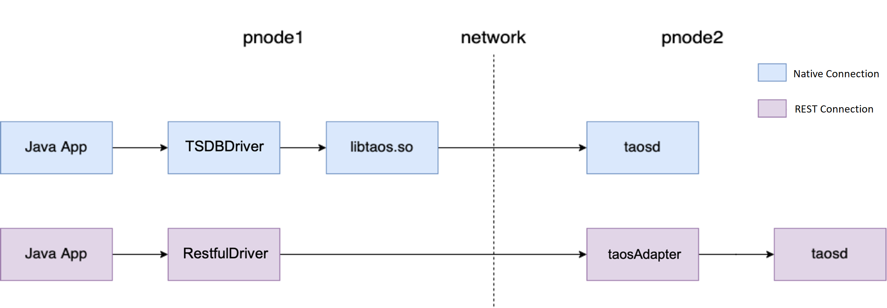

import Tabs from '@theme/Tabs';
import TabItem from '@theme/TabItem';

`taos-jdbcdriver` is the official Java connector for TDengine. Java developers can use it to develop applications that access data in TDengine. `taos-jdbcdriver` implements standard JDBC driver interfaces and two connection methods: One is **native connection**, which connects to TDengine instances natively through the TDengine client driver (taosc), supporting data writing, querying, subscriptions, schemaless writing, and bind interface. The second is **REST connection** which is implemented through taosAdapter. The set of features implemented by the REST connection differs slightly from those implemented by the native connection.



The preceding figure shows the two ways in which a Java application can access TDengine.

- JDBC native connection: Java applications use TSDBDriver on physical node 1 (pnode1) to call client-driven directly (`libtaos.so` or `taos.dll`) APIs to send writing and query requests to taosd instances located on physical node 2 (pnode2).
- JDBC REST connection: The Java application encapsulates the SQL as a REST request via RestfulDriver, sends it to the REST server (taosAdapter) on physical node 2. taosAdapter forwards the request to TDengine server and returns the result.

The REST connection, which does not rely on TDengine client drivers, is more convenient and flexible, in addition to being cross-platform. However the performance is about 30% lower than that of the native connection.

:::info
TDengine's JDBC driver implementation is as consistent as possible with the relational database driver. Still, there are differences in the use scenarios and technical characteristics of TDengine and relational object databases. So 'taos-jdbcdriver' also has some differences from traditional JDBC drivers. It is important to keep the following points in mind:

- TDengine does not currently support delete operations for individual data records.
- Transactional operations are not currently supported.

:::

## Supported platforms

Native connections are supported on the same platforms as the TDengine client driver.
REST connection supports all platforms that can run Java.

## Recent update logs

| taos-jdbcdriver version |                                                                   major changes                                                                    | TDengine version |
| :---------------------: | :------------------------------------------------------------------------------------------------------------------------------------------------: | :--------------: |
|          3.2.5          |                                                Subscription add committed() and assignment() method                                                | 3.1.0.3 or later |
|          3.2.4          |                     Subscription add the enable.auto.commit parameter and the unsubscribe() method in the WebSocket connection                     |        -         |
|          3.2.3          |                                                 Fixed resultSet data parsing failure in some cases                                                 |        -         |
|          3.2.2          |                                                           Subscription add seek function                                                           | 3.0.5.0 or later |
|          3.2.1          |                                      JDBC REST connection supports schemaless/prepareStatement over WebSocket                                      | 3.0.3.0 or later |
|          3.2.0          |                                                          This version has been deprecated                                                          |        -         |
|          3.1.0          |                                             JDBC REST connection supports subscription over WebSocket                                              |        -         |
|      3.0.1 - 3.0.4      | fix the resultSet data is parsed incorrectly sometimes. 3.0.1 is compiled on JDK 11, you are advised to use other version in the JDK 8 environment |        -         |
|          3.0.0          |                                                              Support for TDengine 3.0                                                              | 3.0.0.0 or later |
|         2.0.42          |                                             Fix wasNull interface return value in WebSocket connection                                             |        -         |
|         2.0.41          |                                           Fix decode method of username and password in REST connection                                            |        -         |
|     2.0.39 - 2.0.40     |                                                   Add REST connection/request timeout parameters                                                   |        -         |
|         2.0.38          |                                                    JDBC REST connections add bulk pull function                                                    |        -         |
|         2.0.37          |                                                                 Support json tags                                                                  |        -         |
|         2.0.36          |                                                             Support schemaless writing                                                             |        -         |

**Note**: adding `batchfetch` to the REST connection and setting it to true will enable the WebSocket connection.

### Handling exceptions

After an error is reported, the error message and error code can be obtained through SQLException.

```java
try (Statement statement = connection.createStatement()) {
    // executeQuery
    ResultSet resultSet = statement.executeQuery(sql);
    // print result
    printResult(resultSet);
} catch (SQLException e) {
    System.out.println("ERROR Message: " + e.getMessage());
    System.out.println("ERROR Code: " + e.getErrorCode());
    e.printStackTrace();
}
```

There are four types of error codes that the JDBC connector can report:

- Error code of the JDBC driver itself (error code between 0x2301 and 0x2350),
- Error code of the native connection method (error code between 0x2351 and 0x2360)
- Error code of the consumer method (error code between 0x2371 and 0x2380)
- Error code of other TDengine function modules.

For specific error codes, please refer to.

| Error Code | Description                                                     | Suggested Actions                                                                                                                  |
| ---------- | --------------------------------------------------------------- | ---------------------------------------------------------------------------------------------------------------------------------- |
| 0x2301     | connection already closed                                       | The connection has been closed, check the connection status, or recreate the connection to execute the relevant instructions.      |
| 0x2302     | this operation is NOT supported currently!                      | The current interface does not support the connection. You can use another connection mode.                                        |
| 0x2303     | invalid variables                                               | The parameter is invalid. Check the interface specification and adjust the parameter type and size.                                |
| 0x2304     | statement is closed                                             | The statement is closed. Check whether the statement is closed and used again, or whether the connection is normal.                |
| 0x2305     | resultSet is closed                                             | result set The result set is released. Check whether the result set is released and used again.                                    |
| 0x2306     | Batch is empty!                                                 | prepare statement Add parameters and then execute batch.                                                                           |
| 0x2307     | Can not issue data manipulation statements with executeQuery()  | The update operation should use execute update(), not execute query().                                                             |
| 0x2308     | Can not issue SELECT via executeUpdate()                        | The query operation should use execute query(), not execute update().                                                              |
| 0x230d     | parameter index out of range                                    | The parameter is out of bounds. Check the proper range of the parameter.                                                           |
| 0x230e     | connection already closed                                       | The connection has been closed. Please check whether the connection is closed and used again, or whether the connection is normal. |
| 0x230f     | unknown sql type in tdengine                                    | Check the data type supported by TDengine.                                                                                         |
| 0x2310     | can't register JDBC-JNI driver                                  | The native driver cannot be registered. Please check whether the url is correct.                                                   |
| 0x2312     | url is not set                                                  | Check whether the REST connection url is correct.                                                                                  |
| 0x2314     | numeric value out of range                                      | Check that the correct interface is used for the numeric types in the obtained result set.                                         |
| 0x2315     | unknown taos type in tdengine                                   | Whether the correct TDengine data type is specified when converting the TDengine data type to the JDBC data type.                  |
| 0x2317     |                                                                 | wrong request type was used in the REST connection.                                                                                |
| 0x2318     |                                                                 | data transmission exception occurred during the REST connection. Please check the network status and try again.                    |
| 0x2319     | user is required                                                | The user name information is missing when creating the connection                                                                  |
| 0x231a     | password is required                                            | Password information is missing when creating a connection                                                                         |
| 0x231c     | httpEntity is null, sql:                                        | Execution exception occurred during the REST connection                                                                            |
| 0x231d     | can't create connection with server within                      | Increase the connection time by adding the httpConnectTimeout parameter, or check the connection to the taos adapter.              |
| 0x231e     | failed to complete the task within the specified time           | Increase the execution time by adding the messageWaitTimeout parameter, or check the connection to the taos adapter.               |
| 0x2350     | unknown error                                                   | Unknown exception, please return to the developer on github.                                                                       |
| 0x2352     | Unsupported encoding                                            | An unsupported character encoding set is specified under the native Connection.                                                    |
| 0x2353     | internal error of database, please see taoslog for more details | An error occurs when the prepare statement is executed on the native connection. Check the taos log to locate the fault.           |
| 0x2354     | JNI connection is NULL                                          | When the command is executed, the native Connection is closed. Check the connection to TDengine.                                   |
| 0x2355     | JNI result set is NULL                                          | The result set is abnormal. Please check the connection status and try again.                                                      |
| 0x2356     | invalid num of fields                                           | The meta information of the result set obtained by the native connection does not match.                                           |
| 0x2357     | empty sql string                                                | Fill in the correct SQL for execution.                                                                                             |
| 0x2359     | JNI alloc memory failed, please see taoslog for more details    | Memory allocation for the native connection failed. Check the taos log to locate the problem.                                      |
| 0x2371     | consumer properties must not be null!                           | The parameter is empty when you create a subscription. Please fill in the correct parameter.                                       |
| 0x2372     | configs contain empty key, failed to set consumer property      | The parameter key contains a null value. Please enter the correct parameter.                                                       |
| 0x2373     | failed to set consumer property,                                | The parameter value contains a null value. Please enter the correct parameter.                                                     |
| 0x2375     | topic reference has been destroyed                              | The topic reference is released during the creation of the data subscription. Check the connection to TDengine.                    |
| 0x2376     | failed to set consumer topic, topic name is empty               | During data subscription creation, the subscription topic name is empty. Check that the specified topic name is correct.           |
| 0x2377     | consumer reference has been destroyed                           | The subscription data transfer channel has been closed. Please check the connection to TDengine.                                   |
| 0x2378     | consumer create error                                           | Failed to create a data subscription. Check the taos log according to the error message to locate the fault.                       |
| 0x2379     | seek offset must not be a negative number                       | The seek interface parameter cannot be negative. Use the correct parameter                                                         |
| 0x237a     | vGroup not found in result set                                  | subscription is not bound to the VGroup due to the rebalance mechanism                                                             |

- [TDengine Java Connector](https://github.com/taosdata/taos-connector-jdbc/blob/main/src/main/java/com/taosdata/jdbc/TSDBErrorNumbers.java)
<!-- - [TDengine_ERROR_CODE](../error-code) -->

## TDengine DataType vs. Java DataType

TDengine currently supports timestamp, number, character, Boolean type, and the corresponding type conversion with Java is as follows:

| TDengine DataType | JDBCType           |
| ----------------- | ------------------ |
| TIMESTAMP         | java.sql.Timestamp |
| INT               | java.lang.Integer  |
| BIGINT            | java.lang.Long     |
| FLOAT             | java.lang.Float    |
| DOUBLE            | java.lang.Double   |
| SMALLINT          | java.lang.Short    |
| TINYINT           | java.lang.Byte     |
| BOOL              | java.lang.Boolean  |
| BINARY            | byte array         |
| NCHAR             | java.lang.String   |
| JSON              | java.lang.String   |

**Note**: Only TAG supports JSON types

## Installation Steps

### Pre-installation preparation

Before using Java Connector to connect to the database, the following conditions are required.

- Java 1.8 or above runtime environment and Maven 3.6 or above installed
- TDengine client driver installed (required for native connections, not required for REST connections), please refer to [Installing Client Driver](/reference/connector#Install-Client-Driver)

### Install the connectors

<Tabs defaultValue="maven">
<TabItem value="maven" label="Install via Maven">

taos-jdbcdriver has been published on the [Sonatype Repository](https://search.maven.org/artifact/com.taosdata.jdbc/taos-jdbcdriver) and synchronized to other major repositories.

- [sonatype](https://search.maven.org/artifact/com.taosdata.jdbc/taos-jdbcdriver)
- [mvnrepository](https://mvnrepository.com/artifact/com.taosdata.jdbc/taos-jdbcdriver)
- [maven.aliyun](https://maven.aliyun.com/mvn/search)

Add following dependency in the `pom.xml` file of your Maven project:

```xml-dtd
<dependency>
 <groupId>com.taosdata.jdbc</groupId>
 <artifactId>taos-jdbcdriver</artifactId>
 <version>3.2.2</version>
</dependency>
```

</TabItem>
<TabItem value="source" label="Build from source code">

You can build Java connector from source code after cloning the TDengine project:

```shell
git clone https://github.com/taosdata/taos-connector-jdbc.git
cd taos-connector-jdbc
mvn clean install -Dmaven.test.skip=true
```

After you have compiled taos-jdbcdriver, the `taos-jdbcdriver-3.2.*-dist.jar` file is created in the target directory. The compiled JAR file is automatically stored in your local Maven repository.

</TabItem>
</Tabs>

## Establishing a connection

TDengine's JDBC URL specification format is:
`jdbc:[TAOS|TAOS-RS]://[host_name]:[port]/[database_name]?[user={user}|&password={password}|&charset={charset}|&cfgdir={config_dir}|&locale={locale}|&timezone={timezone}]`

For establishing connections, native connections differ slightly from REST connections.

<Tabs defaultValue="rest">
<TabItem value="native" label="native connection">

```java
Class.forName("com.taosdata.jdbc.TSDBDriver");
String jdbcUrl = "jdbc:TAOS://taosdemo.com:6030/test?user=root&password=taosdata";
Connection conn = DriverManager.getConnection(jdbcUrl);
```

In the above example, TSDBDriver, which uses a JDBC native connection, establishes a connection to a hostname `taosdemo.com`, port `6030` (the default port for TDengine), and a database named `test`. In this URL, the user name `user` is specified as `root`, and the `password` is `taosdata`.

Note: With JDBC native connections, taos-jdbcdriver relies on the client driver (`libtaos.so` on Linux; `taos.dll` on Windows; `libtaos.dylib` on macOS).

The configuration parameters in the URL are as follows:

- user: Log in to the TDengine username. The default value is 'root'.
- password: User login password, the default value is 'taosdata'.
- cfgdir: client configuration file directory path, default '/etc/taos' on Linux OS, 'C:/TDengine/cfg' on Windows OS, '/etc/taos' on macOS.
- charset: The character set used by the client, the default value is the system character set.
- locale: Client locale, by default, use the system's current locale.
- timezone: The time zone used by the client, the default value is the system's current time zone.
- batchfetch: true: pulls result sets in batches when executing queries; false: pulls result sets row by row. The default value is true. Enabling batch pulling and obtaining a batch of data can improve query performance when the query data volume is large.
- batchErrorIgnore:true: When executing statement executeBatch, if there is a SQL execution failure in the middle, the following SQL will continue to be executed. false: No more statements after the failed SQL are executed. The default value is: false.

**Connect using the TDengine client-driven configuration file **

When you use a JDBC native connection to connect to a TDengine cluster, you can use the TDengine client driver configuration file to specify parameters such as `firstEp` and `secondEp` of the cluster in the configuration file as below:

1. Do not specify hostname and port in Java applications.

```java
public Connection getConn() throws Exception{
  Class.forName("com.taosdata.jdbc.TSDBDriver");
  String jdbcUrl = "jdbc:TAOS://:/test?user=root&password=taosdata";
  Properties connProps = new Properties();
  connProps.setProperty(TSDBDriver.PROPERTY_KEY_CHARSET, "UTF-8");
  connProps.setProperty(TSDBDriver.PROPERTY_KEY_LOCALE, "en_US.UTF-8");
  connProps.setProperty(TSDBDriver.PROPERTY_KEY_TIME_ZONE, "UTC-8");
  Connection conn = DriverManager.getConnection(jdbcUrl, connProps);
  return conn;
}
```

2. specify the firstEp and the secondEp in the configuration file taos.cfg

```shell
# first fully qualified domain name (FQDN) for TDengine system
firstEp               cluster_node1:6030

# second fully qualified domain name (FQDN) for TDengine system, for cluster only
secondEp              cluster_node2:6030

# default system charset
# charset               UTF-8

# system locale
# locale                en_US.UTF-8
```

In the above example, JDBC uses the client's configuration file to establish a connection to a hostname `cluster_node1`, port 6030, and a database named `test`. When the firstEp node in the cluster fails, JDBC attempts to connect to the cluster using secondEp.

In TDengine, as long as one node in firstEp and secondEp is valid, the connection to the cluster can be established normally.

The configuration file here refers to the configuration file on the machine where the application that calls the JDBC Connector is located, the default path is `/etc/taos/taos.cfg` on Linux, the default path is `C://TDengine/cfg/taos.cfg` on Windows, and the default path is `/etc/taos/taos.cfg` on macOS.

</TabItem>
<TabItem value="rest" label="REST connection">

```java
Class.forName("com.taosdata.jdbc.rs.RestfulDriver");
String jdbcUrl = "jdbc:TAOS-RS://taosdemo.com:6041/test?user=root&password=taosdata";
Connection conn = DriverManager.getConnection(jdbcUrl);
```

In the above example, a RestfulDriver with a JDBC REST connection is used to establish a connection to a database named `test` with hostname `taosdemo.com` on port `6041`. The URL specifies the user name as `root` and the password as `taosdata`.

There is no dependency on the client driver when Using a JDBC REST connection. Compared to a JDBC native connection, only the following are required:

1. driverClass specified as "com.taosdata.jdbc.rs.RestfulDriver".
2. jdbcUrl starting with "jdbc:TAOS-RS://".
3. use 6041 as the connection port.

The configuration parameters in the URL are as follows:

- user: Log in to the TDengine username. The default value is 'root'.
- password: User login password, the default value is 'taosdata'.
- batchfetch: true: pulls result sets in batches when executing queries; false: pulls result sets row by row. The default value is: false. batchfetch uses HTTP for data transfer. JDBC REST supports batch pulls. taos-jdbcdriver and TDengine transfer data via WebSocket connection. Compared with HTTP, WebSocket enables JDBC REST connection to support large data volume querying and improve query performance.
- charset: specify the charset to parse the string, this parameter is valid only when set batchfetch to true.
- batchErrorIgnore: true: when executing executeBatch of Statement, if one SQL execution fails in the middle, continue to execute the following SQL. false: no longer execute any statement after the failed SQL. The default value is: false.
- httpConnectTimeout: REST connection timeout in milliseconds, the default value is 60000 ms.
- httpSocketTimeout: socket timeout in milliseconds, the default value is 60000 ms. It only takes effect when batchfetch is false.
- messageWaitTimeout: message transmission timeout in milliseconds, the default value is 60000 ms. It only takes effect when batchfetch is true.
- useSSL: connecting Securely Using SSL. true: using SSL connection, false: not using SSL connection.
- httpPoolSize: size of REST concurrent requests. The default value is 20.

**Note**: Some configuration items (e.g., locale, timezone) do not work in the REST connection.

:::note

- Unlike the native connection method, the REST interface is stateless. When using the JDBC REST connection, you need to specify the database name of the table and super table in SQL. For example:

```sql
INSERT INTO test.t1 USING test.weather (ts, temperature) TAGS('California.SanFrancisco') VALUES(now, 24.6);
```

- If the dbname is specified in the URL, the JDBC REST connection uses /rest/sql/dbname as the default URL for RESTful requests. In this case, it is not necessary to specify the dbname in SQL. For example, if the URL is `jdbc:TAOS-RS://127.0.0.1:6041/test`, then the SQL can be executed: insert into test using weather(ts, temperature) tags('California.SanFrancisco') values(now, 24.6);

:::

</TabItem>
</Tabs>

### Specify the URL and Properties to get the connection

In addition to getting the connection from the specified URL, you can use Properties to specify parameters when the connection is established.

Note:

- The client parameter set in the application is process-level. If you want to update the parameters of the client, you need to restart the application. This is because the client parameter is a global parameter that takes effect only the first time the application is set.
- The following sample code is based on taos-jdbcdriver-3.1.0.

```java
public Connection getConn() throws Exception{
  Class.forName("com.taosdata.jdbc.TSDBDriver");
  String jdbcUrl = "jdbc:TAOS://taosdemo.com:6030/test?user=root&password=taosdata";
  Properties connProps = new Properties();
  connProps.setProperty(TSDBDriver.PROPERTY_KEY_CHARSET, "UTF-8");
  connProps.setProperty(TSDBDriver.PROPERTY_KEY_LOCALE, "en_US.UTF-8");
  connProps.setProperty(TSDBDriver.PROPERTY_KEY_TIME_ZONE, "UTC-8");
  connProps.setProperty("debugFlag", "135");
  connProps.setProperty("maxSQLLength", "1048576");
  Connection conn = DriverManager.getConnection(jdbcUrl, connProps);
  return conn;
}

public Connection getRestConn() throws Exception{
  Class.forName("com.taosdata.jdbc.rs.RestfulDriver");
  String jdbcUrl = "jdbc:TAOS-RS://taosdemo.com:6041/test?user=root&password=taosdata";
  Properties connProps = new Properties();
  connProps.setProperty(TSDBDriver.PROPERTY_KEY_BATCH_LOAD, "true");
  Connection conn = DriverManager.getConnection(jdbcUrl, connProps);
  return conn;
}
```

In the above example, a connection is established to `taosdemo.com`, port is 6030/6041, and database named `test`. The connection specifies the user name as `root` and the password as `taosdata` in the URL and specifies the character set, language environment, time zone, and whether to enable bulk fetching in the connProps.The url specifies the user name as `root` and the password as `taosdata`.

The configuration parameters in properties are as follows.

- TSDBDriver.PROPERTY_KEY_USER: login TDengine user name, default value 'root'.
- TSDBDriver.PROPERTY_KEY_PASSWORD: user login password, default value 'taosdata'.
- TSDBDriver.PROPERTY_KEY_BATCH_LOAD: true: pull the result set in batch when executing query; false: pull the result set row by row. The default value is: false.
- TSDBDriver.PROPERTY_KEY_BATCH_ERROR_IGNORE: true: when executing executeBatch of Statement, if there is a SQL execution failure in the middle, continue to execute the following sql. false: no longer execute any statement after the failed SQL. The default value is: false.
- TSDBDriver.PROPERTY_KEY_CONFIG_DIR: only works when using JDBC native connection. Client configuration file directory path, default value `/etc/taos` on Linux OS, default value `C:/TDengine/cfg` on Windows OS, default value `/etc/taos` on macOS.
- TSDBDriver.PROPERTY_KEY_CHARSET: In the character set used by the client, the default value is the system character set.
- TSDBDriver.PROPERTY_KEY_LOCALE: this only takes effect when using JDBC native connection. Client language environment, the default value is system current locale.
- TSDBDriver.PROPERTY_KEY_TIME_ZONE: only takes effect when using JDBC native connection. In the time zone used by the client, the default value is the system's current time zone.
- TSDBDriver.HTTP_CONNECT_TIMEOUT: REST connection timeout in milliseconds, the default value is 60000 ms. It only takes effect when using JDBC REST connection.
- TSDBDriver.HTTP_SOCKET_TIMEOUT: socket timeout in milliseconds, the default value is 60000 ms. It only takes effect when using JDBC REST connection and batchfetch is false.
- TSDBDriver.PROPERTY_KEY_MESSAGE_WAIT_TIMEOUT: message transmission timeout in milliseconds, the default value is 60000 ms. It only takes effect when using JDBC REST connection and batchfetch is true.
- TSDBDriver.PROPERTY_KEY_USE_SSL: connecting Securely Using SSL. true: using SSL connection, false: not using SSL connection. It only takes effect when using JDBC REST connection.
- TSDBDriver.HTTP_POOL_SIZE: size of REST concurrent requests. The default value is 20.
  For JDBC native connections, you can specify other parameters, such as log level, SQL length, etc., by specifying URL and Properties. For more detailed configuration, please refer to [Client Configuration](/reference/config/#Client-Only).

### Priority of configuration parameters

If the configuration parameters are duplicated in the URL, Properties, or client configuration file, the `priority` of the parameters, from highest to lowest, are as follows:

1. JDBC URL parameters, as described above, can be specified in the parameters of the JDBC URL.
2. Properties connProps
3. the configuration file taos.cfg of the TDengine client driver when using a native connection

For example, if you specify the password as `taosdata` in the URL and specify the password as `taosdemo` in the Properties simultaneously, JDBC will use the password in the URL to establish the connection.

## Usage examples

### Create database and tables

```java
Statement stmt = conn.createStatement();

// create database
stmt.executeUpdate("create database if not exists db");

// use database
stmt.executeUpdate("use db");

// create table
stmt.executeUpdate("create table if not exists tb (ts timestamp, temperature int, humidity float)");
```

> **Note**: If you do not use `use db` to specify the database, all subsequent operations on the table need to add the database name as a prefix, such as db.tb.

### Insert data

```java
// insert data
int affectedRows = stmt.executeUpdate("insert into tb values(now, 23, 10.3) (now + 1s, 20, 9.3)");

System.out.println("insert " + affectedRows + " rows.");
```

> now is an internal function. The default is the current time of the client's computer.
> `now + 1s` represents the current time of the client plus 1 second, followed by the number representing the unit of time: a (milliseconds), s (seconds), m (minutes), h (hours), d (days), w (weeks), n (months), y (years).

### Querying data

```java
// insert data
ResultSet resultSet = stmt.executeQuery("select * from tb");

Timestamp ts = null;
int temperature = 0;
float humidity = 0;
while(resultSet.next()){

    ts = resultSet.getTimestamp(1);
    temperature = resultSet.getInt(2);
    humidity = resultSet.getFloat("humidity");

    System.out.printf("%s, %d, %s\n", ts, temperature, humidity);
}
```

> The query is consistent with operating a relational database. When using subscripts to get the contents of the returned fields, you have to start from 1. However, we recommend using the field names to get the values of the fields in the result set.

### execute SQL with reqId

This reqId can be used to request link tracing.

```java
AbstractStatement aStmt = (AbstractStatement) connection.createStatement();
aStmt.execute("create database if not exists db", 1L);
aStmt.executeUpdate("use db", 2L);
try (ResultSet rs = aStmt.executeQuery("select * from tb", 3L)) {
    Timestamp ts = rs.getTimestamp(1);
}
```

### Writing data via parameter binding

TDengine has significantly improved the bind APIs to support data writing (INSERT) scenarios. Writing data in this way avoids the resource consumption of SQL syntax parsing, resulting in significant write performance improvements in many cases.

**Note:**

- JDBC REST connections do not currently support bind interface
- The following sample code is based on taos-jdbcdriver-3.2.1
- The setString method should be called for binary type data, and the setNString method should be called for nchar type data
- Do not use `db.?` in prepareStatement when specify the database with the table name, should directly use `?`, then specify the database in setTableName, for example: `prepareStatement.setTableName("db.t1")`.

<Tabs defaultValue="native">
<TabItem value="native" label="native connection">

```java
public class ParameterBindingDemo {

    private static final String host = "127.0.0.1";
    private static final Random random = new Random(System.currentTimeMillis());
    private static final int BINARY_COLUMN_SIZE = 20;
    private static final String[] schemaList = {
            "create table stable1(ts timestamp, f1 tinyint, f2 smallint, f3 int, f4 bigint) tags(t1 tinyint, t2 smallint, t3 int, t4 bigint)",
            "create table stable2(ts timestamp, f1 float, f2 double) tags(t1 float, t2 double)",
            "create table stable3(ts timestamp, f1 bool) tags(t1 bool)",
            "create table stable4(ts timestamp, f1 binary(" + BINARY_COLUMN_SIZE + ")) tags(t1 binary(" + BINARY_COLUMN_SIZE + "))",
            "create table stable5(ts timestamp, f1 nchar(" + BINARY_COLUMN_SIZE + ")) tags(t1 nchar(" + BINARY_COLUMN_SIZE + "))"
    };
    private static final int numOfSubTable = 10, numOfRow = 10;

    public static void main(String[] args) throws SQLException {

        String jdbcUrl = "jdbc:TAOS://" + host + ":6030/";
        Connection conn = DriverManager.getConnection(jdbcUrl, "root", "taosdata");

        init(conn);

        bindInteger(conn);

        bindFloat(conn);

        bindBoolean(conn);

        bindBytes(conn);

        bindString(conn);

        conn.close();
    }

    private static void init(Connection conn) throws SQLException {
        try (Statement stmt = conn.createStatement()) {
            stmt.execute("drop database if exists test_parabind");
            stmt.execute("create database if not exists test_parabind");
            stmt.execute("use test_parabind");
            for (int i = 0; i < schemaList.length; i++) {
                stmt.execute(schemaList[i]);
            }
        }
    }

    private static void bindInteger(Connection conn) throws SQLException {
        String sql = "insert into ? using stable1 tags(?,?,?,?) values(?,?,?,?,?)";

        try (TSDBPreparedStatement pstmt = conn.prepareStatement(sql).unwrap(TSDBPreparedStatement.class)) {

            for (int i = 1; i <= numOfSubTable; i++) {
                // set table name
                pstmt.setTableName("t1_" + i);
                // set tags
                pstmt.setTagByte(0, Byte.parseByte(Integer.toString(random.nextInt(Byte.MAX_VALUE))));
                pstmt.setTagShort(1, Short.parseShort(Integer.toString(random.nextInt(Short.MAX_VALUE))));
                pstmt.setTagInt(2, random.nextInt(Integer.MAX_VALUE));
                pstmt.setTagLong(3, random.nextLong());
                // set columns
                ArrayList<Long> tsList = new ArrayList<>();
                long current = System.currentTimeMillis();
                for (int j = 0; j < numOfRow; j++)
                    tsList.add(current + j);
                pstmt.setTimestamp(0, tsList);

                ArrayList<Byte> f1List = new ArrayList<>();
                for (int j = 0; j < numOfRow; j++)
                    f1List.add(Byte.parseByte(Integer.toString(random.nextInt(Byte.MAX_VALUE))));
                pstmt.setByte(1, f1List);

                ArrayList<Short> f2List = new ArrayList<>();
                for (int j = 0; j < numOfRow; j++)
                    f2List.add(Short.parseShort(Integer.toString(random.nextInt(Short.MAX_VALUE))));
                pstmt.setShort(2, f2List);

                ArrayList<Integer> f3List = new ArrayList<>();
                for (int j = 0; j < numOfRow; j++)
                    f3List.add(random.nextInt(Integer.MAX_VALUE));
                pstmt.setInt(3, f3List);

                ArrayList<Long> f4List = new ArrayList<>();
                for (int j = 0; j < numOfRow; j++)
                    f4List.add(random.nextLong());
                pstmt.setLong(4, f4List);

                // add column
                pstmt.columnDataAddBatch();
            }
            // execute column
            pstmt.columnDataExecuteBatch();
        }
    }

    private static void bindFloat(Connection conn) throws SQLException {
        String sql = "insert into ? using stable2 tags(?,?) values(?,?,?)";

        TSDBPreparedStatement pstmt = conn.prepareStatement(sql).unwrap(TSDBPreparedStatement.class);

        for (int i = 1; i <= numOfSubTable; i++) {
            // set table name
            pstmt.setTableName("t2_" + i);
            // set tags
            pstmt.setTagFloat(0, random.nextFloat());
            pstmt.setTagDouble(1, random.nextDouble());
            // set columns
            ArrayList<Long> tsList = new ArrayList<>();
            long current = System.currentTimeMillis();
            for (int j = 0; j < numOfRow; j++)
                tsList.add(current + j);
            pstmt.setTimestamp(0, tsList);

            ArrayList<Float> f1List = new ArrayList<>();
            for (int j = 0; j < numOfRow; j++)
                f1List.add(random.nextFloat());
            pstmt.setFloat(1, f1List);

            ArrayList<Double> f2List = new ArrayList<>();
            for (int j = 0; j < numOfRow; j++)
                f2List.add(random.nextDouble());
            pstmt.setDouble(2, f2List);

            // add column
            pstmt.columnDataAddBatch();
        }
        // execute
        pstmt.columnDataExecuteBatch();
        // close if no try-with-catch statement is used
        pstmt.close();
    }

    private static void bindBoolean(Connection conn) throws SQLException {
        String sql = "insert into ? using stable3 tags(?) values(?,?)";

        try (TSDBPreparedStatement pstmt = conn.prepareStatement(sql).unwrap(TSDBPreparedStatement.class)) {
            for (int i = 1; i <= numOfSubTable; i++) {
                // set table name
                pstmt.setTableName("t3_" + i);
                // set tags
                pstmt.setTagBoolean(0, random.nextBoolean());
                // set columns
                ArrayList<Long> tsList = new ArrayList<>();
                long current = System.currentTimeMillis();
                for (int j = 0; j < numOfRow; j++)
                    tsList.add(current + j);
                pstmt.setTimestamp(0, tsList);

                ArrayList<Boolean> f1List = new ArrayList<>();
                for (int j = 0; j < numOfRow; j++)
                    f1List.add(random.nextBoolean());
                pstmt.setBoolean(1, f1List);

                // add column
                pstmt.columnDataAddBatch();
            }
            // execute
            pstmt.columnDataExecuteBatch();
        }
    }

    private static void bindBytes(Connection conn) throws SQLException {
        String sql = "insert into ? using stable4 tags(?) values(?,?)";

        try (TSDBPreparedStatement pstmt = conn.prepareStatement(sql).unwrap(TSDBPreparedStatement.class)) {

            for (int i = 1; i <= numOfSubTable; i++) {
                // set table name
                pstmt.setTableName("t4_" + i);
                // set tags
                pstmt.setTagString(0, new String("abc"));

                // set columns
                ArrayList<Long> tsList = new ArrayList<>();
                long current = System.currentTimeMillis();
                for (int j = 0; j < numOfRow; j++)
                    tsList.add(current + j);
                pstmt.setTimestamp(0, tsList);

                ArrayList<String> f1List = new ArrayList<>();
                for (int j = 0; j < numOfRow; j++) {
                    f1List.add(new String("abc"));
                }
                pstmt.setString(1, f1List, BINARY_COLUMN_SIZE);

                // add column
                pstmt.columnDataAddBatch();
            }
            // execute
            pstmt.columnDataExecuteBatch();
        }
    }

    private static void bindString(Connection conn) throws SQLException {
        String sql = "insert into ? using stable5 tags(?) values(?,?)";

        try (TSDBPreparedStatement pstmt = conn.prepareStatement(sql).unwrap(TSDBPreparedStatement.class)) {

            for (int i = 1; i <= numOfSubTable; i++) {
                // set table name
                pstmt.setTableName("t5_" + i);
                // set tags
                pstmt.setTagNString(0, "California.SanFrancisco");

                // set columns
                ArrayList<Long> tsList = new ArrayList<>();
                long current = System.currentTimeMillis();
                for (int j = 0; j < numOfRow; j++)
                    tsList.add(current + j);
                pstmt.setTimestamp(0, tsList);

                ArrayList<String> f1List = new ArrayList<>();
                for (int j = 0; j < numOfRow; j++) {
                    f1List.add("California.LosAngeles");
                }
                pstmt.setNString(1, f1List, BINARY_COLUMN_SIZE);

                // add column
                pstmt.columnDataAddBatch();
            }
            // execute
            pstmt.columnDataExecuteBatch();
        }
    }
}
```

**Note**: both setString and setNString require the user to declare the width of the corresponding column in the size parameter of the table definition

The methods to set VALUES columns:

```java
public void setInt(int columnIndex, ArrayList<Integer> list) throws SQLException
public void setFloat(int columnIndex, ArrayList<Float> list) throws SQLException
public void setTimestamp(int columnIndex, ArrayList<Long> list) throws SQLException
public void setLong(int columnIndex, ArrayList<Long> list) throws SQLException
public void setDouble(int columnIndex, ArrayList<Double> list) throws SQLException
public void setBoolean(int columnIndex, ArrayList<Boolean> list) throws SQLException
public void setByte(int columnIndex, ArrayList<Byte> list) throws SQLException
public void setShort(int columnIndex, ArrayList<Short> list) throws SQLException
public void setString(int columnIndex, ArrayList<String> list, int size) throws SQLException
public void setNString(int columnIndex, ArrayList<String> list, int size) throws SQLException
```

</TabItem>
<TabItem value="ws" label="WebSocket connection">

```java
public class ParameterBindingDemo {
    private static final String host = "127.0.0.1";
    private static final Random random = new Random(System.currentTimeMillis());
    private static final int BINARY_COLUMN_SIZE = 30;
    private static final String[] schemaList = {
            "create table stable1(ts timestamp, f1 tinyint, f2 smallint, f3 int, f4 bigint) tags(t1 tinyint, t2 smallint, t3 int, t4 bigint)",
            "create table stable2(ts timestamp, f1 float, f2 double) tags(t1 float, t2 double)",
            "create table stable3(ts timestamp, f1 bool) tags(t1 bool)",
            "create table stable4(ts timestamp, f1 binary(" + BINARY_COLUMN_SIZE + ")) tags(t1 binary(" + BINARY_COLUMN_SIZE + "))",
            "create table stable5(ts timestamp, f1 nchar(" + BINARY_COLUMN_SIZE + ")) tags(t1 nchar(" + BINARY_COLUMN_SIZE + "))"
    };
    private static final int numOfSubTable = 10, numOfRow = 10;

    public static void main(String[] args) throws SQLException {

        String jdbcUrl = "jdbc:TAOS-RS://" + host + ":6041/?batchfetch=true";
        Connection conn = DriverManager.getConnection(jdbcUrl, "root", "taosdata");

        init(conn);

        bindInteger(conn);

        bindFloat(conn);

        bindBoolean(conn);

        bindBytes(conn);

        bindString(conn);

        conn.close();
    }

    private static void init(Connection conn) throws SQLException {
        try (Statement stmt = conn.createStatement()) {
            stmt.execute("drop database if exists test_ws_parabind");
            stmt.execute("create database if not exists test_ws_parabind");
            stmt.execute("use test_ws_parabind");
            for (int i = 0; i < schemaList.length; i++) {
                stmt.execute(schemaList[i]);
            }
        }
    }

    private static void bindInteger(Connection conn) throws SQLException {
        String sql = "insert into ? using stable1 tags(?,?,?,?) values(?,?,?,?,?)";

        try (TSWSPreparedStatement pstmt = conn.prepareStatement(sql).unwrap(TSWSPreparedStatement.class)) {

            for (int i = 1; i <= numOfSubTable; i++) {
                // set table name
                pstmt.setTableName("t1_" + i);
                // set tags
                pstmt.setTagByte(1, Byte.parseByte(Integer.toString(random.nextInt(Byte.MAX_VALUE))));
                pstmt.setTagShort(2, Short.parseShort(Integer.toString(random.nextInt(Short.MAX_VALUE))));
                pstmt.setTagInt(3, random.nextInt(Integer.MAX_VALUE));
                pstmt.setTagLong(4, random.nextLong());
                // set columns
                long current = System.currentTimeMillis();
                for (int j = 0; j < numOfRow; j++) {
                    pstmt.setTimestamp(1, new Timestamp(current + j));
                    pstmt.setByte(2, Byte.parseByte(Integer.toString(random.nextInt(Byte.MAX_VALUE))));
                    pstmt.setShort(3, Short.parseShort(Integer.toString(random.nextInt(Short.MAX_VALUE))));
                    pstmt.setInt(4, random.nextInt(Integer.MAX_VALUE));
                    pstmt.setLong(5, random.nextLong());
                    pstmt.addBatch();
                }
                pstmt.executeBatch();
            }
        }
    }

    private static void bindFloat(Connection conn) throws SQLException {
        String sql = "insert into ? using stable2 tags(?,?) values(?,?,?)";

        try(TSWSPreparedStatement pstmt = conn.prepareStatement(sql).unwrap(TSWSPreparedStatement.class)) {

            for (int i = 1; i <= numOfSubTable; i++) {
                // set table name
                pstmt.setTableName("t2_" + i);
                // set tags
                pstmt.setTagFloat(1, random.nextFloat());
                pstmt.setTagDouble(2, random.nextDouble());
                // set columns
                long current = System.currentTimeMillis();
                for (int j = 0; j < numOfRow; j++) {
                    pstmt.setTimestamp(1, new Timestamp(current + j));
                    pstmt.setFloat(2, random.nextFloat());
                    pstmt.setDouble(3, random.nextDouble());
                    pstmt.addBatch();
                }
                pstmt.executeBatch();
            }
        }
    }

    private static void bindBoolean(Connection conn) throws SQLException {
        String sql = "insert into ? using stable3 tags(?) values(?,?)";

        try (TSWSPreparedStatement pstmt = conn.prepareStatement(sql).unwrap(TSWSPreparedStatement.class)) {
            for (int i = 1; i <= numOfSubTable; i++) {
                // set table name
                pstmt.setTableName("t3_" + i);
                // set tags
                pstmt.setTagBoolean(1, random.nextBoolean());
                // set columns
                long current = System.currentTimeMillis();
                for (int j = 0; j < numOfRow; j++) {
                    pstmt.setTimestamp(1, new Timestamp(current + j));
                    pstmt.setBoolean(2, random.nextBoolean());
                    pstmt.addBatch();
                }
                pstmt.executeBatch();
            }
        }
    }

    private static void bindBytes(Connection conn) throws SQLException {
        String sql = "insert into ? using stable4 tags(?) values(?,?)";

        try (TSWSPreparedStatement pstmt = conn.prepareStatement(sql).unwrap(TSWSPreparedStatement.class)) {

            for (int i = 1; i <= numOfSubTable; i++) {
                // set table name
                pstmt.setTableName("t4_" + i);
                // set tags
                pstmt.setTagString(1, new String("abc"));

                // set columns
                long current = System.currentTimeMillis();
                for (int j = 0; j < numOfRow; j++) {
                    pstmt.setTimestamp(1, new Timestamp(current + j));
                    pstmt.setString(2, "abc");
                    pstmt.addBatch();
                }
                pstmt.executeBatch();
            }
        }
    }

    private static void bindString(Connection conn) throws SQLException {
        String sql = "insert into ? using stable5 tags(?) values(?,?)";

        try (TSWSPreparedStatement pstmt = conn.prepareStatement(sql).unwrap(TSWSPreparedStatement.class)) {

            for (int i = 1; i <= numOfSubTable; i++) {
                // set table name
                pstmt.setTableName("t5_" + i);
                // set tags
                pstmt.setTagNString(1, "California.SanFrancisco");

                // set columns
                long current = System.currentTimeMillis();
                for (int j = 0; j < numOfRow; j++) {
                    pstmt.setTimestamp(0, new Timestamp(current + j));
                    pstmt.setNString(1, "California.SanFrancisco");
                    pstmt.addBatch();
                }
                pstmt.executeBatch();
            }
        }
    }
}
```

</TabItem>
</Tabs>

The methods to set TAGS values:

```java
public void setTagNull(int index, int type)
public void setTagBoolean(int index, boolean value)
public void setTagInt(int index, int value)
public void setTagByte(int index, byte value)
public void setTagShort(int index, short value)
public void setTagLong(int index, long value)
public void setTagTimestamp(int index, long value)
public void setTagFloat(int index, float value)
public void setTagDouble(int index, double value)
public void setTagString(int index, String value)
public void setTagNString(int index, String value)
```

### Schemaless Writing

TDengine supports schemaless writing. It is compatible with InfluxDB's Line Protocol, OpenTSDB's telnet line protocol, and OpenTSDB's JSON format protocol. For more information, see [Schemaless Writing](../../schemaless).

<Tabs defaultValue="native">
<TabItem value="native" label="native connection">

```java
public class SchemalessJniTest {
    private static final String host = "127.0.0.1";
    private static final String lineDemo = "st,t1=3i64,t2=4f64,t3=\"t3\" c1=3i64,c3=L\"passit\",c2=false,c4=4f64 1626006833639000000";
    private static final String telnetDemo = "stb0_0 1626006833 4 host=host0 interface=eth0";
    private static final String jsonDemo = "{\"metric\": \"meter_current\",\"timestamp\": 1346846400,\"value\": 10.3, \"tags\": {\"groupid\": 2, \"location\": \"California.SanFrancisco\", \"id\": \"d1001\"}}";

    public static void main(String[] args) throws SQLException {
        final String url = "jdbc:TAOS://" + host + ":6030/?user=root&password=taosdata";
        try (Connection connection = DriverManager.getConnection(url)) {
            init(connection);

            SchemalessWriter writer = new SchemalessWriter(connection);
            writer.write(lineDemo, SchemalessProtocolType.LINE, SchemalessTimestampType.NANO_SECONDS);
            writer.write(telnetDemo, SchemalessProtocolType.TELNET, SchemalessTimestampType.MILLI_SECONDS);
            writer.write(jsonDemo, SchemalessProtocolType.JSON, SchemalessTimestampType.NOT_CONFIGURED);
        }
    }

    private static void init(Connection connection) throws SQLException {
        try (Statement stmt = connection.createStatement()) {
            stmt.executeUpdate("drop database if exists test_schemaless");
            stmt.executeUpdate("create database if not exists test_schemaless");
            stmt.executeUpdate("use test_schemaless");
        }
    }
}
```

</TabItem>
<TabItem value="ws" label="WebSocket connection">

```java
public class SchemalessWsTest {
    private static final String host = "127.0.0.1";
    private static final String lineDemo = "st,t1=3i64,t2=4f64,t3=\"t3\" c1=3i64,c3=L\"passit\",c2=false,c4=4f64 1626006833639000000";
    private static final String telnetDemo = "stb0_0 1626006833 4 host=host0 interface=eth0";
    private static final String jsonDemo = "{\"metric\": \"meter_current\",\"timestamp\": 1626846400,\"value\": 10.3, \"tags\": {\"groupid\": 2, \"location\": \"California.SanFrancisco\", \"id\": \"d1001\"}}";

    public static void main(String[] args) throws SQLException {
        final String url = "jdbc:TAOS-RS://" + host + ":6041/?user=root&password=taosdata&batchfetch=true";
        try(Connection connection = DriverManager.getConnection(url)){
            init(connection);

            try(SchemalessWriter writer = new SchemalessWriter(connection, "test_ws_schemaless")){
                writer.write(lineDemo, SchemalessProtocolType.LINE, SchemalessTimestampType.NANO_SECONDS);
                writer.write(telnetDemo, SchemalessProtocolType.TELNET, SchemalessTimestampType.MILLI_SECONDS);
                writer.write(jsonDemo, SchemalessProtocolType.JSON, SchemalessTimestampType.SECONDS);
            }
        }
    }

    private static void init(Connection connection) throws SQLException {
        try (Statement stmt = connection.createStatement()) {
            stmt.executeUpdate("drop database if exists test_ws_schemaless");
            stmt.executeUpdate("create database if not exists test_ws_schemaless keep 36500");
            stmt.executeUpdate("use test_ws_schemaless");
        }
    }
}
```

</TabItem>
</Tabs>

### Schemaless with reqId

This reqId can be used to request link tracing.

```java
writer.write(lineDemo, SchemalessProtocolType.LINE, SchemalessTimestampType.NANO_SECONDS, 1L);
```

### Data Subscription

The TDengine Java Connector supports subscription functionality with the following application API.

#### Create a Topic

```java
Connection connection = DriverManager.getConnection(url, properties);
Statement statement = connection.createStatement();
statement.executeUpdate("create topic if not exists topic_speed as select ts, speed from speed_table");
```

The three parameters of the `subscribe()` method have the following meanings.

- topic_speed: the subscribed topic (name). This is the unique identifier of the subscription.
- sql: the query statement of the subscription which can only be a _select_ statement. Only the original data should be queried, and data can only be queried in temporal order..

The preceding example uses the SQL statement `select ts, speed from speed_table` and creates a subscription named `topic_speed`.

#### Create a Consumer

```java
Properties config = new Properties();
config.setProperty("bootstrap.servers", "localhost:6030");
config.setProperty("enable.auto.commit", "true");
config.setProperty("group.id", "group1");
config.setProperty("value.deserializer", "com.taosdata.jdbc.tmq.ConsumerTest.ResultDeserializer");

TaosConsumer consumer = new TaosConsumer<>(config);
```

- bootstrap.servers: `ip:port` where the TDengine server is located, or `ip:port` where the taosAdapter is located if WebSocket connection is used.
- enable.auto.commit: Specifies whether to commit automatically.
- group.id: consumer: Specifies the group that the consumer is in.
- value.deserializer: To deserialize the results, you can inherit `com.taosdata.jdbc.tmq.ReferenceDeserializer` and specify the result set bean. You can also inherit `com.taosdata.jdbc.tmq.Deserializer` and perform custom deserialization based on the SQL result set.
- td.connect.type: Specifies the type connect with TDengine, `jni` or `WebSocket`. default is `jni`
- httpConnectTimeout: WebSocket connection timeout in milliseconds, the default value is 5000 ms. It only takes effect when using WebSocket type.
- messageWaitTimeout: socket timeout in milliseconds, the default value is 10000 ms. It only takes effect when using WebSocket type.
- httpPoolSize: Maximum number of concurrent requests on the a connection。It only takes effect when using WebSocket type.
- For more information, see [Consumer Parameters](../../../develop/tmq).

#### Subscribe to consume data

```java
while(true) {
    ConsumerRecords<ResultBean> records = consumer.poll(Duration.ofMillis(100));
        for (ConsumerRecord<ResultBean> record : records) {
            ResultBean bean = record.value();
            process(bean);
        }
}
```

`poll` obtains one message each time it is run.

#### Assignment subscription Offset

```java
// get topicPartition
Set<TopicPartition> assignment() throws SQLException;
// get offset
long position(TopicPartition partition) throws SQLException;
Map<TopicPartition, Long> position(String topic) throws SQLException;
Map<TopicPartition, Long> beginningOffsets(String topic) throws SQLException;
Map<TopicPartition, Long> endOffsets(String topic) throws SQLException;
Map<TopicPartition, OffsetAndMetadata> committed(Set<TopicPartition> partitions) throws SQLException;

// Overrides the fetch offsets that the consumer will use on the next poll(timeout).
void seek(TopicPartition partition, long offset) throws SQLException;
void seekToBeginning(Collection<TopicPartition> partitions) throws SQLException;
void seekToEnd(Collection<TopicPartition> partitions) throws SQLException;
```

Example usage is as follows.

```java
String topic = "offset_seek_test";
Map<TopicPartition, Long> offset = null;
try (TaosConsumer<ResultBean> consumer = new TaosConsumer<>(properties)) {
    consumer.subscribe(Collections.singletonList(topic));
    for (int i = 0; i < 10; i++) {
        if (i == 3) {
            // Saving consumption position
            offset = consumer.position(topic);
        }
        if (i == 5) {
            // reset consumption to the previously saved position
            for (Map.Entry<TopicPartition, Long> entry : offset.entrySet()) {
                consumer.seek(entry.getKey(), entry.getValue());
            }
        }
        ConsumerRecords<ResultBean> records = consumer.poll(Duration.ofMillis(500));
    }
}
```

#### Commit offset

If `enable.auto.commit` is false, offset can be submitted manually.

```java
void commitSync() throws SQLException;
void commitSync(Map<TopicPartition, OffsetAndMetadata> offsets) throws SQLException;
// async commit only support jni connection
void commitAsync(OffsetCommitCallback<V> callback) throws SQLException;
void commitAsync(Map<TopicPartition, OffsetAndMetadata> offsets, OffsetCommitCallback<V> callback) throws SQLException;
```

#### Close subscriptions

```java
// Unsubscribe
consumer.unsubscribe();
// Close consumer
consumer.close()
```

For more information, see [Data Subscription](../../../develop/tmq).

#### Full Sample Code

<Tabs defaultValue="native">
<TabItem value="native" label="native connection">

In addition to the native connection, the Java Connector also supports subscribing via websocket.

```java
public abstract class ConsumerLoop {
    private final TaosConsumer<ResultBean> consumer;
    private final List<String> topics;
    private final AtomicBoolean shutdown;
    private final CountDownLatch shutdownLatch;

    public ConsumerLoop() throws SQLException {
        Properties config = new Properties();
        config.setProperty("td.connect.type", "jni");
        config.setProperty("bootstrap.servers", "localhost:6030");
        config.setProperty("td.connect.user", "root");
        config.setProperty("td.connect.pass", "taosdata");
        config.setProperty("auto.offset.reset", "earliest");
        config.setProperty("msg.with.table.name", "true");
        config.setProperty("enable.auto.commit", "true");
        config.setProperty("auto.commit.interval.ms", "1000");
        config.setProperty("group.id", "group1");
        config.setProperty("client.id", "1");
        config.setProperty("value.deserializer", "com.taosdata.jdbc.tmq.ConsumerTest.ConsumerLoop$ResultDeserializer");
        config.setProperty("value.deserializer.encoding", "UTF-8");

        this.consumer = new TaosConsumer<>(config);
        this.topics = Collections.singletonList("topic_speed");
        this.shutdown = new AtomicBoolean(false);
        this.shutdownLatch = new CountDownLatch(1);
    }

    public abstract void process(ResultBean result);

    public void pollData() throws SQLException {
        try {
            consumer.subscribe(topics);

            while (!shutdown.get()) {
                ConsumerRecords<ResultBean> records = consumer.poll(Duration.ofMillis(100));
                for (ConsumerRecord<ResultBean> record : records) {
                    ResultBean bean = record.value();
                    process(bean);
                }
            }
            consumer.unsubscribe();
        } finally {
            consumer.close();
            shutdownLatch.countDown();
        }
    }

    public void shutdown() throws InterruptedException {
        shutdown.set(true);
        shutdownLatch.await();
    }

    public static class ResultDeserializer extends ReferenceDeserializer<ResultBean> {

    }

    public static class ResultBean {
        private Timestamp ts;
        private int speed;

        public Timestamp getTs() {
            return ts;
        }

        public void setTs(Timestamp ts) {
            this.ts = ts;
        }

        public int getSpeed() {
            return speed;
        }

        public void setSpeed(int speed) {
            this.speed = speed;
        }
    }
}
```

</TabItem>
<TabItem value="ws" label="WebSocket connection">

```java
public abstract class ConsumerLoop {
    private final TaosConsumer<ResultBean> consumer;
    private final List<String> topics;
    private final AtomicBoolean shutdown;
    private final CountDownLatch shutdownLatch;

    public ConsumerLoop() throws SQLException {
        Properties config = new Properties();
        config.setProperty("td.connect.type", "ws");
        config.setProperty("bootstrap.servers", "localhost:6041");
        config.setProperty("td.connect.user", "root");
        config.setProperty("td.connect.pass", "taosdata");
        config.setProperty("auto.offset.reset", "earliest");
        config.setProperty("msg.with.table.name", "true");
        config.setProperty("enable.auto.commit", "true");
        config.setProperty("auto.commit.interval.ms", "1000");
        config.setProperty("group.id", "group2");
        config.setProperty("client.id", "1");
        config.setProperty("value.deserializer", "com.taosdata.jdbc.tmq.ConsumerTest.ConsumerLoop$ResultDeserializer");
        config.setProperty("value.deserializer.encoding", "UTF-8");

        this.consumer = new TaosConsumer<>(config);
        this.topics = Collections.singletonList("topic_speed");
        this.shutdown = new AtomicBoolean(false);
        this.shutdownLatch = new CountDownLatch(1);
    }

    public abstract void process(ResultBean result);

    public void pollData() throws SQLException {
        try {
            consumer.subscribe(topics);

            while (!shutdown.get()) {
                ConsumerRecords<ResultBean> records = consumer.poll(Duration.ofMillis(100));
                for (ConsumerRecord<ResultBean> record : records) {
                    ResultBean bean = record.value();
                    process(bean);
                }
            }
            consumer.unsubscribe();
        } finally {
            consumer.close();
            shutdownLatch.countDown();
        }
    }

    public void shutdown() throws InterruptedException {
        shutdown.set(true);
        shutdownLatch.await();
    }

    public static class ResultDeserializer extends ReferenceDeserializer<ResultBean> {

    }

    public static class ResultBean {
        private Timestamp ts;
        private int speed;

        public Timestamp getTs() {
            return ts;
        }

        public void setTs(Timestamp ts) {
            this.ts = ts;
        }

        public int getSpeed() {
            return speed;
        }

        public void setSpeed(int speed) {
            this.speed = speed;
        }
    }
}
```

</TabItem>
</Tabs>

> **Note**: The value of value.deserializer should be adjusted based on the package path of the test environment.

### Use with connection pool

#### HikariCP

Example usage is as follows.

```java
 public static void main(String[] args) throws SQLException {
    HikariConfig config = new HikariConfig();
    // jdbc properties
    config.setJdbcUrl("jdbc:TAOS://127.0.0.1:6030/log");
    config.setUsername("root");
    config.setPassword("taosdata");
    // connection pool configurations
    config.setMinimumIdle(10);           //minimum number of idle connection
    config.setMaximumPoolSize(10);      //maximum number of connection in the pool
    config.setConnectionTimeout(30000); //maximum wait milliseconds for get connection from pool
    config.setMaxLifetime(0);       // maximum life time for each connection
    config.setIdleTimeout(0);       // max idle time for recycle idle connection
    config.setConnectionTestQuery("select server_status()"); //validation query

    HikariDataSource ds = new HikariDataSource(config); //create datasource

    Connection  connection = ds.getConnection(); // get connection
    Statement statement = connection.createStatement(); // get statement

    //query or insert
    // ...

    connection.close(); // put back to connection pool
}
```

> getConnection(), you need to call the close() method after you finish using it. It doesn't close the connection. It just puts it back into the connection pool.
> For more questions about using HikariCP, please see the [official instructions](https://github.com/brettwooldridge/HikariCP).

#### Druid

Example usage is as follows.

```java
public static void main(String[] args) throws Exception {

    DruidDataSource dataSource = new DruidDataSource();
    // jdbc properties
    dataSource.setDriverClassName("com.taosdata.jdbc.TSDBDriver");
    dataSource.setUrl(url);
    dataSource.setUsername("root");
    dataSource.setPassword("taosdata");
    // pool configurations
    dataSource.setInitialSize(10);
    dataSource.setMinIdle(10);
    dataSource.setMaxActive(10);
    dataSource.setMaxWait(30000);
    dataSource.setValidationQuery("select server_status()");

    Connection  connection = dataSource.getConnection(); // get connection
    Statement statement = connection.createStatement(); // get statement
    //query or insert
    // ...

    connection.close(); // put back to connection pool
}
```

> For more questions about using druid, please see [Official Instructions](https://github.com/alibaba/druid).

### More sample programs

The source code of the sample application is under `TDengine/examples/JDBC`:

- JDBCDemo: JDBC sample source code.
- JDBCConnectorChecker: JDBC installation checker source and jar package.
- connectionPools: using taos-jdbcdriver in connection pools such as HikariCP, Druid, dbcp, c3p0, etc.
- SpringJdbcTemplate: using taos-jdbcdriver in Spring JdbcTemplate.
- mybatisplus-demo: using taos-jdbcdriver in Springboot + Mybatis.
- consumer-demo: consumer TDengine data example, the consumption rate can be controlled by parameters.

[JDBC example](https://github.com/taosdata/TDengine/tree/3.0/examples/JDBC)

## Frequently Asked Questions

1. Why is there no performance improvement when using Statement's `addBatch()` and `executeBatch()` to perform `batch data writing/update`?

   **Cause**: In TDengine's JDBC implementation, SQL statements submitted by `addBatch()` method are executed sequentially in the order they are added, which does not reduce the number of interactions with the server and does not bring performance improvement.

   **Solution**: 1. splice multiple values in a single insert statement; 2. use multi-threaded concurrent insertion; 3. use parameter-bound writing

2. java.lang.UnsatisfiedLinkError: no taos in java.library.path

   **Cause**: The program did not find the dependent native library `taos`.

   **Solution**: On Windows you can copy `C:\TDengine\driver\taos.dll` to the `C:\Windows\System32` directory, on Linux the following soft link will be created `ln -s /usr/local/taos/driver/libtaos.so.x.x.x.x /usr/lib/libtaos.so` will work, on macOS the lib soft link will be `/usr/local/lib/libtaos.dylib`.

3. java.lang.UnsatisfiedLinkError: taos.dll Can't load AMD 64 bit on a IA 32-bit platform

   **Cause**: Currently, TDengine only supports 64-bit JDK.

   **Solution**: Reinstall the 64-bit JDK.

4. java.lang.NoSuchMethodError: setByteArray

   **Cause**: taos-jbdcdriver 3.\* only supports TDengine 3.0 and later.

   **Solution**: Use taos-jdbcdriver 2.\* with your TDengine 2.\* deployment.

5. java.lang.NoSuchMethodError: java.nio.ByteBuffer.position(I)Ljava/nio/ByteBuffer; ... taos-jdbcdriver-3.0.1.jar

**Cause**: taos-jdbcdriver 3.0.1 is compiled on JDK 11.

**Solution**: Use taos-jdbcdriver 3.0.2.

For additional troubleshooting, see [FAQ](../../../train-faq/faq).

## API Reference

[taos-jdbcdriver doc](https://docs.taosdata.com/api/taos-jdbcdriver)

```

```
